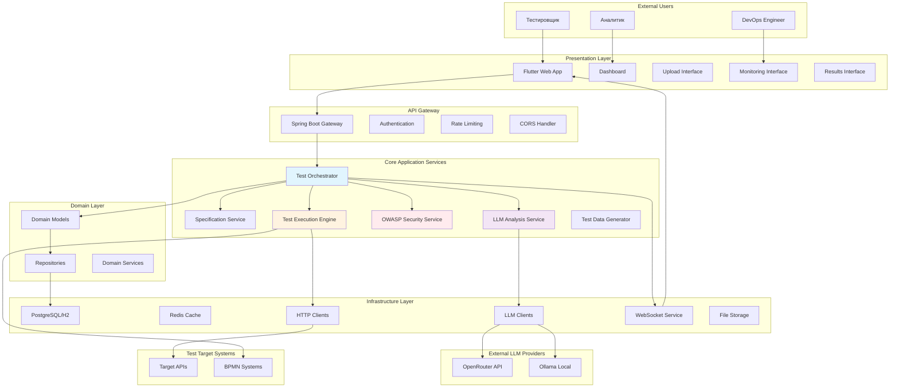
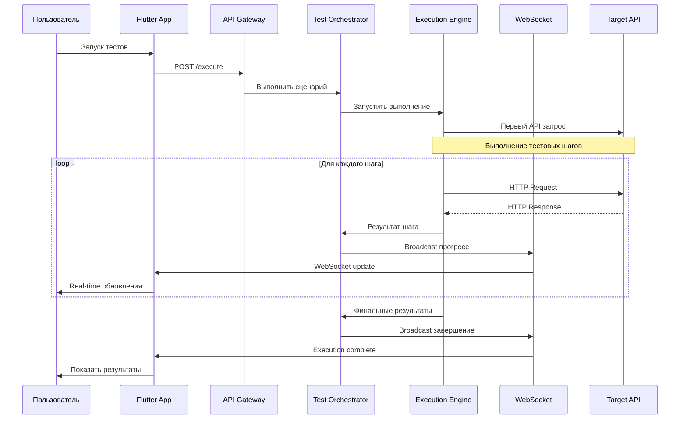
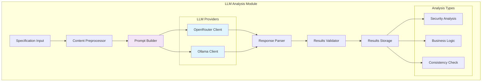
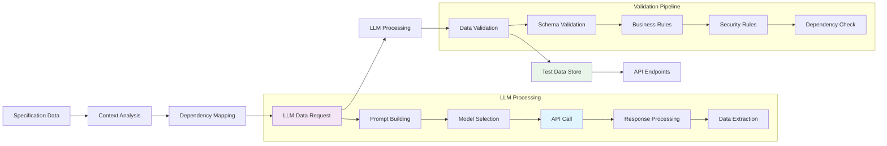
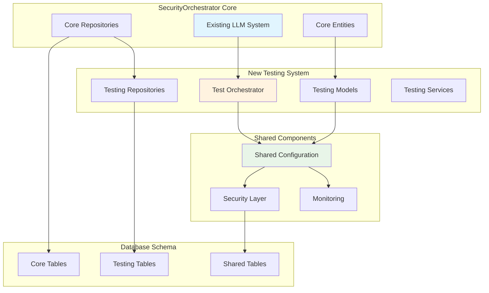
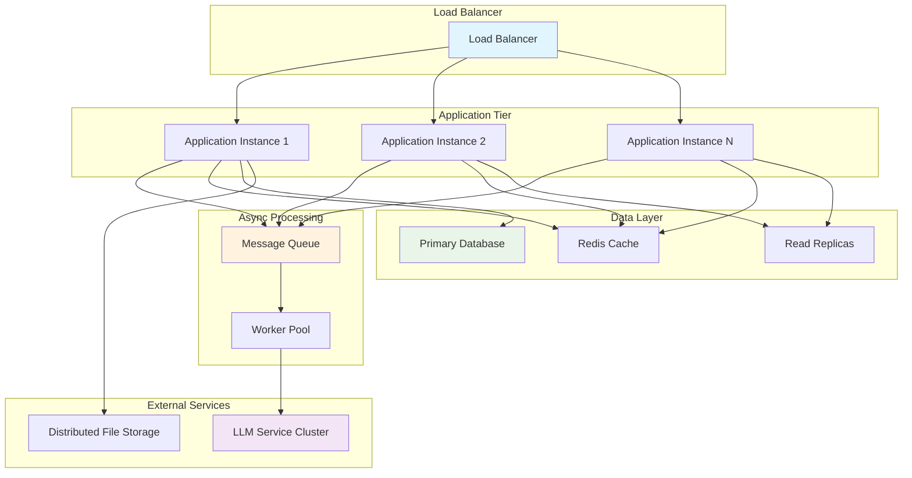
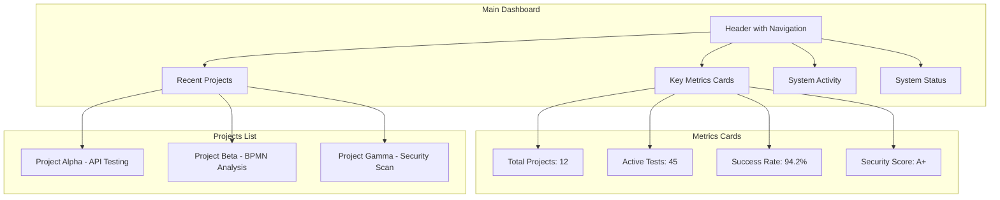
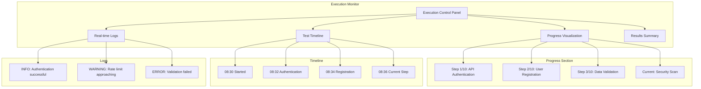
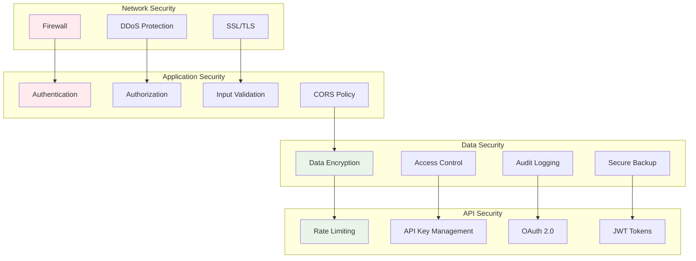
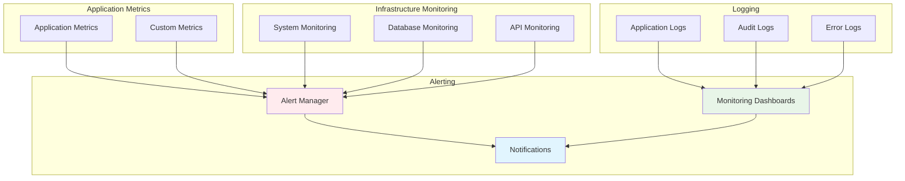

# Диаграммы архитектуры и визуализация системы автоматического тестирования

## 1. Общая системная архитектура

### High-Level System Architecture


## 2. Пользовательские потоки (User Flows)

### 2.1 Flow: Создание и анализ тестового проекта
```mermaid
flowchart TD
    A[Пользователь заходит в систему] --> B[Dashboard]
    B --> C[Нажать "Создать проект"]
    C --> D[Ввести название проекта]
    D --> E[Загрузить OpenAPI/BPMN]
    E --> F[Система анализирует файл]
    F --> G[LLM анализ содержания]
    G --> H[Показать результаты анализа]
    H --> I{Анализ завершен?}
    I -->|Да| J[Генерировать тесты]
    I -->|Нет| K[Показать ошибки]
    K --> L[Исправить файл]
    L --> E
    J --> M[Просмотр сгенерированных тестов]
    M --> N[Запуск тестов]
    
    style A fill:#e8f5e8
    style G fill:#f3e5f5
    style J fill:#fff3e0
    style N fill:#e1f5fe
```

### 2.2 Flow: Мониторинг выполнения тестов


## 3. Детальные компонентные диаграммы

### 3.1 LLM Analysis Module


### 3.2 Test Generation Engine
```mermaid
graph TB
    subgraph "Test Generation Engine"
        SPEC_INPUT[Specification Data]
        
        subgraph "Generation Pipeline"
            PARSER[Spec Parser]
            ANALYZER[Business Logic Analyzer]
            OWASP_GEN[OWASP Test Generator]
            DATA_GEN[Test Data Generator]
            SCENARIO_BUILDER[Scenario Builder]
        end
        
        subgraph "OWASP Categories"
            API1[BOLA Tests]
            API2[Auth Tests]
            API3[Data Exposure]
            API4[Rate Limiting]
            API5[AuthZ Tests]
        end
        
        VALIDATION[Test Validation]
        EXPORT[Test Export]
        
        SPEC_INPUT --> PARSER
        PARSER --> ANALYZER
        ANALYZER --> OWASP_GEN
        OWASP_GEN --> API1
        OWASP_GEN --> API2
        OWASP_GEN --> API3
        OWASP_GEN --> API4
        OWASP_GEN --> API5
        
        ANALYZER --> DATA_GEN
        DATA_GEN --> SCENARIO_BUILDER
        SCENARIO_BUILDER --> VALIDATION
        VALIDATION --> EXPORT
        
        style OWASP_GEN fill:#ffebee
        style DATA_GEN fill:#fff3e0
        style SCENARIO_BUILDER fill:#e8f5e8
```

### 3.3 Test Execution Engine
```mermaid
graph TB
    subgraph "Test Execution Engine"
        EXEC_INPUT[Test Scenarios]
        
        SCHEDULER[Test Scheduler]
        QUEUE[Execution Queue]
        
        subgraph "Execution Workers"
            WORKER1[Worker 1]
            WORKER2[Worker 2]
            WORKER3[Worker N]
        end
        
        subgraph "Execution Pipeline"
            STEP_EX[Step Executor]
            HTTP_CLIENT[HTTP Client]
            VALIDATOR[Response Validator]
            SECURITY_SCAN[Security Scanner]
        end
        
        AGGREGATOR[Result Aggregator]
        REPORTER[Report Generator]
        
        EXEC_INPUT --> SCHEDULER
        SCHEDULER --> QUEUE
        QUEUE --> WORKER1
        QUEUE --> WORKER2
        QUEUE --> WORKER3
        
        WORKER1 --> STEP_EX
        WORKER2 --> STEP_EX
        WORKER3 --> STEP_EX
        
        STEP_EX --> HTTP_CLIENT
        HTTP_CLIENT --> VALIDATOR
        VALIDATOR --> SECURITY_SCAN
        SECURITY_SCAN --> AGGREGATOR
        
        AGGREGATOR --> REPORTER
        
        style SCHEDULER fill:#e1f5fe
        style STEP_EX fill:#fff3e0
        style SECURITY_SCAN fill:#ffebee
```

## 4. BPMN Integration Architecture

### 4.1 BPMN Processing Flow
```mermaid
graph TB
    subgraph "BPMN Integration System"
        BPMN_UPLOAD[BPMN File Upload]
        
        subgraph "BPMN Processing Pipeline"
            XML_PARSER[XML Parser]
            MODEL_BUILDER[Process Model Builder]
            ELEMENT_EXTRACTOR[Element Extractor]
            
            subgraph "Element Analysis"
                TASK_ANALYZER[Task Analysis]
                GATEWAY_ANALYZER[Gateway Analysis]
                FLOW_ANALYZER[Flow Analysis]
            end
            
            LLM_BPMN_ANALYZER[LLM Business Logic Analysis]
            API_MAPPER[API Endpoint Mapper]
        end
        
        subgraph "Integration Points"
            API_DISCOVERY[API Discovery]
            ENDPOINT_MATCHING[Endpoint Matching]
            DEPENDENCY_MAP[Dependency Mapping]
        end
        
        TEST_GEN_INTEGRATION[Integration with Test Generation]
        
        BPMN_UPLOAD --> XML_PARSER
        XML_PARSER --> MODEL_BUILDER
        MODEL_BUILDER --> ELEMENT_EXTRACTOR
        ELEMENT_EXTRACTOR --> TASK_ANALYZER
        ELEMENT_EXTRACTOR --> GATEWAY_ANALYZER
        ELEMENT_EXTRACTOR --> FLOW_ANALYZER
        ELEMENT_EXTRACTOR --> LLM_BPMN_ANALYZER
        LLM_BPMN_ANALYZER --> API_MAPPER
        API_MAPPER --> API_DISCOVERY
        API_DISCOVERY --> ENDPOINT_MATCHING
        ENDPOINT_MATCHING --> DEPENDENCY_MAP
        DEPENDENCY_MAP --> TEST_GEN_INTEGRATION
        
        style LLM_BPMN_ANALYZER fill:#f3e5f5
        style API_MAPPER fill:#e1f5fe
        style DEPENDENCY_MAP fill:#fff3e0
```

## 5. OpenAPI Analysis Architecture

### 5.1 OpenAPI Security Analysis
```mermaid
graph TB
    subgraph "OpenAPI Security Analysis"
        OPENAPI_INPUT[OpenAPI Specification]
        
        subgraph "Analysis Components"
            SCHEMA_PARSER[Schema Parser]
            ENDPOINT_EXTRACTOR[Endpoint Extractor]
            SECURITY_SCANNER[Security Scanner]
            
            subgraph "Security Checks"
                AUTH_CHECK[Authentication Check]
                AUTHZ_CHECK[Authorization Check]
                INPUT_VALIDATION[Input Validation]
                RATE_LIMIT_CHECK[Rate Limiting Check]
                DATA_EXPOSURE[Data Exposure Check]
            end
            
            VULNERABILITY_SCANNER[Vulnerability Scanner]
            
            subgraph "OWASP API Security"
                OWASP1[BOLA Detection]
                OWASP2[Broken Auth Detection]
                OWASP3[Excessive Data Detection]
                OWASP4[Rate Limiting Detection]
                OWASP5[Broken AuthZ Detection]
            end
        end
        
        LLM_SECURITY_ANALYZER[LLM Security Analyzer]
        REPORT_GENERATOR[Security Report Generator]
        
        OPENAPI_INPUT --> SCHEMA_PARSER
        SCHEMA_PARSER --> ENDPOINT_EXTRACTOR
        ENDPOINT_EXTRACTOR --> SECURITY_SCANNER
        SECURITY_SCANNER --> AUTH_CHECK
        SECURITY_SCANNER --> AUTHZ_CHECK
        SECURITY_SCANNER --> INPUT_VALIDATION
        SECURITY_SCANNER --> RATE_LIMIT_CHECK
        SECURITY_SCANNER --> DATA_EXPOSURE
        
        SECURITY_SCANNER --> VULNERABILITY_SCANNER
        VULNERABILITY_SCANNER --> OWASP1
        VULNERABILITY_SCANNER --> OWASP2
        VULNERABILITY_SCANNER --> OWASP3
        VULNERABILITY_SCANNER --> OWASP4
        VULNERABILITY_SCANNER --> OWASP5
        
        ENDPOINT_EXTRACTOR --> LLM_SECURITY_ANALYZER
        LLM_SECURITY_ANALYZER --> REPORT_GENERATOR
        
        style LLM_SECURITY_ANALYZER fill:#f3e5f5
        style VULNERABILITY_SCANNER fill:#ffebee
        style REPORT_GENERATOR fill:#e8f5e8
```

## 6. Data Flow Diagrams

### 6.1 Test Data Generation Flow


## 7. System Integration Architecture

### 7.1 Integration with SecurityOrchestrator Core


## 8. Performance and Scaling Architecture

### 8.1 Scalability Design


## 9. User Interface Wireframes

### 9.1 Main Dashboard


### 9.2 Test Execution Monitor


## 10. Security Architecture

### 10.1 Security Layers


## 11. Monitoring and Observability

### 11.1 Monitoring Architecture


Эти диаграммы обеспечивают полное понимание архитектуры системы и помогут команде разработки в реализации каждого компонента. Они показывают как высокоуровневые потоки данных, так и детальную архитектуру каждого модуля системы автоматического тестирования.