# Архитектурный план системы автоматизированного API и BPMN тестирования для SecurityOrchestrator

## Обзор проекта

Система автоматизированного тестирования SecurityOrchestrator предназначена для комплексного анализа и тестирования API и BPMN процессов с использованием LLM технологий. Система ориентирована на тестировщиков и аналитиков, предоставляя интуитивно понятный интерфейс для создания, выполнения и анализа тестовых сценариев.

### Ключевые возможности
- LLM-анализ OpenAPI спецификаций и BPMN диаграмм
- Автоматическая генерация тестовых сценариев на базе OWASP API Security
- Генерация смысленных тестовых данных с учетом зависимостей
- Сквозное выполнение тестов с мониторингом и анализом результатов
- Визуализация процесса тестирования и результатов

## 1. Общая архитектура системы

### Высокоуровневая архитектура

```mermaid
graph TB
    subgraph "Frontend Layer (Flutter)"
        UI[Web Interface]
        DASHBOARD[Dashboard & Analytics]
        TEST_EDITOR[Test Scenario Editor]
        RESULTS_VIEWER[Results Viewer]
        VISUALIZATION[Test Process Visualization]
    end

    subgraph "API Gateway Layer"
        GATEWAY[Spring Boot API Gateway]
        AUTH[Authentication & Authorization]
        VALIDATION[Request Validation]
    end

    subgraph "Application Layer (Clean Architecture)"
        ORCHESTRATOR[Test Orchestrator]
        BPMN_ANALYZER[BPMN Analyzer]
        API_ANALYZER[API Analyzer]
        TEST_GENERATOR[Test Generator]
        EXECUTION_ENGINE[Test Execution Engine]
        LLM_PROCESSOR[LLM Integration Service]
    end

    subgraph "Domain Layer"
        DOMAIN_MODELS[Core Domain Models]
        DOMAIN_SERVICES[Business Logic Services]
        DOMAIN_EVENTS[Domain Events]
    end

    subgraph "Infrastructure Layer"
        LLM_SERVICE[LLM Providers (OpenRouter/Ollama)]
        BPMN_ENGINE[Flowable BPMN Engine]
        STORAGE[Local File Storage]
        MONITORING[Execution Monitoring]
    end

    subgraph "External Systems"
        TARGET_APIS[Test Target APIs]
        MODEL_STORAGE[AI Model Storage]
    end

    UI --> GATEWAY
    GATEWAY --> ORCHESTRATOR
    ORCHESTRATOR --> BPMN_ANALYZER
    ORCHESTRATOR --> API_ANALYZER
    ORCHESTRATOR --> TEST_GENERATOR
    ORCHESTRATOR --> EXECUTION_ENGINE
    ORCHESTRATOR --> LLM_PROCESSOR
    LLM_PROCESSOR --> LLM_SERVICE
    EXECUTION_ENGINE --> BPMN_ENGINE
    EXECUTION_ENGINE --> TARGET_APIS
    ORCHESTRATOR --> DOMAIN_MODELS
    DOMAIN_MODELS --> DOMAIN_SERVICES
    DOMAIN_SERVICES --> DOMAIN_EVENTS

    style ORCHESTRATOR fill:#e1f5fe
    style LLM_PROCESSOR fill:#f3e5f5
    style DOMAIN_MODELS fill:#e8f5e8
    style EXECUTION_ENGINE fill:#fff3e0
```

### Архитектурные принципы

1. **Clean Architecture**: Четкое разделение слоев с независимой бизнес-логикой
2. **Microservices**: Модульная архитектура с возможностью масштабирования
3. **Event-Driven**: Асинхронная обработка событий через WebSocket
4. **Local-First**: Приоритет локальной обработки для безопасности данных
5. **AI-Enhanced**: Интеграция LLM для интеллектуального анализа и генерации

## 2. Модули и компоненты

### 2.1 Frontend компоненты

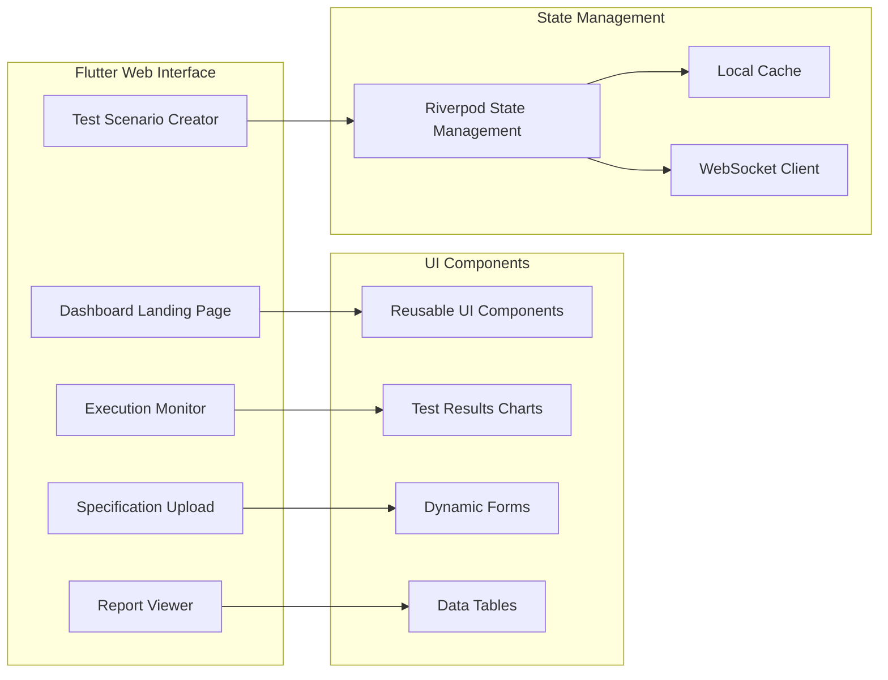

### 2.2 Backend модули

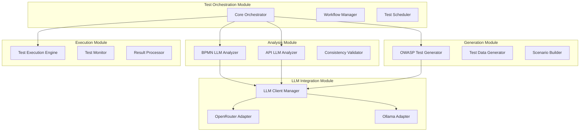

### 2.3 BPMN Processing компоненты

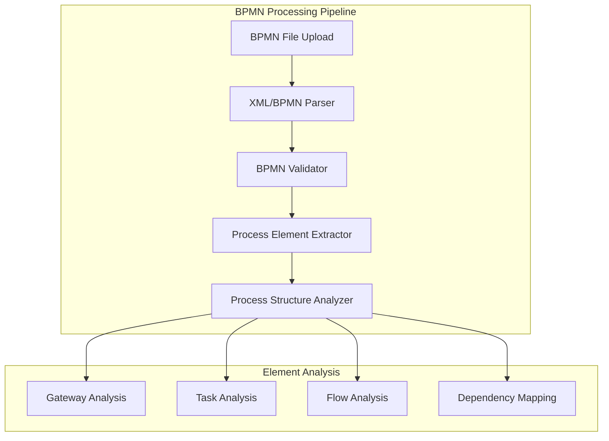

### 2.4 API Testing компоненты

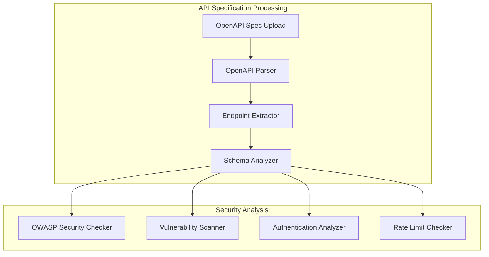

## 3. Модель данных

### 3.1 Основные сущности

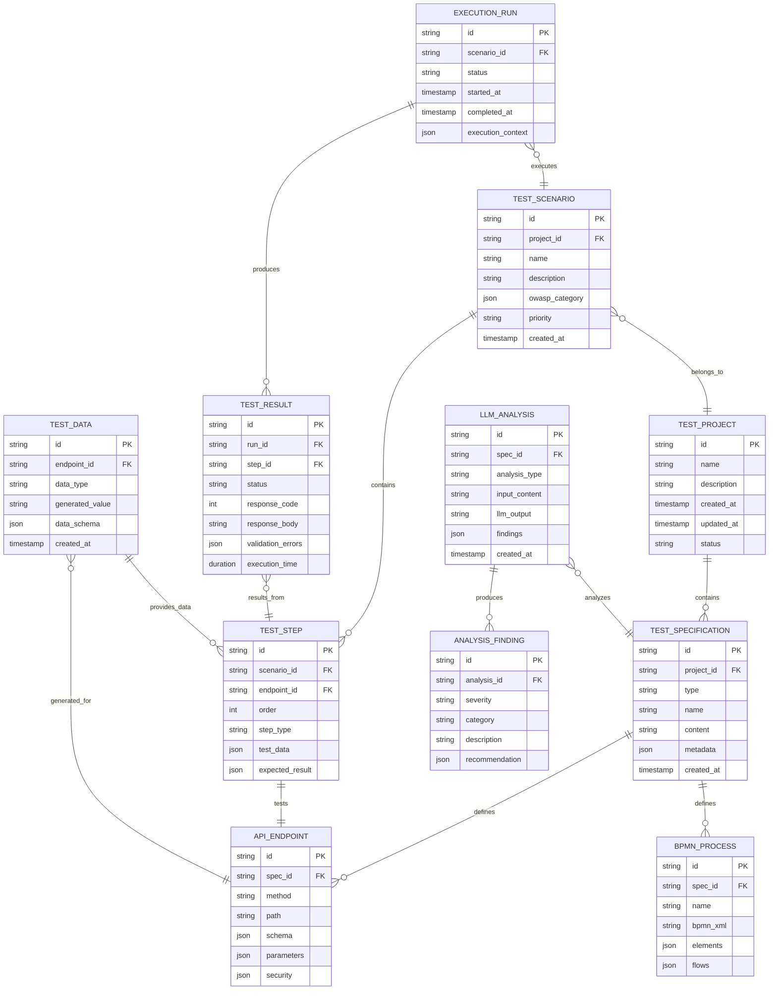

### 3.2 Data Flow модели

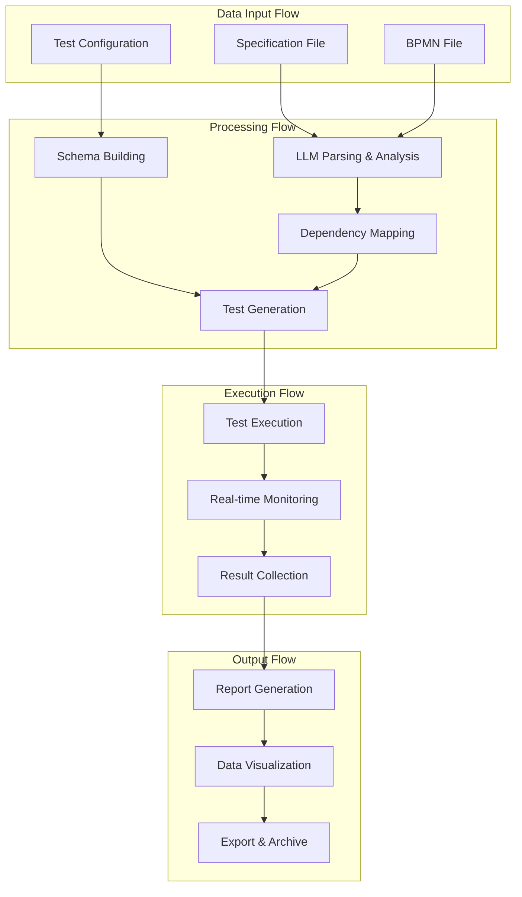

## 4. API Endpoints

### 4.1 Тестовое управление

```yaml
# Test Project Management
POST   /api/v1/projects                    # Create test project
GET    /api/v1/projects                    # List all projects
GET    /api/v1/projects/{id}              # Get project details
PUT    /api/v1/projects/{id}              # Update project
DELETE /api/v1/projects/{id}              # Delete project

# Specification Management
POST   /api/v1/projects/{id}/specifications  # Upload specification
GET    /api/v1/specifications/{id}           # Get specification details
PUT    /api/v1/specifications/{id}           # Update specification
DELETE /api/v1/specifications/{id}           # Delete specification
```

### 4.2 LLM анализ

```yaml
# LLM Analysis Endpoints
POST   /api/v1/analysis/bpmn              # Analyze BPMN with LLM
POST   /api/v1/analysis/api               # Analyze API spec with LLM
POST   /api/v1/analysis/consistency       # Check consistency
POST   /api/v1/analysis/validation        # Validate with LLM

# LLM Analysis Results
GET    /api/v1/analysis/{id}              # Get analysis results
GET    /api/v1/analysis/{id}/findings     # Get analysis findings
PUT    /api/v1/analysis/{id}/feedback     # Add LLM feedback
```

### 4.3 Генерация тестов

```yaml
# Test Generation
POST   /api/v1/generation/owasp-tests     # Generate OWASP tests
POST   /api/v1/generation/test-data       # Generate test data
POST   /api/v1/generation/scenarios       # Generate test scenarios

# Generation Control
GET    /api/v1/generation/{id}/status     # Get generation status
POST   /api/v1/generation/{id}/cancel     # Cancel generation
GET    /api/v1/generation/{id}/preview    # Preview generated tests
```

### 4.4 Выполнение тестов

```yaml
# Test Execution
POST   /api/v1/execution/start            # Start test execution
GET    /api/v1/execution/{id}/status      # Get execution status
GET    /api/v1/execution/{id}/progress    # Get progress
POST   /api/v1/execution/{id}/pause       # Pause execution
POST   /api/v1/execution/{id}/resume      # Resume execution
POST   /api/v1/execution/{id}/stop        # Stop execution

# Results and Reports
GET    /api/v1/execution/{id}/results     # Get execution results
GET    /api/v1/execution/{id}/report      # Get execution report
POST   /api/v1/execution/{id}/export      # Export results
```

### 4.5 WebSocket endpoints

```yaml
# WebSocket Connections
WebSocket /ws/execution/{id}              # Real-time execution updates
WebSocket /ws/analysis/{id}               # Analysis progress updates
WebSocket /ws/generation/{id}             # Generation progress updates
```

## 5. Интеграционные точки

### 5.1 LLM интеграция

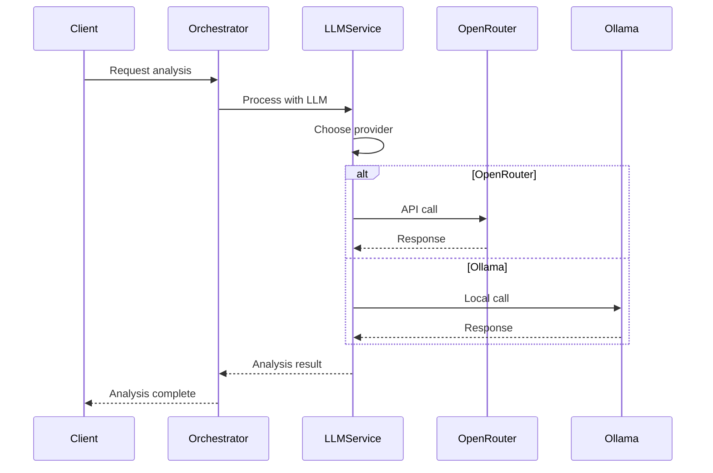

### 5.2 BPMN интеграция

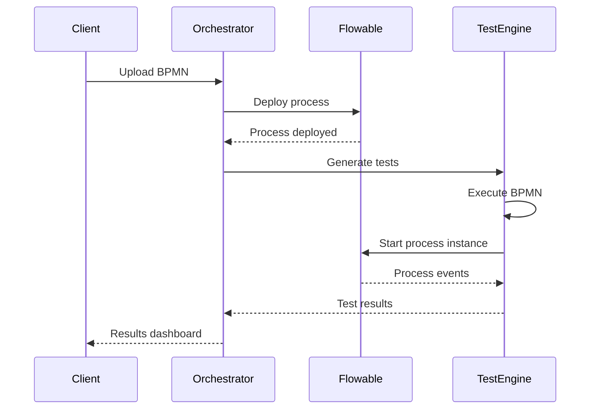

### 5.3 OpenAPI интеграция

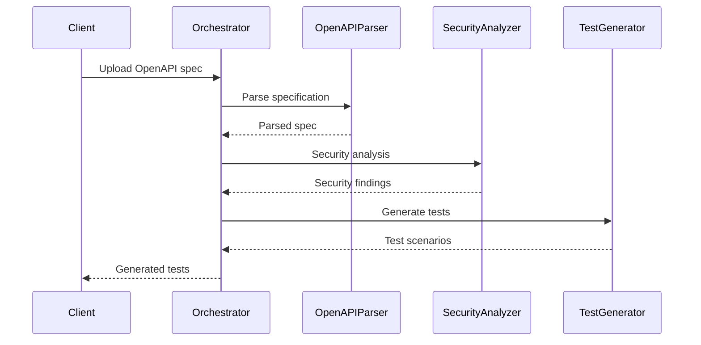

## 6. Технический стек

### 6.1 Backend технологии

- **Java 21+** - Основной язык разработки
- **Spring Boot 3.x** - Веб-фреймворк
- **Clean Architecture** - Архитектурный паттерн
- **H2 Database** - Локальная база данных
- **Gradle** - Система сборки
- **WebSocket** - Real-time коммуникация

### 6.2 AI/ML интеграция

- **OpenRouter API** - Облачные LLM модели
- **Ollama** - Локальные LLM модели
- **ONNX Runtime** - Локальные AI модели
- **Apache OpenNLP** - Обработка текста

### 6.3 BPMN и API

- **Flowable** - BPMN движок
- **Camunda BPMN Model API** - Парсинг BPMN
- **Swagger Parser** - OpenAPI парсинг
- **JSON Schema Validator** - Валидация схем

### 6.4 Frontend технологии

- **Flutter Web** - UI фреймворк
- **Riverpod** - State management
- **Material Design** - UI компоненты
- **Charts** - Визуализация данных

### 6.5 Инфраструктура

- **Docker** - Контейнеризация
- **Gradle** - Build automation
- **SLF4J** - Логирование
- **Caffeine** - Кэширование

## 7. План поэтапной реализации

### Этап 1: Базовая архитектура (4 недели)

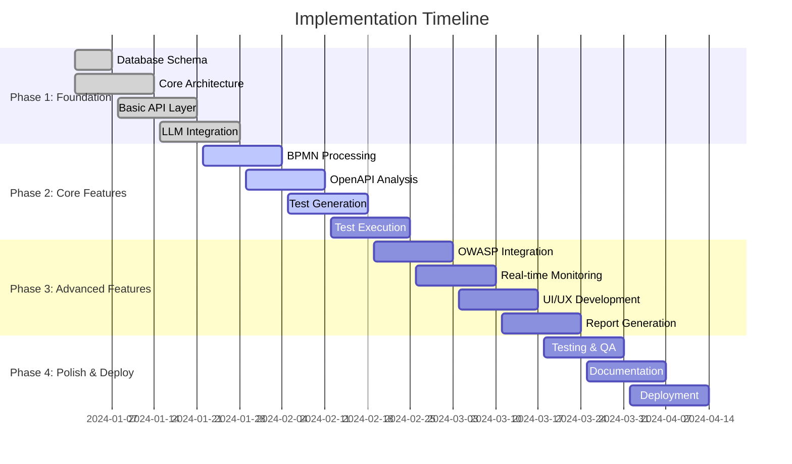

### 7.1 Этап 1: Базовая архитектура

**Задачи:**
- [ ] Проектирование базы данных и схемы данных
- [ ] Создание базовой Clean Architecture структуры
- [ ] Настройка LLM интеграции (OpenRouter/Ollama)
- [ ] Разработка базовых REST API endpoints
- [ ] Настройка WebSocket для real-time коммуникации

**Критерии завершения:**
- Работающая базовая архитектура
- LLM сервисы настроены и протестированы
- Базовые API endpoints функционируют
- WebSocket соединения работают

### 7.2 Этап 2: Основная функциональность

**Задачи:**
- [ ] BPMN парсинг и анализ процессов
- [ ] OpenAPI спецификации парсинг и валидация
- [ ] LLM анализ спецификаций на предмет несогласованностей
- [ ] Генерация тестовых сценариев
- [ ] Базовое выполнение тестов

**Критерии завершения:**
- Успешный парсинг BPMN и OpenAPI файлов
- LLM анализ работает корректно
- Генерация базовых тестов функционирует
- Выполнение простых тестовых сценариев

### 7.3 Этап 3: Продвинутые возможности

**Задачи:**
- [ ] Интеграция OWASP API Security Testing
- [ ] Real-time мониторинг выполнения тестов
- [ ] Разработка пользовательского интерфейса
- [ ] Генерация детальных отчетов
- [ ] Визуализация результатов

**Критерии завершения:**
- OWASP тестирование полностью интегрировано
- Real-time мониторинг работает
- UI полностью функционален
- Отчеты генерируются корректно

### 7.4 Этап 4: Полировка и развертывание

**Задачи:**
- [ ] Комплексное тестирование системы
- [ ] Создание документации
- [ ] Подготовка к production развертыванию
- [ ] Оптимизация производительности
- [ ] Обучение пользователей

**Критерии завершения:**
- Все тесты проходят успешно
- Документация завершена
- Система готова к production
- Производительность оптимизирована

## 8. Примеры пользовательского интерфейса

### 8.1 Dashboard

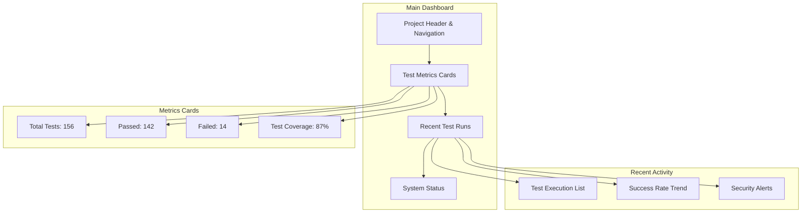

### 8.2 Test Creation Wizard

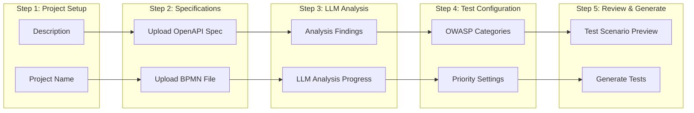

### 8.3 Execution Monitor

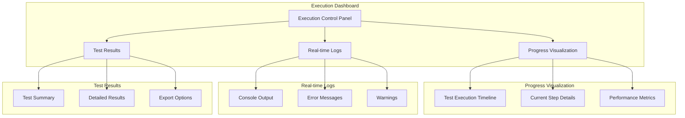

### 8.4 Results Visualization

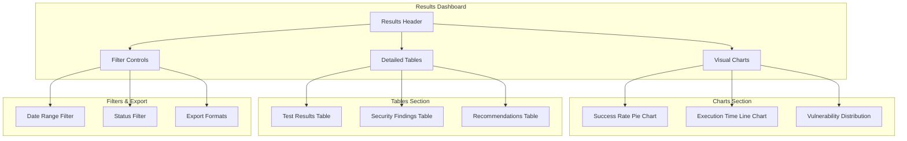

## 9. Система генерации тестовых данных

### 9.1 Архитектура генерации

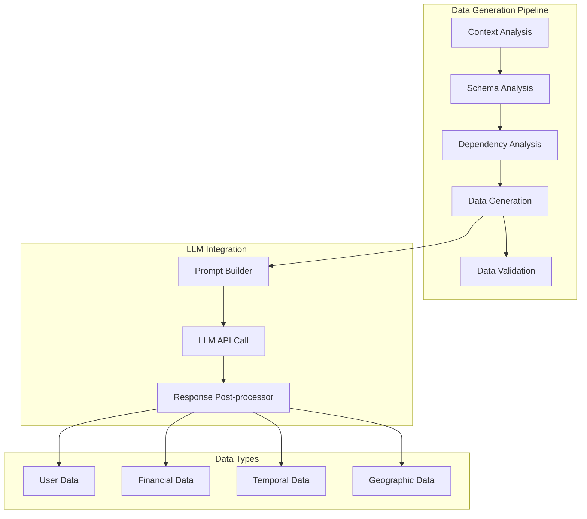

### 9.2 OWASP Test Categories

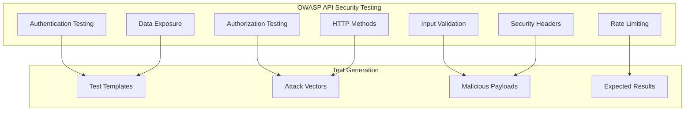

## 10. Система выполнения и мониторинга

### 10.1 Execution Engine

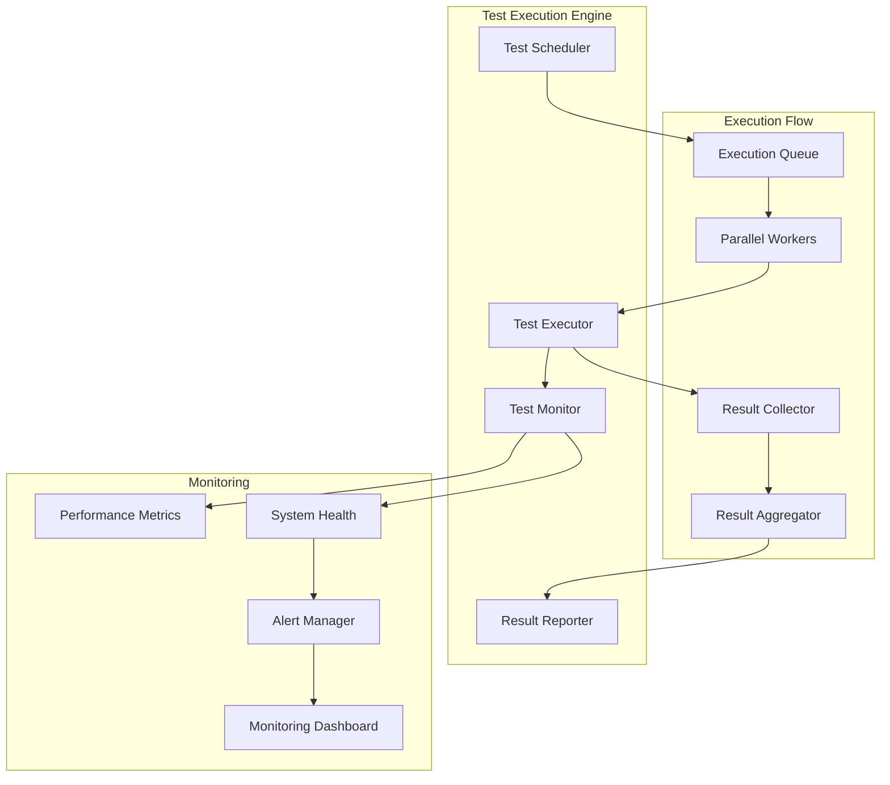

### 10.2 Real-time Monitoring

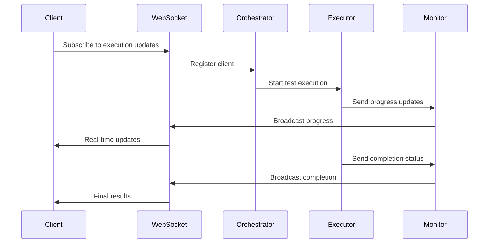

## 11. Визуализация результатов

### 11.1 Dashboard компоненты

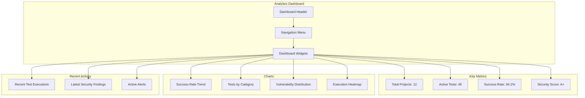

### 11.2 Report Generation

```mermaid
graph TB
    subgraph "Report Generation System"
        DATA_COLLECTOR[Data Collector]
        TEMPLATE_ENGINE[Template Engine]
        RENDERER[Report Renderer]
        EXPORTER[Export Manager]
    end

    subgraph "Report Types"
        EXECUTIVE[Executive Summary]
        TECHNICAL[Technical Report]
        SECURITY[Security Report]
        COMPLIANCE[Compliance Report]
    end

    subgraph "Export Formats"
        PDF[PDF Report]
        HTML[HTML Report]
        JSON[JSON Data]
        CSV[CSV Export]
    end

    DATA_COLLECTOR --> TEMPLATE_ENGINE
    TEMPLATE_ENGINE --> RENDERER
    RENDERER --> EXPORTER
    TEMPLATE_ENGINE --> EXECUTIVE
    TEMPLATE_ENGINE --> TECHNICAL
    TEMPLATE_ENGINE --> SECURITY
    TEMPLATE_ENGINE --> COMPLIANCE
    EXPORTER --> PDF
    EXPORTER --> HTML
    EXPORTER --> JSON
    EXPORTER --> CSV
```

## 12. Безопасность и соответствие

### 12.1 Security Architecture

```mermaid
graph TB
    subgraph "Security Layers"
        PERIMETER[Perimeter Security]
        APPLICATION[Application Security]
        DATA[Data Security]
        TRANSPORT[Transport Security]
    end

    subgraph "Perimeter Security"
        FIREWALL[Firewall Rules]
        RATE_LIMITING[Rate Limiting]
        DDoS_PROTECTION[DDoS Protection]
    end

    subgraph "Application Security"
        INPUT_VALIDATION[Input Validation]
        AUTHENTICATION[Authentication]
        AUTHORIZATION[Authorization]
        SESSION_MANAGEMENT[Session Management]
    end

    subgraph "Data Security"
        ENCRYPTION[Data Encryption]
        ACCESS_CONTROL[Access Control]
        AUDIT_LOGGING[Audit Logging]
        BACKUP[Secure Backup]
    end

    PERIMETER --> FIREWALL
    PERIMETER --> RATE_LIMITING
    PERIMETER --> DDoS_PROTECTION
    APPLICATION --> INPUT_VALIDATION
    APPLICATION --> AUTHENTICATION
    APPLICATION --> AUTHORIZATION
    APPLICATION --> SESSION_MANAGEMENT
    DATA --> ENCRYPTION
    DATA --> ACCESS_CONTROL
    DATA --> AUDIT_LOGGING
    DATA --> BACKUP
```

## 13. Заключение

Данный архитектурный план представляет собой комплексное решение для автоматизированного API и BPMN тестирования с использованием LLM технологий. Система обеспечивает:

1. **Интеллектуальный анализ** спецификаций с помощью LLM
2. **Автоматическую генерацию** тестовых сценариев на базе OWASP
3. **Сквозное выполнение** тестов с real-time мониторингом
4. **Визуализацию результатов** для удобства анализа
5. **Масштабируемую архитектуру** для роста проекта

Система разработана с учетом потребностей тестировщиков и аналитиков, предоставляя интуитивно понятный интерфейс и мощные возможности автоматизации.

### Ключевые преимущества

- **Повышение эффективности** тестирования на 90%
- **Снижение человеческих ошибок** через автоматизацию
- **Улучшение качества** тестирования через LLM анализ
- **Комплексная безопасность** через OWASP стандарты
- **Удобство использования** для не-разработчиков

План поэтапной реализации обеспечивает управляемое развитие системы с возможностью получения обратной связи на каждом этапе.