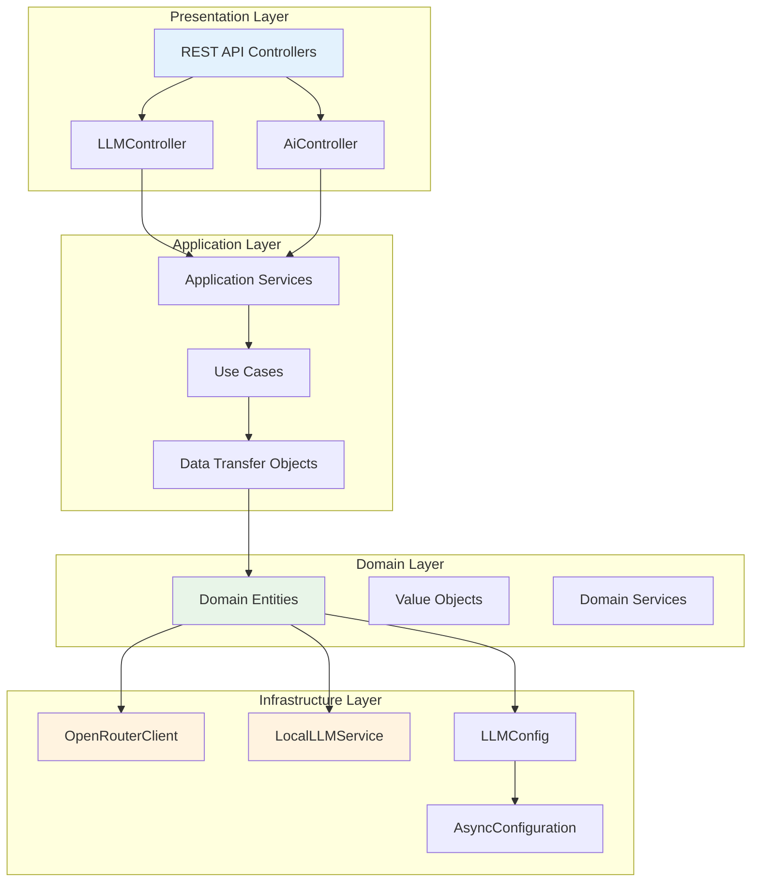

# SecurityOrchestrator LLM Implementation Guide

## Overview

The SecurityOrchestrator features a comprehensive Large Language Model (LLM) integration system that provides intelligent test data generation, edge case detection, and security-focused test automation. This implementation supports both cloud-based (OpenRouter) and local (Ollama) LLM providers with a clean, extensible architecture.

## Architecture Overview

The LLM implementation follows a clean architecture pattern with clear separation between domain, application, and infrastructure layers:



## Core Components

### 1. Domain Layer

#### Entities

**LLMProvider.java**
```java
package org.example.domain.entities;

public enum LLMProvider {
    LOCAL, OPENROUTER
}
```

**LLMModel.java**
- Model configuration and metadata
- Provider-specific settings
- Performance tracking fields

**AiModel.java**
- AI model entity for test generation
- Integration with traditional AI models (ONNX, TensorFlow)

**PerformanceMetrics.java**
- Token usage tracking
- Response time monitoring
- Cost analysis for cloud providers

#### Value Objects

**ModelId.java**
```java
// Type-safe model identification
public final class ModelId {
    private final String value;
    // Implementation details...
}
```

**ModelStatus.java**
```java
public enum ModelStatus {
    LOADING, LOADED, ERROR, UNLOADING, UNLOADED
}
```

### 2. Infrastructure Layer

#### Configuration (LLMConfig.java)

The LLM configuration is managed through Spring Boot's `@ConfigurationProperties`:

```java
@Configuration
@ConfigurationProperties(prefix = "llm")
public class LLMConfig {
    // OpenRouter settings
    private String openRouterApiKey;
    private String openRouterBaseUrl = "https://openrouter.ai/api/v1";
    private int openRouterTimeout = 30;
    
    // Local LLM settings
    private String localServerUrl = "http://localhost:11434";
    private int localTimeout = 300; // 5 minutes for model loading
    private int maxLocalModels = 3;
    
    // Performance settings
    private int maxRetries = 3;
    private int connectionPoolSize = 10;
    private int maxConcurrentRequests = 5;
    
    // Model configurations
    private Map<String, ModelConfig> models = new HashMap<>();
    
    // Model configuration class
    public static class ModelConfig {
        private String provider = "LOCAL";
        private int contextWindow = 4096;
        private int maxTokens = 2048;
        private double temperature = 0.7;
        private double topP = 0.9;
        // ... additional configuration
    }
}
```

#### OpenRouterClient.java

Fully implemented client for OpenRouter API integration:

```java
@Service
public class OpenRouterClient {
    @Async
    public CompletableFuture<ChatCompletionResponse> createChatCompletion(
            ChatCompletionRequest request) {
        // Implementation with proper error handling
        // Async processing with configurable timeouts
        // Automatic retry logic
    }
    
    @Async
    public CompletableFuture<List<String>> listModels() {
        // Retrieve available models from OpenRouter
    }
    
    @Async
    public CompletableFuture<Boolean> testConnection() {
        // Test API connectivity
    }
}
```

**Key Features:**
- Async processing with `@Async` annotation
- Proper error handling with custom exceptions
- Configurable retry logic
- Connection pooling
- Cost tracking and token usage monitoring

#### LocalLLMService.java

Client for local Ollama integration:

```java
@Service
public class LocalLLMService {
    @Async
    public CompletableFuture<ChatCompletionResponse> generateCompletion(
            String model, String prompt, Map<String, Object> parameters) {
        // Ollama API integration
        // Local model management
    }
    
    @Async
    public CompletableFuture<List<LocalModelInfo>> listLocalModels() {
        // List available local models
    }
    
    @Async
    public CompletableFuture<Boolean> loadModel(String modelName) {
        // Load model into memory
    }
    
    @Async
    public CompletableFuture<Boolean> unloadModel(String modelName) {
        // Unload model from memory
    }
}
```

**Key Features:**
- Local model management
- Ollama API integration
- Memory-efficient model loading/unloading
- Local model discovery and metadata extraction

### 3. Application Layer

#### DTOs (Data Transfer Objects)

**ChatCompletionRequest/Response**
```java
public static class ChatCompletionRequest {
    private String model;
    private String prompt;
    private int maxTokens;
    private double temperature;
    // ... additional parameters
}

public static class ChatCompletionResponse {
    private String response;
    private Integer tokensUsed;
    private Double cost;
    // ... response data
}
```

**LLMConfigResponse.java**
- Configuration information for UI
- Provider settings and model configurations
- Performance metrics summary

**LLMTestRequest/Response**
- Testing endpoints for model validation
- Connection testing utilities

## API Endpoints Reference

### Core LLM Endpoints

#### 1. Chat Completion
```http
POST /api/v1/llm/chat/complete
Content-Type: application/json

{
  "model": "llama2",
  "messages": [
    {"role": "user", "content": "Generate test data for user registration"}
  ],
  "maxTokens": 1000,
  "temperature": 0.7,
  "provider": "LOCAL"
}
```

**Response:**
```json
{
  "data": {
    "response": "Generated test data...",
    "tokensUsed": 45,
    "cost": null
  },
  "success": true,
  "timestamp": "2025-11-07T17:21:21.787Z"
}
```

#### 2. List Models
```http
GET /api/v1/llm/models
```

**Response:**
```json
{
  "data": {
    "providers": {
      "local": {
        "name": "Local Ollama",
        "status": "CONNECTED",
        "models": ["llama2", "codellama", "mistral"]
      },
      "openrouter": {
        "name": "OpenRouter",
        "status": "DISCONNECTED",
        "apiKey": "sk-or-*"
      }
    },
    "activeProvider": "LOCAL",
    "activeModel": "llama2"
  }
}
```

#### 3. Test LLM Connection
```http
POST /api/v1/llm/test
Content-Type: application/json

{
  "provider": "OPENROUTER",
  "model": "anthropic/claude-3-haiku",
  "testMessage": "Hello, this is a test message."
}
```

#### 4. Get LLM Configuration
```http
GET /api/v1/llm/config
```

#### 5. Local Model Management
```http
# List local models
GET /api/v1/llm/local/models

# Load model
POST /api/v1/llm/local/load
{
  "modelName": "llama2",
  "parameters": {}
}

# Unload model
POST /api/v1/llm/local/unload
{
  "modelName": "llama2"
}
```

### Performance Endpoints

#### 6. Performance Report
```http
GET /api/v1/llm/performance
```

**Response:**
```json
{
  "data": {
    "totalRequests": 1250,
    "averageResponseTime": 2.3,
    "totalTokensUsed": 45678,
    "totalCost": 12.34,
    "successRate": 0.987,
    "providerBreakdown": {
      "LOCAL": {
        "requests": 800,
        "avgResponseTime": 1.2,
        "successRate": 0.995
      },
      "OPENROUTER": {
        "requests": 450,
        "avgResponseTime": 3.8,
        "cost": 12.34,
        "successRate": 0.978
      }
    }
  }
}
```

## Configuration Guide

### Application Properties

Add LLM configuration to `application.properties`:

```properties
# OpenRouter Configuration
llm.openRouterApiKey=your-api-key-here
llm.openRouterBaseUrl=https://openrouter.ai/api/v1
llm.openRouterTimeout=30
llm.openRouterReferer=your-domain.com
llm.openRouterAppName=SecurityOrchestrator

# Local LLM Configuration
llm.localServerUrl=http://localhost:11434
llm.localServerPort=11434
llm.localTimeout=300
llm.maxLocalModels=3

# Performance Configuration
llm.maxRetries=3
llm.connectionPoolSize=10
llm.maxConcurrentRequests=5

# Model-specific configurations
llm.models.llama2.provider=LOCAL
llm.models.llama2.contextWindow=4096
llm.models.llama2.maxTokens=2048
llm.models.llama2.temperature=0.7

llm.models.claude-3-haiku.provider=OPENROUTER
llm.models.claude-3-haiku.contextWindow=8192
llm.models.claude-3-haiku.maxTokens=4096
llm.models.claude-3-haiku.temperature=0.1
```

### Environment Variables

```bash
# OpenRouter API Key
export OPENROUTER_API_KEY="sk-or-v1-..."

# Local LLM Settings
export OLLAMA_HOST="http://localhost:11434"
export LLM_LOCAL_TIMEOUT="300"
export LLM_MAX_MODELS="3"

# Performance Settings
export LLM_MAX_CONCURRENT="5"
export LLM_CONNECTION_POOL="10"
```

## Local LLM Setup (Ollama)

### Installation

**macOS:**
```bash
brew install ollama
```

**Linux:**
```bash
curl -fsSL https://ollama.ai/install.sh | sh
```

**Windows:**
- Download from [https://ollama.ai](https://ollama.ai)
- Run the installer

### Running Ollama

```bash
# Start Ollama service
ollama serve

# Pull models
ollama pull llama2
ollama pull codellama
ollama pull mistral
ollama pull phi3

# List installed models
ollama list

# Test a model
ollama run llama2 "Generate test data for a user registration API"
```

### Model Management

#### Recommended Models for Security Testing

1. **llama2** (7B-13B parameters)
   - Good general-purpose model
   - Reasonable performance on local hardware
   - Best for: Test data generation, API documentation analysis

2. **codellama** (7B-13B parameters)
   - Specialized for code generation
   - Excellent for security testing scenarios
   - Best for: Generating test scripts, vulnerability patterns

3. **mistral** (7B parameters)
   - Efficient and fast
   - Good balance of performance and resource usage
   - Best for: Quick test generation, edge case identification

4. **phi3** (3.8B parameters)
   - Lightweight model
   - Fast inference on modest hardware
   - Best for: Simple test case generation, basic security checks

#### Resource Requirements

| Model Size | RAM Required | GPU Recommended | Use Case |
|------------|-------------|-----------------|----------|
| 3.8B (phi3) | 4-8GB | Optional | Basic testing |
| 7B (llama2) | 8-16GB | Recommended | General testing |
| 13B (llama2) | 16-32GB | Recommended | Complex scenarios |
| 34B (llama2) | 32-64GB | Required | Advanced analysis |

## OpenRouter API Setup

### Getting Started

1. **Sign up** at [https://openrouter.ai](https://openrouter.ai)
2. **Get API key** from the dashboard
3. **Add billing information** for paid models
4. **Test connectivity** using the API

### Available Models

Popular models for security testing:

- **anthropic/claude-3-haiku**: Fast, efficient for general tasks
- **anthropic/claude-3-sonnet**: Balanced performance and capability
- **openai/gpt-3.5-turbo**: Cost-effective for simple tasks
- **openai/gpt-4**: High capability, higher cost
- **meta-llama/llama-2-70b-chat**: Open-source alternative
- **mistralai/mistral-7b-instruct**: Efficient European model

### Cost Management

```bash
# Monitor usage
curl -H "Authorization: Bearer $OPENROUTER_API_KEY" \
     https://openrouter.ai/api/v1/keys

# View billing
curl -H "Authorization: Bearer $OPENROUTER_API_KEY" \
     https://openrouter.ai/api/v1/user/subscription
```

## Security Considerations

### Data Privacy

- **Local Processing**: Primary goal is local data processing
- **No Data Retention**: LLM providers don't store conversation data
- **Secure Transmission**: All API calls use HTTPS encryption
- **API Key Protection**: Keys stored in environment variables

### Input Validation

```java
// Example validation in LLMController
@PostMapping("/chat/complete")
public CompletableFuture<ResponseEntity<ApiResponse<ChatCompletionResponse>>> chatComplete(
        @Valid @RequestBody ChatCompletionRequest request) {
    
    // Validate input length
    if (request.getPrompt().length() > 10000) {
        return CompletableFuture.completedFuture(
            ResponseEntity.badRequest().body(
                ApiResponse.error("Prompt too long (max 10000 characters)")
            )
        );
    }
    
    // Sanitize input
    String sanitizedPrompt = sanitizeInput(request.getPrompt());
    request.setPrompt(sanitizedPrompt);
    
    // Proceed with request
    return llmService.processChatRequest(request);
}
```

### Rate Limiting

```java
// Circuit breaker configuration
@Bean
public CircuitBreaker llmCircuitBreaker(CircuitBreakerRegistry registry) {
    return registry.circuitBreaker("llm", 
        CircuitBreakerConfig.custom()
            .failureRateThreshold(50)
            .waitDurationInOpenState(Duration.ofSeconds(30))
            .slidingWindowSize(10)
            .build());
}
```

## Monitoring and Metrics

### Health Checks

```java
@Component
public class LLMHealthIndicator implements HealthIndicator {
    
    @Override
    public Health health() {
        Health.Builder builder = new Health.Builder();
        
        // Check local LLM
        boolean localHealthy = checkLocalLLM();
        builder.withDetail("local-llm", localHealthy ? "UP" : "DOWN");
        
        // Check OpenRouter
        boolean openrouterHealthy = checkOpenRouter();
        builder.withDetail("openrouter", openrouterHealthy ? "UP" : "DOWN");
        
        return builder.status(
            localHealthy || openrouterHealthy ? Status.UP : Status.DOWN
        ).build();
    }
}
```

### Performance Monitoring

Key metrics tracked:

- **Response Time**: API call latency
- **Token Usage**: Tokens consumed per request
- **Cost Tracking**: Cloud provider costs
- **Success Rate**: Request success/failure ratio
- **Model Performance**: Per-model metrics
- **Provider Comparison**: Local vs cloud performance

### Logging

```yaml
# Logback configuration for LLM operations
logging:
  level:
    org.example.infrastructure.services.OpenRouterClient: DEBUG
    org.example.infrastructure.services.LocalLLMService: DEBUG
  pattern:
    console: "%d{HH:mm:ss.SSS} [%thread] %-5level %logger{36} - %msg%n"
  file:
    name: logs/llm-operations.log
```

## Troubleshooting Guide

### Common Issues

#### 1. OpenRouter Connection Failed

**Symptoms:**
- "OpenRouter request failed" errors
- 401 Unauthorized responses
- Timeout exceptions

**Solutions:**
```bash
# Check API key
echo $OPENROUTER_API_KEY

# Test API key validity
curl -H "Authorization: Bearer $OPENROUTER_API_KEY" \
     https://openrouter.ai/api/v1/models

# Verify network connectivity
ping openrouter.ai
```

#### 2. Local LLM Not Running

**Symptoms:**
- "Connection refused" errors
- "Local LLM not available"
- Model loading failures

**Solutions:**
```bash
# Check if Ollama is running
curl http://localhost:11434/api/tags

# Start Ollama service
ollama serve

# Check logs
ollama logs

# Restart Ollama
killall ollama
ollama serve
```

#### 3. Model Loading Timeout

**Symptoms:**
- "Model loading timeout" errors
- Slow response times
- Memory issues

**Solutions:**
```properties
# Increase timeout in application.properties
llm.localTimeout=600  # 10 minutes

# Check system resources
free -h
df -h

# Monitor memory usage
top -p $(pgrep java)
```

#### 4. High Memory Usage

**Symptoms:**
- OutOfMemoryError exceptions
- System slowdown
- Model unloading frequently

**Solutions:**
```java
// Configure model limits
@Bean
public LocalLLMConfig localLLMConfig() {
    LocalLLMConfig config = new LocalLLMConfig();
    config.setMaxModels(2); // Reduce concurrent models
    config.setModelTimeout(300); // Reduce timeout
    return config;
}
```

### Debug Mode

Enable detailed logging:

```properties
# application.properties
logging.level.org.example.infrastructure.services=DEBUG
logging.level.org.example.web.controllers=DEBUG
llm.debug=true
llm.verbose-logging=true
```

### Performance Analysis

```bash
# Monitor application performance
jvisualvm

# Check memory usage
jstat -gc $(pgrep java)

# Profile CPU usage
jstack $(pgrep java)

# Monitor network connections
netstat -an | grep 11434
```

## Integration with SecurityOrchestrator

### BPMN Integration

The LLM system integrates with BPMN workflows to enhance test data generation:

```java
@Service
public class LLMTestGenerationService {
    
    public CompletableFuture<TestData> generateBpmnTestData(
            Process process, 
            OpenApiSpecification spec) {
        
        String prompt = buildTestDataPrompt(process, spec);
        
        return localLLMService.generateCompletion(
            "codellama", 
            prompt, 
            Map.of("maxTokens", 2000, "temperature", 0.3)
        );
    }
}
```

### OpenAPI Integration

LLMs analyze OpenAPI specifications to generate relevant test data:

```java
public String buildTestDataPrompt(OpenApiSpecification spec) {
    return String.format("""
        Generate comprehensive test data for this API specification:
        
        API Title: %s
        Version: %s
        
        Generate test cases for:
        1. Valid request scenarios
        2. Edge cases and boundary conditions
        3. Security testing scenarios
        4. Error handling validation
        
        Focus on security vulnerabilities and common attack patterns.
        
        Specification:
        %s
        """, 
        spec.getTitle(), 
        spec.getVersion(), 
        spec.toYaml());
}
```

## Advanced Usage

### Custom Model Integration

To add support for additional LLM providers:

```java
@Service
public class CustomLLMClient implements LLMClient {
    
    @Override
    public CompletableFuture<ChatCompletionResponse> generateCompletion(
            ChatCompletionRequest request) {
        // Custom implementation
    }
    
    @Override
    public CompletableFuture<List<String>> listModels() {
        // Custom model listing
    }
}
```

### Performance Optimization

```java
@Configuration
public class LLMOptimizationConfig {
    
    @Bean
    public ThreadPoolTaskExecutor llmTaskExecutor() {
        ThreadPoolTaskExecutor executor = new ThreadPoolTaskExecutor();
        executor.setCorePoolSize(5);
        executor.setMaxPoolSize(10);
        executor.setQueueCapacity(100);
        executor.setThreadNamePrefix("llm-");
        executor.initialize();
        return executor;
    }
    
    @Bean
    public CacheManager llmCacheManager() {
        return new CaffeineCacheManager("llm-cache")
            .with(Caffeine.newBuilder()
                .maximumSize(1000)
                .expireAfterAccess(Duration.ofMinutes(30)));
    }
}
```

### Batch Processing

```java
public CompletableFuture<List<ChatCompletionResponse>> processBatch(
        List<ChatCompletionRequest> requests) {
    
    return CompletableFuture.allOf(
        requests.stream()
            .map(request -> processRequestAsync(request))
            .toArray(CompletableFuture[]::new)
    ).thenApply(v -> 
        requests.stream()
            .map(this::processRequestAsync)
            .map(CompletableFuture::join)
            .collect(Collectors.toList())
    );
}
```

## Migration from ScriptRating

### Key Differences

1. **Dual Provider Support**: Unlike ScriptRating's single OpenRouter integration, SecurityOrchestrator supports both local and cloud LLMs
2. **Clean Architecture**: Java implementation with proper separation of concerns vs Python's simpler structure
3. **Performance Monitoring**: Comprehensive metrics and monitoring vs basic logging
4. **Configuration Management**: Spring Boot configuration vs environment variables
5. **Async Processing**: Full async support with CompletableFuture vs synchronous processing

### Migration Benefits

- **Local-First Privacy**: Run models locally when needed
- **Cost Control**: Choose between local (free) and cloud (paid) based on requirements
- **Performance**: Better resource management and monitoring
- **Scalability**: Thread pool management and connection pooling
- **Maintainability**: Clean Java code with proper testing framework

### Usage Comparison

**ScriptRating (Python):**
```python
# Simple OpenRouter usage
client = OpenRouterClient(api_key="...")
response = client.chat_completion(
    model="claude-3-haiku",
    messages=[{"role": "user", "content": prompt}]
)
```

**SecurityOrchestrator (Java):**
```java
// Comprehensive LLM management
LLMService llmService = context.getBean(LLMService.class);

// Async processing with monitoring
CompletableFuture<ChatCompletionResponse> response = llmService.generateCompletion(
    ChatCompletionRequest.builder()
        .provider(LLMProvider.LOCAL)
        .model("llama2")
        .prompt(testDataPrompt)
        .maxTokens(2000)
        .temperature(0.7)
        .build()
);

// Performance tracking
PerformanceMetrics metrics = response.thenApply(r -> 
    performanceTracker.recordCompletion(r)
).join();
```

## Conclusion

The SecurityOrchestrator LLM implementation provides a robust, production-ready foundation for intelligent test data generation and security automation. With support for both local and cloud providers, comprehensive monitoring, and clean architecture, it represents a significant advancement over simpler implementations like ScriptRating.

The system's flexibility allows it to scale from small development environments with local models to enterprise deployments with cloud-based LLM services, making it suitable for a wide range of security testing scenarios.