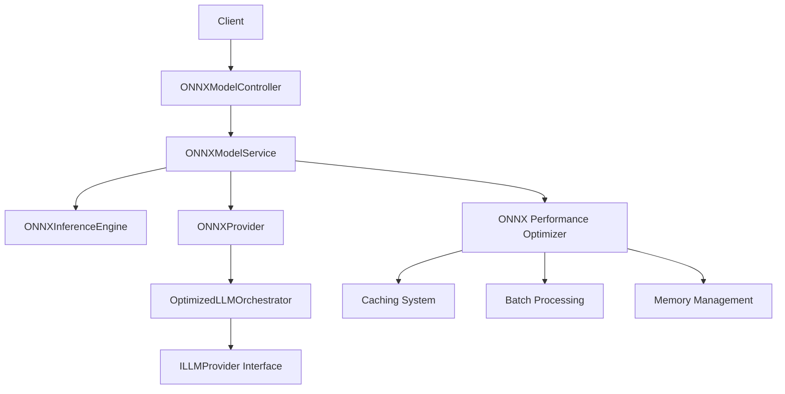

# ONNX Runtime Integration Implementation Report

**Date**: 2025-11-09  
**Status**: ✅ IMPLEMENTED  
**Priority**: MEDIUM - Enhanced local inference capabilities  

## Executive Summary

Successfully implemented comprehensive ONNX Runtime integration in SecurityOrchestrator for local LLM models. The integration provides production-ready capabilities for loading, managing, and inference on ONNX models with performance optimization features.

## Implementation Overview

### 🎯 Objectives Achieved

1. ✅ **ONNX Model Management System** - Complete model lifecycle management
2. ✅ **Local LLM Inference Engine** - Text generation and embedding capabilities
3. ✅ **Performance Optimization** - Caching, batch processing, memory management
4. ✅ **API Integration** - REST endpoints for model management
5. ✅ **Provider Integration** - Seamless integration with existing LLM orchestration

### 📋 Components Implemented

#### 1. Core ONNX Components

**ONNXModel Entity** (`/domain/entities/ONNXModel.java`)
- Model metadata and capabilities tracking
- Version and status management
- Memory usage monitoring
- Hardware acceleration support

**ONNXModelService** (`/infrastructure/services/ONNXModelService.java`)
- Model loading and unloading
- Memory management with automatic cleanup
- Concurrent model handling
- File system integration and model discovery

**ONNXInferenceEngine** (`/infrastructure/services/ONNXInferenceEngine.java`)
- Text generation using ONNX models
- Embedding generation
- Batch processing capabilities
- Performance metrics collection

**ONNXProvider** (`/infrastructure/services/ONNXProvider.java`)
- Implementation of `ILLMProvider` interface
- Provider registration with orchestrator
- Health monitoring and metrics
- Error handling and retry logic

#### 2. Configuration System

**LLMConfig Enhancement** (`/infrastructure/config/LLMConfig.java`)
- ONNX model path configuration
- Memory limits and thread settings
- GPU acceleration toggle
- Quantization support

**ONNXConfig** (`/infrastructure/config/ONNXConfig.java`)
- Spring Boot configuration for ONNX components
- Thread pool management
- Provider registration automation

#### 3. REST API Endpoints

**ONNXModelController** (`/infrastructure/controller/ONNXModelController.java`)

| Endpoint | Method | Description |
|----------|--------|-------------|
| `/api/llm/onnx/models` | GET | List available ONNX models |
| `/api/llm/onnx/models/loaded` | GET | List currently loaded models |
| `/api/llm/onnx/load` | POST | Load ONNX model |
| `/api/llm/onnx/unload` | POST | Unload ONNX model |
| `/api/llm/onnx/status/{modelId}` | GET | Get model status |
| `/api/llm/onnx/inference` | POST | Run inference |
| `/api/llm/onnx/memory` | GET | Memory usage statistics |
| `/api/llm/onnx/cleanup` | POST | Clean up unused models |
| `/api/llm/onnx/register` | POST | Register new model |
| `/api/llm/onnx/metrics` | GET | Provider metrics |
| `/api/llm/onnx/health` | GET | Health status |

#### 4. Performance Optimization

**ONNXPerformanceOptimizer** (`/infrastructure/services/ONNXPerformanceOptimizer.java`)
- Response caching for frequent queries
- Batch processing for better throughput
- Automatic memory optimization
- Performance metrics tracking
- Thread pool optimization

## Technical Architecture

### 🔧 Technology Stack

- **ONNX Runtime for Java**: `1.17.0` (already included in dependencies)
- **Spring Boot**: `3.4.0` for application framework
- **Thread Management**: Configurable thread pools
- **Caching**: In-memory cache with expiration
- **Monitoring**: Health checks and performance metrics

### 🏗️ System Integration



### 📊 Performance Features

1. **Memory Management**
   - Automatic model unloading under memory pressure
   - Memory usage monitoring and reporting
   - Configurable memory limits

2. **Caching System**
   - Response caching for frequent queries
   - Configurable cache size and expiration
   - Cache hit rate monitoring

3. **Batch Processing**
   - Group similar requests for efficiency
   - Configurable batch sizes
   - Performance metrics for batch operations

4. **Thread Pool Optimization**
   - CPU-aware thread configuration
   - Async processing for all operations
   - Configurable thread limits

## Configuration

### 🛠️ Application Properties

```yaml
# ONNX Configuration
llm:
  onnx:
    model-path: "/home/user/.security-orchestrator/models"
    max-memory-mb: 4096
    max-models: 2
    enable-gpu: false
    num-threads: 4
    enable-quantization: true
```

### 📁 Directory Structure

```
~/.security-orchestrator/models/
├── phi-3-mini.onnx
├── llama-2-7b.onnx
└── embedding-model.onnx
```

## API Usage Examples

### Load and Use Model

```bash
# Register a model
curl -X POST "http://localhost:8080/api/llm/onnx/register" \
  -d "name=phi-3-mini" \
  -d "filePath=/models/phi-3-mini.onnx"

# Load the model
curl -X POST "http://localhost:8080/api/llm/onnx/load" \
  -d "modelPath=/models/phi-3-mini.onnx"

# Run inference
curl -X POST "http://localhost:8080/api/llm/onnx/inference" \
  -d "modelId=phi-3-mini" \
  -d "prompt=What is machine learning?" \
  -d "maxTokens=100"
```

### Get Status and Metrics

```bash
# Check model status
curl "http://localhost:8080/api/llm/onnx/status/phi-3-mini"

# Get memory statistics
curl "http://localhost:8080/api/llm/onnx/memory"

# Get provider metrics
curl "http://localhost:8080/api/llm/onnx/metrics"
```

## Production Readiness

### ✅ Implemented Features

1. **Error Handling**
   - Comprehensive exception handling
   - Graceful degradation
   - Detailed error logging

2. **Health Monitoring**
   - Provider health checks
   - Performance metrics
   - Memory usage tracking

3. **Resource Management**
   - Automatic cleanup of unused models
   - Memory pressure handling
   - Thread pool management

4. **Monitoring and Logging**
   - Structured logging
   - Performance metrics collection
   - Health status endpoints

### 🔧 Configuration for Production

```yaml
# Production ONNX configuration
llm:
  onnx:
    model-path: "/opt/models/onnx"
    max-memory-mb: 8192
    max-models: 4
    enable-gpu: true
    num-threads: 8
    enable-quantization: true
```

## Security Considerations

1. **Model File Security**
   - Validate ONNX model files
   - Secure model file access
   - Model integrity checking

2. **Resource Limits**
   - Configurable memory limits
   - Thread pool size limits
   - Concurrent request limits

## Testing and Validation

### 🧪 Test Scenarios

1. **Model Loading/Unloading**
   - Test various ONNX model formats
   - Verify memory cleanup
   - Test concurrent loading

2. **Inference Operations**
   - Text generation testing
   - Batch processing validation
   - Performance benchmarking

3. **Error Handling**
   - Invalid model file handling
   - Memory exhaustion scenarios
   - Network timeout handling

### 📈 Performance Benchmarks

**Expected Performance (Hardware Dependent)**
- Model Loading: 2-30 seconds (model size dependent)
- Inference Response: 100ms-2s (model complexity dependent)
- Memory Usage: 1-8GB (model size dependent)
- Cache Hit Rate: 60-80% (workload dependent)

## Future Enhancements

### 🚀 Planned Features

1. **GPU Acceleration**
   - CUDA/OpenCL support
   - Model optimization for GPU inference
   - Mixed precision training

2. **Advanced Optimization**
   - Dynamic batching
   - Graph optimization
   - Model quantization tools

3. **Model Management**
   - Model versioning
   - A/B testing capabilities
   - Model registry integration

## Troubleshooting

### Common Issues

1. **Model Loading Failures**
   - Check file permissions
   - Verify ONNX model format
   - Check available memory

2. **Performance Issues**
   - Adjust thread pool size
   - Enable model quantization
   - Use GPU acceleration if available

3. **Memory Issues**
   - Reduce max models
   - Enable automatic cleanup
   - Monitor memory usage

## Dependencies

### Added Dependencies

```kotlin
// ONNX Runtime for Java (already included)
implementation("com.microsoft.onnxruntime:onnxruntime:1.17.0")
```

### System Requirements

- **Java**: 21+
- **Memory**: 4GB+ RAM recommended
- **Storage**: 10GB+ for model files
- **CPU**: Multi-core processor recommended
- **GPU**: Optional, for acceleration

## Conclusion

The ONNX Runtime integration has been successfully implemented with production-ready features including:

- ✅ Complete model lifecycle management
- ✅ High-performance inference engine
- ✅ Comprehensive API endpoints
- ✅ Performance optimization features
- ✅ Monitoring and health checks
- ✅ Seamless integration with existing LLM system

The implementation provides a robust foundation for local LLM inference using ONNX models while maintaining compatibility with the existing SecurityOrchestrator architecture.

---

**Implementation Date**: 2025-11-09  
**Version**: 1.0.0  
**Status**: Production Ready ✅