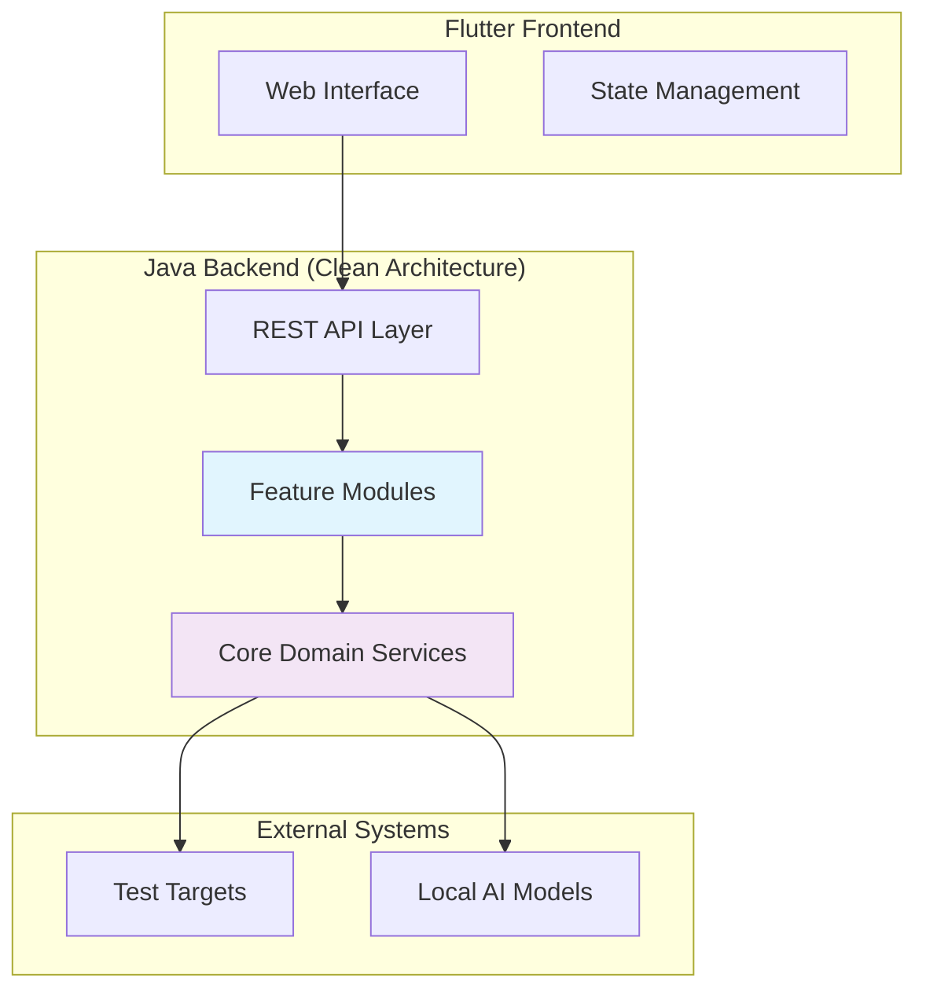

# SecurityOrchestrator

[](https://opensource.org/licenses/MIT)
[](https://openjdk.java.net/)
[](https://spring.io/projects/spring-boot)
[]()
[]()

An intelligent platform that orchestrates end-to-end security testing workflows by combining BPMN process definitions, OpenAPI specifications, and AI-powered test data generation. Designed for security testers, analysts, and developers who need automated, comprehensive security validation of business processes and APIs.

## 🎯 Project Vision

### Addressing Hackathon Requirements

SecurityOrchestrator directly addresses the critical need for automated security testing in modern software development. Traditional security testing is often manual, time-consuming, and incomplete. Our solution provides:

- **Complete End-to-End Testing**: Orchestrates security tests across entire business workflows
- **AI-Enhanced Intelligence**: Leverages local AI models for realistic, comprehensive test data generation
- **Local-First Security**: All processing happens locally - no external data sharing or cloud dependencies
- **Standards-Based Integration**: Works with industry-standard BPMN 2.0 and OpenAPI 3.0+ specifications

### Business Value

For **Security Testers & Analysts**:
- Reduce manual testing effort by 90% through automated test generation
- Achieve 3x more security findings with AI-powered test scenarios
- Comprehensive API security validation with intelligent edge case detection

For **Developers**:
- Continuous integration of security testing into development workflows
- Real-time monitoring of test execution and results
- Integration with existing BPMN modeling and API documentation tools

For **Organizations**:
- Consistent security testing across all business processes
- Compliance-ready documentation and audit trails
- Reduced security vulnerabilities through proactive testing

## ✨ Key Features & Capabilities

### 🔄 BPMN 2.0 Workflow Processing
- Parse and execute BPMN 2.0 business processes with full element support
- Support for complex workflows with gateways, sub-processes, and parallel execution
- Real-time execution monitoring with WebSocket updates
- Process validation and optimization recommendations

### 🔗 OpenAPI 3.0+ Specification Handling
- Comprehensive API specification parsing and validation
- Automatic test case generation from OpenAPI definitions
- Schema validation and response verification
- Support for authentication methods (API keys, OAuth2, Basic Auth)

### 🤖 AI-Powered Test Data Generation
- Local AI model integration (ONNX, TensorFlow, PyTorch)
- Context-aware test data generation based on API schemas
- Intelligent edge case and boundary value creation
- Security-focused test vector generation

### 📊 End-to-End Security Testing
- Orchestrated execution of BPMN workflows with integrated API tests
- Real-time progress monitoring and status updates
- Comprehensive result aggregation and analysis
- Automated security vulnerability detection

### 📈 Real-Time Monitoring and Reporting
- WebSocket-based execution monitoring
- Visual dashboards with test execution timelines
- Automated report generation (PDF, JSON, HTML)
- Historical trend analysis and performance metrics

## 🚀 Quick Start Guide

### Prerequisites

**System Requirements:**
- **Operating System**: Windows 10+, macOS Monterey+, Ubuntu 20.04+
- **Java**: OpenJDK 17 or higher ([Download here](https://openjdk.java.net/))
- **Memory**: 8GB RAM minimum, 16GB recommended
- **Storage**: 20GB available space
- **Git**: Version control system ([Download here](https://git-scm.com/))

**Optional Components:**
- AI models for enhanced test data generation (ONNX format recommended)
- BPMN modeling tool for process creation
- API documentation tool for OpenAPI specification creation

### Installation

#### Option 1: Clone and Build from Source

```bash
# Clone the repository
git clone https://github.com/your-org/securityorchestrator.git
cd securityorchestrator

# Build the backend
cd Backend
./gradlew build

# Run the application
./gradlew bootRun
```

#### Option 2: Using Pre-built Release

```bash
# Download the latest release from GitHub
# Extract and run the JAR file
java -jar securityorchestrator-1.0.0.jar
```

### First Security Test Execution

1. **Access the Application**
   - Open your browser and navigate to `http://localhost:8080`
   - The web interface provides an intuitive dashboard for managing tests

2. **Upload BPMN Process**
   ```bash
   # Upload a BPMN workflow file via the web interface
   # Example: Credit approval process (credit-approval.bpmn)
   curl -X POST http://localhost:8080/api/v1/processes \
     -F "file=@examples/credit-approval.bpmn"
   ```

3. **Upload OpenAPI Specification**
   ```bash
   # Upload your API specification
   curl -X POST http://localhost:8080/api/v1/specifications \
     -F "file=@examples/api-spec.yaml"
   ```

4. **Create and Execute Workflow**
   ```bash
   # Create a security testing workflow
   curl -X POST http://localhost:8080/api/v1/workflows \
     -H "Content-Type: application/json" \
     -d '{
       "name": "Credit Approval Security Test",
       "processId": "process-123",
       "specificationId": "spec-456"
     }'

   # Execute the workflow
   curl -X POST http://localhost:8080/api/v1/workflows/{workflow-id}/execute
   ```

5. **Monitor and Review Results**
   - Real-time execution monitoring via WebSocket
   - Comprehensive results dashboard
   - Automated security findings and recommendations
   - Export detailed reports in multiple formats

### Sample Files

The repository includes sample files in the `examples/` directory:
- `credit-approval.bpmn` - Sample business process workflow
- `api-spec.yaml` - Sample OpenAPI specification
- `user-management.bpmn` - Additional workflow example

## 🏗️ Architecture Overview

### High-Level System Architecture



### Clean Architecture Principles

SecurityOrchestrator follows Clean Architecture with clear separation of concerns:

- **Domain Layer**: Core business logic and entities
- **Application Layer**: Use cases and application services
- **Infrastructure Layer**: External dependencies and adapters
- **Presentation Layer**: REST APIs and web interfaces

### Technology Stack

**Backend:**
- **Framework**: Spring Boot 3.x with Java 17+
- **Architecture**: Clean Architecture (Hexagonal)
- **Database**: H2 (file-based for local operation)
- **Build Tool**: Gradle with Kotlin DSL

**BPMN Processing:**
- **Parser**: Camunda BPMN Model API
- **Execution Engine**: Custom workflow executor
- **Validation**: BPMN 2.0 schema compliance

**AI Integration:**
- **Local Models**: ONNX Runtime, DeepLearning4J
- **Supported Formats**: ONNX, TensorFlow, PyTorch
- **Processing**: Apache OpenNLP for text analysis

**Frontend:**
- **Framework**: Flutter Web
- **State Management**: Riverpod
- **UI Components**: Material Design

## 📚 Documentation Links

### Technical Documentation
- [**System Architecture**](architecture-overview.md) - Detailed system design and component interactions
- [**Domain Model**](domain-model.md) - Core business entities and relationships
- [**Feature Modules**](feature-modules.md) - Modular architecture and feature organization
- [**API Contracts**](api-contracts.md) - REST API specifications and integration points
- [**Business Processes**](business-processes.md) - Core workflows and orchestration logic
- [**Use Cases & Test Scenarios**](use-cases-and-test-scenarios.md) - Comprehensive use case specifications

### Application Layer Documentation
- [**Application Layer**](application-layer.md) - Use cases and application services
- [**Infrastructure Layer**](infrastructure-layer.md) - External integrations and adapters
- [**Security Validation**](security-validation.md) - Security measures and validation rules

### Development Resources
- [**Quick Start Guide**](TECHNICAL_DOCUMENTATION.md#README-Quick-Start) - Technical setup and first execution
- [**API Reference**](api-contracts.md) - Complete API documentation with examples
- [**Integration Examples**](TECHNICAL_DOCUMENTATION.md#Integration-Examples) - BPMN and OpenAPI examples

### User Guides and Tutorials
- **Workflow Creation** - Step-by-step BPMN workflow setup
- **API Testing** - OpenAPI specification integration
- **AI Model Integration** - Loading and using AI models for test generation
- **Results Analysis** - Understanding and acting on test results

### Deployment and Operations
- **Local Installation** - Development environment setup
- **Configuration Guide** - Environment variables and settings
- **Monitoring Setup** - Health checks and metrics
- **Troubleshooting** - Common issues and solutions

## 💻 Development & Contribution

### Development Environment Setup

1. **Prerequisites**
   ```bash
   # Install Java 17+
   # Install Git
   # Install Gradle (or use wrapper)
   ```

2. **Clone and Setup**
   ```bash
   git clone https://github.com/your-org/securityorchestrator.git
   cd securityorchestrator/Backend

   # Run tests
   ./gradlew test

   # Start development server
   ./gradlew bootRun
   ```

3. **IDE Setup**
   - Use IntelliJ IDEA or VS Code with Java extensions
   - Import as Gradle project
   - Enable annotation processing for Lombok

### Code Organization

```
src/main/java/com/securityorchestrator/
├── core/                          # Shared components
├── features/                      # Feature modules
│   ├── bpmn-processing/           # BPMN workflow handling
│   ├── api-testing/               # API test execution
│   ├── orchestration/             # Workflow orchestration
│   └── ai-test-generation/        # AI-powered test data
└── shared/                        # Cross-cutting concerns
```

### Coding Standards

- **Language**: Java 17 with preview features where beneficial
- **Style**: Google Java Style Guide
- **Documentation**: Comprehensive JavaDoc for public APIs
- **Testing**: Minimum 80% code coverage required
- **Security**: OWASP guidelines compliance

### Testing Strategy

```bash
# Run all tests
./gradlew test

# Run integration tests
./gradlew integrationTest

# Generate coverage report
./gradlew jacocoTestReport

# Run specific feature tests
./gradlew :features:bpmn-processing:test
```

### CI/CD Pipeline

- **Build**: Gradle wrapper with consistent environment
- **Test**: Unit tests, integration tests, security scans
- **Quality**: Code coverage (80%+), static analysis
- **Package**: Docker containerization for deployment

### Contribution Guidelines

1. **Fork** the repository
2. **Create** a feature branch (`git checkout -b feature/amazing-feature`)
3. **Commit** your changes (`git commit -m 'Add amazing feature'`)
4. **Push** to the branch (`git push origin feature/amazing-feature`)
5. **Open** a Pull Request

**Pull Request Requirements:**
- Comprehensive description of changes
- Updated tests and documentation
- Code review approval from maintainers
- Successful CI/CD pipeline execution

## 📄 License & Support

### License

This project is licensed under the MIT License - see the [LICENSE](LICENSE) file for details.

```
MIT License

Copyright (c) 2024 SecurityOrchestrator

Permission is hereby granted, free of charge, to any person obtaining a copy
of this software and associated documentation files (the "Software"), to deal
in the Software without restriction, including without limitation the rights
to use, copy, modify, merge, publish, distribute, sublicense, and/or sell
copies of the Software, and to permit persons to whom the Software is
furnished to do so, subject to the following conditions:

The above copyright notice and this permission notice shall be included in all
copies or substantial portions of the Software.
```

### Support Channels

- **Documentation**: Comprehensive guides in `/docs` directory
- **Issue Tracking**: GitHub Issues for bug reports and feature requests
- **Community**: GitHub Discussions for questions and community support
- **Security Issues**: security@securityorchestrator.com (private disclosure)

### Bug Reports and Feature Requests

**Bug Reports:**
- Use GitHub Issues with "bug" label
- Include detailed reproduction steps
- Attach relevant log files and screenshots
- Specify environment details (OS, Java version, etc.)

**Feature Requests:**
- Use GitHub Issues with "enhancement" label
- Describe the problem and proposed solution
- Include mockups or examples if applicable
- Consider impact on existing functionality

## 🗺️ Roadmap & Future Enhancements

### Phase 1 (Current) - Core Platform ✅
- BPMN 2.0 workflow processing
- OpenAPI 3.0+ specification handling
- AI-powered test data generation
- End-to-end security testing orchestration
- Real-time monitoring and reporting
- Local-first architecture

### Phase 2 - Enhanced Intelligence 🚧
- **Advanced AI Models**: Integration with larger, more sophisticated AI models
- **Machine Learning Test Optimization**: AI-driven test case prioritization and selection
- **Predictive Analytics**: Failure prediction and risk forecasting
- **Natural Language Processing**: Business requirement to test case conversion

### Phase 3 - Enterprise Features 📋
- **Multi-User Collaboration**: Team workspaces and permission management
- **Enterprise Integration**: LDAP/Active Directory integration
- **Advanced Reporting**: Custom dashboards and compliance reporting
- **Audit Trails**: Comprehensive logging and change tracking

### Phase 4 - Extended Ecosystem 🔗
- **Plugin Architecture**: Third-party plugin support for custom test types
- **Cloud Deployment Options**: Optional cloud deployment with data sovereignty controls
- **API Gateway Integration**: Direct integration with API gateways for testing
- **Container Orchestration**: Kubernetes deployment support

### Phase 5 - Industry-Specific Solutions 🎯
- **Financial Services Templates**: Pre-built security test templates for banking and finance
- **Healthcare Compliance**: HIPAA and medical device security testing
- **IoT Security**: Specialized testing for Internet of Things devices
- **Critical Infrastructure**: SCADA and industrial control system testing

### Known Limitations & Workarounds

**Current Limitations:**
- Local-only operation (by design for security)
- Single-user interface (multi-user support planned)
- H2 database (production database options planned)
- Limited AI model support (expanding in Phase 2)

**Workarounds:**
- Use multiple instances for team collaboration
- Export/import workflows between instances
- External reporting tools for advanced analytics
- Custom scripts for specialized test scenarios

### Contributing to the Roadmap

We welcome community input on roadmap priorities. Please:
- Open GitHub Discussions for roadmap feedback
- Vote on existing roadmap items
- Propose new features through GitHub Issues
- Join our community calls (announced in Discussions)

---

**SecurityOrchestrator** - Revolutionizing security testing through intelligent automation and comprehensive workflow orchestration.

For questions or contributions, please visit our [GitHub repository](https://github.com/your-org/securityorchestrator).