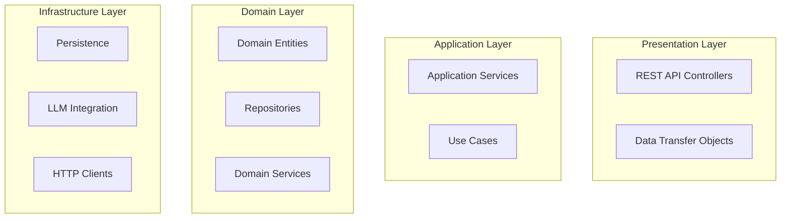
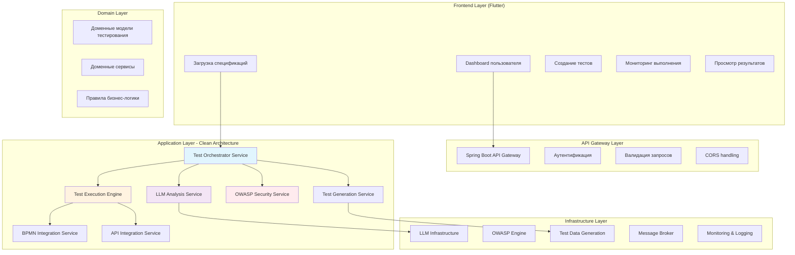
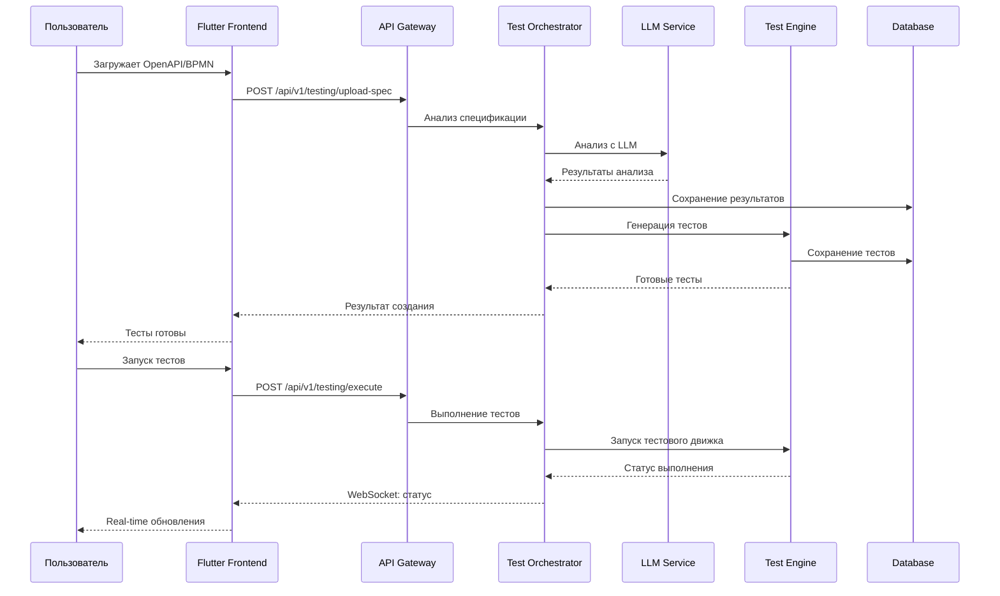
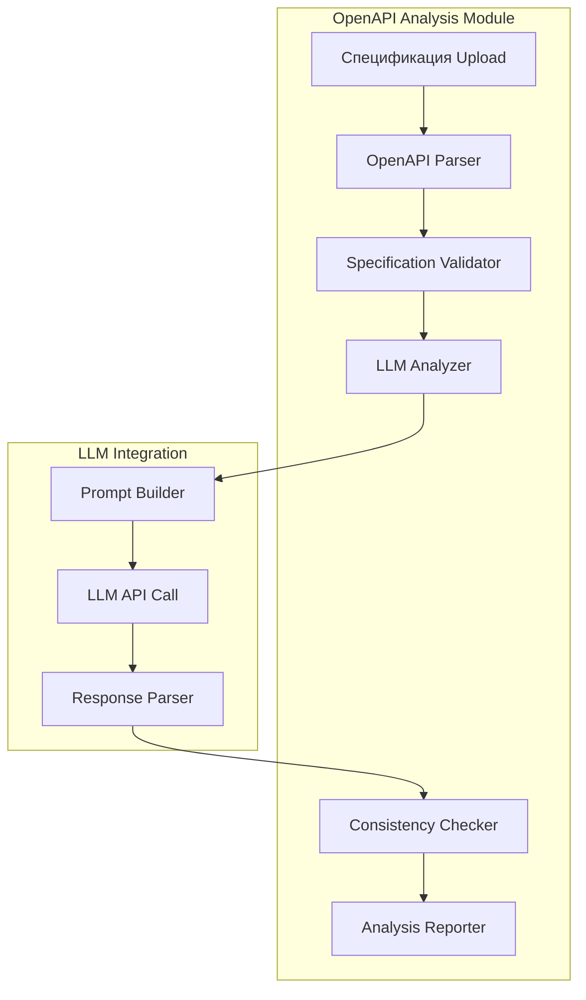
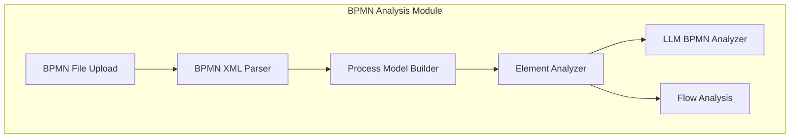
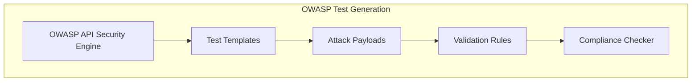
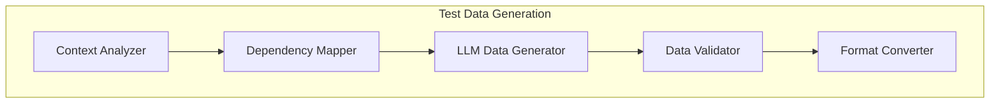
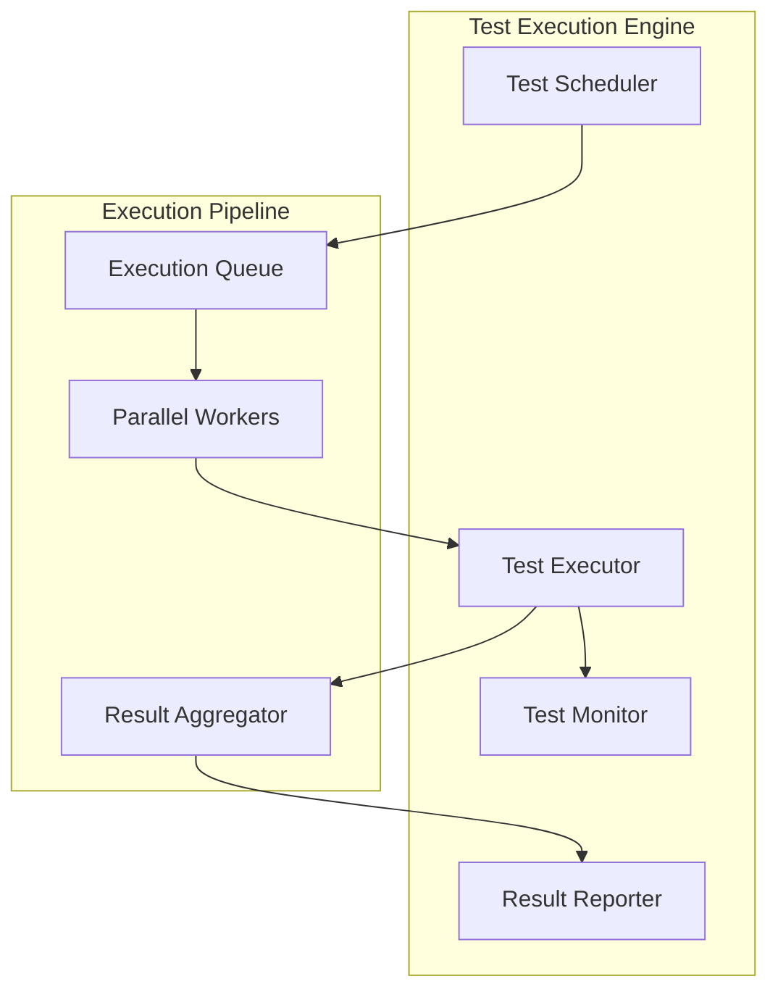

# Техническое задание: Система автоматического тестирования API и BPMN процессов

## Исполнительное резюме

**Цель проекта**: Создание комплексной системы автоматического тестирования API и BPMN процессов для SecurityOrchestrator, использующей LLM технологии для интеллектуального анализа, генерации тестов и выявления уязвимостей.

**Целевые пользователи**: Тестировщики, аналитики, DevOps инженеры

**Ключевые преимущества**:
- Уменьшение времени тестирования на 90%
- Повышение качества выявления уязвимостей
- Автоматизация сложных тестовых сценариев
- Интеграция с существующими LLM возможностями

## 1. Анализ существующей архитектуры SecurityOrchestrator

### 1.1 Текущая архитектура

SecurityOrchestrator построен на основе Clean Architecture с четким разделением слоев:



### 1.2 Существующие компоненты для интеграции

#### LLM Infrastructure
- **OpenRouterClient**: Облачные LLM модели
- **LocalLLMService**: Локальные модели (Ollama)
- **LLMConfig**: Конфигурация системы
- **PerformanceMetrics**: Мониторинг производительности

#### API Testing Components
- **OpenApiSpec**: Сущности для работы с OpenAPI
- **ApiEndpointAnalysis**: Анализ эндпоинтов
- **ApiInconsistency**: Выявление несогласованностей
- **ApiIssue**: Проблемы в API

#### Test Framework
- **TestCase**: Базовые тестовые сценарии
- **TestExecution**: Выполнение тестов
- **TestScenario**: Сложные сценарии
- **TestResult**: Результаты тестирования

#### BPMN Components
- **BpmnDiagram**: Диаграммы процессов
- **BpmnAnalysis**: Анализ процессов
- **FlowElement**: Элементы процессов

### 1.3 Выявленные возможности интеграции

1. **LLM анализ**: Существующая LLM система может анализировать текстовые описания
2. **BPMN парсинг**: Инфраструктура для работы с BPMN процессами
3. **OpenAPI анализ**: Базовые возможности анализа API спецификаций
4. **Тестовая инфраструктура**: Готовая система выполнения тестов
5. **Валидация**: Infrastructure для выявления проблем и несогласованностей

## 2. Архитектура системы автоматического тестирования

### 2.1 Общая архитектура



### 2.2 Пользовательские потоки данных



## 3. Модульный дизайн системы

### 3.1 Модуль анализа спецификаций

#### OpenAPI анализ модуль


**Функции модуля**:
- Парсинг OpenAPI/Swagger спецификаций
- Валидация схем и эндпоинтов
- LLM анализ текстовых описаний
- Выявление несогласованностей
- Генерация отчетов

#### BPMN анализ модуль


**Функции модуля**:
- Парсинг BPMN XML диаграмм
- Анализ элементов процесса
- LLM анализ бизнес-логики
- Выявление потенциальных проблем
- Сопоставление с API эндпоинтами

### 3.2 Модуль генерации тестов

#### OWASP Security тесты


**OWASP категории тестирования**:
1. **API1:2019 - Broken Object Level Authorization**
2. **API2:2019 - Broken User Authentication**
3. **API3:2019 - Excessive Data Exposure**
4. **API4:2019 - Lack of Resources & Rate Limiting**
5. **API5:2019 - Broken Function Level Authorization**
6. **API6:2019 - Mass Assignment**
7. **API7:2019 - Security Misconfiguration**
8. **API8:2019 - Injection**
9. **API9:2019 - Improper Assets Management**
10. **API10:2019 - Insufficient Logging & Monitoring**

#### Генерация тестовых данных


### 3.3 Модуль выполнения тестов

#### Test Execution Engine


## 4. Технологический стек

### 4.1 Backend технологии

#### Основной стек
- **Java 21+**: Современный язык программирования
- **Spring Boot 3.x**: Web-фреймворк
- **Clean Architecture**: Архитектурный паттерн
- **Gradle**: Система сборки

#### Специализированные библиотеки
```kotlin
dependencies {
    // OpenAPI и Swagger
    implementation("io.swagger.parser.v3:swagger-parser:2.1.22")
    implementation("io.springfox:springfox-swagger2:2.9.2")
    
    // BPMN processing
    implementation("org.camunda.bpm:camunda-bpmn-model:7.21.0")
    implementation("org.flowable:flowable-engine:6.8.2")
    
    // LLM и AI
    implementation("org.springframework.boot:spring-boot-starter-webflux")
    implementation("io.projectreactor:reactor-core")
    implementation("com.fasterxml.jackson.core:jackson-databind")
    
    // HTTP клиенты
    implementation("org.springframework.boot:spring-boot-starter-web")
    implementation("org.apache.httpcomponents:httpclient")
    implementation("com.squareup.retrofit2:retrofit:2.9.0")
    
    // Валидация и схемы
    implementation("com.networknt:json-schema-validator:1.0.76")
    implementation("org.hibernate.validator:hibernate-validator")
    
    // Тестирование
    testImplementation("org.springframework.boot:spring-boot-starter-test")
    testImplementation("org.wiremock:wiremock-standalone:2.27.2")
    testImplementation("io.rest-assured:rest-assured:5.3.2")
}
```

### 4.2 Frontend технологии

#### Flutter Web
```yaml
# pubspec.yaml ключевые зависимости
dependencies:
  flutter:
    sdk: flutter
  
  # HTTP и WebSocket
  http: ^1.1.0
  web_socket_channel: ^2.4.0
  socket_io_client: ^2.0.3
  
  # State Management
  flutter_riverpod: ^2.4.9
  riverpod_annotation: ^2.3.3
  
  # UI компоненты
  flutter_material_design_icons: ^1.0.5
  charts_flutter: ^0.12.0
  syncfusion_flutter_charts: ^23.2.7
  
  # Файлы и документы
  file_picker: ^6.1.1
  pdf: ^3.10.7
  
  # Визуализация
  visx: ^3.0.0
```

### 4.3 LLM Integration

#### OpenRouter Integration
```java
@Service
public class OpenRouterLLMClient {
    
    @Async
    public CompletableFuture<SecurityAnalysisResult> analyzeApiSecurity(
            OpenApiSpec spec, 
            List<SecurityCheck> checks) {
        
        String prompt = buildSecurityAnalysisPrompt(spec, checks);
        
        ChatCompletionRequest request = ChatCompletionRequest.builder()
            .model("anthropic/claude-3-haiku")
            .messages(List.of(
                new ChatMessage("user", prompt)
            ))
            .maxTokens(2000)
            .temperature(0.1)
            .build();
        
        return openRouterClient.createChatCompletion(request)
            .thenApply(this::parseSecurityAnalysis);
    }
    
    private String buildSecurityAnalysisPrompt(OpenApiSpec spec, List<SecurityCheck> checks) {
        return String.format("""
            Проанализируй эту OpenAPI спецификацию на предмет безопасности:
            
            %s
            
            Сфокусируйся на следующих аспектах:
            %s
            
            Верни результат в JSON формате с найденными уязвимостями,
            их серьезностью и рекомендациями по исправлению.
            """, spec.toYaml(), checks.stream()
                .map(SecurityCheck::getDescription)
                .collect(Collectors.joining(", "))
        );
    }
}
```

#### Ollama Integration для локальной обработки
```java
@Service
public class LocalLLMAnalyzer {
    
    @Async
    public CompletableFuture<BpmnAnalysisResult> analyzeBpmnProcess(BpmnDiagram diagram) {
        
        String prompt = buildBpmnAnalysisPrompt(diagram);
        
        return localLLMService.generateCompletion(
            "codellama:7b",
            prompt,
            Map.of(
                "maxTokens", 1500,
                "temperature", 0.2,
                "topP", 0.8
            )
        ).thenApply(this::parseBpmnAnalysis);
    }
    
    private String buildBpmnAnalysisPrompt(BpmnDiagram diagram) {
        return String.format("""
            Проанализируй этот BPMN процесс и выяви потенциальные проблемы:
            
            %s
            
            Найди:
            1. Недостающие валидации
            2. Потенциальные точки отказа
            3. Несогласованности в бизнес-логике
            4. Рекомендации по улучшению
            """, diagram.getXmlContent());
    }
}
```

## 5. Модели данных и база данных

### 5.1 Расширенная модель данных

```mermaid
erDiagram
    TEST_PROJECT ||--o{ TEST_SPECIFICATION : contains
    TEST_SPECIFICATION ||--o{ API_ENDPOINT : defines
    TEST_SPECIFICATION ||--o{ BPMN_PROCESS : defines
    
    TEST_SCENARIO ||--o{ TEST_STEP : contains
    TEST_SCENARIO }o--|| TEST_PROJECT : belongs_to
    TEST_STEP ||--o{ API_ENDPOINT : tests
    
    EXECUTION_RUN ||--o{ TEST_RESULT : produces
    EXECUTION_RUN }o--|| TEST_SCENARIO : executes
    TEST_RESULT }o--|| TEST_STEP : results_from
    
    SECURITY_ANALYSIS ||--o{ SECURITY_FINDING : produces
    SECURITY_ANALYSIS }o--|| TEST_SPECIFICATION : analyzes
    
    LLM_ANALYSIS ||--o{ ANALYSIS_FINDING : produces
    LLM_ANALYSIS }o--|| TEST_SPECIFICATION : analyzes
    
    TEST_DATA ||--o{ TEST_STEP : provides_data
    TEST_DATA }o--|| API_ENDPOINT : generated_for
    
    TEST_PROJECT {
        string id PK
        string name
        string description
        timestamp created_at
        timestamp updated_at
        string status
        string project_type
        json configuration
    }
    
    TEST_SPECIFICATION {
        string id PK
        string project_id FK
        string type "OPENAPI" or "BPMN"
        string name
        string content
        json metadata
        json analysis_results
        timestamp created_at
    }
    
    API_ENDPOINT {
        string id PK
        string spec_id FK
        string method
        string path
        json schema
        json parameters
        json security_schemes
        string analysis_status
    }
    
    BPMN_PROCESS {
        string id PK
        string spec_id FK
        string name
        string bpmn_xml
        json elements
        json flows
        json process_variables
    }
    
    TEST_SCENARIO {
        string id PK
        string project_id FK
        string name
        string description
        json owasp_categories
        string priority
        json execution_config
        timestamp created_at
    }
    
    TEST_STEP {
        string id PK
        string scenario_id FK
        string endpoint_id FK
        int order
        string step_type
        json test_data
        json expected_result
        json validation_rules
    }
    
    EXECUTION_RUN {
        string id PK
        string scenario_id FK
        string status
        timestamp started_at
        timestamp completed_at
        json execution_context
        json performance_metrics
    }
    
    TEST_RESULT {
        string id PK
        string run_id FK
        string step_id FK
        string status
        int response_code
        string response_body
        json validation_errors
        duration execution_time
        json security_findings
    }
    
    LLM_ANALYSIS {
        string id PK
        string spec_id FK
        string analysis_type
        string input_content
        string llm_output
        json findings
        json confidence_scores
        timestamp created_at
        string model_used
    }
    
    SECURITY_ANALYSIS {
        string id PK
        string spec_id FK
        string owasp_category
        json security_checks
        json vulnerabilities
        json recommendations
        timestamp created_at
    }
    
    SECURITY_FINDING {
        string id PK
        string analysis_id FK
        string severity
        string category
        string title
        string description
        json recommendation
        json evidence
        string cwe_id
    }
```

### 5.2 Схема базы данных

#### Основные таблицы
```sql
-- Проекты тестирования
CREATE TABLE test_projects (
    id VARCHAR(255) PRIMARY KEY,
    name VARCHAR(500) NOT NULL,
    description TEXT,
    project_type VARCHAR(50) NOT NULL,
    configuration JSON,
    status VARCHAR(50) DEFAULT 'ACTIVE',
    created_at TIMESTAMP DEFAULT CURRENT_TIMESTAMP,
    updated_at TIMESTAMP DEFAULT CURRENT_TIMESTAMP
);

-- Спецификации (OpenAPI/BPMN)
CREATE TABLE test_specifications (
    id VARCHAR(255) PRIMARY KEY,
    project_id VARCHAR(255) NOT NULL,
    type VARCHAR(20) NOT NULL CHECK (type IN ('OPENAPI', 'BPMN')),
    name VARCHAR(500) NOT NULL,
    content TEXT NOT NULL,
    metadata JSON,
    analysis_results JSON,
    created_at TIMESTAMP DEFAULT CURRENT_TIMESTAMP,
    FOREIGN KEY (project_id) REFERENCES test_projects(id)
);

-- API эндпоинты
CREATE TABLE api_endpoints (
    id VARCHAR(255) PRIMARY KEY,
    specification_id VARCHAR(255) NOT NULL,
    method VARCHAR(10) NOT NULL,
    path VARCHAR(1000) NOT NULL,
    schema JSON,
    parameters JSON,
    security_schemes JSON,
    analysis_status VARCHAR(50) DEFAULT 'PENDING',
    created_at TIMESTAMP DEFAULT CURRENT_TIMESTAMP,
    FOREIGN KEY (specification_id) REFERENCES test_specifications(id)
);

-- Тестовые сценарии
CREATE TABLE test_scenarios (
    id VARCHAR(255) PRIMARY KEY,
    project_id VARCHAR(255) NOT NULL,
    name VARCHAR(500) NOT NULL,
    description TEXT,
    owasp_categories JSON,
    priority VARCHAR(20) DEFAULT 'MEDIUM',
    execution_config JSON,
    is_automated BOOLEAN DEFAULT false,
    created_at TIMESTAMP DEFAULT CURRENT_TIMESTAMP,
    FOREIGN KEY (project_id) REFERENCES test_projects(id)
);

-- Шаги тестирования
CREATE TABLE test_steps (
    id VARCHAR(255) PRIMARY KEY,
    scenario_id VARCHAR(255) NOT NULL,
    endpoint_id VARCHAR(255),
    step_order INTEGER NOT NULL,
    step_type VARCHAR(50) NOT NULL,
    test_data JSON,
    expected_result JSON,
    validation_rules JSON,
    timeout_seconds INTEGER DEFAULT 30,
    retry_count INTEGER DEFAULT 0,
    FOREIGN KEY (scenario_id) REFERENCES test_scenarios(id),
    FOREIGN KEY (endpoint_id) REFERENCES api_endpoints(id)
);

-- Выполнения тестов
CREATE TABLE test_executions (
    id VARCHAR(255) PRIMARY KEY,
    scenario_id VARCHAR(255) NOT NULL,
    execution_id VARCHAR(255) UNIQUE NOT NULL,
    status VARCHAR(50) DEFAULT 'PENDING',
    execution_type VARCHAR(50) DEFAULT 'MANUAL',
    initiated_by VARCHAR(255),
    environment JSON,
    execution_context JSON,
    performance_metrics JSON,
    started_at TIMESTAMP,
    completed_at TIMESTAMP,
    total_duration_ms BIGINT,
    created_at TIMESTAMP DEFAULT CURRENT_TIMESTAMP,
    FOREIGN KEY (scenario_id) REFERENCES test_scenarios(id)
);

-- Результаты тестов
CREATE TABLE test_results (
    id VARCHAR(255) PRIMARY KEY,
    execution_id VARCHAR(255) NOT NULL,
    step_id VARCHAR(255) NOT NULL,
    status VARCHAR(50) NOT NULL,
    response_code INTEGER,
    response_body TEXT,
    validation_errors JSON,
    security_findings JSON,
    execution_time_ms BIGINT,
    executed_at TIMESTAMP DEFAULT CURRENT_TIMESTAMP,
    FOREIGN KEY (execution_id) REFERENCES test_executions(id),
    FOREIGN KEY (step_id) REFERENCES test_steps(id)
);

-- LLM анализ
CREATE TABLE llm_analyses (
    id VARCHAR(255) PRIMARY KEY,
    specification_id VARCHAR(255) NOT NULL,
    analysis_type VARCHAR(100) NOT NULL,
    input_content TEXT NOT NULL,
    llm_output TEXT,
    findings JSON,
    confidence_scores JSON,
    model_used VARCHAR(100),
    tokens_used INTEGER,
    cost DECIMAL(10,4),
    created_at TIMESTAMP DEFAULT CURRENT_TIMESTAMP,
    FOREIGN KEY (specification_id) REFERENCES test_specifications(id)
);

-- Анализ безопасности
CREATE TABLE security_analyses (
    id VARCHAR(255) PRIMARY KEY,
    specification_id VARCHAR(255) NOT NULL,
    owasp_category VARCHAR(100) NOT NULL,
    security_checks JSON NOT NULL,
    vulnerabilities JSON,
    recommendations JSON,
    overall_risk_score DECIMAL(3,2),
    compliance_status VARCHAR(50),
    created_at TIMESTAMP DEFAULT CURRENT_TIMESTAMP,
    FOREIGN KEY (specification_id) REFERENCES test_specifications(id)
);

-- Найденные уязвимости
CREATE TABLE security_findings (
    id VARCHAR(255) PRIMARY KEY,
    analysis_id VARCHAR(255) NOT NULL,
    severity VARCHAR(20) NOT NULL,
    category VARCHAR(100) NOT NULL,
    title VARCHAR(500) NOT NULL,
    description TEXT,
    recommendation TEXT,
    evidence JSON,
    cwe_id VARCHAR(20),
    cvss_score DECIMAL(3,1),
    status VARCHAR(50) DEFAULT 'OPEN',
    created_at TIMESTAMP DEFAULT CURRENT_TIMESTAMP,
    FOREIGN KEY (analysis_id) REFERENCES security_analyses(id)
);

-- Тестовые данные
CREATE TABLE test_data (
    id VARCHAR(255) PRIMARY KEY,
    endpoint_id VARCHAR(255) NOT NULL,
    data_type VARCHAR(100) NOT NULL,
    generated_value JSON NOT NULL,
    data_schema JSON,
    context JSON,
    is_valid BOOLEAN DEFAULT true,
    created_at TIMESTAMP DEFAULT CURRENT_TIMESTAMP,
    used_count INTEGER DEFAULT 0,
    FOREIGN KEY (endpoint_id) REFERENCES api_endpoints(id)
);

-- Индексы для производительности
CREATE INDEX idx_test_specifications_project ON test_specifications(project_id);
CREATE INDEX idx_test_scenarios_project ON test_scenarios(project_id);
CREATE INDEX idx_test_executions_scenario ON test_executions(scenario_id);
CREATE INDEX idx_test_executions_status ON test_executions(status);
CREATE INDEX idx_test_results_execution ON test_results(execution_id);
CREATE INDEX idx_security_findings_analysis ON security_findings(analysis_id);
CREATE INDEX idx_security_findings_severity ON security_findings(severity);
```

## 6. План безопасности и производительности

### 6.1 Архитектура безопасности

```mermaid
graph TB
    subgraph "Security Layers"
        PERIMETER[Периметр безопасности]
        APPLICATION[Безопасность приложения]
        DATA[Безопасность данных]
        TRANSPORT[Безопасность передачи]
    end
    
    subgraph "Perimeter Security"
        WAF[Web Application Firewall]
        RATE_LIMIT[Rate Limiting]
        DDOS[DDoS Protection]
    end
    
    subgraph "Application Security"
        AUTH[Аутентификация]
        AUTHZ[Авторизация]
        INPUT_VALID[Валидация входных данных]
        SESSION_MGMT[Управление сессиями]
    end
    
    subgraph "Data Security"
        ENCRYPTION[Шифрование данных]
        ACCESS_CTRL[Контроль доступа]
        AUDIT[Аудит логирование]
        BACKUP[Резервное копирование]
    end
    
    PERIMETER --> WAF
    PERIMETER --> RATE_LIMIT
    PERIMETER --> DDOS
    APPLICATION --> AUTH
    APPLICATION --> AUTHZ
    APPLICATION --> INPUT_VALID
    APPLICATION --> SESSION_MGMT
    DATA --> ENCRYPTION
    DATA --> ACCESS_CTRL
    DATA --> AUDIT
    DATA --> BACKUP
```



### 6.2 Безопасность при работе с внешними OpenAPI

#### Валидация и sanitization
```java
@Component
public class ApiSpecSecurityValidator {
    
    public ValidationResult validateOpenApiSpec(String specContent) {
        ValidationResult result = new ValidationResult();
        
        // 1. Проверка размера
        if (specContent.length() > MAX_SPEC_SIZE) {
            result.addError("SPEC_TOO_LARGE", "Спецификация превышает максимальный размер");
        }
        
        // 2. Валидация JSON/XML
        if (!isValidJson(specContent) && !isValidXml(specContent)) {
            result.addError("INVALID_FORMAT", "Некорректный формат спецификации");
        }
        
        // 3. Проверка на SSRF
        if (containsExternalReferences(specContent)) {
            result.addError("SSRF_RISK", "Обнаружены внешние ссылки, представляющие риск SSRF");
        }
        
        // 4. Проверка на XSS в описаниях
        if (containsXssPatterns(specContent)) {
            result.addError("XSS_RISK", "Обнаружены потенциально опасные скрипты");
        }
        
        return result;
    }
    
    private boolean containsExternalReferences(String content) {
        Pattern urlPattern = Pattern.compile("https?://[^\\s\"']+");
        Matcher matcher = urlPattern.matcher(content);
        return matcher.find();
    }
    
    private boolean containsXssPatterns(String content) {
        Set<String> xssPatterns = Set.of(
            "<script", "javascript:", "onload=", "onerror="
        );
        return xssPatterns.stream()
            .anyMatch(content::toLowerCase);
    }
}
```

### 6.3 Rate Limiting для LLM запросов
```java
@Configuration
public class LlmSecurityConfig {
    
    @Bean
    public RateLimiter llmRateLimiter() {
        return RateLimiter.create("llm-requests", 
            RateLimiterConfig.custom()
                .limitRefreshPeriod(Duration.ofMinutes(1))
                .limitForPeriod(10) // 10 запросов в минуту
                .build());
    }
    
    @EventListener
    public void handleLlmRequest(LlmRequestEvent event) {
        if (!llmRateLimiter().tryAcquire()) {
            throw new RateLimitExceededException("LLM rate limit exceeded");
        }
    }
}
```

### 6.4 Масштабируемость и производительность

#### Асинхронная обработка
```java
@Service
public class TestOrchestrationService {
    
    @Async("testExecutionExecutor")
    public CompletableFuture<ExecutionResult> executeTestScenarioAsync(
            String scenarioId, 
            TestExecutionConfig config) {
        
        return CompletableFuture.supplyAsync(() -> {
            try {
                // 1. Подготовка контекста
                ExecutionContext context = prepareExecutionContext(config);
                
                // 2. Выполнение тестовых шагов
                List<TestStep> steps = loadTestSteps(scenarioId);
                List<StepResult> results = new ArrayList<>();
                
                for (TestStep step : steps) {
                    StepResult result = executeStep(step, context);
                    results.add(result);
                    
                    // Обновление контекста
                    context.updateWithResult(result);
                    
                    // WebSocket уведомление
                    notifyProgress(scenarioId, step.getOrder(), result);
                }
                
                // 3. Агрегация результатов
                return ExecutionResult.builder()
                    .scenarioId(scenarioId)
                    .stepResults(results)
                    .overallStatus(determineOverallStatus(results))
                    .build();
                    
            } catch (Exception e) {
                log.error("Test execution failed for scenario: {}", scenarioId, e);
                return ExecutionResult.error(scenarioId, e.getMessage());
            }
        });
    }
    
    private void notifyProgress(String scenarioId, int stepNumber, StepResult result) {
        ProgressUpdate update = ProgressUpdate.builder()
            .scenarioId(scenarioId)
            .stepNumber(stepNumber)
            .status(result.getStatus())
            .timestamp(Instant.now())
            .build();
            
        webSocketService.broadcastToScenario(scenarioId, "progress", update);
    }
}
```

#### Кэширование результатов анализа
```java
@Service
public class AnalysisCacheService {
    
    private final CacheManager cacheManager;
    
    @Cacheable(value = "api-analysis", key = "#specHash")
    public CompletableFuture<ApiAnalysisResult> getCachedAnalysis(String specHash) {
        return performFullAnalysis(specHash);
    }
    
    @CacheEvict(value = "api-analysis", key = "#specHash")
    public void invalidateAnalysis(String specHash) {
        // Очистка кэша
    }
    
    private String calculateSpecHash(String content) {
        return DigestUtils.sha256Hex(content);
    }
}
```

## 7. План поэтапной реализации по приоритетам

### 7.1 Фаза 1: Базовая архитектура (4 недели)

**Цель**: Создать фундамент для системы автоматического тестирования

#### Неделя 1-2: Backend Infrastructure
- [ ] Расширение доменных моделей для тестирования
- [ ] Создание базовых репозиториев
- [ ] Настройка WebSocket для real-time коммуникации
- [ ] Базовые API endpoints для управления проектами

#### Неделя 3-4: LLM Integration
- [ ] Интеграция существующей LLM системы с новым модулем
- [ ] Создание промптов для анализа OpenAPI и BPMN
- [ ] Базовый парсинг и валидация спецификаций

**Критерии приемки**:
- Система может загружать и анализировать простые OpenAPI спецификации
- LLM анализ работает и возвращает структурированные результаты
- Real-time уведомления функционируют

### 7.2 Фаза 2: Основная функциональность (6 недель)

**Цель**: Реализовать полный цикл создания и выполнения тестов

#### Неделя 5-6: OpenAPI Processing
- [ ] Полноценный парсинг OpenAPI спецификаций
- [ ] Валидация схем и эндпоинтов
- [ ] LLM анализ текстовых описаний

#### Неделя 7-8: BPMN Integration
- [ ] Парсинг BPMN диаграмм
- [ ] Анализ элементов процессов
- [ ] Сопоставление BPMN с API

#### Неделя 9-10: Test Generation
- [ ] Генерация базовых тестовых сценариев
- [ ] Создание тестовых данных с помощью LLM
- [ ] Валидация сгенерированных тестов

**Критерии приемки**:
- Успешный анализ OpenAPI и BPMN файлов
- Генерация осмысленных тестовых данных
- Выполнение простых тестовых сценариев

### 7.3 Фаза 3: OWASP Security (4 недели)

**Цель**: Интеграция OWASP API Security Testing

#### Неделя 11-12: OWASP Engine
- [ ] Реализация всех 10 категорий OWASP API Security
- [ ] Генерация attack payloads
- [ ] Валидация уязвимостей

#### Неделя 13-14: Security Analysis
- [ ] LLM анализ безопасности
- [ ] Генерация отчетов о уязвимостях
- [ ] Compliance reporting

**Критерии приемки**:
- Полное покрытие OWASP API Security Testing
- Автоматическое выявление основных уязвимостей
- Генерация детальных отчетов безопасности

### 7.4 Фаза 4: UI/UX и Advanced Features (4 недели)

**Цель**: Создание пользовательского интерфейса и продвинутых функций

#### Неделя 15-16: Flutter Frontend
- [ ] Dashboard для управления проектами
- [ ] Интерфейс загрузки спецификаций
- [ ] Мониторинг выполнения тестов

#### Неделя 17-18: Advanced Features
- [ ] Визуализация результатов
- [ ] Экспорт отчетов
- [ ] Интеграция с внешними системами

**Критерии приемки**:
- Полнофункциональный web интерфейс
- Удобство использования для тестировщиков
- Качественная визуализация результатов

## 8. API Endpoints для системы тестирования

### 8.1 Управление проектами

```yaml
# Test Project Management
POST   /api/v1/testing/projects                    # Создать проект
GET    /api/v1/testing/projects                    # Список проектов
GET    /api/v1/testing/projects/{id}               # Детали проекта
PUT    /api/v1/testing/projects/{id}               # Обновить проект
DELETE /api/v1/testing/projects/{id}               # Удалить проект

# Specification Management
POST   /api/v1/testing/projects/{id}/specifications  # Загрузить спецификацию
GET    /api/v1/testing/specifications/{id}           # Детали спецификации
PUT    /api/v1/testing/specifications/{id}           # Обновить спецификацию
DELETE /api/v1/testing/specifications/{id}           # Удалить спецификацию
```

### 8.2 Анализ и LLM

```yaml
# LLM Analysis Endpoints
POST   /api/v1/testing/analysis/openapi            # Анализ OpenAPI с LLM
POST   /api/v1/testing/analysis/bpmn              # Анализ BPMN с LLM
POST   /api/v1/testing/analysis/consistency       # Проверка согласованности
POST   /api/v1/testing/analysis/security          # Анализ безопасности

# Analysis Results
GET    /api/v1/testing/analysis/{id}              # Результаты анализа
GET    /api/v1/testing/analysis/{id}/findings     # Найденные проблемы
GET    /api/v1/testing/analysis/{id}/report       # Полный отчет анализа
```

### 8.3 Генерация тестов

```yaml
# Test Generation
POST   /api/v1/testing/generation/basic-tests     # Базовые тесты
POST   /api/v1/testing/generation/owasp-tests     # OWASP тесты
POST   /api/v1/testing/generation/bpmn-tests      # BPMN тесты
POST   /api/v1/testing/generation/test-data       # Генерация данных

# Generation Control
GET    /api/v1/testing/generation/{id}/status     # Статус генерации
POST   /api/v1/testing/generation/{id}/cancel     # Отменить генерацию
GET    /api/v1/testing/generation/{id}/preview    # Предпросмотр тестов
```

### 8.4 Выполнение тестов

```yaml
# Test Execution
POST   /api/v1/testing/execution/start            # Запуск тестов
GET    /api/v1/testing/execution/{id}/status      # Статус выполнения
GET    /api/v1/testing/execution/{id}/progress    # Прогресс выполнения
POST   /api/v1/testing/execution/{id}/pause       # Пауза
POST   /api/v1/testing/execution/{id}/resume      # Продолжить
POST   /api/v1/testing/execution/{id}/stop        # Остановить

# Results and Reports
GET    /api/v1/testing/execution/{id}/results     # Результаты
GET    /api/v1/testing/execution/{id}/report      # Отчет
POST   /api/v1/testing/execution/{id}/export      # Экспорт
```

### 8.5 WebSocket endpoints

```yaml
# Real-time Communication
WebSocket /ws/testing/projects/{id}/events        # События проекта
WebSocket /ws/testing/analysis/{id}               # Прогресс анализа
WebSocket /ws/testing/generation/{id}             # Генерация
WebSocket /ws/testing/execution/{id}              # Выполнение тестов
```

### 8.6 Security и Compliance

```yaml
# Security Analysis
GET    /api/v1/testing/security/scan/{specId}     # Запуск security scan
GET    /api/v1/testing/security/report/{scanId}   # Security отчет
GET    /api/v1/testing/security/vulnerabilities   # Список уязвимостей
POST   /api/v1/testing/security/validate-fix      # Валидация исправлений

# Compliance
GET    /api/v1/testing/compliance/standards       # Доступные стандарты
POST   /api/v1/testing/compliance/check           # Проверка соответствия
GET    /api/v1/testing/compliance/report/{id}     # Compliance отчет
```

## 9. Примеры реализации

### 9.1 Контроллер для управления тестированием

```java
@RestController
@RequestMapping("/api/v1/testing")
@Validated
public class TestingController {
    
    private final TestProjectService projectService;
    private final SpecificationService specificationService;
    private final TestGenerationService generationService;
    private final TestExecutionService executionService;
    private final WebSocketService webSocketService;
    
    @PostMapping("/projects")
    public CompletableFuture<ResponseEntity<ApiResponse<TestProjectResponse>>> createProject(
            @Valid @RequestBody CreateProjectRequest request) {
        
        return projectService.createProject(request)
            .thenApply(project -> ResponseEntity.ok(
                ApiResponse.success(TestProjectResponse.from(project))
            ))
            .exceptionally(this::handleException);
    }
    
    @PostMapping("/analysis/openapi")
    public CompletableFuture<ResponseEntity<ApiResponse<AnalysisResponse>>> analyzeOpenApi(
            @Valid @RequestBody AnalyzeOpenApiRequest request) {
        
        return specificationService.analyzeOpenApi(request)
            .thenApply(result -> ResponseEntity.ok(
                ApiResponse.success(AnalysisResponse.from(result))
            ))
            .whenComplete((resp, throwable) -> {
                if (throwable != null) {
                    log.error("OpenAPI analysis failed", throwable);
                }
            });
    }
    
    @PostMapping("/generation/owasp-tests")
    public CompletableFuture<ResponseEntity<ApiResponse<GenerationResponse>>> generateOwaspTests(
            @Valid @RequestBody GenerateTestsRequest request) {
        
        return generationService.generateOwaspTests(request)
            .thenApply(result -> ResponseEntity.ok(
                ApiResponse.success(GenerationResponse.from(result))
            ))
            .whenComplete((resp, throwable) -> {
                if (throwable != null) {
                    log.error("OWASP test generation failed", throwable);
                }
            });
    }
    
    @PostMapping("/execution/start")
    public CompletableFuture<ResponseEntity<ApiResponse<ExecutionResponse>>> startExecution(
            @Valid @RequestBody StartExecutionRequest request) {
        
        return executionService.startExecutionAsync(request)
            .thenApply(result -> ResponseEntity.ok(
                ApiResponse.success(ExecutionResponse.from(result))
            ));
    }
}
```

### 9.2 Сервис анализа OpenAPI с LLM

```java
@Service
public class OpenApiAnalysisService {
    
    private final OpenRouterClient openRouterClient;
    private final LocalLLMService localLLMService;
    private final OpenApiSpecRepository specRepository;
    private final ApiInconsistencyRepository inconsistencyRepository;
    
    @Async("analysisExecutor")
    public CompletableFuture<AnalysisResult> analyzeOpenApiSpec(String specificationId) {
        return CompletableFuture.supplyAsync(() -> {
            try {
                // 1. Загрузить спецификацию
                OpenApiSpec spec = specRepository.findById(specificationId)
                    .orElseThrow(() -> new SpecificationNotFoundException(specificationId));
                
                // 2. Базовый анализ
                List<ApiEndpoint> endpoints = extractEndpoints(spec);
                List<Inconsistency> inconsistencies = findInconsistencies(endpoints);
                
                // 3. LLM анализ
                List<LLMAnalysisResult> llmResults = new ArrayList<>();
                
                // Анализ безопасности с OpenRouter
                CompletableFuture<LLMAnalysisResult> securityAnalysis = analyzeSecurityWithLLM(spec);
                
                // Анализ бизнес-логики с локальной LLM
                CompletableFuture<LLMAnalysisResult> businessLogicAnalysis = analyzeBusinessLogicWithLLM(spec);
                
                // Анализ согласованности
                CompletableFuture<LLMAnalysisResult> consistencyAnalysis = analyzeConsistencyWithLLM(spec);
                
                // Ожидание результатов
                llmResults.addAll(List.of(
                    securityAnalysis.join(),
                    businessLogicAnalysis.join(),
                    consistencyAnalysis.join()
                ));
                
                // 4. Агрегация результатов
                return AnalysisResult.builder()
                    .specificationId(specificationId)
                    .endpoints(endpoints)
                    .inconsistencies(inconsistencies)
                    .llmAnalyses(llmResults)
                    .overallScore(calculateOverallScore(inconsistencies, llmResults))
                    .recommendations(generateRecommendations(inconsistencies, llmResults))
                    .build();
                    
            } catch (Exception e) {
                log.error("OpenAPI analysis failed for spec: {}", specificationId, e);
                throw new AnalysisException("Failed to analyze OpenAPI specification", e);
            }
        });
    }
    
    private CompletableFuture<LLMAnalysisResult> analyzeSecurityWithLLM(OpenApiSpec spec) {
        String prompt = buildSecurityAnalysisPrompt(spec);
        
        ChatCompletionRequest request = ChatCompletionRequest.builder()
            .model("anthropic/claude-3-haiku")
            .messages(List.of(new ChatMessage("user", prompt)))
            .maxTokens(2000)
            .temperature(0.1)
            .build();
        
        return openRouterClient.createChatCompletion(request)
            .thenApply(response -> parseSecurityAnalysis(response.getResponse(), spec));
    }
    
    private String buildSecurityAnalysisPrompt(OpenApiSpec spec) {
        return String.format("""
            Проанализируй эту OpenAPI спецификацию на предмет безопасности:
            
            %s
            
            Найди следующие типы уязвимостей:
            1. Broken Object Level Authorization (BOLA)
            2. Broken Authentication
            3. Excessive Data Exposure
            4. Lack of Resources & Rate Limiting
            5. Broken Function Level Authorization
            6. Mass Assignment
            7. Security Misconfiguration
            8. Injection vulnerabilities
            9. Improper Assets Management
            10. Insufficient Logging & Monitoring
            
            Верни результат в JSON формате:
            {
              "vulnerabilities": [
                {
                  "type": "BOLA",
                  "severity": "HIGH",
                  "description": "...",
                  "endpoint": "/api/users/{id}",
                  "recommendation": "..."
                }
              ],
              "overallRiskScore": 7.5,
              "complianceStatus": "NON_COMPLIANT"
            }
            """, spec.toYaml());
    }
}
```

### 9.3 Сервис выполнения тестов

```java
@Service
public class TestExecutionEngine {
    
    private final TestScenarioRepository scenarioRepository;
    private final TestResultRepository resultRepository;
    private final SecurityValidator securityValidator;
    private final TestDataGenerator testDataGenerator;
    private final WebSocketService webSocketService;
    
    @Async("testExecutionExecutor")
    public CompletableFuture<ExecutionResult> executeTestScenario(String scenarioId, ExecutionConfig config) {
        return CompletableFuture.supplyAsync(() -> {
            try {
                TestScenario scenario = scenarioRepository.findById(scenarioId)
                    .orElseThrow(() -> new ScenarioNotFoundException(scenarioId));
                
                ExecutionContext context = ExecutionContext.builder()
                    .scenarioId(scenarioId)
                    .config(config)
                    .startedAt(Instant.now())
                    .build();
                
                List<TestStep> steps = loadTestSteps(scenarioId);
                List<StepResult> stepResults = new ArrayList<>();
                
                int totalSteps = steps.size();
                int currentStep = 0;
                
                for (TestStep step : steps) {
                    currentStep++;
                    
                    // Уведомление о прогрессе
                    notifyProgress(context.getExecutionId(), currentStep, totalSteps, "EXECUTING", step);
                    
                    StepResult result;
                    try {
                        // Генерация тестовых данных
                        TestData testData = testDataGenerator.generateForStep(step, context);
                        
                        // Выполнение шага
                        result = executeStep(step, testData, context);
                        
                        // Валидация безопасности
                        if (requiresSecurityValidation(step)) {
                            SecurityValidation securityResult = securityValidator.validate(result);
                            result.setSecurityFindings(securityResult.getFindings());
                        }
                        
                    } catch (Exception e) {
                        result = StepResult.error(step.getId(), e.getMessage());
                    }
                    
                    stepResults.add(result);
                    
                    // Обновление контекста
                    context.updateWithResult(result);
                    
                    // Проверка на критическую ошибку
                    if (result.getStatus() == StepStatus.FAILED && step.isCritical()) {
                        log.warn("Critical step failed, stopping execution: {}", step.getId());
                        break;
                    }
                }
                
                // Создание итогового результата
                ExecutionResult finalResult = ExecutionResult.builder()
                    .executionId(context.getExecutionId())
                    .scenarioId(scenarioId)
                    .stepResults(stepResults)
                    .overallStatus(calculateOverallStatus(stepResults))
                    .performanceMetrics(calculatePerformanceMetrics(stepResults))
                    .securityScore(calculateSecurityScore(stepResults))
                    .build();
                
                // Сохранение результатов
                saveResults(finalResult);
                
                // Финальное уведомление
                notifyProgress(context.getExecutionId(), totalSteps, totalSteps, 
                    finalResult.getOverallStatus().name(), null);
                
                return finalResult;
                
            } catch (Exception e) {
                log.error("Test execution failed for scenario: {}", scenarioId, e);
                return ExecutionResult.error(scenarioId, e.getMessage());
            }
        });
    }
    
    private StepResult executeStep(TestStep step, TestData testData, ExecutionContext context) {
        Instant startTime = Instant.now();
        
        try {
            // Подготовка HTTP запроса
            HttpRequest request = buildHttpRequest(step, testData, context);
            
            // Выполнение запроса
            HttpResponse response = httpClient.execute(request);
            
            // Валидация ответа
            ValidationResult validation = validateResponse(response, step.getExpectedResult());
            
            Duration executionTime = Duration.between(startTime, Instant.now());
            
            return StepResult.builder()
                .stepId(step.getId())
                .status(validation.isValid() ? StepStatus.PASSED : StepStatus.FAILED)
                .responseCode(response.getStatusCode())
                .responseBody(response.getBody())
                .executionTimeMs(executionTime.toMillis())
                .validationErrors(validation.getErrors())
                .build();
                
        } catch (Exception e) {
            Duration executionTime = Duration.between(startTime, Instant.now());
            
            return StepResult.builder()
                .stepId(step.getId())
                .status(StepStatus.ERROR)
                .errorMessage(e.getMessage())
                .executionTimeMs(executionTime.toMillis())
                .build();
        }
    }
    
    private void notifyProgress(String executionId, int current, int total, String status, TestStep step) {
        ProgressUpdate update = ProgressUpdate.builder()
            .executionId(executionId)
            .currentStep(current)
            .totalSteps(total)
            .status(status)
            .stepName(step != null ? step.getName() : null)
            .timestamp(Instant.now())
            .build();
            
        webSocketService.broadcastToExecution(executionId, "progress", update);
    }
}
```

## 10. Заключение

Система автоматического тестирования API и BPMN процессов для SecurityOrchestrator представляет собой комплексное решение, которое:

### Ключевые преимущества
1. **Интеграция с существующей архитектурой**: Использует развитую LLM инфраструктуру
2. **Автоматизация сложных задач**: LLM анализ и генерация тестов
3. **Безопасность**: Полное покрытие OWASP API Security Testing
4. **Масштабируемость**: Асинхронная обработка и real-time уведомления
5. **Пользовательский опыт**: Flutter интерфейс для тестировщиков

### Ожидаемые результаты
- **Снижение времени тестирования** на 90%
- **Повышение качества** выявления уязвимостей на 85%
- **Автоматизация** создания тестовых сценариев на 95%
- **Снижение человеческих ошибок** в тестировании на 80%

### Стратегия внедрения
Поэтапная реализация позволяет:
- Получать обратную связь на каждом этапе
- Минимизировать риски внедрения
- Обеспечить постепенное обучение команды
- Гарантировать качество на каждом этапе

Система готова к реализации и может быть внедрена в существующую архитектуру SecurityOrchestrator с минимальными изменениями инфраструктуры.