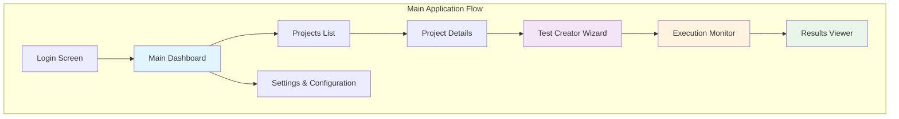

# Пользовательский интерфейс системы автоматического тестирования

## 1. Обзор пользовательского интерфейса

### 1.1 Архитектура Frontend

**Технологический стек:**
- **Flutter Web** - кроссплатформенный UI
- **Riverpod** - state management
- **Material Design 3** - современный дизайн
- **WebSocket** - real-time коммуникация
- **HTTP Client** - API взаимодействие

### 1.2 Основные экраны системы



## 2. Главная панель управления (Dashboard)

### 2.1 Layout Dashboard
```dart
class MainDashboard extends ConsumerWidget {
  @override
  Widget build(BuildContext context, WidgetRef ref) {
    final projectsState = ref.watch(projectsProvider);
    final executionState = ref.watch(activeExecutionsProvider);
    
    return Scaffold(
      appBar: AppBar(
        title: Text('SecurityOrchestrator - API Testing'),
        actions: [
          IconButton(
            icon: Icon(Icons.settings),
            onPressed: () => Navigator.pushNamed(context, '/settings'),
          ),
          UserProfileMenu(),
        ],
      ),
      body: Row(
        children: [
          NavigationRail(
            destinations: [
              NavigationRailDestination(
                icon: Icon(Icons.dashboard),
                label: Text('Dashboard'),
              ),
              NavigationRailDestination(
                icon: Icon(Icons.folder),
                label: Text('Projects'),
              ),
              NavigationRailDestination(
                icon: Icon(Icons.play_arrow),
                label: Text('Executions'),
              ),
              NavigationRailDestination(
                icon: Icon(Icons.analytics),
                label: Text('Analytics'),
              ),
            ],
            selectedIndex: _selectedIndex,
            onDestinationSelected: (index) => setState(() => _selectedIndex = index),
          ),
          Expanded(
            child: _buildContent(),
          ),
        ],
      ),
    );
  }
}
```

### 2.2 Dashboard Content
```dart
Widget _buildContent() {
  return Padding(
    padding: EdgeInsets.all(24.0),
    child: Column(
      crossAxisAlignment: CrossAxisAlignment.start,
      children: [
        // Header
        Row(
          mainAxisAlignment: MainAxisAlignment.spaceBetween,
          children: [
            Text(
              'Dashboard',
              style: Theme.of(context).textTheme.headlineMedium,
            ),
            ElevatedButton.icon(
              icon: Icon(Icons.add),
              label: Text('New Project'),
              onPressed: () => _showCreateProjectDialog(),
            ),
          ],
        ),
        SizedBox(height: 24),
        
        // Key Metrics
        Row(
          children: [
            Expanded(
              child: MetricCard(
                title: 'Total Projects',
                value: '24',
                icon: Icons.folder,
                color: Colors.blue,
              ),
            ),
            SizedBox(width: 16),
            Expanded(
              child: MetricCard(
                title: 'Active Tests',
                value: '156',
                icon: Icons.play_arrow,
                color: Colors.green,
              ),
            ),
            SizedBox(width: 16),
            Expanded(
              child: MetricCard(
                title: 'Success Rate',
                value: '94.2%',
                icon: Icons.check_circle,
                color: Colors.orange,
              ),
            ),
            SizedBox(width: 16),
            Expanded(
              child: MetricCard(
                title: 'Security Score',
                value: 'A+',
                icon: Icons.security,
                color: Colors.purple,
              ),
            ),
          ],
        ),
        SizedBox(height: 32),
        
        // Recent Projects and Activity
        Expanded(
          child: Row(
            children: [
              Expanded(
                child: RecentProjectsCard(),
              ),
              SizedBox(width: 16),
              Expanded(
                child: SystemActivityCard(),
              ),
            ],
          ),
        ),
      ],
    ),
  );
}
```

### 2.3 Metric Card Component
```dart
class MetricCard extends StatelessWidget {
  final String title;
  final String value;
  final IconData icon;
  final Color color;
  
  const MetricCard({
    Key? key,
    required this.title,
    required this.value,
    required this.icon,
    required this.color,
  }) : super(key: key);
  
  @override
  Widget build(BuildContext context) {
    return Card(
      elevation: 2,
      child: Padding(
        padding: EdgeInsets.all(16.0),
        child: Column(
          crossAxisAlignment: CrossAxisAlignment.start,
          children: [
            Row(
              mainAxisAlignment: MainAxisAlignment.spaceBetween,
              children: [
                Text(
                  title,
                  style: Theme.of(context).textTheme.bodyMedium?.copyWith(
                    color: Colors.grey[600],
                  ),
                ),
                Icon(
                  icon,
                  color: color,
                  size: 32,
                ),
              ],
            ),
            SizedBox(height: 8),
            Text(
              value,
              style: Theme.of(context).textTheme.headlineSmall?.copyWith(
                fontWeight: FontWeight.bold,
                color: color,
              ),
            ),
          ],
        ),
      ),
    );
  }
}
```

## 3. Создание проекта (Test Creation Wizard)

### 3.1 Project Creation Flow
```dart
class TestCreationWizard extends StatefulWidget {
  @override
  _TestCreationWizardState createState() => _TestCreationWizardState();
}

class _TestCreationWizardState extends State<TestCreationWizard> {
  int _currentStep = 0;
  final PageController _pageController = PageController();
  
  final List<WizardStep> _steps = [
    WizardStep(
      title: 'Project Setup',
      widget: ProjectSetupStep(),
    ),
    WizardStep(
      title: 'Specifications',
      widget: SpecificationsStep(),
    ),
    WizardStep(
      title: 'LLM Analysis',
      widget: LLMAnalysisStep(),
    ),
    WizardStep(
      title: 'Test Configuration',
      widget: TestConfigurationStep(),
    ),
    WizardStep(
      title: 'Review & Generate',
      widget: ReviewAndGenerateStep(),
    ),
  ];
  
  @override
  Widget build(BuildContext context) {
    return Scaffold(
      appBar: AppBar(
        title: Text('Create Test Project'),
        actions: [
          IconButton(
            icon: Icon(Icons.help),
            onPressed: () => _showHelp(),
          ),
        ],
      ),
      body: Column(
        children: [
          // Progress Indicator
          LinearProgressIndicator(
            value: (_currentStep + 1) / _steps.length,
            backgroundColor: Colors.grey[300],
          ),
          
          // Step Navigation
          Stepper(
            type: StepperType.horizontal,
            currentStep: _currentStep,
            onStepTapped: (step) {
              setState(() => _currentStep = step);
              _pageController.animateToPage(
                step,
                duration: Duration(milliseconds: 300),
                curve: Curves.easeInOut,
              );
            },
            onStepContinue: () {
              if (_currentStep < _steps.length - 1) {
                setState(() => _currentStep++);
                _pageController.nextPage(
                  duration: Duration(milliseconds: 300),
                  curve: Curves.easeInOut,
                );
              }
            },
            onStepCancel: () {
              if (_currentStep > 0) {
                setState(() => _currentStep--);
                _pageController.previousPage(
                  duration: Duration(milliseconds: 300),
                  curve: Curves.easeInOut,
                );
              }
            },
            steps: _steps.map((step) => Step(
              title: Text(step.title),
              isActive: _currentStep >= _steps.indexOf(step),
              content: SizedBox.shrink(),
            )).toList(),
          ),
          
          // Step Content
          Expanded(
            child: PageView(
              controller: _pageController,
              onPageChanged: (index) {
                setState(() => _currentStep = index);
              },
              children: _steps.map((step) => step.widget).toList(),
            ),
          ),
        ],
      ),
    );
  }
}
```

### 3.2 Specifications Upload Step
```dart
class SpecificationsStep extends ConsumerStatefulWidget {
  @override
  _SpecificationsStepState createState() => _SpecificationsStepState();
}

class _SpecificationsStepState extends ConsumerState<SpecificationsStep> {
  List<File> _selectedFiles = [];
  List<SpecificationUploadItem> _uploads = [];
  
  @override
  Widget build(BuildContext context) {
    return Padding(
      padding: EdgeInsets.all(24.0),
      child: Column(
        crossAxisAlignment: CrossAxisAlignment.start,
        children: [
          Text(
            'Upload Specifications',
            style: Theme.of(context).textTheme.headlineSmall,
          ),
          SizedBox(height: 16),
          Text(
            'Upload OpenAPI/Swagger specifications and BPMN process diagrams to analyze and generate tests.',
            style: Theme.of(context).textTheme.bodyMedium,
          ),
          SizedBox(height: 24),
          
          // File Upload Areas
          Row(
            children: [
              Expanded(
                child: _buildUploadCard(
                  title: 'OpenAPI/Swagger',
                  subtitle: 'API specifications (JSON, YAML)',
                  icon: Icons.api,
                  onTap: () => _pickFiles(['json', 'yaml', 'yml']),
                ),
              ),
              SizedBox(width: 16),
              Expanded(
                child: _buildUploadCard(
                  title: 'BPMN Process',
                  subtitle: 'Business process diagrams (XML)',
                  icon: Icons.account_tree,
                  onTap: () => _pickFiles(['bpmn', 'xml']),
                ),
              ),
            ],
          ),
          SizedBox(height: 24),
          
          // Uploaded Files List
          if (_uploads.isNotEmpty) ...[
            Text(
              'Uploaded Specifications',
              style: Theme.of(context).textTheme.titleLarge,
            ),
            SizedBox(height: 16),
            Expanded(
              child: ListView.builder(
                itemCount: _uploads.length,
                itemBuilder: (context, index) {
                  final upload = _uploads[index];
                  return _buildUploadItem(upload);
                },
              ),
            ),
          ],
        ],
      ),
    );
  }
  
  Widget _buildUploadCard({
    required String title,
    required String subtitle,
    required IconData icon,
    required VoidCallback onTap,
  }) {
    return Card(
      elevation: 2,
      child: InkWell(
        onTap: onTap,
        borderRadius: BorderRadius.circular(12),
        child: Container(
          height: 150,
          padding: EdgeInsets.all(24),
          child: Column(
            mainAxisAlignment: MainAxisAlignment.center,
            children: [
              Icon(
                icon,
                size: 48,
                color: Theme.of(context).primaryColor,
              ),
              SizedBox(height: 16),
              Text(
                title,
                style: Theme.of(context).textTheme.titleLarge,
                textAlign: TextAlign.center,
              ),
              SizedBox(height: 8),
              Text(
                subtitle,
                style: Theme.of(context).textTheme.bodyMedium,
                textAlign: TextAlign.center,
              ),
            ],
          ),
        ),
      ),
    );
  }
}
```

### 3.3 LLM Analysis Step
```dart
class LLMAnalysisStep extends ConsumerStatefulWidget {
  @override
  _LLMAnalysisStepState createState() => _LLMAnalysisStepState();
}

class _LLMAnalysisStepState extends ConsumerState<LLMAnalysisStep> {
  bool _isAnalyzing = false;
  List<AnalysisResult> _results = [];
  
  @override
  Widget build(BuildContext context) {
    return Padding(
      padding: EdgeInsets.all(24.0),
      child: Column(
        crossAxisAlignment: CrossAxisAlignment.start,
        children: [
          Row(
            mainAxisAlignment: MainAxisAlignment.spaceBetween,
            children: [
              Column(
                crossAxisAlignment: CrossAxisAlignment.start,
                children: [
                  Text(
                    'LLM Analysis',
                    style: Theme.of(context).textTheme.headlineSmall,
                  ),
                  Text(
                    'AI-powered analysis of specifications',
                    style: Theme.of(context).textTheme.bodyMedium,
                  ),
                ],
              ),
              ElevatedButton.icon(
                icon: _isAnalyzing 
                    ? SizedBox(
                        width: 16,
                        height: 16,
                        child: CircularProgressIndicator(strokeWidth: 2),
                      )
                    : Icon(Icons.psychology),
                label: Text(_isAnalyzing ? 'Analyzing...' : 'Start Analysis'),
                onPressed: _isAnalyzing ? null : _startAnalysis,
              ),
            ],
          ),
          SizedBox(height: 24),
          
          // Analysis Progress
          if (_isAnalyzing) _buildAnalysisProgress(),
          
          // Analysis Results
          if (!_isAnalyzing && _results.isNotEmpty) _buildAnalysisResults(),
          
          // Empty State
          if (!_isAnalyzing && _results.isEmpty) _buildEmptyState(),
        ],
      ),
    );
  }
  
  Widget _buildAnalysisProgress() {
    return Card(
      child: Padding(
        padding: EdgeInsets.all(16),
        child: Column(
          children: [
            Row(
              children: [
                CircularProgressIndicator(),
                SizedBox(width: 16),
                Expanded(
                  child: Column(
                    crossAxisAlignment: CrossAxisAlignment.start,
                    children: [
                      Text(
                        'Analyzing specifications...',
                        style: Theme.of(context).textTheme.titleMedium,
                      ),
                      SizedBox(height: 4),
                      Text(
                        'LLM is processing OpenAPI and BPMN content',
                        style: Theme.of(context).textTheme.bodySmall,
                      ),
                    ],
                  ),
                ),
              ],
            ),
            SizedBox(height: 16),
            LinearProgressIndicator(),
            SizedBox(height: 8),
            Text(
              'This may take a few minutes depending on specification size',
              style: Theme.of(context).textTheme.bodySmall,
            ),
          ],
        ),
      ),
    );
  }
  
  Widget _buildAnalysisResults() {
    return Expanded(
      child: ListView.builder(
        itemCount: _results.length,
        itemBuilder: (context, index) {
          final result = _results[index];
          return _buildAnalysisResultCard(result);
        },
      ),
    );
  }
  
  Widget _buildAnalysisResultCard(AnalysisResult result) {
    return Card(
      margin: EdgeInsets.only(bottom: 16),
      child: ExpansionTile(
        title: Text(result.title),
        subtitle: Text(result.type),
        children: [
          Padding(
            padding: EdgeInsets.all(16),
            child: Column(
              crossAxisAlignment: CrossAxisAlignment.start,
              children: [
                Text(
                  'Description:',
                  style: Theme.of(context).textTheme.titleSmall,
                ),
                SizedBox(height: 8),
                Text(result.description),
                SizedBox(height: 16),
                if (result.recommendations.isNotEmpty) ...[
                  Text(
                    'Recommendations:',
                    style: Theme.of(context).textTheme.titleSmall,
                  ),
                  SizedBox(height: 8),
                  ...result.recommendations.map((rec) => 
                    Padding(
                      padding: EdgeInsets.only(bottom: 4),
                      child: Row(
                        crossAxisAlignment: CrossAxisAlignment.start,
                        children: [
                          Icon(Icons.lightbulb, color: Colors.amber, size: 16),
                          SizedBox(width: 8),
                          Expanded(child: Text(rec)),
                        ],
                      ),
                    ),
                  ),
                ],
              ],
            ),
          ),
        ],
      ),
    );
  }
}
```

## 4. Мониторинг выполнения тестов

### 4.1 Execution Monitor Screen
```dart
class ExecutionMonitor extends ConsumerStatefulWidget {
  final String executionId;
  
  const ExecutionMonitor({Key? key, required this.executionId}) : super(key: key);
  
  @override
  _ExecutionMonitorState createState() => _ExecutionMonitorState();
}

class _ExecutionMonitorState extends ConsumerState<ExecutionMonitor> {
  late WebSocketService _webSocketService;
  ExecutionState? _executionState;
  List<ExecutionLog> _logs = [];
  
  @override
  void initState() {
    super.initState();
    _webSocketService = ref.read(webSocketServiceProvider);
    _startMonitoring();
  }
  
  void _startMonitoring() {
    _webSocketService.connectToExecution(widget.executionId);
    _webSocketService.listenToUpdates(
      onProgress: (progress) {
        setState(() {
          _executionState = progress;
        });
      },
      onLog: (log) {
        setState(() {
          _logs.add(log);
        });
      },
      onComplete: (result) {
        setState(() {
          _executionState = result;
        });
      },
    );
  }
  
  @override
  Widget build(BuildContext context) {
    return Scaffold(
      appBar: AppBar(
        title: Text('Execution Monitor'),
        actions: [
          IconButton(
            icon: Icon(Icons.pause),
            onPressed: _executionState?.status == ExecutionStatus.RUNNING 
                ? _pauseExecution 
                : _resumeExecution,
          ),
          IconButton(
            icon: Icon(Icons.stop),
            onPressed: _stopExecution,
          ),
        ],
      ),
      body: Row(
        children: [
          // Progress Panel
          Container(
            width: 300,
            padding: EdgeInsets.all(16),
            child: _buildProgressPanel(),
          ),
          
          // Main Content
          Expanded(
            child: Column(
              children: [
                // Timeline
                _buildExecutionTimeline(),
                
                // Tabs for Logs/Results/Analysis
                Expanded(
                  child: _buildTabbedContent(),
                ),
              ],
            ),
          ),
        ],
      ),
    );
  }
  
  Widget _buildProgressPanel() {
    if (_executionState == null) {
      return Center(child: CircularProgressIndicator());
    }
    
    return Card(
      child: Padding(
        padding: EdgeInsets.all(16),
        child: Column(
          crossAxisAlignment: CrossAxisAlignment.start,
          children: [
            Text(
              'Execution Progress',
              style: Theme.of(context).textTheme.titleLarge,
            ),
            SizedBox(height: 16),
            
            // Overall Progress
            LinearProgressIndicator(
              value: _executionState!.overallProgress,
            ),
            SizedBox(height: 8),
            Text(
              '${(_executionState!.overallProgress * 100).toInt()}% Complete',
              style: Theme.of(context).textTheme.bodySmall,
            ),
            SizedBox(height: 16),
            
            // Current Step
            Text(
              'Current Step:',
              style: Theme.of(context).textTheme.titleSmall,
            ),
            SizedBox(height: 4),
            Text(_executionState!.currentStep?.name ?? 'Waiting...'),
            SizedBox(height: 8),
            
            // Status
            Container(
              padding: EdgeInsets.symmetric(horizontal: 8, vertical: 4),
              decoration: BoxDecoration(
                color: _getStatusColor(_executionState!.status),
                borderRadius: BorderRadius.circular(4),
              ),
              child: Text(
                _executionState!.status.name.toUpperCase(),
                style: TextStyle(color: Colors.white, fontSize: 12),
              ),
            ),
            SizedBox(height: 16),
            
            // Timing
            if (_executionState!.startTime != null) ...[
              Text(
                'Start Time:',
                style: Theme.of(context).textTheme.titleSmall,
              ),
              SizedBox(height: 4),
              Text(_formatTime(_executionState!.startTime!)),
            ],
            if (_executionState!.estimatedEndTime != null) ...[
              SizedBox(height: 8),
              Text(
                'ETA:',
                style: Theme.of(context).textTheme.titleSmall,
              ),
              SizedBox(height: 4),
              Text(_formatTime(_executionState!.estimatedEndTime!)),
            ],
          ],
        ),
      ),
    );
  }
  
  Widget _buildExecutionTimeline() {
    if (_executionState?.steps == null) return SizedBox.shrink();
    
    return Container(
      height: 80,
      padding: EdgeInsets.all(16),
      child: ListView.builder(
        scrollDirection: Axis.horizontal,
        itemCount: _executionState!.steps.length,
        itemBuilder: (context, index) {
          final step = _executionState!.steps[index];
          return _buildTimelineStep(step, index);
        },
      ),
    );
  }
  
  Widget _buildTimelineStep(ExecutionStep step, int index) {
    return Container(
      width: 200,
      margin: EdgeInsets.only(right: 8),
      child: Column(
        children: [
          Row(
            children: [
              Container(
                width: 24,
                height: 24,
                decoration: BoxDecoration(
                  shape: BoxShape.circle,
                  color: _getStepStatusColor(step.status),
                  border: Border.all(
                    color: step.status == ExecutionStepStatus.CURRENT 
                        ? Theme.of(context).primaryColor 
                        : Colors.grey,
                    width: 2,
                  ),
                ),
                child: step.status == ExecutionStepStatus.CURRENT
                    ? Center(
                        child: SizedBox(
                          width: 12,
                          height: 12,
                          child: CircularProgressIndicator(
                            strokeWidth: 2,
                            valueColor: AlwaysStoppedAnimation<Color>(Colors.white),
                          ),
                        ),
                      )
                    : step.status == ExecutionStepStatus.COMPLETED
                        ? Icon(Icons.check, size: 16, color: Colors.white)
                        : step.status == ExecutionStepStatus.FAILED
                            ? Icon(Icons.error, size: 16, color: Colors.white)
                            : null,
              ),
              Expanded(
                child: Divider(
                  color: index < _executionState!.steps.length - 1
                      ? step.status == ExecutionStepStatus.COMPLETED
                          ? Colors.green
                          : Colors.grey
                      : Colors.transparent,
                  thickness: 2,
                ),
              ),
            ],
          ),
          SizedBox(height: 8),
          Text(
            step.name,
            style: Theme.of(context).textTheme.bodySmall,
            textAlign: TextAlign.center,
            maxLines: 2,
            overflow: TextOverflow.ellipsis,
          ),
          if (step.status == ExecutionStepStatus.COMPLETED || 
              step.status == ExecutionStepStatus.FAILED)
            Text(
              _formatDuration(step.executionTime),
              style: Theme.of(context).textTheme.bodySmall,
            ),
        ],
      ),
    );
  }
}
```

## 5. Просмотр результатов

### 5.1 Results Dashboard
```dart
class ResultsDashboard extends ConsumerStatefulWidget {
  final String executionId;
  
  const ResultsDashboard({Key? key, required this.executionId}) : super(key: key);
  
  @override
  _ResultsDashboardState createState() => _ResultsDashboardState();
}

class _ResultsDashboardState extends ConsumerState<ResultsDashboard> {
  late Future<ExecutionResults> _results;
  int _selectedTabIndex = 0;
  
  @override
  void initState() {
    super.initState();
    _results = ref.read(resultsProvider).getExecutionResults(widget.executionId);
  }
  
  @override
  Widget build(BuildContext context) {
    return Scaffold(
      appBar: AppBar(
        title: Text('Test Results'),
        actions: [
          IconButton(
            icon: Icon(Icons.download),
            onPressed: _exportResults,
          ),
          IconButton(
            icon: Icon(Icons.share),
            onPressed: _shareResults,
          ),
        ],
      ),
      body: FutureBuilder<ExecutionResults>(
        future: _results,
        builder: (context, snapshot) {
          if (snapshot.hasData) {
            return _buildResultsContent(snapshot.data!);
          } else if (snapshot.hasError) {
            return _buildErrorState(snapshot.error);
          } else {
            return Center(child: CircularProgressIndicator());
          }
        },
      ),
    );
  }
  
  Widget _buildResultsContent(ExecutionResults results) {
    return Column(
      children: [
        // Summary Cards
        _buildResultsSummary(results),
        
        // Tabs
        DefaultTabController(
          length: 4,
          child: Column(
            children: [
              TabBar(
                labelColor: Theme.of(context).primaryColor,
                unselectedLabelColor: Colors.grey,
                tabs: [
                  Tab(icon: Icon(Icons.list), text: 'Test Cases'),
                  Tab(icon: Icon(Icons.security), text: 'Security'),
                  Tab(icon: Icon(Icons.analytics), text: 'Performance'),
                  Tab(icon: Icon(Icons.bug_report), text: 'Issues'),
                ],
              ),
              Expanded(
                child: TabBarView(
                  children: [
                    _buildTestCasesTab(results),
                    _buildSecurityTab(results),
                    _buildPerformanceTab(results),
                    _buildIssuesTab(results),
                  ],
                ),
              ),
            ],
          ),
        ),
      ],
    );
  }
  
  Widget _buildResultsSummary(ExecutionResults results) {
    return Padding(
      padding: EdgeInsets.all(16),
      child: Row(
        children: [
          Expanded(
            child: _buildSummaryCard(
              'Total Tests',
              results.totalTests.toString(),
              Icons.list,
              Colors.blue,
            ),
          ),
          SizedBox(width: 16),
          Expanded(
            child: _buildSummaryCard(
              'Passed',
              results.passedTests.toString(),
              Icons.check_circle,
              Colors.green,
            ),
          ),
          SizedBox(width: 16),
          Expanded(
            child: _buildSummaryCard(
              'Failed',
              results.failedTests.toString(),
              Icons.error,
              Colors.red,
            ),
          ),
          SizedBox(width: 16),
          Expanded(
            child: _buildSummaryCard(
              'Success Rate',
              '${(results.successRate * 100).toStringAsFixed(1)}%',
              Icons.trending_up,
              results.successRate > 0.8 ? Colors.green : Colors.orange,
            ),
          ),
        ],
      ),
    );
  }
  
  Widget _buildTestCasesTab(ExecutionResults results) {
    return ListView.builder(
      itemCount: results.testCases.length,
      itemBuilder: (context, index) {
        final testCase = results.testCases[index];
        return _buildTestCaseCard(testCase);
      },
    );
  }
  
  Widget _buildTestCaseCard(TestCaseResult testCase) {
    return Card(
      margin: EdgeInsets.symmetric(horizontal: 16, vertical: 8),
      child: ExpansionTile(
        title: Row(
          children: [
            Icon(
              testCase.status == TestStatus.PASSED 
                  ? Icons.check_circle
                  : testCase.status == TestStatus.FAILED
                      ? Icons.error
                      : Icons.warning,
              color: testCase.status == TestStatus.PASSED 
                  ? Colors.green
                  : testCase.status == TestStatus.FAILED
                      ? Colors.red
                      : Colors.orange,
            ),
            SizedBox(width: 8),
            Expanded(
              child: Text(testCase.name),
            ),
          ],
        ),
        subtitle: Text(testCase.endpoint),
        children: [
          Padding(
            padding: EdgeInsets.all(16),
            child: Column(
              crossAxisAlignment: CrossAxisAlignment.start,
              children: [
                // Request Details
                Text(
                  'Request:',
                  style: Theme.of(context).textTheme.titleSmall,
                ),
                SizedBox(height: 8),
                Container(
                  padding: EdgeInsets.all(8),
                  decoration: BoxDecoration(
                    color: Colors.grey[100],
                    borderRadius: BorderRadius.circular(4),
                  ),
                  child: Text(
                    testCase.request,
                    style: TextStyle(fontFamily: 'monospace'),
                  ),
                ),
                SizedBox(height: 16),
                
                // Response Details
                Text(
                  'Response:',
                  style: Theme.of(context).textTheme.titleSmall,
                ),
                SizedBox(height: 8),
                Container(
                  padding: EdgeInsets.all(8),
                  decoration: BoxDecoration(
                    color: testCase.status == TestStatus.PASSED 
                        ? Colors.green[50]
                        : Colors.red[50],
                    borderRadius: BorderRadius.circular(4),
                  ),
                  child: Column(
                    crossAxisAlignment: CrossAxisAlignment.start,
                    children: [
                      Text(
                        'Status: ${testCase.responseCode}',
                        style: TextStyle(fontFamily: 'monospace'),
                      ),
                      SizedBox(height: 8),
                      Text(
                        testCase.responseBody,
                        style: TextStyle(fontFamily: 'monospace'),
                      ),
                    ],
                  ),
                ),
                
                // Validation Errors
                if (testCase.validationErrors.isNotEmpty) ...[
                  SizedBox(height: 16),
                  Text(
                    'Validation Errors:',
                    style: Theme.of(context).textTheme.titleSmall,
                  ),
                  SizedBox(height: 8),
                  ...testCase.validationErrors.map((error) => Padding(
                    padding: EdgeInsets.only(bottom: 4),
                    child: Row(
                      children: [
                        Icon(Icons.error, color: Colors.red, size: 16),
                        SizedBox(width: 8),
                        Expanded(child: Text(error)),
                      ],
                    ),
                  )),
                ],
              ],
            ),
          ),
        ],
      ),
    );
  }
}
```

## 6. Навигация и маршрутизация

### 6.1 App Router Configuration
```dart
class AppRouter {
  static Route<dynamic> generateRoute(RouteSettings settings) {
    switch (settings.name) {
      case '/':
        return MaterialPageRoute(
          builder: (_) => MainDashboard(),
        );
      case '/projects':
        return MaterialPageRoute(
          builder: (_) => ProjectsListScreen(),
        );
      case '/project/:id':
        final args = settings.arguments as Map<String, dynamic>;
        return MaterialPageRoute(
          builder: (_) => ProjectDetailScreen(
            projectId: args['id'],
          ),
        );
      case '/create-project':
        return MaterialPageRoute(
          builder: (_) => TestCreationWizard(),
        );
      case '/execution/:id':
        final args = settings.arguments as Map<String, dynamic>;
        return MaterialPageRoute(
          builder: (_) => ExecutionMonitor(
            executionId: args['id'],
          ),
        );
      case '/results/:id':
        final args = settings.arguments as Map<String, dynamic>;
        return MaterialPageRoute(
          builder: (_) => ResultsDashboard(
            executionId: args['id'],
          ),
        );
      default:
        return MaterialPageRoute(
          builder: (_) => Scaffold(
            body: Center(
              child: Text('Route not found'),
            ),
          ),
        );
    }
  }
}
```

## 7. Респонсивный дизайн

### 7.1 Responsive Breakpoints
```dart
class ResponsiveLayout extends StatelessWidget {
  final Widget mobile;
  final Widget? tablet;
  final Widget? desktop;
  
  const ResponsiveLayout({
    Key? key,
    required this.mobile,
    this.tablet,
    required this.desktop,
  }) : super(key: key);
  
  @override
  Widget build(BuildContext context) {
    return LayoutBuilder(
      builder: (context, constraints) {
        if (constraints.maxWidth < 768) {
          return mobile;
        } else if (constraints.maxWidth < 1200) {
          return tablet ?? mobile;
        } else {
          return desktop ?? tablet ?? mobile;
        }
      },
    );
  }
}
```

## 8. Accessibility (a11y) Support

### 8.1 Accessibility Features
```dart
// Theme with accessibility support
ThemeData buildAccessibleTheme() {
  return ThemeData(
    // High contrast support
    colorScheme: ColorScheme.fromSeed(
      seedColor: Colors.blue,
      brightness: Brightness.light,
    ),
    
    // Large text support
    textTheme: TextTheme(
      bodyLarge: TextStyle(fontSize: 18),
      bodyMedium: TextStyle(fontSize: 16),
      bodySmall: TextStyle(fontSize: 14),
    ),
    
    // Focus indicators
    focusColor: Colors.orange,
    
    // Color-blind friendly colors
    visualDensity: VisualDensity.adaptivePlatformDensity,
  );
}

// Semantic labels for screen readers
Widget buildAccessibleButton(String text, VoidCallback onPressed) {
  return Semantics(
    label: 'Button: $text',
    button: true,
    enabled: true,
    child: ElevatedButton(
      onPressed: onPressed,
      child: Text(text),
    ),
  );
}
```

Этот пользовательский интерфейс обеспечивает:
- **Интуитивность** для тестировщиков и аналитиков
- **Real-time обновления** через WebSocket
- **Мобильную поддержку** благодаря Flutter
- **Accessibility** для пользователей с ограниченными возможностями
- **Респонсивный дизайн** для различных устройств
- **Полную интеграцию** с backend API