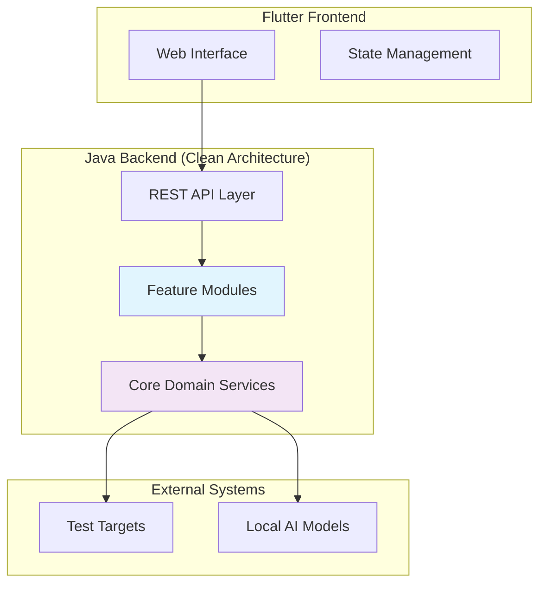
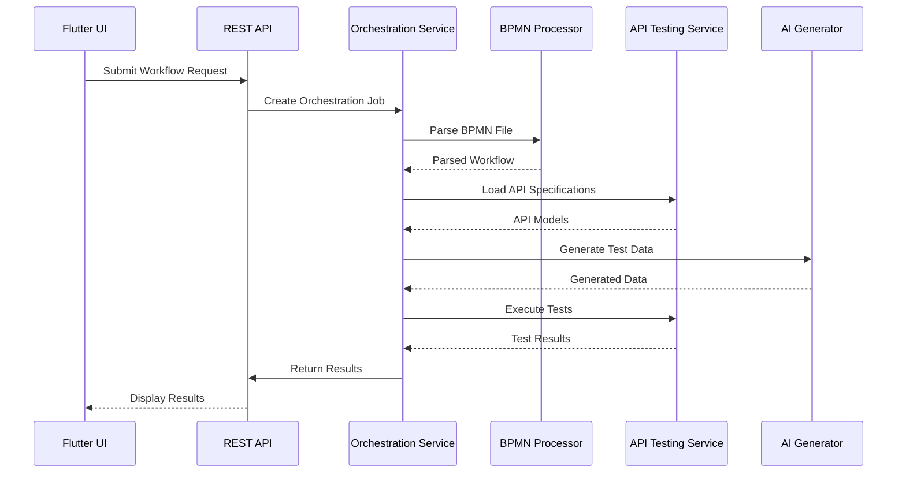

# SecurityOrchestrator System Architecture

## Overview

The SecurityOrchestrator is a comprehensive testing platform that orchestrates BPMN workflows and OpenAPI specifications for end-to-end security testing. The system follows clean architecture principles with a feature-first organization, ensuring modularity, testability, and maintainability.

## High-Level Architecture



## Clean Architecture Layers

### Domain Layer
- **Entities**: Core business objects (BPMN Process, API Specification, Test Case)
- **Value Objects**: Immutable data structures (TestResult, ValidationRule)
- **Domain Services**: Business logic without external dependencies
- **Repositories**: Abstract data access interfaces

### Application Layer
- **Use Cases**: Application-specific business logic
- **Commands/Queries**: Request/response DTOs
- **Event Handlers**: Domain event processing
- **Application Services**: Orchestration logic

### Infrastructure Layer
- **Adapters**: External service implementations
- **Persistence**: Database/file system access
- **External APIs**: Third-party integrations
- **Frameworks**: Web frameworks, messaging

## Feature-First Organization

### Core Features

#### 1. BPMN Processing Feature
```
bpmn-processing/
├── domain/
│   ├── model/
│   ├── service/
│   └── repository/
├── application/
│   ├── usecase/
│   └── dto/
└── infrastructure/
    ├── parser/
    ├── executor/
    └── persistence/
```

#### 2. API Testing Feature
```
api-testing/
├── domain/
│   ├── model/
│   ├── service/
│   └── repository/
├── application/
│   ├── usecase/
│   └── dto/
└── infrastructure/
    ├── openapi/
    ├── client/
    └── persistence/
```

#### 3. Orchestration Feature
```
orchestration/
├── domain/
│   ├── model/
│   ├── service/
│   └── repository/
├── application/
│   ├── usecase/
│   └── dto/
└── infrastructure/
    ├── workflow/
    ├── scheduler/
    └── persistence/
```

#### 4. AI Test Generation Feature
```
ai-test-generation/
├── domain/
│   ├── model/
│   ├── service/
│   └── repository/
├── application/
│   ├── usecase/
│   └── dto/
└── infrastructure/
    ├── model/
    ├── processor/
    └── persistence/
```

## Component Interactions



## Technology Stack

### Backend (Java 21+)
- **Framework**: Spring Boot 3.x
- **Architecture**: Clean Architecture (Hexagonal)
- **Build Tool**: Gradle
- **Testing**: JUnit 5, Mockito, TestContainers
- **Documentation**: OpenAPI/Swagger
- **Logging**: SLF4J with Logback
- **Configuration**: Spring Configuration Properties

### BPMN Processing
- **Parser**: Camunda BPMN Model API
- **Execution Engine**: Custom workflow executor
- **Validation**: BPMN validation rules

### API Testing
- **OpenAPI Parser**: Swagger Parser
- **HTTP Client**: Apache HttpClient
- **Schema Validation**: JSON Schema Validator

### AI Integration
- **Local Models**: ONNX Runtime
- **ML Framework**: DeepLearning4J
- **Text Processing**: Apache OpenNLP

### Frontend (Flutter)
- **Framework**: Flutter Web
- **State Management**: Riverpod
- **UI Components**: Material Design
- **Data Visualization**: Charts library
- **File Upload**: File picker

### Data Storage
- **Primary**: H2 Database (file-based)
- **Caching**: Caffeine
- **File Storage**: Local file system
- **Configuration**: YAML/Properties files

## Integration Points

### Feature Dependencies
- **Orchestration** depends on BPMN Processing, API Testing, AI Generation
- **BPMN Processing** depends on core domain models
- **API Testing** depends on OpenAPI specifications
- **AI Generation** depends on local model files

### Cross-Cutting Concerns
- **Security**: Input validation, secure file handling
- **Monitoring**: Application metrics, health checks
- **Configuration**: Environment-based settings
- **Error Handling**: Structured error responses

## Security Considerations

### Data Protection
- **Local Processing**: All data processed locally, no external uploads
- **File Validation**: Strict validation of uploaded BPMN/OpenAPI files
- **Input Sanitization**: All inputs validated and sanitized

### Access Control
- **Local Application**: No authentication required (local usage)
- **API Security**: Basic input validation and rate limiting
- **File System Security**: Secure file permissions

### AI Model Security
- **Local Models Only**: No external AI API calls
- **Model Validation**: Verify model integrity before loading
- **Safe Execution**: Sandboxed model execution

### Network Security
- **Target Testing**: Secure HTTP client configuration
- **Certificate Validation**: Proper SSL/TLS validation for test targets
- **Timeout Management**: Prevent resource exhaustion

## Deployment Architecture

### Local Development
- **Single Machine**: All components run locally
- **Database**: H2 file-based database
- **Models**: Local ONNX model files
- **Web Server**: Embedded Tomcat

### Production Considerations
- **Containerization**: Docker support for portability
- **Configuration**: Environment variables for settings
- **Monitoring**: Application metrics endpoint
- **Backup**: Automated local data backup

## Scalability Considerations

### Performance
- **Asynchronous Processing**: Non-blocking workflow execution
- **Resource Management**: Memory-efficient data processing
- **Caching**: Result caching for repeated operations

### Extensibility
- **Plugin Architecture**: Feature modules as plugins
- **API Extensions**: REST API for custom integrations
- **Model Support**: Extensible AI model loading

This architecture provides a solid foundation for the SecurityOrchestrator, ensuring clean separation of concerns, maintainability, and the ability to evolve with changing requirements.