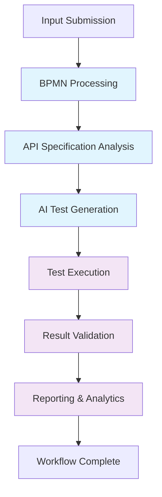
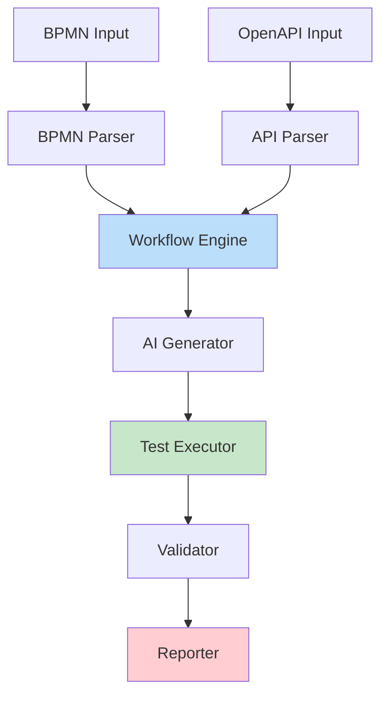

# Core Business Processes and Workflows

## Overview

The SecurityOrchestrator system orchestrates end-to-end security testing workflows that combine BPMN process definitions, OpenAPI specifications, and AI-powered test data generation. This document details the core business processes that deliver automation, intelligence, and reliability to security testers and analysts.

## 1. Workflow Orchestration Process

### High-Level Flow


### BPMN-Style Process Flow

```
┌─────────────────────────────────────────────────────────────────┐
│                    WORKFLOW ORCHESTRATION PROCESS                │
├─────────────────────────────────────────────────────────────────┤
│  START EVENT: Workflow Request Received                         │
│                                                                 │
│  TASK: Validate Input Files                                     │
│  ├─ BPMN file validation (XML structure, BPMN 2.0 compliance)   │
│  └─ OpenAPI spec validation (JSON/YAML format, schema validity) │
│                                                                 │
│  GATEWAY: Files Valid?                                          │
│  ├─ YES → Continue                                              │
│  └─ NO → END EVENT: Validation Error                            │
│                                                                 │
│  PARALLEL GATEWAY: Process Inputs                               │
│  ├─ BRANCH 1: BPMN Processing                                   │
│  │  └─ TASK: Parse BPMN → Create Process Model                  │
│  └─ BRANCH 2: API Analysis                                      │
│     └─ TASK: Parse OpenAPI → Extract Operations                 │
│                                                                 │
│  SYNCHRONIZATION: Inputs Processed                              │
│                                                                 │
│  TASK: Generate Test Scenarios                                  │
│  ├─ Map BPMN tasks to API operations                            │
│  ├─ Configure test execution order                              │
│  └─ Prepare test context                                        │
│                                                                 │
│  SUB-PROCESS: AI Test Data Generation                           │
│  ├─ Load appropriate AI model                                   │
│  ├─ Analyze API schemas                                         │
│  ├─ Generate contextual test data                               │
│  └─ Validate generated data                                     │
│                                                                 │
│  TASK: Execute Workflow                                         │
│  ├─ Initialize execution context                                │
│  ├─ Execute BPMN process steps                                  │
│  ├─ Run API tests per step                                      │
│  └─ Handle step dependencies                                    │
│                                                                 │
│  GATEWAY: Execution Successful?                                 │
│  ├─ YES → TASK: Collect Results                                 │
│  └─ NO → TASK: Handle Exceptions                                │
│                                                                 │
│  TASK: Generate Reports                                         │
│  ├─ Aggregate test results                                      │
│  ├─ Calculate metrics                                           │
│  ├─ Create visualizations                                       │
│  └─ Store execution history                                     │
│                                                                 │
│  END EVENT: Workflow Completed                                  │
└─────────────────────────────────────────────────────────────────┘
```

### Business Value
- **Automation**: Complete end-to-end testing without manual intervention
- **Intelligence**: AI-generated test data based on API context and business rules
- **Reliability**: Comprehensive validation and error handling throughout the process

## 2. Business Process Management (BPMN Processing)

### BPMN Processing Workflow

```
┌─────────────────────────────────────────────────────────────────┐
│                  BPMN PROCESS MANAGEMENT WORKFLOW                │
├─────────────────────────────────────────────────────────────────┤
│  START EVENT: BPMN File Upload                                  │
│                                                                 │
│  TASK: File Validation                                          │
│  ├─ Extension check (.bpmn, .xml)                               │
│  ├─ Size limit check (10MB)                                     │
│  ├─ XML structure validation                                    │
│  └─ BPMN 2.0 schema compliance                                  │
│                                                                 │
│  GATEWAY: File Valid?                                           │
│  ├─ YES → Continue                                              │
│  └─ NO → END EVENT: Invalid BPMN File                           │
│                                                                 │
│  TASK: Parse BPMN Document                                      │
│  ├─ Load XML using Camunda BPMN Model API                       │
│  ├─ Extract process definitions                                 │
│  ├─ Build flow element hierarchy                                │
│  └─ Resolve sequence flows                                      │
│                                                                 │
│  TASK: Validate Process Structure                               │
│  ├─ Check for start events                                      │
│  ├─ Validate sequence flow connections                          │
│  ├─ Verify gateway configurations                               │
│  └─ Check process completeness                                  │
│                                                                 │
│  GATEWAY: Process Valid?                                        │
│  ├─ YES → TASK: Store Process Model                             │
│  └─ NO → TASK: Generate Validation Errors                       │
│                                                                 │
│  TASK: Create Execution Template                                │
│  ├─ Map flow elements to executable tasks                       │
│  ├─ Configure task dependencies                                 │
│  ├─ Set up variable contexts                                    │
│  └─ Prepare for orchestration                                   │
│                                                                 │
│  END EVENT: BPMN Process Ready                                  │
└─────────────────────────────────────────────────────────────────┘
```

### Decision Points
- **File Format Decision**: XML vs BPMN extension handling
- **Schema Compliance**: BPMN 2.0 vs custom extensions
- **Process Complexity**: Simple linear vs complex branching workflows

### Exception Handling
- **Parse Errors**: Malformed XML, invalid BPMN elements
- **Validation Failures**: Missing required elements, invalid connections
- **Storage Errors**: Database connectivity issues, disk space constraints

## 3. API Testing Workflow

### OpenAPI Processing and Test Generation

```
┌─────────────────────────────────────────────────────────────────┐
│                     API TESTING WORKFLOW                         │
├─────────────────────────────────────────────────────────────────┤
│  START EVENT: OpenAPI Spec Upload                               │
│                                                                 │
│  TASK: Specification Validation                                 │
│  ├─ Format validation (JSON/YAML)                               │
│  ├─ Size limit check (5MB)                                      │
│  ├─ OpenAPI version detection                                   │
│  └─ Schema compliance check                                     │
│                                                                 │
│  GATEWAY: Spec Valid?                                           │
│  ├─ YES → Continue                                              │
│  └─ NO → END EVENT: Invalid Specification                       │
│                                                                 │
│  TASK: Parse OpenAPI Document                                   │
│  ├─ Load spec using Swagger Parser                              │
│  ├─ Extract API paths and operations                            │
│  ├─ Process schemas and parameters                              │
│  └─ Build operation models                                      │
│                                                                 │
│  TASK: Generate Test Cases                                      │
│  ├─ Create positive test cases (valid requests)                │
│  ├─ Generate negative test cases (invalid inputs)              │
│  ├─ Add boundary condition tests                                │
│  └─ Include security-specific tests                             │
│                                                                 │
│  SUB-PROCESS: AI Data Generation                                │
│  ├─ Analyze parameter schemas                                   │
│  ├─ Generate contextual test data                               │
│  ├─ Create edge cases and boundary values                       │
│  └─ Validate data against constraints                           │
│                                                                 │
│  TASK: Configure Test Execution                                 │
│  ├─ Set up HTTP client configuration                            │
│  ├─ Configure authentication methods                            │
│  ├─ Define response validation rules                            │
│  └─ Set execution timeouts                                      │
│                                                                 │
│  TASK: Execute Test Cases                                       │
│  ├─ Send HTTP requests                                          │
│  ├─ Capture responses                                           │
│  ├─ Validate response schemas                                   │
│  └─ Check security headers                                      │
│                                                                 │
│  TASK: Process Results                                          │
│  ├─ Compare actual vs expected results                          │
│  ├─ Calculate success/failure metrics                           │
│  ├─ Log detailed execution information                          │
│  └─ Prepare for workflow integration                            │
│                                                                 │
│  END EVENT: API Tests Completed                                 │
└─────────────────────────────────────────────────────────────────┘
```

### Integration Points
- **BPMN Integration**: Test cases mapped to process tasks
- **AI Integration**: Generated data enhances test coverage
- **Security Integration**: Headers and authentication validation

### Business Value for Testers
- **Comprehensive Coverage**: Automated generation of extensive test suites
- **Contextual Testing**: AI-generated data reflects real-world scenarios
- **Security Focus**: Built-in security validation and header checks

## 4. AI Test Generation Process

### Intelligent Data Generation Workflow

```
┌─────────────────────────────────────────────────────────────────┐
│                 AI TEST GENERATION PROCESS                       │
├─────────────────────────────────────────────────────────────────┤
│  START EVENT: Generation Request                                │
│                                                                 │
│  TASK: Model Selection and Loading                              │
│  ├─ Analyze API operation context                               │
│  ├─ Select appropriate local AI model                           │
│  ├─ Load model into memory                                      │
│  └─ Validate model compatibility                                │
│                                                                 │
│  GATEWAY: Model Available?                                      │
│  ├─ YES → Continue                                              │
│  └─ NO → TASK: Use Fallback Generation                          │
│                                                                 │
│  TASK: Context Analysis                                         │
│  ├─ Parse OpenAPI schemas                                       │
│  ├─ Extract parameter constraints                               │
│  ├─ Analyze operation semantics                                 │
│  └─ Identify data dependencies                                  │
│                                                                 │
│  TASK: Generate Test Data                                       │
│  ├─ Create valid data sets                                      │
│  ├─ Generate boundary conditions                                │
│  ├─ Produce edge cases                                          │
│  └─ Include security test vectors                               │
│                                                                 │
│  TASK: Data Validation                                          │
│  ├─ Schema compliance check                                     │
│  ├─ Constraint validation                                       │
│  ├─ Business rule verification                                  │
│  └─ Format correctness                                          │
│                                                                 │
│  GATEWAY: Data Valid?                                           │
│  ├─ YES → TASK: Enhance Data                                    │
│  └─ NO → TASK: Regenerate Invalid Data                          │
│                                                                 │
│  TASK: Apply Intelligence                                       │
│  ├─ Context-aware value generation                              │
│  ├─ Semantic data relationships                                 │
│  ├─ Realistic scenario creation                                 │
│  └─ Security vulnerability patterns                             │
│                                                                 │
│  TASK: Optimize Test Coverage                                   │
│  ├─ Eliminate redundant test cases                              │
│  ├─ Prioritize high-risk scenarios                              │
│  ├─ Balance positive/negative tests                             │
│  └─ Ensure comprehensive coverage                               │
│                                                                 │
│  END EVENT: Test Data Generated                                 │
└─────────────────────────────────────────────────────────────────┘
```

### AI Model Types and Usage
- **ONNX Models**: General-purpose data generation
- **TensorFlow Models**: Complex schema understanding
- **PyTorch Models**: Specialized security testing
- **Custom Models**: Domain-specific test data generation

### Business Value for Analysts
- **Intelligent Coverage**: Context-aware test data generation
- **Efficiency**: Automated creation of comprehensive test suites
- **Quality**: Realistic data that exposes real vulnerabilities

## 5. Execution and Validation Process

### End-to-End Test Execution

```
┌─────────────────────────────────────────────────────────────────┐
│               EXECUTION AND VALIDATION PROCESS                  │
├─────────────────────────────────────────────────────────────────┤
│  START EVENT: Execution Triggered                               │
│                                                                 │
│  TASK: Initialize Execution Context                             │
│  ├─ Create isolated execution environment                       │
│  ├─ Set up resource limits                                      │
│  ├─ Initialize monitoring                                       │
│  └─ Prepare logging infrastructure                              │
│                                                                 │
│  TASK: Execute BPMN Process                                     │
│  ├─ Start process execution                                     │
│  ├─ Navigate flow elements                                      │
│  ├─ Execute tasks in sequence                                   │
│  └─ Handle gateway decisions                                    │
│                                                                 │
│  PARALLEL EXECUTION: API Tests                                  │
│  ├─ BRANCH: Functional Tests                                    │
│  │  ├─ Execute positive test cases                              │
│  │  └─ Validate responses                                       │
│  ├─ BRANCH: Security Tests                                      │
│  │  ├─ Execute security test cases                              │
│  │  └─ Check security headers                                   │
│  └─ BRANCH: Performance Tests                                   │
│     ├─ Execute load tests                                       │
│     └─ Monitor response times                                   │
│                                                                 │
│  SYNCHRONIZATION: Test Results                                  │
│                                                                 │
│  TASK: Validate Results                                         │
│  ├─ Schema validation                                          │
│  ├─ Business rule validation                                    │
│  ├─ Security requirement checks                                 │
│  └─ Performance threshold validation                            │
│                                                                 │
│  GATEWAY: All Tests Passed?                                     │
│  ├─ YES → TASK: Mark Success                                    │
│  └─ NO → TASK: Analyze Failures                                 │
│                                                                 │
│  TASK: Handle Exceptions                                        │
│  ├─ Categorize failure types                                    │
│  ├─ Log detailed error information                              │
│  ├─ Attempt recovery actions                                    │
│  └─ Escalate critical failures                                  │
│                                                                 │
│  TASK: Resource Cleanup                                         │
│  ├─ Close network connections                                   │
│  ├─ Free allocated resources                                    │
│  ├─ Clean up temporary files                                    │
│  └─ Secure data deletion                                        │
│                                                                 │
│  END EVENT: Execution Complete                                  │
└─────────────────────────────────────────────────────────────────┘
```

### Validation Types
- **Schema Validation**: JSON Schema compliance
- **Business Logic Validation**: Custom business rules
- **Security Validation**: OWASP security checks
- **Performance Validation**: Response time and throughput checks

### Exception Handling
- **Network Failures**: Timeout and retry logic
- **Authentication Errors**: Token refresh mechanisms
- **Resource Exhaustion**: Memory and CPU limit enforcement
- **Data Corruption**: Integrity checks and recovery

## 6. Reporting and Analytics Process

### Comprehensive Results Processing

```
┌─────────────────────────────────────────────────────────────────┐
│              REPORTING AND ANALYTICS PROCESS                    │
├─────────────────────────────────────────────────────────────────┤
│  START EVENT: Execution Results Available                       │
│                                                                 │
│  TASK: Aggregate Test Results                                   │
│  ├─ Collect all test case results                               │
│  ├─ Calculate success/failure rates                             │
│  ├─ Compute execution metrics                                   │
│  └─ Identify failure patterns                                   │
│                                                                 │
│  TASK: Generate Analytics                                       │
│  ├─ Trend analysis over time                                    │
│  ├─ Coverage metrics calculation                                │
│  ├─ Risk assessment scoring                                     │
│  └─ Performance benchmarking                                    │
│                                                                 │
│  TASK: Create Visualizations                                    │
│  ├─ Test execution timeline charts                              │
│  ├─ Coverage heatmaps                                           │
│  ├─ Failure analysis diagrams                                   │
│  └─ Performance dashboards                                      │
│                                                                 │
│  TASK: Security Analysis                                        │
│  ├─ Vulnerability assessment                                    │
│  ├─ Risk scoring and prioritization                             │
│  ├─ Compliance checking                                         │
│  └─ Remediation recommendations                                  │
│                                                                 │
│  TASK: Generate Reports                                         │
│  ├─ Executive summary reports                                   │
│  ├─ Detailed technical reports                                  │
│  ├─ Security assessment reports                                 │
│  └─ Compliance documentation                                    │
│                                                                 │
│  TASK: Data Archival                                            │
│  ├─ Store execution history                                     │
│  ├─ Archive test artifacts                                      │
│  ├─ Maintain audit trails                                       │
│  └─ Secure sensitive data                                       │
│                                                                 │
│  TASK: Notification Distribution                                │
│  ├─ Send alerts for critical failures                           │
│  ├─ Distribute reports to stakeholders                          │
│  ├─ Update dashboards                                           │
│  └─ Trigger follow-up actions                                   │
│                                                                 │
│  END EVENT: Reporting Complete                                  │
└─────────────────────────────────────────────────────────────────┘
```

### Report Types and Business Value
- **Executive Dashboards**: High-level security posture overview
- **Technical Reports**: Detailed findings for developers
- **Compliance Reports**: Audit-ready documentation
- **Trend Analysis**: Historical performance and security metrics

### Analytics Capabilities
- **Predictive Analytics**: Failure prediction and risk forecasting
- **Coverage Analysis**: Test completeness assessment
- **Performance Metrics**: Execution efficiency and reliability tracking
- **Security Scoring**: Automated risk assessment and prioritization

## Integration Points and Data Flow

### Cross-Process Integration


### Data Flow Patterns
- **Event-Driven**: Domain events trigger cross-module actions
- **Pipeline Processing**: Sequential data transformation through modules
- **Aggregation**: Results collection and consolidation
- **Feedback Loop**: Analytics inform future test generation

This comprehensive business process documentation provides the foundation for understanding how the SecurityOrchestrator delivers value through automated, intelligent, and reliable security testing workflows.