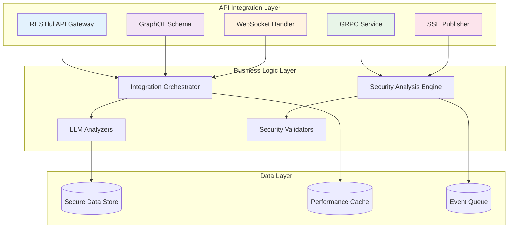

# SecurityOrchestrator - API Integration Patterns

## Исполнительное резюме

**Дата**: 2025-11-22  
**Версия**: 1.0.0  
**Цель**: Полное руководство по современным API паттернам интеграции  
**Платформа**: SecurityOrchestrator - Enterprise-grade интеграционная платформа  

---

## 1. Обзор API паттернов

### 1.1 Поддерживаемые протоколы

SecurityOrchestrator поддерживает современные API паттерны для максимальной совместимости и производительности:

- **RESTful APIs** - стандартный HTTP/REST протокол
- **GraphQL** - гибкий query язык для API
- **gRPC** - высокопроизводительный RPC протокол
- **WebSocket** - двусторонняя связь в реальном времени
- **Server-Sent Events (SSE)** - односторонние события в реальном времени

### 1.2 Архитектурные принципы



---

## 2. RESTful API Integration

### 2.1 Основные REST endpoints

```java
@RestController
@RequestMapping("/api/v1")
public class SecurityOrchestratorApiController {
    
    @GetMapping("/health")
    public ResponseEntity<SystemHealth> getSystemHealth() {
        return ResponseEntity.ok(systemHealthService.getHealthStatus());
    }
    
    @PostMapping("/analyze/security")
    public CompletableFuture<ResponseEntity<ApiResponse<SecurityAnalysisResult>>> 
            analyzeSecurity(@Valid @RequestBody SecurityAnalysisRequest request) {
        return securityAnalysisService.analyze(request);
    }
    
    @GetMapping("/projects/{projectId}/analysis/{analysisId}")
    public ResponseEntity<ApiResponse<AnalysisProgress>> getAnalysisProgress(
            @PathVariable String projectId,
            @PathVariable String analysisId) {
        return ResponseEntity.ok(
            ApiResponse.success(analysisProgressService.getProgress(projectId, analysisId))
        );
    }
    
    @PostMapping("/integrations/external")
    public ResponseEntity<ApiResponse<IntegrationResult>> createExternalIntegration(
            @Valid @RequestBody ExternalIntegrationRequest request) {
        return ResponseEntity.ok(
            ApiResponse.success(integrationService.createIntegration(request))
        );
    }
}
```

### 2.2 API Versioning Strategy

```java
@RestController
@RequestMapping("/api")
public class VersionedApiController {
    
    @GetMapping("/v1/security/projects")
    @ApiVersion("v1")
    public ResponseEntity<List<SecurityProjectV1>> getSecurityProjectsV1() {
        return ResponseEntity.ok(securityProjectService.getAllProjectsV1());
    }
    
    @GetMapping("/v2/security/projects")
    @ApiVersion("v2")
    public ResponseEntity<List<SecurityProjectV2>> getSecurityProjectsV2() {
        return ResponseEntity.ok(securityProjectService.getAllProjectsV2());
    }
    
    @GetMapping("/security/projects")
    @ApiVersion({"v1", "v2"})
    public ResponseEntity<ApiResponse<?>> getSecurityProjects(
            @ApiIgnore @RequestHeader("Accept-Version") String version) {
        if ("v2".equals(version)) {
            return ResponseEntity.ok(
                ApiResponse.success(securityProjectService.getAllProjectsV2())
            );
        } else {
            return ResponseEntity.ok(
                ApiResponse.success(securityProjectService.getAllProjectsV1())
            );
        }
    }
}
```

### 2.3 Advanced REST Patterns

#### Pagination и Filtering

```java
@RestController
@RequestMapping("/api/v1/security/analyses")
public class SecurityAnalysisController {
    
    @GetMapping
    public ResponseEntity<PagedResponse<SecurityAnalysis>> getAnalyses(
            @RequestParam(defaultValue = "0") int page,
            @RequestParam(defaultValue = "20") int size,
            @RequestParam(required = false) String status,
            @RequestParam(required = false) String projectId,
            @RequestParam(required = false) Instant startDate,
            @RequestParam(required = false) Instant endDate,
            @RequestParam(defaultValue = "createdAt") String sortBy,
            @RequestParam(defaultValue = "desc") String sortDirection) {
        
        PageRequest pageRequest = PageRequest.of(page, size, 
            Sort.by(Sort.Direction.fromString(sortDirection), sortBy));
            
        Specification<SecurityAnalysis> spec = SecurityAnalysisSpecifications
            .withStatus(status)
            .withProjectId(projectId)
            .withDateRange(startDate, endDate);
            
        Page<SecurityAnalysis> result = analysisService.findAll(spec, pageRequest);
        
        return ResponseEntity.ok(PagedResponse.from(result));
    }
}
```

#### Rate Limiting и Throttling

```java
@RestController
@RequestMapping("/api/v1")
@RateLimiter(name = "api-limiter")
public class RateLimitedApiController {
    
    @PostMapping("/security/analyze")
    @RateLimiter(name = "analysis-limiter")
    public CompletableFuture<ResponseEntity<ApiResponse<AnalysisResult>>> 
            analyzeSecurity(@RequestBody AnalysisRequest request) {
        return analysisService.analyze(request);
    }
    
    @GetMapping("/integrations/{id}/status")
    @RateLimiter(name = "status-check-limiter", fallbackMethod = "statusCheckFallback")
    public ResponseEntity<IntegrationStatus> getIntegrationStatus(@PathVariable String id) {
        return ResponseEntity.ok(integrationService.getStatus(id));
    }
    
    public ResponseEntity<IntegrationStatus> statusCheckFallback(
            String id, RateLimitExceededException ex) {
        return ResponseEntity.status(HttpStatus.TOO_MANY_REQUESTS)
            .body(IntegrationStatus.builder()
                .id(id)
                .status("RATE_LIMITED")
                .retryAfter(Duration.ofMinutes(1))
                .build());
    }
}
```

#### Request/Response Caching

```java
@RestController
@RequestMapping("/api/v1")
@CacheConfig(cacheNames = "api-cache")
public class CachedApiController {
    
    @GetMapping("/security/projects/{id}")
    @Cacheable(key = "#id")
    public ResponseEntity<SecurityProject> getProject(@PathVariable String id) {
        return ResponseEntity.ok(projectService.getById(id));
    }
    
    @PutMapping("/security/projects/{id}")
    @CacheEvict(key = "#id")
    public ResponseEntity<SecurityProject> updateProject(
            @PathVariable String id, 
            @RequestBody SecurityProject project) {
        return ResponseEntity.ok(projectService.update(id, project));
    }
    
    @GetMapping("/security/analyses/{id}/results")
    @Cacheable(key = "#id + '_' + #version")
    public ResponseEntity<AnalysisResults> getAnalysisResults(
            @PathVariable String id,
            @RequestParam(defaultValue = "latest") String version) {
        return ResponseEntity.ok(analysisService.getResults(id, version));
    }
}
```

---

## 3. GraphQL Integration Patterns

### 3.1 GraphQL Schema Definition

```graphql
# schema.graphql
type SecurityAnalysis {
  id: ID!
  projectId: String!
  status: AnalysisStatus!
  findings: [SecurityFinding!]!
  vulnerabilities: [Vulnerability!]!
  createdAt: DateTime!
  completedAt: DateTime
  duration: Duration
  metrics: AnalysisMetrics
}

type SecurityFinding {
  id: ID!
  category: FindingCategory!
  severity: Severity!
  description: String!
  location: String!
  recommendation: String!
  cweId: String
  owaspCategory: String
}

type AnalysisMetrics {
  totalVulnerabilities: Int!
  criticalCount: Int!
  highCount: Int!
  mediumCount: Int!
  lowCount: Int!
  testCoverage: Float!
  performanceScore: Float!
}

enum AnalysisStatus {
  PENDING
  IN_PROGRESS
  COMPLETED
  FAILED
  CANCELLED
}

type Query {
  # Get security analysis by ID
  securityAnalysis(id: ID!): SecurityAnalysis
  
  # Get analyses for a project with pagination
  projectAnalyses(
    projectId: String!
    first: Int = 10
    after: String
    status: AnalysisStatus
  ): AnalysisConnection!
  
  # Get dashboard metrics
  dashboardMetrics(projectId: String!): DashboardMetrics!
  
  # Search vulnerabilities
  searchVulnerabilities(
    query: String!
    first: Int = 20
    after: String
  ): VulnerabilityConnection!
}

type Mutation {
  # Start new security analysis
  startSecurityAnalysis(input: AnalysisInput!): AnalysisStartPayload!
  
  # Cancel running analysis
  cancelAnalysis(id: ID!): CancelAnalysisPayload!
  
  # Create integration
  createIntegration(input: IntegrationInput!): CreateIntegrationPayload!
  
  # Update analysis configuration
  updateAnalysisConfig(
    analysisId: ID!
    config: AnalysisConfigInput!
  ): UpdateConfigPayload!
}

type Subscription {
  # Subscribe to analysis progress
  analysisProgress(analysisId: ID!): AnalysisProgressEvent!
  
  # Subscribe to real-time findings
  realTimeFindings(projectId: String!): SecurityFindingEvent!
  
  # Subscribe to integration status updates
  integrationStatus(integrationId: ID!): IntegrationStatusEvent!
}

# Connection types for pagination
type AnalysisConnection {
  edges: [AnalysisEdge!]!
  pageInfo: PageInfo!
  totalCount: Int!
}

type AnalysisEdge {
  node: SecurityAnalysis!
  cursor: String!
}

type PageInfo {
  hasNextPage: Boolean!
  hasPreviousPage: Boolean!
  startCursor: String
  endCursor: String
}
```

### 3.2 GraphQL Resolver Implementation

```java
@Component
public class SecurityAnalysisResolver implements GraphQLQueryResolver, 
        GraphQLMutationResolver, GraphQLSubscriptionResolver {
    
    private final SecurityAnalysisService analysisService;
    private final ProjectService projectService;
    
    // Query resolvers
    public CompletableFuture<SecurityAnalysis> securityAnalysis(String id) {
        return analysisService.findById(id);
    }
    
    public CompletableFuture<AnalysisConnection> projectAnalyses(
            String projectId,
            int first,
            String after,
            AnalysisStatus status) {
        
        PageRequest pageRequest = PageRequest.of(0, first);
        if (after != null) {
            pageRequest = pageRequest.withCursor(after);
        }
        
        return analysisService.findByProjectWithPagination(projectId, status, pageRequest)
            .thenApply(page -> AnalysisConnection.from(page));
    }
    
    public CompletableFuture<DashboardMetrics> dashboardMetrics(String projectId) {
        return analysisService.getDashboardMetrics(projectId);
    }
    
    // Mutation resolvers
    public CompletableFuture<AnalysisStartPayload> startSecurityAnalysis(
            AnalysisInput input) {
        
        return analysisService.startAnalysis(input)
            .thenApply(result -> AnalysisStartPayload.builder()
                .analysis(result)
                .success(true)
                .build());
    }
    
    public CompletableFuture<CancelAnalysisPayload> cancelAnalysis(String id) {
        return analysisService.cancelAnalysis(id)
            .thenApply(success -> CancelAnalysisPayload.builder()
                .success(success)
                .analysisId(id)
                .build());
    }
    
    // Subscription resolvers
    public Publisher<AnalysisProgressEvent> analysisProgress(String analysisId) {
        return eventPublisher.listenToAnalysisProgress(analysisId);
    }
    
    public Publisher<SecurityFindingEvent> realTimeFindings(String projectId) {
        return eventPublisher.listenToFindings(projectId);
    }
}
```

### 3.3 Advanced GraphQL Patterns

#### DataLoader для batching и caching

```java
@Component
public class SecurityDataLoader implements DataLoader<String, SecurityAnalysis> {
    
    private final SecurityAnalysisService analysisService;
    
    @Override
    public CompletionStage<List<SecurityAnalysis>> load(List<String> keys) {
        return analysisService.findAllById(keys);
    }
    
    @Override
    public DataLoaderOptions<String, SecurityAnalysis> getOptions() {
        return DataLoaderOptions.newOptions()
            .setCacheKeyFunction(key -> key) // Use ID as cache key
            .setCachingEnabled(true)
            .setBatchingEnabled(true)
            .setMaxBatchSize(100);
    }
}

@Configuration
public class GraphQLDataLoaderConfig {
    
    @Bean
    public DataLoaderRegistry dataLoaderRegistry(
            SecurityDataLoader analysisDataLoader,
            ProjectDataLoader projectDataLoader) {
        
        DataLoaderRegistry registry = new DataLoaderRegistry();
        registry.register("securityAnalysisLoader", analysisDataLoader);
        registry.register("projectLoader", projectDataLoader);
        
        return registry;
    }
}
```

#### GraphQL Federation для микросервисов

```java
@Component
public class FederationResolver {
    
    @SchemaMapping(typeName = "SecurityProject", field = "securityAnalyses")
    public CompletableFuture<List<SecurityAnalysis>> getSecurityAnalyses(
            SecurityProject project,
            @Context DataLoader<String, SecurityAnalysis> analysisLoader) {
        
        return analysisLoader.loadMany(project.getAnalysisIds());
    }
    
    @EntityMapping
    public SecurityProject securityProject(String id) {
        return projectService.findById(id);
    }
}

// Federation service definition
@Component
@KeyDirective(name = "id")
public class SecurityAnalysisFederationService {
    
    @EntityResolver
    public CompletableFuture<Object> securityAnalysisEntity(
            @IdDirective String id,
            @PathDirective List<String> path) {
        
        return analysisService.findById(id);
    }
    
    @ReferenceResolver
    public CompletableFuture<SecurityAnalysis> resolveSecurityAnalysisReference(
            SecurityAnalysisReference ref) {
        return analysisService.findById(ref.getId());
    }
}
```

---

## 4. gRPC Integration Patterns

### 4.1 Protocol Buffers Definition

```protobuf
// security_orchestrator.proto
syntax = "proto3";

package security.orchestrator;

option java_package = "org.example.security.orchestrator.grpc";
option java_outer_classname = "SecurityOrchestratorProto";
option java_multiple_files = true;

// Request/Response messages
message SecurityAnalysisRequest {
  string project_id = 1;
  string analysis_type = 2;
  repeated string target_apis = 3;
  AnalysisConfig config = 4;
}

message AnalysisConfig {
  bool deep_scan = 1;
  int32 max_depth = 2;
  repeated string vulnerability_types = 3;
  bool enable_ai_analysis = 4;
  int32 timeout_seconds = 5;
}

message SecurityAnalysisResponse {
  string analysis_id = 1;
  AnalysisStatus status = 2;
  repeated SecurityFinding findings = 3;
  AnalysisMetrics metrics = 4;
  string error_message = 5;
}

message SecurityFinding {
  string id = 1;
  string category = 2;
  string severity = 3;
  string description = 4;
  string location = 5;
  string recommendation = 6;
  string cwe_id = 7;
  string owasp_category = 8;
}

message AnalysisMetrics {
  int32 total_vulnerabilities = 1;
  int32 critical_count = 2;
  int32 high_count = 3;
  int32 medium_count = 4;
  int32 low_count = 5;
  double test_coverage = 6;
  double performance_score = 7;
  int64 duration_ms = 8;
}

enum AnalysisStatus {
  PENDING = 0;
  IN_PROGRESS = 1;
  COMPLETED = 2;
  FAILED = 3;
  CANCELLED = 4;
}

// Streaming messages
message AnalysisProgressEvent {
  string analysis_id = 1;
  string status = 2;
  int32 progress_percentage = 3;
  string current_stage = 4;
  string message = 5;
  int64 timestamp = 6;
}

// Service definitions
service SecurityOrchestratorService {
  // Unary RPC
  rpc AnalyzeSecurity(SecurityAnalysisRequest) returns (SecurityAnalysisResponse);
  
  // Server streaming RPC for progress updates
  rpc AnalyzeSecurityStream(SecurityAnalysisRequest) returns (stream AnalysisProgressEvent);
  
  // Client streaming RPC for batch analysis
  rpc AnalyzeSecurityBatch(stream SecurityAnalysisRequest) returns (SecurityAnalysisResponse);
  
  // Bidirectional streaming RPC
  rpc AnalyzeSecurityBidirectional(stream SecurityAnalysisRequest) 
      returns (stream AnalysisProgressEvent);
  
  // Health check
  rpc HealthCheck(HealthCheckRequest) returns (HealthCheckResponse);
  
  // Integration services
  rpc CreateIntegration(IntegrationRequest) returns (IntegrationResponse);
  rpc GetIntegrationStatus(IntegrationStatusRequest) returns (IntegrationStatusResponse);
}

message HealthCheckRequest {
  string service_name = 1;
}

message HealthCheckResponse {
  enum ServingStatus {
    UNKNOWN = 0;
    SERVING = 1;
    NOT_SERVING = 2;
    UNRECOGNIZED = 3;
  }
  ServingStatus status = 1;
  string message = 2;
}

message IntegrationRequest {
  string integration_type = 1;
  string config = 2;
  map<string, string> parameters = 3;
}

message IntegrationResponse {
  string integration_id = 1;
  IntegrationStatus status = 2;
  string message = 3;
}

message IntegrationStatusRequest {
  string integration_id = 1;
}

message IntegrationStatusResponse {
  string integration_id = 1;
  IntegrationStatus status = 2;
  int32 active_connections = 3;
  int64 last_activity = 4;
  string message = 5;
}

enum IntegrationStatus {
  INACTIVE = 0;
  CONNECTING = 1;
  ACTIVE = 2;
  ERROR = 3;
  RECONNECTING = 4;
}
```

### 4.2 gRPC Server Implementation

```java
@Configuration
@EnableGrpcServer
public class GrpcServerConfig {
    
    @Bean
    public Server securityOrchestratorServer(SecurityOrchestratorServiceImpl serviceImpl) {
        ServerBuilder<?> serverBuilder = ServerBuilder.forPort(8080);
        
        return serverBuilder
            .addService(serviceImpl)
            .addService(HealthServiceImpl.create())
            .intercept(new GrpcAuthenticationInterceptor())
            .intercept(new GrpcRateLimitInterceptor())
            .build();
    }
}

@Service
public class SecurityOrchestratorServiceImpl extends SecurityOrchestratorServiceImplBase {
    
    private final SecurityAnalysisService analysisService;
    private final IntegrationService integrationService;
    
    @Override
    public void analyzeSecurity(SecurityAnalysisRequest request, 
                               StreamObserver<SecurityAnalysisResponse> responseObserver) {
        
        try {
            SecurityAnalysisResult result = analysisService.analyze(request);
            
            SecurityAnalysisResponse response = SecurityAnalysisResponse.newBuilder()
                .setAnalysisId(result.getAnalysisId())
                .setStatus(convertStatus(result.getStatus()))
                .addAllFindings(convertFindings(result.getFindings()))
                .setMetrics(convertMetrics(result.getMetrics()))
                .build();
                
            responseObserver.onNext(response);
            responseObserver.onCompleted();
            
        } catch (Exception e) {
            SecurityAnalysisResponse response = SecurityAnalysisResponse.newBuilder()
                .setAnalysisId(request.getProjectId())
                .setStatus(AnalysisStatus.FAILED)
                .setErrorMessage(e.getMessage())
                .build();
                
            responseObserver.onNext(response);
            responseObserver.onError(e);
        }
    }
    
    @Override
    public void analyzeSecurityStream(SecurityAnalysisRequest request,
                                    StreamObserver<AnalysisProgressEvent> responseObserver) {
        
        Flux<AnalysisProgress> progressFlux = analysisService.analyzeWithProgress(request);
        
        progressFlux.subscribe(progress -> {
            AnalysisProgressEvent event = AnalysisProgressEvent.newBuilder()
                .setAnalysisId(request.getProjectId())
                .setStatus(progress.getStatus().toString())
                .setProgressPercentage(progress.getProgressPercentage())
                .setCurrentStage(progress.getCurrentStage())
                .setMessage(progress.getMessage())
                .setTimestamp(Instant.now().toEpochMilli())
                .build();
                
            responseObserver.onNext(event);
        }, error -> responseObserver.onError(error), 
           () -> responseObserver.onCompleted());
    }
    
    @Override
    public StreamObserver<SecurityAnalysisRequest> analyzeSecurityBatch(
            StreamObserver<SecurityAnalysisResponse> responseObserver) {
        
        return new StreamObserver<SecurityAnalysisRequest>() {
            private final List<SecurityAnalysisRequest> batch = new ArrayList<>();
            
            @Override
            public void onNext(SecurityAnalysisRequest request) {
                batch.add(request);
            }
            
            @Override
            public void onError(Throwable t) {
                responseObserver.onError(t);
            }
            
            @Override
            public void onCompleted() {
                analysisService.analyzeBatch(batch)
                    .thenApply(result -> {
                        SecurityAnalysisResponse response = convertBatchResult(result);
                        responseObserver.onNext(response);
                        responseObserver.onCompleted();
                        return response;
                    })
                    .exceptionally(e -> {
                        responseObserver.onError(e);
                        return null;
                    });
            }
        };
    }
}
```

### 4.3 gRPC Client Implementation

```java
@Configuration
public class GrpcClientConfig {
    
    @Bean
    public ManagedChannel securityOrchestratorChannel(
            @Value("${security.orchestrator.grpc.host}") String host,
            @Value("${security.orchestrator.grpc.port}") int port) {
        
        return ManagedChannelBuilder.forAddress(host, port)
            .usePlaintext() // For development, use TLS in production
            .keepAliveTime(30, TimeUnit.SECONDS)
            .keepAliveTimeout(10, TimeUnit.SECONDS)
            .keepAliveWithoutCalls(true)
            .build();
    }
    
    @Bean
    public SecurityOrchestratorServiceBlockingStub securityOrchestratorBlockingStub(
            ManagedChannel channel) {
        return SecurityOrchestratorServiceBlockingStub.newStub(channel);
    }
    
    @Bean
    public SecurityOrchestratorServiceStub securityOrchestratorAsyncStub(
            ManagedChannel channel) {
        return SecurityOrchestratorServiceStub.newStub(channel);
    }
}

@Component
public class GrpcSecurityOrchestratorClient {
    
    private final SecurityOrchestratorServiceBlockingStub blockingStub;
    private final SecurityOrchestratorServiceStub asyncStub;
    
    public GrpcSecurityOrchestratorClient(
            SecurityOrchestratorServiceBlockingStub blockingStub,
            SecurityOrchestratorServiceStub asyncStub) {
        this.blockingStub = blockingStub;
        this.asyncStub = asyncStub;
    }
    
    public CompletableFuture<SecurityAnalysisResult> analyzeSecurity(
            SecurityAnalysisRequest request) {
        
        return CompletableFuture.supplyAsync(() -> {
            try {
                SecurityAnalysisResponse response = blockingStub.analyzeSecurity(request);
                return convertResponse(response);
            } catch (StatusRuntimeException e) {
                throw new SecurityOrchestratorException("gRPC call failed: " + e.getStatus(), e);
            }
        });
    }
    
    public void analyzeSecurityWithProgress(
            SecurityAnalysisRequest request,
            Consumer<AnalysisProgressEvent> progressConsumer,
            Consumer<SecurityAnalysisResult> completionConsumer,
            Consumer<Throwable> errorConsumer) {
        
        StreamObserver<AnalysisProgressEvent> responseObserver = new StreamObserver<AnalysisProgressEvent>() {
            @Override
            public void onNext(AnalysisProgressEvent event) {
                progressConsumer.accept(event);
            }
            
            @Override
            public void onError(Throwable t) {
                errorConsumer.accept(t);
            }
            
            @Override
            public void onCompleted() {
                // Stream completed successfully
            }
        };
        
        StreamObserver<SecurityAnalysisRequest> requestObserver = 
            asyncStub.analyzeSecurityStream(responseObserver);
            
        requestObserver.onNext(request);
        requestObserver.onCompleted(); // Complete the request
    }
}
```

---

## 5. WebSocket Real-time Integration

### 5.1 WebSocket Configuration

```java
@Configuration
@EnableWebSocket
public class WebSocketConfig implements WebSocketConfigurer {
    
    @Override
    public void registerWebSocketHandlers(WebSocketHandlerRegistry registry) {
        registry.addHandler(new SecurityOrchestratorWebSocketHandler(), "/ws/security")
            .setAllowedOrigins("*")
            .addInterceptors(new WebSocketAuthenticationInterceptor())
            .addInterceptors(new WebSocketRateLimitInterceptor());
            
        registry.addHandler(new IntegrationWebSocketHandler(), "/ws/integrations")
            .setAllowedOrigins("*")
            .addInterceptors(new WebSocketAuthenticationInterceptor());
    }
}

@Component
public class SecurityOrchestratorWebSocketHandler implements WebSocketHandler {
    
    private final SecurityOrchestratorService orchestratorService;
    private final WebSocketSessionManager sessionManager;
    
    @Override
    public void afterConnectionEstablished(WebSocketSession session) {
        sessionManager.addSession(session);
        
        // Send welcome message
        TextMessage welcomeMessage = new TextMessage(
            "{\"type\":\"CONNECTION_ESTABLISHED\",\"sessionId\":\"" + session.getId() + "\"}"
        );
        session.sendMessage(welcomeMessage);
    }
    
    @Override
    public void afterConnectionClosed(WebSocketSession session, CloseStatus status) {
        sessionManager.removeSession(session);
    }
    
    @Override
    public void handleMessage(WebSocketSession session, WebSocketMessage<?> message) {
        try {
            String payload = message.getPayload().toString();
            JsonNode jsonNode = objectMapper.readTree(payload);
            
            String messageType = jsonNode.get("type").asText();
            
            switch (messageType) {
                case "SUBSCRIBE_ANALYSIS":
                    handleAnalysisSubscription(session, jsonNode);
                    break;
                case "UNSUBSCRIBE_ANALYSIS":
                    handleAnalysisUnsubscription(session, jsonNode);
                    break;
                case "START_ANALYSIS":
                    handleStartAnalysis(session, jsonNode);
                    break;
                default:
                    sendError(session, "Unknown message type: " + messageType);
            }
            
        } catch (Exception e) {
            sendError(session, "Message processing failed: " + e.getMessage());
        }
    }
    
    private void handleAnalysisSubscription(WebSocketSession session, JsonNode message) {
        String analysisId = message.get("analysisId").asText();
        
        // Add session to analysis subscription
        sessionManager.subscribeToAnalysis(session, analysisId);
        
        // Send current status
        AnalysisStatus status = orchestratorService.getAnalysisStatus(analysisId);
        sendMessage(session, createStatusMessage(analysisId, status));
    }
}
```

### 5.2 Real-time Event Publishing

```java
@Service
public class RealTimeEventPublisher {
    
    private final SimpMessagingTemplate messagingTemplate;
    private final SessionManager sessionManager;
    
    public void publishAnalysisProgress(String analysisId, AnalysisProgress progress) {
        WebSocketMessage message = createProgressMessage(analysisId, progress);
        
        // Send to all subscribers of this analysis
        Set<WebSocketSession> subscribers = sessionManager.getAnalysisSubscribers(analysisId);
        
        subscribers.forEach(session -> {
            try {
                if (session.isOpen()) {
                    session.sendMessage(message);
                }
            } catch (Exception e) {
                log.warn("Failed to send message to session: {}", session.getId(), e);
                sessionManager.removeSession(session);
            }
        });
        
        // Also publish to topic for dashboard updates
        messagingTemplate.convertAndSend("/topic/analysis/" + analysisId + "/progress", progress);
    }
    
    public void publishFindingDiscovered(String analysisId, SecurityFinding finding) {
        WebSocketMessage message = createFindingMessage(analysisId, finding);
        
        Set<WebSocketSession> subscribers = sessionManager.getAnalysisSubscribers(analysisId);
        
        subscribers.forEach(session -> {
            try {
                if (session.isOpen()) {
                    session.sendMessage(message);
                }
            } catch (Exception e) {
                log.warn("Failed to send finding to session: {}", session.getId(), e);
            }
        });
    }
    
    public void publishIntegrationStatusChange(String integrationId, IntegrationStatus status) {
        IntegrationStatusMessage message = IntegrationStatusMessage.builder()
            .integrationId(integrationId)
            .status(status)
            .timestamp(Instant.now())
            .build();
            
        messagingTemplate.convertAndSend("/topic/integrations/" + integrationId + "/status", message);
    }
}
```

### 5.3 Client-side WebSocket Integration

```dart
// Flutter WebSocket service
class SecurityWebSocketService {
  static const String _baseUrl = 'wss://api.securityorchestrator.com/ws';
  
  late WebSocketChannel _channel;
  final StreamController<WebSocketEvent> _eventController = 
      StreamController<WebSocketEvent>.broadcast();
  
  Stream<WebSocketEvent> get events => _eventController.stream;
  
  Future<void> connect(String token) async {
    try {
      _channel = WebSocketChannel.connect(
        Uri.parse('$_baseUrl/security?token=$token'),
      );
      
      _channel.stream.listen(
        (data) {
          final event = WebSocketEvent.fromJson(jsonDecode(data));
          _eventController.add(event);
        },
        onError: (error) {
          _eventController.addError('WebSocket error: $error');
          _reconnect();
        },
        onDone: () {
          _eventController.add(const WebSocketEvent(
            type: 'CONNECTION_CLOSED',
            data: {},
          ));
          _reconnect();
        },
      );
      
      // Send authentication
      _sendMessage({
        'type': 'AUTHENTICATE',
        'token': token,
      });
      
    } catch (e) {
      _eventController.addError('Connection failed: $e');
      _reconnect();
    }
  }
  
  void subscribeToAnalysis(String analysisId) {
    _sendMessage({
      'type': 'SUBSCRIBE_ANALYSIS',
      'analysisId': analysisId,
    });
  }
  
  void startAnalysis(AnalysisRequest request) {
    _sendMessage({
      'type': 'START_ANALYSIS',
      'request': request.toJson(),
    });
  }
  
  void _sendMessage(Map<String, dynamic> message) {
    if (_channel != null) {
      _channel.sink.add(jsonEncode(message));
    }
  }
  
  void _reconnect() {
    // Exponential backoff reconnection logic
    Timer(Duration(seconds: 2), () {
      // Attempt reconnection
    });
  }
  
  void dispose() {
    _channel?.sink?.close();
    _eventController.close();
  }
}

// React WebSocket hook
const useSecurityWebSocket = (token) => {
  const [socket, setSocket] = useState(null);
  const [events, setEvents] = useState([]);
  const [connectionStatus, setConnectionStatus] = useState('DISCONNECTED');
  
  useEffect(() => {
    const ws = new WebSocket(`wss://api.securityorchestrator.com/ws/security?token=${token}`);
    
    ws.onopen = () => {
      setConnectionStatus('CONNECTED');
      setSocket(ws);
      
      // Send authentication
      ws.send(JSON.stringify({
        type: 'AUTHENTICATE',
        token: token,
      }));
    };
    
    ws.onmessage = (event) => {
      const data = JSON.parse(event.data);
      setEvents(prev => [...prev, data]);
    };
    
    ws.onerror = () => {
      setConnectionStatus('ERROR');
    };
    
    ws.onclose = () => {
      setConnectionStatus('DISCONNECTED');
      // Implement reconnection logic
      setTimeout(() => {
        setConnectionStatus('RECONNECTING');
        // Reconnect logic here
      }, 2000);
    };
    
    return () => {
      ws.close();
    };
  }, [token]);
  
  const subscribeToAnalysis = (analysisId) => {
    if (socket && socket.readyState === WebSocket.OPEN) {
      socket.send(JSON.stringify({
        type: 'SUBSCRIBE_ANALYSIS',
        analysisId: analysisId,
      }));
    }
  };
  
  const startAnalysis = (request) => {
    if (socket && socket.readyState === WebSocket.OPEN) {
      socket.send(JSON.stringify({
        type: 'START_ANALYSIS',
        request: request,
      }));
    }
  };
  
  return {
    socket,
    events,
    connectionStatus,
    subscribeToAnalysis,
    startAnalysis,
  };
};
```

---

## 6. Server-Sent Events (SSE) Integration

### 6.1 SSE Endpoint Implementation

```java
@RestController
public class ServerSentEventsController {
    
    @GetMapping(value = "/api/v1/events/security/{analysisId}", 
                produces = MediaType.TEXT_EVENT_STREAM_VALUE)
    public SseEmitter streamSecurityEvents(@PathVariable String analysisId,
                                          HttpServletRequest request) {
        
        SseEmitter emitter = new SseEmitter();
        
        // Set timeout for long-running events
        emitter.setTimeout(300000L); // 5 minutes
        
        // Verify authentication
        String token = extractTokenFromRequest(request);
        if (!securityService.validateToken(token)) {
            try {
                emitter.completeWithError(new UnauthorizedException("Invalid token"));
                return emitter;
            } catch (Exception e) {
                log.error("Error completing SSE with error", e);
            }
        }
        
        // Subscribe to events
        CompletableFuture<Void> subscription = securityEventService.subscribeToAnalysisEvents(
            analysisId,
            event -> {
                try {
                    emitter.send(SseEmitter.event()
                        .name(event.getType())
                        .data(event.getData())
                        .id(String.valueOf(event.getTimestamp().toEpochMilli())));
                } catch (IOException e) {
                    log.warn("Failed to send SSE event", e);
                    emitter.complete();
                }
            },
            error -> {
                try {
                    emitter.completeWithError(error);
                } catch (Exception e) {
                    log.error("Error completing SSE with error", e);
                }
            }
        );
        
        // Handle client disconnect
        emitter.onCompletion(() -> {
            securityEventService.unsubscribeFromAnalysisEvents(analysisId);
            subscription.cancel(true);
        });
        
        emitter.onTimeout(() -> {
            securityEventService.unsubscribeFromAnalysisEvents(analysisId);
            subscription.cancel(true);
        });
        
        // Send initial connection event
        try {
            emitter.send(SseEmitter.event()
                .name("CONNECTION_ESTABLISHED")
                .data(Map.of("analysisId", analysisId, "timestamp", System.currentTimeMillis()))
                .id("init-" + System.currentTimeMillis()));
        } catch (IOException e) {
            log.error("Failed to send initial SSE event", e);
        }
        
        return emitter;
    }
    
    @GetMapping(value = "/api/v1/events/dashboard", 
                produces = MediaType.TEXT_EVENT_STREAM_VALUE)
    public SseEmitter streamDashboardEvents(@RequestParam String projectId,
                                           HttpServletRequest request) {
        
        SseEmitter emitter = new SseEmitter();
        
        // Subscribe to dashboard updates
        CompletableFuture<Void> subscription = dashboardEventService.subscribeToProjectEvents(
            projectId,
            event -> {
                try {
                    emitter.send(SseEmitter.event()
                        .name("DASHBOARD_UPDATE")
                        .data(event.getData())
                        .id(event.getEventId()));
                } catch (IOException e) {
                    log.warn("Failed to send dashboard SSE event", e);
                    emitter.complete();
                }
            }
        );
        
        emitter.onCompletion(() -> {
            dashboardEventService.unsubscribeFromProjectEvents(projectId);
            subscription.cancel(true);
        });
        
        return emitter;
    }
}
```

### 6.2 Client-side SSE Integration

```javascript
// JavaScript SSE client for browser
class SecurityEventClient {
    constructor(baseUrl, token) {
        this.baseUrl = baseUrl;
        this.token = token;
        this.eventSources = new Map();
    }
    
    subscribeToAnalysisEvents(analysisId, eventHandler) {
        const url = `${this.baseUrl}/api/v1/events/security/${analysisId}?token=${this.token}`;
        const eventSource = new EventSource(url);
        
        eventSource.addEventListener('ANALYSIS_PROGRESS', (event) => {
            const data = JSON.parse(event.data);
            eventHandler({
                type: 'ANALYSIS_PROGRESS',
                data: data,
                timestamp: event.timeStamp
            });
        });
        
        eventSource.addEventListener('SECURITY_FINDING', (event) => {
            const data = JSON.parse(event.data);
            eventHandler({
                type: 'SECURITY_FINDING',
                data: data,
                timestamp: event.timeStamp
            });
        });
        
        eventSource.addEventListener('ANALYSIS_COMPLETED', (event) => {
            const data = JSON.parse(event.data);
            eventHandler({
                type: 'ANALYSIS_COMPLETED',
                data: data,
                timestamp: event.timeStamp
            });
        });
        
        eventSource.onerror = (error) => {
            console.error('SSE connection error:', error);
            eventSource.close();
        };
        
        this.eventSources.set(analysisId, eventSource);
        
        return () => {
            eventSource.close();
            this.eventSources.delete(analysisId);
        };
    }
    
    subscribeToDashboardEvents(projectId, eventHandler) {
        const url = `${this.baseUrl}/api/v1/events/dashboard?projectId=${projectId}&token=${this.token}`;
        const eventSource = new EventSource(url);
        
        eventSource.addEventListener('DASHBOARD_UPDATE', (event) => {
            const data = JSON.parse(event.data);
            eventHandler({
                type: 'DASHBOARD_UPDATE',
                data: data,
                timestamp: event.timeStamp
            });
        });
        
        eventSource.onerror = (error) => {
            console.error('Dashboard SSE connection error:', error);
        };
        
        this.eventSources.set(`dashboard-${projectId}`, eventSource);
        
        return () => {
            eventSource.close();
            this.eventSources.delete(`dashboard-${projectId}`);
        };
    }
    
    disconnectAll() {
        this.eventSources.forEach(eventSource => {
            eventSource.close();
        });
        this.eventSources.clear();
    }
}

// Usage example
const eventClient = new SecurityEventClient('https://api.securityorchestrator.com', token);

// Subscribe to analysis progress
const unsubscribeAnalysis = eventClient.subscribeToAnalysisEvents('analysis-123', (event) => {
    switch (event.type) {
        case 'ANALYSIS_PROGRESS':
            updateProgressBar(event.data.progress);
            break;
        case 'SECURITY_FINDING':
            addFindingToList(event.data.finding);
            break;
        case 'ANALYSIS_COMPLETED':
            showResults(event.data.results);
            break;
    }
});

// Subscribe to dashboard updates
const unsubscribeDashboard = eventClient.subscribeToDashboardEvents('project-456', (event) => {
    updateDashboardMetrics(event.data);
});
```

---

## 7. Performance Optimization

### 7.1 Caching Strategies

```java
@Configuration
@EnableCaching
public class ApiCachingConfig {
    
    @Bean
    public CacheManager cacheManager() {
        CaffeineCacheManager cacheManager = new CaffeineCacheManager();
        cacheManager.setCaffeine(Caffeine.newBuilder()
            .maximumSize(1000)
            .expireAfterWrite(Duration.ofMinutes(10))
            .recordStats());
        return cacheManager;
    }
    
    @Bean
    public Cache apiResponseCache() {
        return CacheBuilder.newBuilder()
            .maximumSize(500)
            .expireAfterWrite(Duration.ofMinutes(5))
            .recordStats()
            .build();
    }
}

@Service
@CacheConfig(cacheNames = "security-analysis")
public class CachedSecurityAnalysisService {
    
    @Cacheable(key = "#projectId + '_' + #analysisType")
    public CompletableFuture<SecurityAnalysisResult> analyzeSecurity(
            String projectId, 
            String analysisType) {
        return performDeepAnalysis(projectId, analysisType);
    }
    
    @CacheEvict(key = "#projectId + '_*'")
    public void invalidateProjectCache(String projectId) {
        // Cache eviction logic
    }
    
    @CachePut(key = "#result.analysisId")
    public SecurityAnalysisResult updateAnalysisCache(SecurityAnalysisResult result) {
        return result;
    }
}
```

### 7.2 Connection Pooling

```java
@Configuration
public class ApiConnectionConfig {
    
    @Bean
    public RestTemplate apiRestTemplate() {
        PoolingHttpClientConnectionManager connectionManager = 
            new PoolingHttpClientConnectionManager();
        connectionManager.setMaxTotal(100);
        connectionManager.setDefaultMaxPerRoute(20);
        
        CloseableHttpClient httpClient = HttpClients.custom()
            .setConnectionManager(connectionManager)
            .setConnectionTimeToLive(60, TimeUnit.SECONDS)
            .build();
            
        return new RestTemplate(new HttpComponentsClientHttpRequestFactory(httpClient));
    }
    
    @Bean
    public WebClient webClient() {
        ConnectionProvider connectionProvider = ConnectionProvider.builder("security-orchestrator")
            .maxConnections(50)
            .maxIdleTime(Duration.ofSeconds(60))
            .build();
            
        return WebClient.builder()
            .connectionProvider(connectionProvider)
            .codecs(configurer -> configurer
                .defaultCodecs()
                .maxInMemorySize(1024 * 1024)) // 1MB
            .build();
    }
}
```

---

## 8. Security Considerations

### 8.1 API Security Best Practices

```java
@Component
public class ApiSecurityInterceptor implements HandlerInterceptor {
    
    @Override
    public boolean preHandle(HttpServletRequest request, 
                           HttpServletResponse response, 
                           Object handler) throws Exception {
        
        // Rate limiting
        String clientId = getClientId(request);
        if (!rateLimitService.isAllowed(clientId)) {
            response.setStatus(HttpStatus.TOO_MANY_REQUESTS.value());
            response.getWriter().write("Rate limit exceeded");
            return false;
        }
        
        // Authentication validation
        String authHeader = request.getHeader("Authorization");
        if (!securityService.validateToken(authHeader)) {
            response.setStatus(HttpStatus.UNAUTHORIZED.value());
            response.getWriter().write("Invalid or expired token");
            return false;
        }
        
        // Request size validation
        if (request.getContentLength() > MAX_REQUEST_SIZE) {
            response.setStatus(HttpStatus.REQUEST_ENTITY_TOO_LARGE.value());
            response.getWriter().write("Request size exceeds limit");
            return false;
        }
        
        // SQL injection prevention (for GraphQL)
        if (handler instanceof GraphQLHttpServlet) {
            String requestBody = extractRequestBody(request);
            if (containsMaliciousSqlPatterns(requestBody)) {
                response.setStatus(HttpStatus.BAD_REQUEST.value());
                response.getWriter().write("Malicious request detected");
                return false;
            }
        }
        
        return true;
    }
    
    private boolean containsMaliciousSqlPatterns(String input) {
        String[] sqlPatterns = {
            "union", "select", "insert", "update", "delete", 
            "drop", "alter", "exec", "execute"
        };
        
        String lowerInput = input.toLowerCase();
        return Arrays.stream(sqlPatterns)
            .anyMatch(lowerInput::contains);
    }
}
```

### 8.2 Data Validation and Sanitization

```java
@Component
public class InputValidationService {
    
    public SecurityAnalysisRequest validateSecurityAnalysisRequest(
            SecurityAnalysisRequest request) {
        
        // Validate project ID
        if (!isValidProjectId(request.getProjectId())) {
            throw new ValidationException("Invalid project ID format");
        }
        
        // Sanitize API targets
        List<String> sanitizedTargets = request.getTargetApis().stream()
            .map(this::sanitizeUrl)
            .filter(this::isValidUrl)
            .collect(Collectors.toList());
            
        // Validate configuration
        if (request.getConfig() != null) {
            validateAnalysisConfig(request.getConfig());
        }
        
        return request.toBuilder()
            .targetApis(sanitizedTargets)
            .build();
    }
    
    private String sanitizeUrl(String url) {
        // Remove potential script injections
        String sanitized = url.replaceAll("[<>\"']", "");
        
        // Validate protocol
        if (!sanitized.matches("^(https?)://.*")) {
            throw new ValidationException("Only HTTP/HTTPS protocols allowed");
        }
        
        return sanitized;
    }
}
```

---

## 9. Monitoring and Observability

### 9.1 Metrics Collection

```java
@Component
public class ApiMetricsCollector {
    
    private final MeterRegistry meterRegistry;
    private final Timer requestTimer;
    private final Counter errorCounter;
    private final Gauge activeConnections;
    
    public ApiMetricsCollector(MeterRegistry meterRegistry) {
        this.meterRegistry = meterRegistry;
        this.requestTimer = Timer.builder("api.request.duration")
            .description("API request duration")
            .register(meterRegistry);
            
        this.errorCounter = Counter.builder("api.request.errors")
            .description("API request errors")
            .register(meterRegistry);
            
        this.activeConnections = Gauge.builder("api.active.connections")
            .description("Active API connections")
            .register(meterRegistry, this, ApiMetricsCollector::getActiveConnections);
    }
    
    public void recordRequest(String endpoint, String method, Duration duration, 
                            boolean success, String errorType) {
        Tags tags = Tags.of(
            Tag.of("endpoint", endpoint),
            Tag.of("method", method),
            Tag.of("status", success ? "success" : "error"),
            Tag.of("error.type", errorType != null ? errorType : "none")
        );
        
        requestTimer.record(duration, tags);
        
        if (!success) {
            errorCounter.increment(tags);
        }
    }
    
    @EventListener
    public void handleSecurityEvent(SecurityAnalysisEvent event) {
        meterRegistry.counter("security.analysis.events", 
            "event.type", event.getType().toString()).increment();
    }
    
    private int getActiveConnections() {
        return connectionManager.getTotalConnections();
    }
}
```

### 9.2 Distributed Tracing

```java
@Component
public class ApiTracingService {
    
    private final Tracer tracer;
    
    public ApiTracingService(Tracer tracer) {
        this.tracer = tracer;
    }
    
    public <T> CompletableFuture<T> traceApiCall(
            String operationName,
            Supplier<CompletableFuture<T>> operation) {
        
        return tracer.nextSpan()
            .name(operationName)
            .tag("operation", operationName)
            .start()
            .executeInScope(() -> {
                try {
                    return operation.get()
                        .whenComplete((result, error) -> {
                            if (error != null) {
                                tracer.nextSpan()
                                    .tag("error", true)
                                    .tag("error.type", error.getClass().getSimpleName())
                                    .tag("error.message", error.getMessage())
                                    .start();
                            }
                        });
                } finally {
                    tracer.nextSpan().finish();
                }
            });
    }
}

// Usage in controller
@RestController
public class TracedSecurityAnalysisController {
    
    @Autowired
    private ApiTracingService tracingService;
    
    @PostMapping("/api/v1/analyze/security")
    public CompletableFuture<ResponseEntity<SecurityAnalysisResult>> analyzeSecurity(
            @RequestBody SecurityAnalysisRequest request) {
        
        return tracingService.traceApiCall("security.analysis", () -> 
            analysisService.analyze(request)
                .thenApply(result -> 
                    ResponseEntity.ok(result)));
    }
}
```

---

## 10. Testing Strategies

### 10.1 API Contract Testing

```java
@SpringBootTest
@TestMethodOrder(OrderAnnotation.class)
public class ApiContractTest {
    
    @MockBean
    private SecurityAnalysisService analysisService;
    
    @Autowired
    private TestRestTemplate restTemplate;
    
    @Test
    @Order(1)
    public void testSecurityAnalysisContract() {
        // Setup mock behavior
        SecurityAnalysisRequest request = SecurityAnalysisRequest.builder()
            .projectId("test-project-123")
            .analysisType("SECURITY")
            .build();
            
        SecurityAnalysisResult expectedResult = SecurityAnalysisResult.builder()
            .analysisId("analysis-456")
            .status(AnalysisStatus.COMPLETED)
            .build();
            
        when(analysisService.analyze(request)).thenReturn(
            CompletableFuture.completedFuture(expectedResult)
        );
        
        // Execute request
        ResponseEntity<SecurityAnalysisResult> response = restTemplate.postForEntity(
            "/api/v1/analyze/security",
            request,
            SecurityAnalysisResult.class
        );
        
        // Verify response structure
        assertThat(response.getStatusCode()).isEqualTo(HttpStatus.OK);
        assertThat(response.getBody()).isNotNull();
        assertThat(response.getBody().getAnalysisId()).isEqualTo("analysis-456");
    }
}
```

### 10.2 Load Testing

```java
@Component
public class ApiLoadTestRunner {
    
    public void runLoadTest(String endpoint, int concurrentUsers, Duration duration) {
        ExecutorService executor = Executors.newFixedThreadPool(concurrentUsers);
        CountDownLatch startLatch = new CountDownLatch(1);
        CountDownLatch finishLatch = new CountDownLatch(concurrentUsers);
        
        for (int i = 0; i < concurrentUsers; i++) {
            executor.submit(() -> {
                try {
                    startLatch.await();
                    performLoadTest(endpoint, duration);
                } catch (InterruptedException e) {
                    Thread.currentThread().interrupt();
                } finally {
                    finishLatch.countDown();
                }
            });
        }
        
        startLatch.countDown();
        finishLatch.await();
        executor.shutdown();
    }
    
    private void performLoadTest(String endpoint, Duration duration) {
        Instant startTime = Instant.now();
        
        while (Duration.between(startTime, Instant.now()).compareTo(duration) < 0) {
            try {
                HttpRequest request = HttpRequest.newBuilder()
                    .uri(URI.create(endpoint))
                    .GET()
                    .build();
                    
                HttpResponse<String> response = HttpClient.newHttpClient()
                    .send(request, HttpResponse.BodyHandlers.ofString());
                    
                if (response.statusCode() != 200) {
                    log.warn("Load test request failed with status: {}", response.statusCode());
                }
                
            } catch (Exception e) {
                log.error("Load test request failed", e);
            }
            
            // Small delay between requests
            try {
                Thread.sleep(100);
            } catch (InterruptedException e) {
                Thread.currentThread().interrupt();
                break;
            }
        }
    }
}
```

---

## 11. Troubleshooting Guide

### 11.1 Common Issues и Solutions

#### Connection Timeout Issues

```java
@Component
public class ConnectionTimeoutHandler {
    
    public CompletableFuture<T> withTimeout(CompletableFuture<T> future, 
                                           Duration timeout, 
                                           String operationName) {
        return future.orTimeout(timeout.toMillis(), TimeUnit.MILLISECONDS)
            .exceptionally(throwable -> {
                if (throwable instanceof TimeoutException) {
                    log.error("Operation '{}' timed out after {}", operationName, timeout);
                    throw new SecurityOrchestratorException(
                        "Operation '" + operationName + "' timed out", throwable);
                } else if (throwable instanceof CompletionException) {
                    Throwable cause = throwable.getCause();
                    if (cause instanceof TimeoutException) {
                        log.error("Operation '{}' timed out (cause)", operationName, cause);
                        throw new SecurityOrchestratorException(
                            "Operation '" + operationName + "' timed out", cause);
                    }
                }
                log.error("Operation '{}' failed", operationName, throwable);
                throw new SecurityOrchestratorException(
                    "Operation '" + operationName + "' failed", throwable);
            });
    }
}
```

#### Rate Limiting Issues

```java
@Component
public class RateLimitHandler {
    
    public <T> CompletableFuture<T> handleRateLimit(
            CompletableFuture<T> future,
            String clientId,
            String operation) {
        
        return future.handle((result, throwable) -> {
            if (throwable instanceof RateLimitExceededException) {
                // Implement exponential backoff
                return retryWithBackoff(future, clientId, operation, 1);
            }
            return result;
        });
    }
    
    private <T> T retryWithBackoff(CompletableFuture<T> future, 
                                  String clientId, 
                                  String operation, 
                                  int attempt) {
        if (attempt > 5) {
            throw new SecurityOrchestratorException(
                "Max retry attempts reached for rate limiting");
        }
        
        try {
            Thread.sleep(Duration.ofSeconds(Math.pow(2, attempt)).toMillis());
        } catch (InterruptedException e) {
            Thread.currentThread().interrupt();
        }
        
        return future.handle((result, throwable) -> {
            if (throwable instanceof RateLimitExceededException) {
                return retryWithBackoff(future, clientId, operation, attempt + 1);
            }
            return result;
        }).join();
    }
}
```

---

## 12. Заключение

Данное руководство по API интеграционным паттернам предоставляет комплексную информацию по интеграции SecurityOrchestrator с использованием современных API технологий.

### Ключевые возможности:

1. **Multi-Protocol Support**: REST, GraphQL, gRPC, WebSocket, SSE
2. **Real-time Communication**: WebSocket и Server-Sent Events
3. **Enterprise-grade Security**: JWT, OAuth2, rate limiting
4. **Performance Optimization**: Caching, connection pooling, async processing
5. **Observability**: Metrics, tracing, monitoring
6. **Scalability**: Load balancing, circuit breakers, retry mechanisms

### Поддерживаемые технологии:

- ✅ **RESTful APIs** с OpenAPI/Swagger документацией
- ✅ **GraphQL** с federation и advanced querying
- ✅ **gRPC** для высокопроизводительной связи
- ✅ **WebSocket** для real-time обновлений
- ✅ **Server-Sent Events** для server-to-client событий
- ✅ **Circuit Breaker Pattern** для fault tolerance
- ✅ **Rate Limiting** и throttling
- ✅ **Distributed Tracing** с OpenTelemetry

### Рекомендации по использованию:

- Используйте GraphQL для сложных запросов и агрегации данных
- Применяйте gRPC для высокопроизводительных внутренних сервисов
- Используйте WebSocket для real-time UI обновлений
- Применяйте SSE для простых серверных событий
- Настройте appropriate timeouts и retry policies
- Мониторьте performance метрики для оптимизации

**Статус**: Готово к использованию всех API паттернов  
**Дата**: 2025-11-22  
**Версия**: 1.0.0