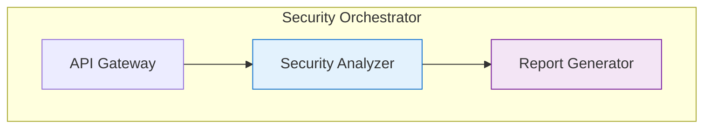

# Security Orchestrator - Documentation Guidelines

## 🎯 Executive Summary

**Purpose**: Comprehensive guidelines for creating, maintaining, and reviewing Security Orchestrator documentation  
**Target Audience**: Technical writers, developers, documentation contributors  
**Current Version**: 2.0.0  
**Last Updated**: 2025-11-22T07:40:00Z  

This document establishes standardized practices, templates, and quality assurance processes for all Security Orchestrator documentation to ensure consistency, readability, and technical accuracy.

---

## 📋 Table of Contents

1. [Terminology Standards](#terminology-standards)
2. [Writing Style Guidelines](#writing-style-guidelines)
3. [Document Structure Templates](#document-structure-templates)
4. [Markdown Formatting Conventions](#markdown-formatting-conventions)
5. [Code Example Standards](#code-example-standards)
6. [Image and Diagram Guidelines](#image-and-diagram-guidelines)
7. [Link and Reference Standards](#link-and-reference-standards)
8. [Quality Assurance Checklist](#quality-assurance-checklist)
9. [Review Process](#review-process)
10. [Document Lifecycle Management](#document-lifecycle-management)

---

## 🏷️ Terminology Standards

### System Name Usage

#### ✅ **Preferred Terminology**
- **"Security Orchestrator"** (with space) - Official system name
- **"Security Orchestrator platform"** - When referring to the entire system
- **"SecurityOrchestrator"** (without space) - Code/class names, file references

#### ❌ **Avoid These Variations**
- ~~"SecurityOrchestrator"~~ (in regular text - use space version)
- ~~"Security Orchestrator system"~~ (redundant - just "Security Orchestrator")
- ~~"SO"~~ (avoid abbreviations in documentation)
- ~~"Orchestrator platform"~~ (not specific enough)

#### 📝 **Examples**
```
✅ Correct: "The Security Orchestrator provides comprehensive security testing..."
✅ Correct: "SecurityOrchestrator.java contains the main application class."
✅ Correct: "The Security Orchestrator platform supports enterprise integration."
```

### Technical Terms

#### Architecture Terms
- **Feature-first architecture** - Use this exact term
- **Microservices architecture** - Standard term
- **Clean architecture** - Always capitalize
- **Domain-driven design** - Always hyphenate
- **API gateway** - Lowercase "gateway"
- **RESTful API** - Use "API" in title case

#### Technology Stack
- **Java 21+** - Always specify version
- **Spring Boot 3.x** - Use "3.x" notation
- **Flutter Web** - Official term with "Web"
- **LLM integration** - Lowercase "llm" unless in document title
- **BPMN 2.0** - Always include version
- **OpenAPI specification** - Use "specification" not "spec"

#### Security Terms
- **OWASP Top 10** - Official capitalization
- **Security testing framework** - Use this phrase
- **Vulnerability assessment** - Hyphenate "vulnerability"
- **Risk assessment** - Hyphenate "risk"
- **Compliance framework** - Use this phrase

### Language Preferences

#### English Language
- **Primary Language**: English for all technical documentation
- **Secondary Language**: Russian for management/project documents only
- **Technical Terms**: Keep technical terms in English even in Russian documents
- **Examples**: Use English for code examples and console output

#### Consistency Rules
```
✅ Consistent: "Security Orchestrator" throughout document
✅ Consistent: "API integration" (not "API's" or "api")
✅ Consistent: "OpenAPI specifications" (plural)
✅ Consistent: "Java 21" (not "Java 21+")
```

---

## ✍️ Writing Style Guidelines

### Document Tone and Voice

#### Professional Technical Writing
- **Tone**: Professional, clear, authoritative
- **Voice**: Third person active (prefer "The system provides" over "We provide")
- **Audience**: Technical professionals, developers, system administrators
- **Perspective**: Always from system capabilities, not personal opinion

#### ❌ **Avoid**
- First person plurals ("We recommend", "Let's see")
- Marketing language ("Amazing features", "Revolutionary")
- Jargon without explanation
- Conversational tone ("Now, let's look at...")

#### ✅ **Preferred**
```
❌ "We can see that the Security Orchestrator has some great features"
✅ "The Security Orchestrator provides comprehensive security analysis capabilities"

❌ "This is really cool because..."
✅ "This functionality enables..."

❌ "Let's try to understand..."
✅ "The system provides the following capabilities..."
```

### Sentence Structure

#### Clarity Principles
- **Maximum length**: 25 words per sentence (ideal)
- **Complex ideas**: Break into bullet points
- **Technical specifications**: Use consistent formatting
- **Actionable instructions**: Use imperative mood

#### Examples
```
✅ Clear: "The Security Orchestrator supports BPMN 2.0 and OpenAPI 3.0 specifications."
✅ Clear: "To configure the system:
   1. Navigate to the settings panel
   2. Select the appropriate provider
   3. Configure authentication credentials"

❌ Complex: "The Security Orchestrator, which is designed as a comprehensive platform that leverages artificial intelligence to provide automated security testing capabilities for enterprise environments, supports multiple integration patterns including REST APIs and webhooks for maximum flexibility."
```

### Technical Accuracy

#### Documentation Standards
- **Verified information**: All technical details must be verified against current implementation
- **Version-specific**: Include version numbers for all referenced technologies
- **Example accuracy**: Code examples must be tested and functional
- **Link validation**: All external links must be accessible

#### Update Requirements
- **Version tracking**: Include version numbers in document headers
- **Date stamps**: Use ISO 8601 format (2025-11-22T07:40:00Z)
- **Status indicators**: Mark documents as Draft, Review, Approved, or Deprecated
- **Change history**: Maintain change logs for major updates

---

## 📄 Document Structure Templates

### Template 1: Technical Documentation

```markdown
# [Document Title] - Security Orchestrator

## Executive Summary
- Brief description (2-3 sentences)
- Target audience
- Prerequisites

## Table of Contents
Auto-generated or manually maintained list

## 1. Overview
### System Description
### Key Features
### Architecture Components

## 2. Getting Started
### Prerequisites
### Installation Steps
### Basic Configuration

## 3. Implementation Guide
### Core Concepts
### Configuration Options
### Integration Patterns

## 4. Advanced Topics
### Performance Considerations
### Security Requirements
### Troubleshooting

## 5. Reference
### API Documentation
### Configuration Reference
### Best Practices

## 6. Examples
### Code Examples
### Use Cases
### Common Patterns

## 7. Support
### Troubleshooting Guide
### FAQ
### Contact Information

---
**Document Version**: [X.Y.Z]
**Last Updated**: [ISO 8601 timestamp]
**Status**: [Draft/Review/Approved/Deprecated]
**Author**: [Name and contact]
**Reviewer**: [Name and contact]
**Next Review**: [Date]
```

### Template 2: User Guide

```markdown
# [Feature Name] User Guide - Security Orchestrator

## What This Guide Covers
- Brief overview of functionality
- Who should read this guide
- Prerequisites and requirements

## Getting Started
### First Steps
### Basic Operations
### Essential Features

## Core Features
### [Feature 1]
**Purpose**: [Brief description]
**How to Use**: [Step-by-step instructions]
**Example**: [Practical example]

### [Feature 2]
**Purpose**: [Brief description]
**How to Use**: [Step-by-step instructions]
**Example**: [Practical example]

## Advanced Features
### [Advanced Feature]
**When to Use**: [Use cases]
**Configuration**: [Settings explanation]
**Best Practices**: [Recommendations]

## Troubleshooting
### Common Issues
### Error Messages
### Getting Help

## Appendix
### Glossary
### Keyboard Shortcuts
### Related Documentation

---
**Guide Version**: [X.Y.Z]
**Last Updated**: [ISO 8601 timestamp]
**Applies to**: Security Orchestrator [version]
**Feedback**: [Contact information]
```

### Template 3: API Reference

```markdown
# API Reference - Security Orchestrator

## Overview
[High-level API description]

## Base URL
```
Production: https://api.securityorchestrator.com
Development: http://localhost:8080
```

## Authentication
[Authentication method description]

## Endpoints

### [Endpoint Category]

#### [HTTP Method] [Endpoint Path]
**Description**: [What this endpoint does]

**Parameters**:
- `[path/param]` (type, required): [Description]
- `query_param` (string, optional): [Description]

**Request Body** (if applicable):
```json
{
  "example": "field"
}
```

**Response**:
```json
{
  "success": true,
  "data": {
    "response": "structure"
  }
}
```

**Example**:
```bash
curl -X [METHOD] [URL] \
  -H "Authorization: Bearer [TOKEN]" \
  -H "Content-Type: application/json"
```

**Status Codes**:
- `200`: Success
- `400`: Bad Request
- `401`: Unauthorized
- `404`: Not Found
- `500`: Internal Server Error

## Error Handling
[Error response format]

## Rate Limiting
[Rate limiting information]

---
**API Version**: v1
**Documentation Updated**: [ISO 8601 timestamp]
```

---

## 📝 Markdown Formatting Conventions

### Document Headers

#### Header Hierarchy
```markdown
# Document Title (H1)
## Main Section (H2)
### Subsection (H3)
#### Sub-subsection (H4)
##### Detail level (H5)
###### Fine details (H6)
```

#### Header Guidelines
- **H1**: Use for document title only
- **H2**: Use for major sections
- **H3**: Use for sub-sections and feature descriptions
- **H4-H6**: Use sparingly, only when necessary for clarity

#### Header Examples
```
✅ Good:
# Security Testing Framework
## Authentication Methods
### JWT Token Implementation
#### Token Validation Process

❌ Too many levels:
# Document
## Section
### Subsection
#### Sub-subsection
##### Detail
###### Fine detail
```

### Text Formatting

#### Code Formatting
- **Inline code**: Use backticks \`code\` for file paths, commands, and short code snippets
- **Code blocks**: Use triple backticks \`\`\`language for longer examples
- **File references**: Use backticks and bold: \`**Backend/app/Main.java**\`

#### Text Emphasis
- **Bold**: Use \`**bold text**\` for important concepts and file names
- **Italics**: Use \`*italic text*\` for emphasis within sentences
- **Bold and italics**: Use \`***text***\` sparingly for critical information

#### Lists and Enumeration

**Unordered Lists**:
```markdown
✅ Use consistent bullet points:
- First item
- Second item
  - Nested item (2 spaces indent)
  - Another nested item

❌ Don't mix styles:
- First item
* Second item (inconsistent)
+ Third item (inconsistent)
```

**Ordered Lists**:
```markdown
✅ Steps and sequences:
1. First step
2. Second step
3. Third step
   a. Sub-step
   b. Another sub-step
```

### Special Formatting

#### Tables
```markdown
| Column 1 | Column 2 | Column 3 |
|----------|----------|----------|
| Value 1  | Value 2  | Value 3  |
| Value A  | Value B  | Value C  |

✅ Include table description above
```

#### Blockquotes
```markdown
> **Important Note**: This is how you format important notes or warnings.

> **Note**: Regular information that needs attention but isn't critical.
```

#### Horizontal Rules
```markdown
Use sparingly and consistently:
---

Usually before major sections or templates
```

---

## 💻 Code Example Standards

### General Principles

#### Testability
- All code examples must be tested and functional
- Include error handling where appropriate
- Provide complete, runnable examples when possible

#### Consistency
- Use consistent naming conventions
- Follow language-specific style guides
- Include imports and dependencies

#### Clarity
- Add comments for complex logic
- Use descriptive variable names
- Include input/output examples

### Language-Specific Standards

#### Java Examples
```java
/**
 * Example: Security Orchestrator API Client
 * 
 * @author Security Orchestrator Team
 * @version 1.0.0
 */
@RestController
@RequestMapping("/api/v1/security")
public class SecurityOrchestratorController {
    
    @Autowired
    private SecurityOrchestratorService service;
    
    /**
     * Performs security analysis of uploaded BPMN process
     * 
     * @param file the BPMN process file to analyze
     * @param analysisType the type of analysis to perform
     * @return AnalysisResult containing security findings
     */
    @PostMapping("/analyze")
    public ResponseEntity<AnalysisResult> analyzeBpmn(
            @RequestParam("file") MultipartFile file,
            @RequestParam("analysisType") String analysisType) {
        
        try {
            AnalysisResult result = service.analyzeProcess(file, analysisType);
            return ResponseEntity.ok(result);
        } catch (SecurityAnalysisException e) {
            return ResponseEntity.badRequest()
                .body(AnalysisResult.error(e.getMessage()));
        }
    }
}
```

#### Flutter/Dart Examples
```dart
/// Security Orchestrator API Client for Flutter
/// 
/// Provides methods for interacting with Security Orchestrator backend
class SecurityOrchestratorClient {
  static const String _baseUrl = 'https://api.securityorchestrator.com';
  static const String _apiKey = 'your-api-key-here';
  
  late final Dio _dio;
  
  SecurityOrchestratorClient() {
    _dio = Dio(BaseOptions(
      baseUrl: _baseUrl,
      headers: {
        'Authorization': 'Bearer $_apiKey',
        'Content-Type': 'application/json',
      },
    ));
  }
  
  /// Performs security analysis of a BPMN process
  /// 
  /// [bpmnFile] The BPMN process file to analyze
  /// [analysisType] Type of security analysis to perform
  /// 
  /// Returns [SecurityAnalysisResult] or throws [SecurityAnalysisException]
  Future<SecurityAnalysisResult> analyzeBpmnProcess({
    required File bpmnFile,
    required String analysisType,
  }) async {
    try {
      final formData = FormData.fromMap({
        'file': await MultipartFile.fromFile(bpmnFile.path),
        'analysisType': analysisType,
      });
      
      final response = await _dio.post(
        '/api/v1/bpmn/analyze',
        data: formData,
      );
      
      return SecurityAnalysisResult.fromJson(response.data);
    } on DioException catch (e) {
      throw SecurityAnalysisException(
        'Failed to analyze BPMN process: ${e.message}',
      );
    }
  }
}
```

#### JavaScript/TypeScript Examples
```typescript
/**
 * Security Orchestrator API Client
 * 
 * @description Provides methods for interacting with Security Orchestrator backend
 * @version 1.0.0
 */
interface SecurityAnalysisRequest {
  processId: string;
  analysisType: 'SECURITY' | 'COMPLIANCE' | 'PERFORMANCE';
  specifications: {
    bpmn?: string;
    openapi?: string;
  };
}

class SecurityOrchestratorClient {
  private readonly baseUrl: string;
  private readonly apiKey: string;
  
  constructor(baseUrl: string = 'https://api.securityorchestrator.com', apiKey: string) {
    this.baseUrl = baseUrl;
    this.apiKey = apiKey;
  }
  
  /**
   * Performs comprehensive security analysis
   * 
   * @param request The analysis request configuration
   * @returns Promise with analysis results
   * @throws SecurityAnalysisException if analysis fails
   */
  async performSecurityAnalysis(request: SecurityAnalysisRequest): Promise<SecurityAnalysisResult> {
    try {
      const response = await fetch(`${this.baseUrl}/api/v1/analysis/comprehensive`, {
        method: 'POST',
        headers: {
          'Authorization': `Bearer ${this.apiKey}`,
          'Content-Type': 'application/json',
        },
        body: JSON.stringify(request),
      });
      
      if (!response.ok) {
        throw new Error(`HTTP ${response.status}: ${response.statusText}`);
      }
      
      return await response.json();
    } catch (error) {
      throw new SecurityAnalysisException(
        `Security analysis failed: ${error instanceof Error ? error.message : 'Unknown error'}`
      );
    }
  }
}
```

#### Shell/Command Line Examples
```bash
#!/bin/bash
# Security Orchestrator - Automated Deployment Script
# Version: 1.0.0
# Description: Deploys Security Orchestrator to production environment

set -e  # Exit on any error

# Configuration
APP_NAME="security-orchestrator"
APP_VERSION="2.0.0"
DEPLOYMENT_ENV="production"

# Colors for output
RED='\033[0;31m'
GREEN='\033[0;32m'
YELLOW='\033[1;33m'
NC='\033[0m' # No Color

echo -e "${GREEN}Starting deployment of $APP_NAME v$APP_VERSION${NC}"

# Validate environment
if [[ "$DEPLOYMENT_ENV" != "production" && "$DEPLOYMENT_ENV" != "staging" ]]; then
    echo -e "${RED}Invalid deployment environment: $DEPLOYMENT_ENV${NC}"
    exit 1
fi

# Check prerequisites
echo -e "${YELLOW}Checking prerequisites...${NC}"
command -v docker >/dev/null 2>&1 || { 
    echo -e "${RED}Docker is required but not installed.${NC}"; 
    exit 1; 
}

# Deploy application
echo -e "${YELLOW}Deploying application...${NC}"
docker-compose -f docker-compose.$DEPLOYMENT_ENV.yml up -d

# Wait for services to be healthy
echo -e "${YELLOW}Waiting for services to start...${NC}"
sleep 30

# Verify deployment
if curl -f http://localhost:8080/actuator/health >/dev/null 2>&1; then
    echo -e "${GREEN}✅ Deployment successful!${NC}"
    echo -e "${GREEN}Security Orchestrator is running at: http://localhost:8080${NC}"
else
    echo -e "${RED}❌ Deployment failed. Check logs.${NC}"
    exit 1
fi
```

### Code Block Guidelines

#### Language Specification
```markdown
✅ Specify language for syntax highlighting:
```java
// Java code example
public class SecurityAnalysis {
    public void analyze() {
        System.out.println("Security analysis in progress");
    }
}
```

✅ Include file paths in comments:
```java
// File: Backend/features/bpmn/src/main/java/.../BpmnService.java
@Service
public class BpmnService {
    // Service implementation
}
```

❌ Avoid bare code blocks:
```
// No language specification
public class Example {
    void method() {}
}
```

#### Error Handling Examples
```java
// ✅ Include proper error handling
try {
    SecurityAnalysisResult result = analyzer.analyze(bpmnFile);
    return ResponseEntity.ok(result);
} catch (BpmnValidationException e) {
    logger.error("Invalid BPMN file: {}", e.getMessage());
    return ResponseEntity.badRequest()
        .body(ErrorResponse.builder()
            .code("INVALID_BPMN")
            .message("The provided BPMN file contains validation errors")
            .timestamp(Instant.now())
            .build());
} catch (Exception e) {
    logger.error("Unexpected error during analysis", e);
    return ResponseEntity.status(HttpStatus.INTERNAL_SERVER_ERROR)
        .body(ErrorResponse.of("ANALYSIS_FAILED", "An unexpected error occurred"));
}
```

---

## 🖼️ Image and Diagram Guidelines

### Diagram Standards

#### Mermaid Diagram Conventions
```markdown
✅ Use consistent formatting:

```

#### Diagram Principles
- **Clear labeling**: All nodes and connections should be clearly labeled
- **Logical flow**: Follow logical reading patterns (left-to-right, top-to-bottom)
- **Consistent styling**: Use consistent colors and shapes for similar elements
- **Accessibility**: Include text alternatives for complex diagrams

### Image Requirements

#### Technical Specifications
- **Format**: PNG or SVG for diagrams, PNG/JPEG for screenshots
- **Resolution**: Minimum 1200px width for web display
- **Compression**: Optimize for web (under 500KB per image when possible)
- **Naming**: Use descriptive, lowercase names with hyphens
- **Storage**: Store images in organized folders within the docs directory

#### File Naming Convention
```
✅ Good naming:
- security-analysis-workflow.png
- api-integration-patterns.svg
- system-architecture-overview.png

❌ Poor naming:
- image1.png
- Diagram_2.JPG
- ARCHITECTURE.jpeg
```

#### Screenshot Guidelines
- **Include context**: Show enough UI to understand the example
- **Annotate when needed**: Use arrows, circles, or text to highlight important areas
- **Current interface**: Ensure screenshots match current version
- **Alternative text**: Provide descriptive alt text for accessibility

---

## 🔗 Link and Reference Standards

### Internal Links

#### File References
```markdown
✅ Use relative paths within docs directory:
- [System Architecture](SYSTEM_ARCHITECTURE.md)
- [API Reference](API_REFERENCE.md)
- [BPMN Guide](../bpmn/BPMN_ANALYSIS_SYSTEM.md)

❌ Avoid absolute paths or generic descriptions:
- [This document](somefile.md)
- [Click here](#some-section)
- [The document about architecture](#)
```

#### Section References
```markdown
✅ Link to specific sections:
- [Architecture Overview](#architecture-overview)
- [API Endpoints](#api-endpoints)
- [Troubleshooting](#troubleshooting-common-issues)

✅ Use descriptive link text:
- [Review the security architecture documentation](SECURITY_ARCHITECTURE.md)
- [Configure LLM integration settings](LLM_ARCHITECTURE.md#configuration)
```

### External Links

#### Validation Requirements
- **Accessible**: All external links must be tested and accessible
- **Stable**: Prefer stable URLs over temporary links
- **Relevant**: Only link to sources that directly support the content

#### External Link Formatting
```markdown
✅ Include helpful context:
- [OWASP API Security Top 10](https://owasp.org/www-project-api-security/) - Industry standard for API security
- [Spring Boot Documentation](https://docs.spring.io/spring-boot/docs/current/reference/html/) - Official Spring Boot guide

❌ Bare links without context:
- https://owasp.org/www-project-api-security/
- https://docs.spring.io/spring-boot/docs/current/reference/html/
```

#### Link Validation Process
1. **Before publishing**: Test all external links
2. **Regular audits**: Monthly link validation using automated tools
3. **Broken link reporting**: Community members can report broken links
4. **Alternative links**: Provide backup references when possible

---

## ✅ Quality Assurance Checklist

### Content Quality

#### Technical Accuracy
- [ ] All technical specifications verified against current implementation
- [ ] Code examples tested and functional
- [ ] API endpoints documented with correct methods and parameters
- [ ] Version numbers accurate and current
- [ ] Configuration examples work in real scenarios

#### Completeness
- [ ] All major features and capabilities documented
- [ ] Prerequisites and requirements clearly stated
- [ ] Installation and setup steps complete
- [ ] Troubleshooting section addresses common issues
- [ ] Examples cover typical use cases

#### Clarity and Readability
- [ ] Clear, professional tone maintained throughout
- [ ] Complex concepts explained with examples
- [ ] Consistent terminology used throughout document
- [ ] Logical information flow and organization
- [ ] Appropriate level of technical detail for target audience

### Technical Standards

#### Formatting Compliance
- [ ] Consistent markdown formatting applied
- [ ] Proper header hierarchy maintained (H1 → H2 → H3)
- [ ] Code blocks use appropriate language specifications
- [ ] Tables properly formatted with clear headers
- [ ] Lists use consistent bullet point styles

#### Link and Reference Integrity
- [ ] All internal links tested and functional
- [ ] External links accessible and relevant
- [ ] Cross-references consistent and accurate
- [ ] Document cross-references updated to match changes
- [ ] No orphaned links or missing references

#### Document Structure
- [ ] Document template properly applied
- [ ] Table of contents accurate and complete
- [ ] Required sections present and properly formatted
- [ ] Document metadata (version, author, date) current
- [ ] Status indicators accurately reflect document state

### Accessibility and Usability

#### Accessibility Compliance
- [ ] Alt text provided for all images and diagrams
- [ ] Color not used as sole means of conveying information
- [ ] Text readable without requiring specific font sizes
- [ ] Links have descriptive text, not just "click here"
- [ ] Complex diagrams accompanied by textual descriptions

#### Usability Features
- [ ] Quick reference sections for common tasks
- [ ] Search-friendly headings and section organization
- [ ] Examples include both success and error scenarios
- [ ] Related documentation properly cross-referenced
- [ ] Contact information and support channels included

---

## 🔍 Review Process

### Review Workflow

#### Stage 1: Content Review (Technical Accuracy)
- **Reviewer**: Subject Matter Expert (SME)
- **Focus**: Technical accuracy, completeness, relevance
- **Timeline**: 3-5 business days
- **Criteria**:
  - [ ] Technical specifications correct
  - [ ] Implementation details accurate
  - [ ] Examples tested and functional
  - [ ] Security considerations addressed

#### Stage 2: Style and Format Review
- **Reviewer**: Technical Writer or Documentation Team
- **Focus**: Writing style, formatting, consistency
- **Timeline**: 2-3 business days
- **Criteria**:
  - [ ] Follows documentation guidelines
  - [ ] Consistent terminology used
  - [ ] Proper markdown formatting
  - [ ] Clear and professional tone

#### Stage 3: Peer Review
- **Reviewer**: Peer developer or similar role
- **Focus**: User experience, clarity, usefulness
- **Timeline**: 2-3 business days
- **Criteria**:
  - [ ] Easy to understand and follow
  - [ ] Addresses target audience needs
  - [ ] Examples are practical and useful
  - [ ] Troubleshooting covers likely issues

#### Stage 4: Final Approval
- **Reviewer**: Documentation Lead or Team Manager
- **Focus**: Overall quality, compliance with standards
- **Timeline**: 1-2 business days
- **Criteria**:
  - [ ] Meets all quality standards
  - [ ] Follows organizational guidelines
  - [ ] Ready for publication
  - [ ] Metadata and version information correct

### Review Assignment Process

#### Automatic Assignment
- **Technical Review**: Assigned based on document category and reviewer expertise
- **Style Review**: Routed to documentation team automatically
- **Peer Review**: Assigned to team members with relevant experience

#### Manual Assignment
- **Complex Topics**: May require specific SMEs not in regular rotation
- **Urgent Updates**: May bypass standard review for critical fixes
- **Special Documents**: Enterprise integrations, security updates may require additional review

### Review Tools and Resources

#### Collaborative Tools
- **GitHub Pull Requests**: Primary review platform
- **Review Comments**: Structured feedback with resolution tracking
- **Review Status**: Automated tracking of review progress
- **Approval Workflows**: Defined approval criteria and processes

#### Review Templates
- **Content Review Checklist**: Specific to technical accuracy
- **Style Guide Compliance**: Formatting and writing standards
- **Security Review**: Special considerations for security documentation
- **API Documentation**: Specific criteria for API reference docs

---

## 🔄 Document Lifecycle Management

### Document States

#### Draft
- **Purpose**: Initial content creation
- **Status**: In development, not ready for use
- **Review**: Internal review only
- **Public Access**: Not published

#### Review
- **Purpose**: Undergoing formal review process
- **Status**: Complete draft awaiting approval
- **Review**: Technical, style, and peer review
- **Public Access**: Not published

#### Approved
- **Purpose**: Completed review and approved for publication
- **Status**: Ready for public use
- **Review**: Periodic review scheduled
- **Public Access**: Published and accessible

#### Deprecated
- **Purpose**: Superseded by newer version or no longer relevant
- **Status**: Outdated but archived for reference
- **Review**: No longer actively maintained
- **Public Access**: Archived with deprecation notice

#### Archived
- **Purpose**: Historical reference only
- **Status**: No longer maintained or updated
- **Review**: None
- **Public Access**: Archived location only

### Version Management

#### Version Numbering
- **Major Version** (X.0.0): Major changes, breaking changes, new sections
- **Minor Version** (1.X.0): New features, significant updates
- **Patch Version** (1.0.X): Bug fixes, minor corrections, formatting updates

#### Version History Template
```markdown
## Version History

### Version 2.0.0 (2025-11-22)
**Status**: Approved
**Changes**:
- Added new section on LLM integration
- Updated API reference for v2 endpoints
- Improved troubleshooting guide
- Fixed formatting inconsistencies

**Previous Version**: v1.5.0

### Version 1.5.0 (2025-10-15)
**Status**: Deprecated
**Changes**:
- Added OpenAPI security analysis
- Updated deployment examples
- Added performance optimization section

**Previous Version**: v1.4.0
```

### Update Triggers

#### Automated Reviews
- **Quarterly**: All documents undergo quarterly review for accuracy
- **Annual**: Comprehensive review and potential major updates
- **Security**: Immediate review for security-related changes

#### Manual Updates
- **Feature Releases**: Documentation updated with new features
- **Bug Reports**: Documentation corrected based on user feedback
- **User Requests**: Documentation enhanced based on community input
- **Regulatory Changes**: Updates for compliance requirements

### Maintenance Schedule

#### Regular Maintenance Tasks
- **Weekly**: Link validation and basic accuracy checks
- **Monthly**: Content freshness review and minor updates
- **Quarterly**: Comprehensive review and major updates
- **Annually**: Complete documentation audit and strategic review

#### Maintenance Team Roles
- **Primary Author**: Maintains document accuracy and content
- **Technical Reviewer**: Ensures technical accuracy
- **Documentation Editor**: Maintains style and formatting
- **Community Manager**: Handles community feedback and requests

---

## 📞 Support and Contact

### Documentation Team
- **Documentation Lead**: docs-team@securityorchestrator.com
- **Technical Writer**: technical-writer@securityorchestrator.com
- **Community Manager**: community@securityorchestrator.com

### Guidelines Feedback
- **GitHub Issues**: Use for specific guideline updates or clarifications
- **Documentation Discussions**: General feedback and suggestions
- **Email**: documentation-guidelines@securityorchestrator.com

### Additional Resources
- [Master Documentation Index](MASTER_DOCUMENTATION_INDEX.md)
- [Documentation Roadmap](DOCUMENTATION_ROADMAP.md)
- [GitHub Repository](https://github.com/SecurityOrchestrator/SecurityOrchestrator)

---

*This documentation guidelines document serves as the foundation for all Security Orchestrator documentation quality and consistency. Regular updates ensure alignment with community needs and industry best practices.*

**Guidelines Version**: 2.0.0  
**Last Updated**: 2025-11-22T07:40:00Z  
**Next Review**: 2026-02-22  
**Stakeholder Review**: Quarterly  
**Community Feedback**: Monthly