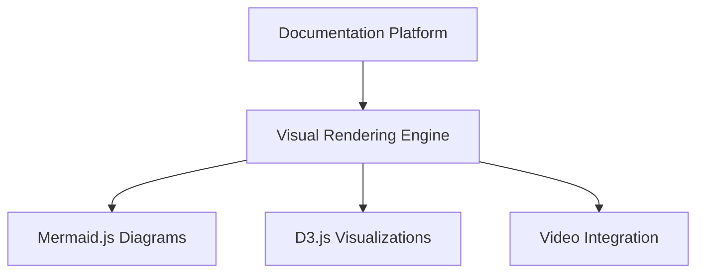
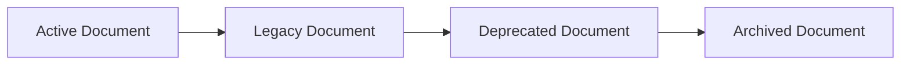
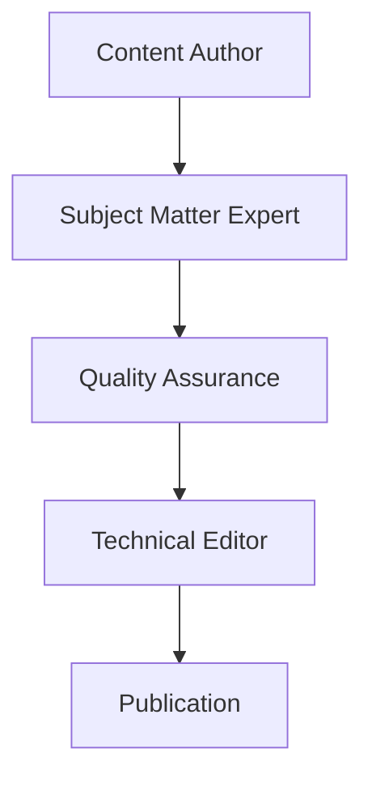
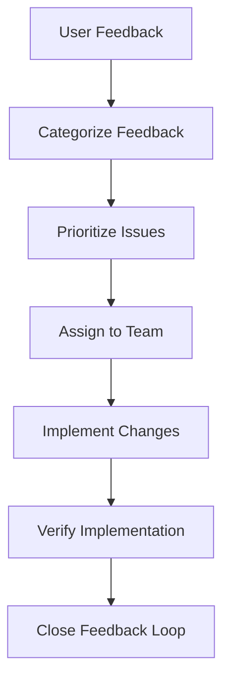
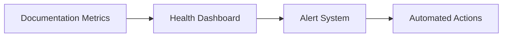
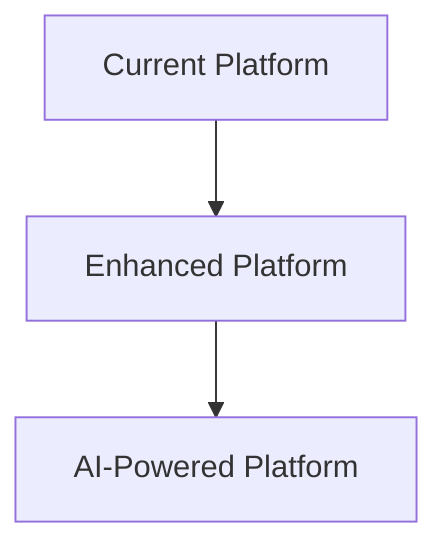
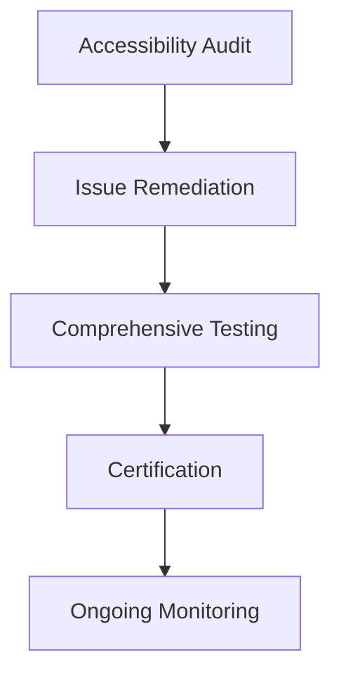
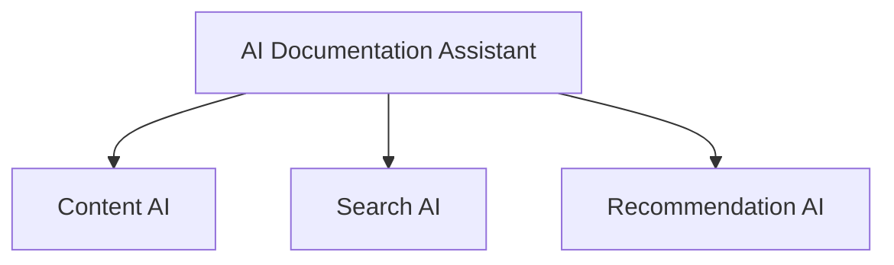

# Security Orchestrator - Documentation Roadmap

## 🎯 Executive Summary

**Current Status**: Production Documentation Complete  
**Roadmap Period**: 2025 Q4 - 2026 Q4  
**Last Updated**: 2025-11-22T07:38:00Z  
**Next Review**: 2026-02-22  

This roadmap outlines the strategic evolution of Security Orchestrator documentation, including future enhancements, maintenance schedules, and continuous improvement initiatives.

---

## 📈 Documentation Evolution Timeline

### Phase 1: Foundation & Optimization (Q4 2025)
**Timeline**: November 2025 - December 2025  
**Status**: ✅ Currently In Progress  

#### Completed Initiatives
- ✅ Master Documentation Index creation
- ✅ Cross-reference validation
- ✅ Terminology standardization
- ✅ Quick Start Guide development

#### In Progress
- 🔄 Complete cross-reference validation
- 🔄 Quality assurance review
- 🔄 Documentation guidelines establishment

#### Planned Enhancements
- 📝 Interactive API documentation with Swagger integration
- 📝 Enhanced troubleshooting guides with visual aids
- 📝 Video tutorial series for key user workflows
- 📝 Mobile app documentation expansion

### Phase 2: Advanced Features (Q1 2026)
**Timeline**: January 2026 - March 2026  

#### Content Enhancements
- 🤖 AI-powered documentation search
- 📊 Interactive architecture diagrams with Mermaid.js
- 🔗 Dynamic API reference with live examples
- 📱 Progressive Web App documentation
- 🌍 Multi-language support expansion (Spanish, French, German)

#### User Experience Improvements
- 🎨 Enhanced UI/UX documentation design
- 📋 Search functionality across all documents
- 💬 Interactive feedback mechanisms
- 🔖 Bookmark system for quick reference
- 📱 Mobile-optimized documentation layout

### Phase 3: Community & Collaboration (Q2 2026)
**Timeline**: April 2026 - June 2026  

#### Community-Driven Content
- 👥 User-contributed examples and use cases
- 🏆 Community recognition program for contributors
- 💬 Documentation discussion forums
- 📝 Collaborative editing capabilities
- 🧪 Beta testing documentation for new features

#### Integration Enhancements
- 🔗 Deep GitHub integration for documentation updates
- 🤖 Automated documentation generation from code
- 📊 Analytics and usage tracking
- 🔔 Notification system for documentation changes
- 🎯 Personalized documentation recommendations

### Phase 4: Enterprise Excellence (Q3-Q4 2026)
**Timeline**: July 2026 - December 2026  

#### Enterprise Features
- 🏢 Organization-specific documentation customization
- 📋 Compliance documentation automation
- 🔐 Security documentation with access controls
- 📊 Advanced reporting and analytics
- 🎓 Certification and training program documentation

---

## 🚀 Future Enhancement Priorities

### High Priority (Next 6 Months)

#### 1. Interactive Documentation Platform
**Goal**: Transform static documentation into an interactive platform  
**Benefits**:
- Improved user engagement
- Real-time code examples
- Interactive tutorials
- Better learning experience

**Implementation Plan**:
```markdown
Phase 1: Interactive API Explorer
├── Swagger/OpenAPI integration
├── Live code examples
├── Try-it-yourself endpoints
└── Real-time response validation

Phase 2: Interactive Tutorials
├── Step-by-step guided tours
├── Interactive configuration wizards
├── Troubleshooting assistants
└── Video integration

Phase 3: Advanced Features
├── AI-powered search
├── Contextual help system
├── Collaborative annotations
└── Version-aware documentation
```

#### 2. Enhanced Visual Documentation
**Goal**: Improve visual appeal and comprehension  
**Components**:
- Interactive architecture diagrams
- Animated process flows
- Visual troubleshooting guides
- Infographic summaries

**Technical Requirements**:


#### 3. Multi-Platform Documentation Strategy
**Goal**: Ensure documentation accessibility across all platforms  
**Targets**:
- Web application
- Mobile apps (iOS/Android)
- Desktop applications
- Embedded systems

### Medium Priority (6-12 Months)

#### 1. Advanced Search & Discovery
**Features**:
- AI-powered semantic search
- Contextual search results
- Voice search capabilities
- Search result recommendations

#### 2. Personalization Engine
**Capabilities**:
- Role-based documentation views
- Personalized learning paths
- Progress tracking
- Adaptive content recommendations

#### 3. Analytics & Insights
**Metrics**:
- Documentation usage patterns
- User journey analysis
- Content effectiveness scoring
- Improvement recommendations

### Low Priority (12+ Months)

#### 1. VR/AR Documentation
- Virtual reality architecture tours
- Augmented reality troubleshooting
- 3D interactive diagrams

#### 2. Advanced Collaboration
- Real-time collaborative editing
- Version control for documentation
- Approval workflows
- Content governance

---

## 🗂️ Document Lifecycle Management

### Deprecation Strategy

#### Current Deprecation Candidates
| Document | Status | Reason | Migration Path |
|----------|--------|--------|----------------|
| None currently | N/A | All documents are current | N/A |

#### Future Deprecation Planning


#### Deprecation Timeline Process
1. **Legacy Status** (6 months before deprecation)
   - ⚠️ Warning banners added
   - 🔗 Redirect to new version
   - 📧 Notification to users

2. **Deprecated Status** (Official deprecation)
   - 🚫 Removed from main navigation
   - 📅 Sunset date announced
   - 🔄 Alternative solutions provided

3. **Archived Status** (Post-deprecation)
   - 📦 Moved to archive location
   - 🔗 Soft redirects maintained
   - 📊 Usage analytics tracked

### Document Versioning Strategy

#### Semantic Versioning for Documentation
```
Major.Minor.Patch
├── Major: Breaking changes, major restructuring
├── Minor: New features, significant updates
└── Patch: Corrections, minor updates
```

#### Version Control Best Practices
- 🏷️ Clear version labeling
- 🔗 Cross-version linking
- 📅 Sunset policies
- 📊 Version usage tracking

---

## 🔄 Maintenance Schedule

### Regular Maintenance Activities

#### Weekly Tasks
- ✅ Content accuracy verification
- 🔗 Link validation
- 📝 Spelling and grammar checks
- 🐛 Bug fix integration

#### Monthly Tasks
- 📊 Analytics review and optimization
- 🔄 User feedback analysis
- 📋 Content freshness assessment
- 🎯 SEO optimization updates

#### Quarterly Tasks
- 🔍 Comprehensive content audit
- 📈 Strategy review and updates
- 🎨 Design and UX improvements
- 🔧 Technical infrastructure updates

#### Annual Tasks
- 🏗️ Architecture review
- 🌐 Multi-language expansion assessment
- 📚 Content strategy overhaul
- 🔮 Future planning and roadmap updates

### Maintenance Team Structure

#### Documentation Maintainers
- **Technical Writer** (Primary)
  - Content creation and updates
  - Style guide enforcement
  - Quality assurance

- **Subject Matter Experts** (Rotating)
  - Technical accuracy review
  - Domain-specific insights
  - Best practices input

- **Community Managers** (Part-time)
  - User feedback collection
  - Community contributions
  - Support coordination

#### Quality Assurance Process


---

## 💬 Feedback Collection Mechanisms

### User Feedback Channels

#### 1. In-Documentation Feedback
**Location**: Every document page  
**Methods**:
- 👍👎 Thumbs up/down ratings
- 💬 Comment sections
- 📧 "Report issue" buttons
- ⭐ Star ratings per section

#### 2. Structured Feedback Forms
**Categories**:
- Content accuracy
- Clarity and usability
- Technical difficulty
- Missing information
- Suggestions for improvement

#### 3. Community Forums
**Platform**: GitHub Discussions  
**Topics**:
- Documentation questions
- Feature requests
- Use case sharing
- Best practices discussions

#### 4. Analytics-Based Feedback
**Metrics Tracked**:
- Time spent on pages
- Bounce rates
- Search queries
- Download patterns
- User journey flows

### Feedback Processing Workflow



### Feedback Response SLAs

| Priority Level | Response Time | Resolution Time |
|----------------|---------------|-----------------|
| **Critical** | 4 hours | 24 hours |
| **High** | 24 hours | 1 week |
| **Medium** | 3 days | 2 weeks |
| **Low** | 1 week | 1 month |

---

## 📊 Success Metrics & KPIs

### Content Quality Metrics

#### Engagement Metrics
- 📈 Page views per document
- ⏱️ Average time on page
- 🔄 Return visitor rate
- 📱 Mobile vs desktop usage

#### User Satisfaction Metrics
- 👍 Positive feedback percentage
- ⭐ Average rating score
- 💬 Comment sentiment analysis
- 🎯 Goal completion rate

#### Technical Metrics
- 🔗 Broken link percentage
- ⚡ Page load times
- 🔍 Search success rate
- 📱 Mobile usability score

### Documentation Health Dashboard



### KPI Targets for 2026

| Metric | Current | Target | Timeline |
|--------|---------|--------|----------|
| User Satisfaction | 4.2/5 | 4.7/5 | Q2 2026 |
| Mobile Usability | 75% | 90% | Q3 2026 |
| Search Success | 60% | 85% | Q4 2026 |
| Content Freshness | 80% | 95% | Q1 2026 |
| Page Load Speed | 3.2s | 2.0s | Q2 2026 |

---

## 🛠️ Technical Infrastructure

### Documentation Platform Evolution

#### Current Infrastructure
- ✅ Markdown-based content
- ✅ Git version control
- ✅ Static site generation
- ✅ Search functionality

#### Planned Infrastructure Enhancements


#### Technology Stack Evolution
**Phase 1 (Current)**:
- Markdown + Git
- Jekyll/Hugo static generation
- Basic search
- Manual deployment

**Phase 2 (Enhancement)**:
- Interactive documentation platform
- Real-time search with AI
- Automated deployment
- Analytics integration

**Phase 3 (Future)**:
- AI-powered content generation
- Personalized experiences
- Advanced collaboration tools
- Predictive analytics

### Content Management System

#### Requirements
- 🎯 Multi-author support
- 📝 Version control integration
- 🔄 Workflow management
- 📊 Analytics integration
- 🔍 Advanced search capabilities
- 📱 Mobile optimization
- 🌐 Multi-language support
- 🔐 Access control and permissions

#### Recommended Solutions
1. **GitBook** - Community collaboration
2. **Notion** - Flexible content management
3. **Confluence** - Enterprise collaboration
4. **Custom Solution** - Tailored to specific needs

---

## 🎓 Training & Certification Programs

### Documentation Training Program

#### For Content Creators
- 📝 Technical writing best practices
- 🎨 Documentation design principles
- 🔍 SEO optimization techniques
- 📱 Mobile-first content creation
- 🌐 Accessibility compliance

#### For Community Contributors
- 📋 Contribution guidelines
- 🔍 Quality standards
- 🤝 Collaboration workflows
- 🛠️ Tool training
- 📊 Analytics interpretation

### Certification Tracks

#### 1. Security Orchestrator Expert
**Requirements**:
- Complete all user documentation
- Pass practical assessment
- Contribute 3+ examples
- Maintain certification annually

#### 2. Technical Documentation Specialist
**Requirements**:
- Advanced technical writing skills
- API documentation expertise
- Architecture documentation proficiency
- Community contribution track record

---

## 🌍 Localization & Accessibility

### Multi-Language Expansion Plan

#### Phase 1 Languages (Q1 2026)
- 🇪🇸 Spanish
- 🇫🇷 French
- 🇩🇪 German

#### Phase 2 Languages (Q3 2026)
- 🇯🇵 Japanese
- 🇨🇳 Chinese (Simplified)
- 🇰🇷 Korean
- 🇵🇹 Portuguese

#### Phase 3 Languages (Q4 2026)
- 🇮🇹 Italian
- 🇷🇺 Russian (Enhanced)
- 🇮🇳 Hindi
- 🇸🇦 Arabic

### Accessibility Compliance

#### WCAG 2.1 AA Compliance
- ♿ Keyboard navigation
- 🔊 Screen reader compatibility
- 🎨 High contrast support
- 📏 Scalable text and graphics
- 🚫 No seizure-inducing content

#### Implementation Timeline


---

## 🔮 Future Vision & Innovation

### AI-Powered Documentation Assistant

#### Capabilities
- 🤖 Intelligent content suggestions
- 🔍 Contextual help delivery
- 📝 Automated content generation
- 🎯 Personalized learning paths
- 🔧 Predictive troubleshooting

#### Implementation Strategy


### Immersive Documentation Experience

#### Virtual Reality Integration
- 🏗️ 3D architecture visualization
- 🎮 Interactive system exploration
- 📚 Virtual training environments
- 👥 Collaborative VR sessions

#### Augmented Reality Support
- 📱 Mobile AR overlays
- 🔧 On-site troubleshooting assistance
- 📊 Real-time system monitoring
- 🎯 Guided repair instructions

---

## 📅 Implementation Timeline

### Detailed Roadmap Schedule

#### Q4 2025 (November - December)
- ✅ Master documentation index
- 🔄 Quality assurance completion
- 📝 Documentation guidelines
- 🎥 Video tutorial planning

#### Q1 2026 (January - March)
- 🤖 Interactive documentation platform
- 🌐 Multi-language support (Phase 1)
- 📱 Mobile optimization
- 📊 Analytics dashboard

#### Q2 2026 (April - June)
- 👥 Community collaboration features
- 🎨 Enhanced visual documentation
- 🔍 Advanced search implementation
- 🎓 Training program launch

#### Q3 2026 (July - September)
- 🏢 Enterprise features
- 🏆 Community recognition program
- 📋 Compliance automation
- 🎯 Personalization engine

#### Q4 2026 (October - December)
- 🚀 AI-powered features
- 🌟 VR/AR exploration
- 📊 Advanced analytics
- 🔮 2027 planning

---

## 📞 Contact & Support

### Documentation Team
- **Documentation Lead**: docs@securityorchestrator.com
- **Technical Writer**: techwriter@securityorchestrator.com
- **Community Manager**: community@securityorchestrator.com

### Feedback & Suggestions
- **GitHub Issues**: [Documentation Issues](https://github.com/SecurityOrchestrator/SecurityOrchestrator/labels/documentation)
- **Email**: documentation-feedback@securityorchestrator.com
- **Community Forum**: [Documentation Discussions](https://github.com/SecurityOrchestrator/SecurityOrchestrator/discussions/categories/documentation)

### Roadmap Updates
- **Status Page**: [Documentation Roadmap Status](https://github.com/SecurityOrchestrator/SecurityOrchestrator/projects/documentation)
- **Monthly Updates**: Newsletter subscription available
- **Quarterly Reviews**: Public roadmap review sessions

---

*This documentation roadmap is a living document that evolves with user needs and technological advances. Regular reviews ensure alignment with community requirements and industry best practices.*

**Roadmap Version**: 2.0.0  
**Next Major Review**: 2026-02-22  
**Stakeholder Review**: Quarterly  
**Community Feedback**: Monthly