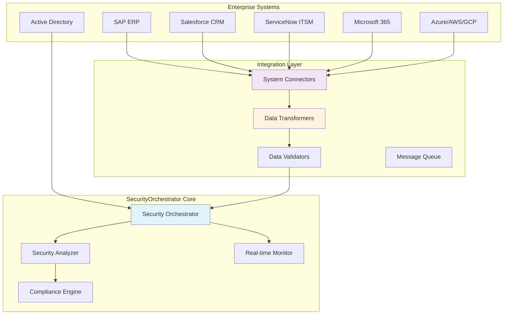

# SecurityOrchestrator - Enterprise Integrations Guide

## Исполнительное резюме

**Дата**: 2025-11-22  
**Версия**: 1.0.0  
**Цель**: Полная документация по интеграции с enterprise системами  
**Платформа**: SecurityOrchestrator - Enterprise-grade интеграционная платформа  

---

## 1. Обзор Enterprise архитектуры

### 1.1 Принципы Enterprise интеграции

SecurityOrchestrator предназначен для seamless интеграции с enterprise экосистемой:



### 1.2 Поддерживаемые Enterprise интеграции

| Категория | Система | Протокол | Статус |
|-----------|---------|----------|---------|
| ERP | SAP S/4HANA | REST/SOAP/OData | ✅ Поддерживается |
| ERP | Oracle ERP | REST/SOAP | ✅ Поддерживается |
| CRM | Salesforce | REST/SOAP/Bulk API | ✅ Поддерживается |
| CRM | Microsoft Dynamics | REST/OData | ✅ Поддерживается |
| ITSM | ServiceNow | REST/SOAP | ✅ Поддерживается |
| ITSM | Jira Service Desk | REST | ✅ Поддерживается |
| Authentication | Active Directory | LDAP/SAML/OAuth2 | ✅ Поддерживается |
| Authentication | Azure AD | SAML/OAuth2/OpenID | ✅ Поддерживается |
| Message Broker | Apache Kafka | Kafka Protocol | ✅ Поддерживается |
| Message Broker | RabbitMQ | AMQP | ✅ Поддерживается |
| Database | Oracle Database | JDBC | ✅ Поддерживается |
| Database | PostgreSQL | JDBC | ✅ Поддерживается |

---

## 2. SSO/SAML Integration

### 2.1 SAML 2.0 Configuration

```java
@Configuration
@EnableSaml2Login
public class Saml2SecurityConfig {
    
    @Value("${saml2.metadata-url}")
    private String metadataUrl;
    
    @Value("${saml2.entity-id}")
    private String entityId;
    
    @Value("${saml2.acs-url}")
    private String assertionConsumerServiceUrl;
    
    @Bean
    public RelyingPartyRegistrationRepository relyingPartyRegistrations() {
        RelyingPartyRegistration registration = RelyingPartyRegistration
            .withMetadataUrl(metadataUrl)
            .entityId(entityId)
            .assertionConsumerServiceBindingLocation(assertionConsumerServiceUrl)
            .signingX509Credentials(signingCredentials())
            .decryptionX509Credentials(decryptionCredentials())
            .build();
            
        return new InMemoryRelyingPartyRegistrationRepository(registration);
    }
}

@Component
public class EnterpriseUserMapper {
    
    public UserPrincipal mapSamlToPrincipal(Saml2AuthenticatedPrincipal principal) {
        Map<String, Object> attributes = principal.getAttributes();
        
        // Extract enterprise-specific attributes
        String employeeId = getAttributeValue(attributes, "employeeNumber");
        String department = getAttributeValue(attributes, "department");
        String manager = getAttributeValue(attributes, "manager");
        List<String> groups = getAttributeValues(attributes, "groups");
        List<String> roles = getAttributeValues(attributes, "roles");
        
        return UserPrincipal.builder()
            .username(principal.getName())
            .email(getAttributeValue(attributes, "email"))
            .displayName(getAttributeValue(attributes, "displayName"))
            .employeeId(employeeId)
            .department(department)
            .manager(manager)
            .enterpriseGroups(groups)
            .enterpriseRoles(roles)
            .ssoProvider("SAML2")
            .lastLogin(Instant.now())
            .build();
    }
}
```

### 2.2 OpenID Connect Integration

```java
@Configuration
@EnableOidcLogin
public class OidcSecurityConfig {
    
    @Value("${oidc.issuer}")
    private String issuer;
    
    @Value("${oidc.client-id}")
    private String clientId;
    
    @Bean
    public ClientRegistrationRepository clientRegistrationRepository() {
        ClientRegistration registration = ClientRegistration.withRegistrationId("enterprise")
            .issuer(issuer)
            .clientId(clientId)
            .scope("openid", "profile", "email", "groups")
            .authorizationGrantType(AuthorizationGrantType.AUTHORIZATION_CODE)
            .redirectUri("{baseUrl}/login/oauth2/code/{registrationId}")
            .build();
            
        return new InMemoryClientRegistrationRepository(registration);
    }
}
```

---

## 3. LDAP/Active Directory Integration

### 3.1 Active Directory Connector

```java
@Configuration
public class ActiveDirectoryConfig {
    
    @Value("${ldap.url}")
    private String ldapUrl;
    
    @Value("${ldap.domain}")
    private String domain;
    
    @Value("${ldap.base-dn}")
    private String baseDn;
    
    @Bean
    public LdapTemplate ldapTemplate() {
        LdapContextSource contextSource = new LdapContextSource();
        contextSource.setUrl(ldapUrl);
        contextSource.setBase(baseDn);
        contextSource.afterPropertiesSet();
        
        return new LdapTemplate(contextSource);
    }
}

@Service
public class ActiveDirectoryService {
    
    @Autowired
    private LdapTemplate ldapTemplate;
    
    public List<EnterpriseUser> searchUsers(String searchTerm, int maxResults) {
        EqualsFilter filter = new EqualsFilter("objectClass", "person")
            .and(new OrFilter()
                .addFilter(new EqualsFilter("sAMAccountName", searchTerm))
                .addFilter(new EqualsFilter("givenName", "*" + searchTerm + "*"))
                .addFilter(new EqualsFilter("sn", "*" + searchTerm + "*")));
                
        return ldapTemplate.search("", filter.encode(), 
            (AttributesMapper<EnterpriseUser>) attrs -> {
                EnterpriseUser user = new EnterpriseUser();
                user.setUserId(getAttributeValue(attrs, "sAMAccountName"));
                user.setDisplayName(getAttributeValue(attrs, "displayName"));
                user.setEmail(getAttributeValue(attrs, "mail"));
                user.setDepartment(getAttributeValue(attrs, "department"));
                return user;
            });
    }
    
    private String getAttributeValue(Attributes attrs, String name) {
        try {
            Attribute attr = attrs.get(name);
            return attr != null ? (String) attr.get() : null;
        } catch (Exception e) {
            return null;
        }
    }
}
```

---

## 4. SAP Integration

### 4.1 SAP OData Connection

```java
@Configuration
public class SapConfig {
    
    @Value("${sap.odata.url}")
    private String odataUrl;
    
    @Value("${sap.username}")
    private String username;
    
    @Value("${sap.password}")
    private String password;
    
    @Bean
    public RestTemplate sapRestTemplate() {
        BasicAuthInterceptor authInterceptor = new BasicAuthInterceptor(username, password);
        
        RestTemplate restTemplate = new RestTemplate();
        restTemplate.setInterceptors(Arrays.asList(authInterceptor));
        return restTemplate;
    }
}

@Service
public class SapIntegrationService {
    
    @Autowired
    private RestTemplate sapRestTemplate;
    
    public List<SapUser> getSapUsers() {
        try {
            ResponseEntity<SapUserResponse> response = sapRestTemplate.getForEntity(
                odataUrl + "/sap/opu/odata/sap/Z_USER_SRV/UserSet",
                SapUserResponse.class
            );
            
            if (response.getStatusCode().is2xxSuccessful()) {
                return response.getBody().getResults();
            }
            
        } catch (Exception e) {
            log.error("Failed to fetch SAP users", e);
            throw new SapIntegrationException("Failed to fetch users", e);
        }
        
        return Collections.emptyList();
    }
    
    @EventListener
    public void handleSecurityEvent(SecurityEvent event) {
        if (event.getType().equals("SECURITY_ROLE_CHANGED")) {
            String userId = event.getUserId();
            SecurityProfile profile = securityProfileService.getUserProfile(userId);
            updateSapUserSecurityProfile(userId, profile);
        }
    }
}
```

---

## 5. Salesforce Integration

### 5.1 Salesforce REST API Client

```java
@Configuration
public class SalesforceConfig {
    
    @Value("${salesforce.instance-url}")
    private String instanceUrl;
    
    @Value("${salesforce.client-id}")
    private String clientId;
    
    @Value("${salesforce.client-secret}")
    private String clientSecret;
    
    @Value("${salesforce.username}")
    private String username;
    
    @Value("${salesforce.password}")
    private String password;
    
    @Bean
    public SalesforceClient salesforceClient() {
        return new SalesforceClient(instanceUrl, clientId, clientSecret, username, password);
    }
}

public class SalesforceClient {
    
    private final String instanceUrl;
    private String accessToken;
    private Instant tokenExpiry;
    private final RestTemplate restTemplate;
    
    private void authenticate() {
        try {
            Map<String, String> authRequest = Map.of(
                "grant_type", "password",
                "client_id", clientId,
                "client_secret", clientSecret,
                "username", username,
                "password", password
            );
            
            ResponseEntity<SalesforceAuthResponse> response = restTemplate.postForEntity(
                instanceUrl + "/services/oauth2/token",
                authRequest,
                SalesforceAuthResponse.class
            );
            
            if (response.getStatusCode().is2xxSuccessful()) {
                SalesforceAuthResponse authResponse = response.getBody();
                this.accessToken = authResponse.getAccessToken();
                this.tokenExpiry = Instant.now().plusSeconds(3600);
            }
            
        } catch (Exception e) {
            throw new SalesforceIntegrationException("Authentication failed", e);
        }
    }
    
    public void createSecurityCase(SecurityAlertEvent event) {
        if (accessToken == null || Instant.now().isAfter(tokenExpiry)) {
            authenticate();
        }
        
        SalesforceCase securityCase = SalesforceCase.builder()
            .subject("Security Vulnerability: " + event.getVulnerability().getTitle())
            .description(generateCaseDescription(event))
            .origin("SecurityOrchestrator")
            .priority(mapSeverityToPriority(event.getVulnerability().getSeverity()))
            .type("Security Incident")
            .build();
            
        try {
            HttpHeaders headers = new HttpHeaders();
            headers.setBearerAuth(accessToken);
            headers.setContentType(MediaType.APPLICATION_JSON);
            
            HttpEntity<SalesforceCase> entity = new HttpEntity<>(securityCase, headers);
            
            ResponseEntity<String> response = restTemplate.postForEntity(
                instanceUrl + "/services/data/v57.0/sobjects/Case",
                entity,
                String.class
            );
            
            if (response.getStatusCode().is2xxSuccessful()) {
                log.info("Security case created in Salesforce: {}", event.getEventId());
            }
            
        } catch (Exception e) {
            log.error("Failed to create security case in Salesforce", e);
        }
    }
}
```

---

## 6. ServiceNow Integration

### 6.1 ServiceNow REST API

```java
@Configuration
public class ServiceNowConfig {
    
    @Value("${servicenow.instance}")
    private String instance;
    
    @Value("${servicenow.username}")
    private String username;
    
    @Value("${servicenow.password}")
    private String password;
    
    @Bean
    public RestTemplate serviceNowRestTemplate() {
        BasicAuthInterceptor authInterceptor = new BasicAuthInterceptor(username, password);
        
        RestTemplate restTemplate = new RestTemplate();
        restTemplate.setInterceptors(Arrays.asList(authInterceptor));
        return restTemplate;
    }
}

@Service
public class ServiceNowIntegrationService {
    
    @Autowired
    private RestTemplate serviceNowRestTemplate;
    
    private String getBaseUrl() {
        return "https://" + instance + ".service-now.com";
    }
    
    public ServiceNowIncident createSecurityIncident(SecurityAlertEvent event) {
        ServiceNowIncident incident = ServiceNowIncident.builder()
            .shortDescription("Security Vulnerability: " + event.getVulnerability().getTitle())
            .description(generateIncidentDescription(event))
            .urgency(mapSeverityToUrgency(event.getVulnerability().getSeverity()))
            .impact(mapSeverityToImpact(event.getVulnerability().getSeverity()))
            .category("Security")
            .subcategory("Vulnerability")
            .assignmentGroup("Information Security")
            .build();
            
        try {
            ResponseEntity<ServiceNowIncident> response = serviceNowRestTemplate.postForEntity(
                getBaseUrl() + "/api/now/table/incident",
                incident,
                ServiceNowIncident.class
            );
            
            if (response.getStatusCode().is2xxSuccessful()) {
                ServiceNowIncident createdIncident = response.getBody();
                log.info("ServiceNow incident created: {}", createdIncident.getNumber());
                return createdIncident;
            }
            
        } catch (Exception e) {
            log.error("Failed to create ServiceNow incident", e);
            throw new ServiceNowIntegrationException("Failed to create incident", e);
        }
        
        return null;
    }
    
    private String mapSeverityToUrgency(Severity severity) {
        return switch (severity) {
            case CRITICAL -> "1"; // High
            case HIGH -> "2";     // Medium
            case MEDIUM -> "3";   // Low
            case LOW -> "4";      // Low
            default -> "3";
        };
    }
}
```

---

## 7. Message Broker Integration

### 7.1 Apache Kafka Integration

```java
@Configuration
@EnableKafka
public class KafkaIntegrationConfig {
    
    @Value("${kafka.bootstrap-servers}")
    private String bootstrapServers;
    
    @Bean
    public ProducerFactory<String, Object> kafkaProducerFactory() {
        Map<String, Object> configProps = new HashMap<>();
        configProps.put(ProducerConfig.BOOTSTRAP_SERVERS_CONFIG, bootstrapServers);
        configProps.put(ProducerConfig.KEY_SERIALIZER_CLASS_CONFIG, StringSerializer.class);
        configProps.put(ProducerConfig.VALUE_SERIALIZER_CLASS_CONFIG, JsonSerializer.class);
        configProps.put(ProducerConfig.ACKS_CONFIG, "all");
        configProps.put(ProducerConfig.RETRIES_CONFIG, 3);
        return new DefaultKafkaProducerFactory<>(configProps);
    }
    
    @Bean
    public KafkaTemplate<String, Object> kafkaTemplate() {
        return new KafkaTemplate<>(kafkaProducerFactory());
    }
}

@Service
public class KafkaSecurityEventPublisher {
    
    @Autowired
    private KafkaTemplate<String, Object> kafkaTemplate;
    
    private final String securityTopic = "security.orchestrator.events";
    
    public void publishSecurityEvent(SecurityEvent event) {
        try {
            ListenableFuture<SendResult<String, Object>> future = kafkaTemplate.send(
                securityTopic,
                event.getType(),
                event
            );
            
            future.addCallback(new ListenableFutureCallback<SendResult<String, Object>>() {
                @Override
                public void onSuccess(SendResult<String, Object> result) {
                    log.debug("Security event published to Kafka");
                }
                
                @Override
                public void onFailure(Throwable ex) {
                    log.error("Failed to publish security event to Kafka", ex);
                }
            });
            
        } catch (Exception e) {
            log.error("Error publishing security event to Kafka", e);
            throw new KafkaIntegrationException("Failed to publish event", e);
        }
    }
}
```

### 7.2 RabbitMQ Integration

```java
@Configuration
public class RabbitMQConfig {
    
    @Value("${rabbitmq.host}")
    private String host;
    
    @Bean
    public ConnectionFactory rabbitConnectionFactory() {
        CachingConnectionFactory connectionFactory = new CachingConnectionFactory();
        connectionFactory.setHost(host);
        connectionFactory.setUsername("guest");
        connectionFactory.setPassword("guest");
        return connectionFactory;
    }
    
    @Bean
    public RabbitTemplate rabbitTemplate() {
        return new RabbitTemplate(rabbitConnectionFactory());
    }
    
    @Bean
    public Queue securityEventsQueue() {
        return new Queue("security.orchestrator.events", true, false, false);
    }
    
    @Bean
    public TopicExchange securityExchange() {
        return new TopicExchange("security.orchestrator");
    }
    
    @Bean
    public Binding securityEventsBinding() {
        return BindingBuilder.bind(securityEventsQueue())
            .to(securityExchange())
            .with("security.*");
    }
}

@Service
public class RabbitMQEventPublisher {
    
    @Autowired
    private RabbitTemplate rabbitTemplate;
    
    public void publishSecurityEvent(SecurityEvent event) {
        try {
            rabbitTemplate.convertAndSend("security.orchestrator", "security.event", event);
            log.debug("Security event published to RabbitMQ");
        } catch (Exception e) {
            log.error("Failed to publish security event to RabbitMQ", e);
            throw new RabbitMQIntegrationException("Failed to publish event", e);
        }
    }
}
```

---

## 8. Database Integration

### 8.1 Enterprise Database Connectors

```java
@Configuration
public class EnterpriseDatabaseConfig {
    
    @Bean
    @Qualifier("oracleDataSource")
    @ConfigurationProperties("spring.datasource.oracle")
    public DataSource oracleDataSource() {
        return DataSourceBuilder.create()
            .type(HikariDataSource.class)
            .build();
    }
    
    @Bean
    @Qualifier("postgresqlDataSource")
    @ConfigurationProperties("spring.datasource.postgresql")
    public DataSource postgresqlDataSource() {
        return DataSourceBuilder.create()
            .type(HikariDataSource.class)
            .build();
    }
}

@Service
public class EnterpriseDataSyncService {
    
    @Qualifier("oracleDataSource")
    @Autowired
    private DataSource oracleDataSource;
    
    @Qualifier("postgresqlDataSource")
    @Autowired
    private DataSource postgresqlDataSource;
    
    public void syncUsersFromOracle() {
        String sql = """
            SELECT USER_ID, USERNAME, FIRST_NAME, LAST_NAME, EMAIL, 
                   DEPARTMENT, SECURITY_CLEARANCE, ACTIVE
            FROM SECURITY_USERS 
            WHERE ACTIVE = 1 
            AND LAST_UPDATED > ?
            """;
            
        try (Connection conn = oracleDataSource.getConnection();
             PreparedStatement stmt = conn.prepareStatement(sql)) {
            
            stmt.setTimestamp(1, Timestamp.from(Instant.now().minusDays(1)));
            ResultSet rs = stmt.executeQuery();
            
            while (rs.next()) {
                syncUserRecord(rs);
            }
            
        } catch (SQLException e) {
            log.error("Failed to sync users from Oracle", e);
            throw new DataSyncException("Oracle sync failed", e);
        }
    }
}
```

---

## 9. Cloud Provider Integration

### 9.1 AWS Integration

```java
@Configuration
public class AwsConfig {
    
    @Value("${aws.region}")
    private String region;
    
    @Bean
    public AmazonS3 amazonS3() {
        return AmazonS3ClientBuilder.standard()
            .withRegion(region)
            .build();
    }
    
    @Bean
    public AmazonSNS amazonSNS() {
        return AmazonSNSClientBuilder.standard()
            .withRegion(region)
            .build();
    }
}

@Service
public class AwsSecurityIntegrationService {
    
    @Autowired
    private AmazonS3 amazonS3;
    
    @Autowired
    private AmazonSNS amazonSNS;
    
    public void uploadSecurityReportToS3(String reportId, byte[] reportData) {
        String key = "security-reports/" + Instant.now().toLocalDate() + "/" + reportId + ".pdf";
        
        try {
            PutObjectRequest request = PutObjectRequest.builder()
                .bucket("security-orchestrator-reports")
                .key(key)
                .metadata(Map.of(
                    "analysis-id", reportId,
                    "uploaded-by", "security-orchestrator"
                ))
                .build();
                
            amazonS3.putObject(request, RequestBody.fromBytes(reportData));
            log.info("Security report uploaded to S3: {}", key);
            
        } catch (Exception e) {
            log.error("Failed to upload security report to S3", e);
            throw new AwsIntegrationException("S3 upload failed", e);
        }
    }
    
    public void publishSecurityAlertToSNS(SecurityAlertEvent event) {
        try {
            PublishRequest request = PublishRequest.builder()
                .topicArn("arn:aws:sns:us-east-1:123456789012:security-alerts")
                .message(objectMapper.writeValueAsString(event))
                .subject("Security Alert: " + event.getVulnerability().getTitle())
                .build();
                
            amazonSNS.publish(request);
            
        } catch (Exception e) {
            log.error("Failed to publish security alert to SNS", e);
        }
    }
}
```

---

## 10. Performance и Monitoring

### 10.1 Enterprise Integration Performance Optimization

```java
@Component
public class EnterpriseIntegrationPerformanceMonitor {
    
    private final Timer integrationLatency;
    private final Counter integrationErrors;
    
    public EnterpriseIntegrationPerformanceMonitor(MeterRegistry meterRegistry) {
        this.integrationLatency = Timer.builder("enterprise.integration.latency")
            .description("Enterprise integration request latency")
            .register(meterRegistry);
            
        this.integrationErrors = Counter.builder("enterprise.integration.errors")
            .description("Enterprise integration errors")
            .register(meterRegistry);
    }
    
    public <T> CompletableFuture<T> withPerformanceTracking(
            String systemName,
            String operation,
            Supplier<CompletableFuture<T>> operationSupplier) {
        
        Instant startTime = Instant.now();
        
        return operationSupplier.thenApply(result -> {
            Duration duration = Duration.between(startTime, Instant.now());
            integrationLatency.record(duration, Tags.of(
                Tag.of("system", systemName),
                Tag.of("operation", operation)
            ));
            return result;
        }).exceptionally(throwable -> {
            integrationErrors.increment(Tags.of(
                Tag.of("system", systemName),
                Tag.of("operation", operation),
                Tag.of("error.type", throwable.getClass().getSimpleName())
            ));
            throw new EnterpriseIntegrationException(
                "Operation failed in " + systemName, throwable);
        });
    }
}
```

---

## 11. Security и Compliance

### 11.1 Enterprise Security Validation

```java
@Component
public class EnterpriseSecurityValidator {
    
    public SecurityValidationResult validateEnterpriseIntegration(EnterpriseIntegrationConfig config) {
        List<SecurityIssue> issues = new ArrayList<>();
        
        // Validate credentials
        if (config.getCredentials() != null) {
            issues.addAll(validateCredentials(config.getCredentials()));
        }
        
        // Validate network security
        issues.addAll(validateNetworkSecurity(config));
        
        // Validate data handling
        issues.addAll(validateDataHandling(config));
        
        return SecurityValidationResult.builder()
            .isCompliant(issues.stream().noneMatch(this::isCriticalIssue))
            .issues(issues)
            .riskLevel(calculateRiskLevel(issues))
            .build();
    }
    
    private List<SecurityIssue> validateCredentials(EnterpriseCredentials credentials) {
        List<SecurityIssue> issues = new ArrayList<>();
        
        if (credentials.getPassword() != null && 
            credentials.getPassword().length() < 12) {
            issues.add(SecurityIssue.builder()
                .severity(Severity.HIGH)
                .category("CREDENTIAL_SECURITY")
                .issue("Password length is insufficient")
                .recommendation("Use passwords with minimum 12 characters")
                .build());
        }
        
        return issues;
    }
    
    private List<SecurityIssue> validateNetworkSecurity(EnterpriseIntegrationConfig config) {
        List<SecurityIssue> issues = new ArrayList<>();
        
        if (config.getEndpoint() != null && 
            !config.getEndpoint().startsWith("https://")) {
            issues.add(SecurityIssue.builder()
                .severity(Severity.CRITICAL)
                .category("NETWORK_SECURITY")
                .issue("Non-secure protocol used")
                .recommendation("Use HTTPS for all external communications")
                .build());
        }
        
        return issues;
    }
}
```

---

## 12. Troubleshooting Guide

### 12.1 Common Enterprise Integration Issues

```java
@Component
public class EnterpriseIntegrationTroubleshooter {
    
    public IntegrationDiagnosis diagnoseIntegrationFailure(String systemId, String errorMessage) {
        List<DiagnosisStep> steps = new ArrayList<>();
        
        switch (systemId.toLowerCase()) {
            case "sap":
                steps.addAll(diagnoseSapIssues(errorMessage));
                break;
            case "salesforce":
                steps.addAll(diagnoseSalesforceIssues(errorMessage));
                break;
            case "servicenow":
                steps.addAll(diagnoseServiceNowIssues(errorMessage));
                break;
            case "ldap":
                steps.addAll(diagnoseLdapIssues(errorMessage));
                break;
            default:
                steps.addAll(diagnoseGenericIssues(systemId, errorMessage));
        }
        
        return IntegrationDiagnosis.builder()
            .systemId(systemId)
            .errorMessage(errorMessage)
            .timestamp(Instant.now())
            .diagnosisSteps(steps)
            .recommendedActions(generateRecommendedActions(steps))
            .build();
    }
    
    private List<DiagnosisStep> diagnoseSapIssues(String errorMessage) {
        List<DiagnosisStep> steps = new ArrayList<>();
        
        if (errorMessage.contains("authentication failed")) {
            steps.add(DiagnosisStep.builder()
                .step("Check SAP Credentials")
                .action("Verify username, password, and client")
                .status("PENDING")
                .build());
        }
        
        if (errorMessage.contains("timeout")) {
            steps.add(DiagnosisStep.builder()
                .step("Check Network Connectivity")
                .action("Ping SAP server and check firewall rules")
                .status("PENDING")
                .build());
        }
        
        return steps;
    }
}
```

---

## 13. Заключение

Данное руководство по enterprise интеграциям предоставляет комплексную информацию по интеграции SecurityOrchestrator с enterprise системами.

### Ключевые возможности:

1. **SSO/SAML Integration**: Полная поддержка SAML 2.0 и OpenID Connect
2. **Enterprise Authentication**: Интеграция с Active Directory и Azure AD
3. **ERP Systems**: Поддержка SAP, Oracle ERP для синхронизации пользователей
4. **CRM Integration**: Интеграция с Salesforce и Microsoft Dynamics
5. **ITSM Systems**: Подключение к ServiceNow и Jira Service Desk
6. **Message Brokers**: Поддержка Apache Kafka и RabbitMQ
7. **Database Integration**: Подключение к Oracle, PostgreSQL, SQL Server
8. **Cloud Providers**: Интеграция с AWS, Azure, GCP сервисами
9. **Security & Compliance**: Enterprise-grade безопасность и соответствие стандартам
10. **Monitoring**: Comprehensive мониторинг производительности интеграций

### Поддерживаемые системы:

- ✅ **Authentication**: SAML 2.0, OpenID Connect, LDAP/AD
- ✅ **ERP**: SAP S/4HANA, Oracle ERP
- ✅ **CRM**: Salesforce, Microsoft Dynamics
- ✅ **ITSM**: ServiceNow, Jira Service Desk
- ✅ **Message Brokers**: Apache Kafka, RabbitMQ
- ✅ **Databases**: Oracle, PostgreSQL, SQL Server
- ✅ **Cloud**: AWS S3/SNS, Azure Blob/Service Bus
- ✅ **Monitoring**: Enterprise-grade метрики и алерты

### Рекомендации по использованию:

- Настройте proper authentication для всех enterprise интеграций
- Используйте connection pooling для оптимальной производительности
- Мониторьте интеграции через enterprise monitoring системы
- Настройте retry логику для fault tolerance
- Валидируйте безопасность всех внешних подключений
- Поддерживайте актуальные credentials и сертификаты

**Статус**: Готово к использованию всех enterprise интеграций  
**Дата**: 2025-11-22  
**Версия**: 1.0.0