# Security Orchestrator - Frontend Architecture

## Overview

The Security Orchestrator frontend is built using **Flutter Web** with a modern, responsive design optimized for security professionals and enterprise users. The architecture follows clean architecture principles with clear separation between UI, business logic, and data layers, implementing Provider pattern for state management and supporting real-time updates through WebSocket connections.

## Frontend Architecture Overview

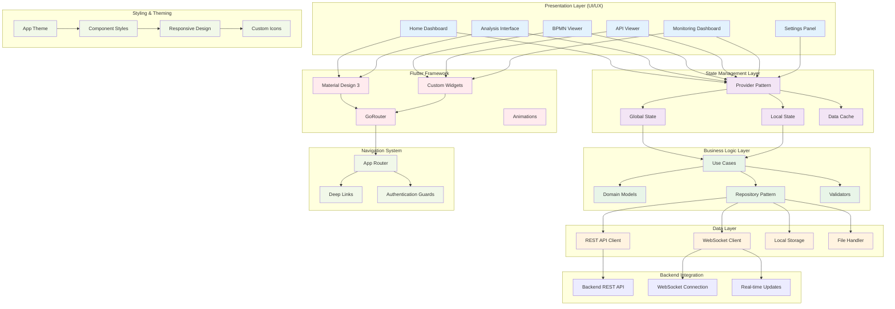

## Flutter Project Structure

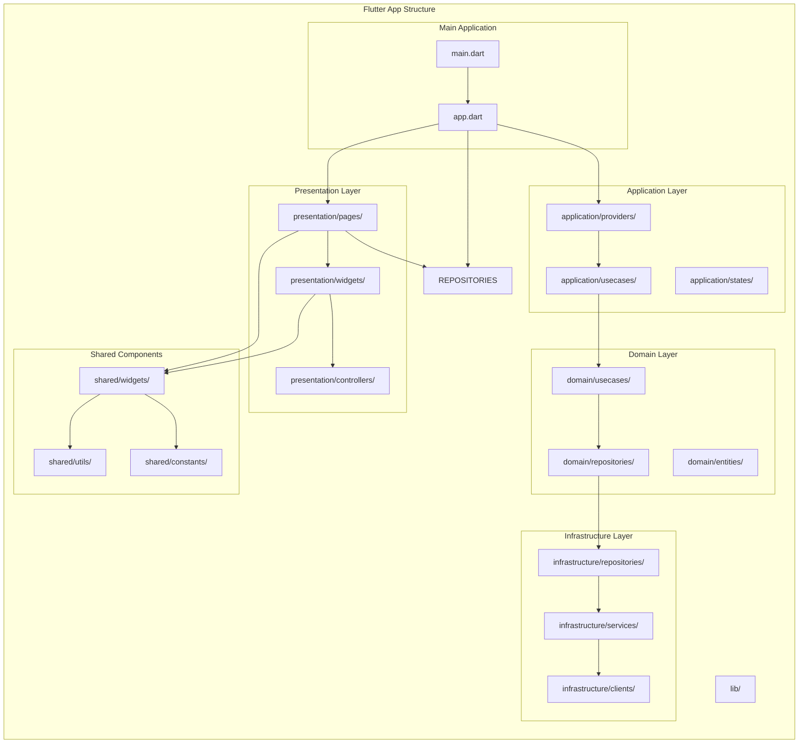

## State Management Architecture

### Provider Pattern Implementation

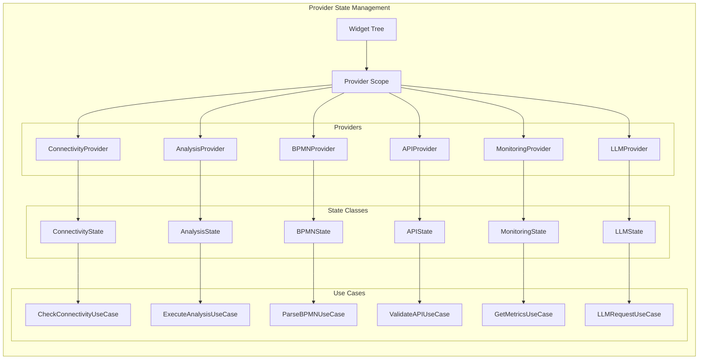

### State Management Flow

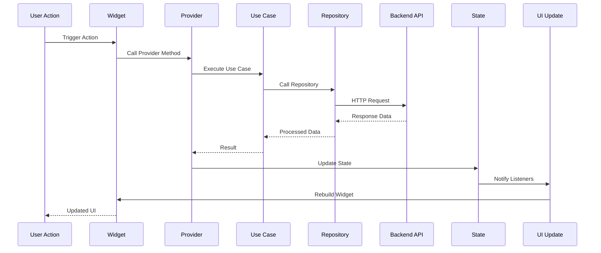

## Navigation & Routing Architecture

### GoRouter Implementation

```mermaid
graph LR
    subgraph "Routing Configuration"
        APP_ROUTER[AppRouter Class]
        ROUTES[Route Definitions]
        GUARDS[Route Guards]
        INTERCEPTORS[Interceptors]
    end
    
    subgraph "Route Definitions"
        HOME_ROUTE[/home]
        ANALYSIS_ROUTE[/analysis]
        BPMN_ROUTE[/bpmn/:id]
        API_ROUTE[/api/:id]
        MONITORING_ROUTE[/monitoring]
        LLM_ROUTE[/llm]
        SETTINGS_ROUTE[/settings]
    end
    
    subgraph "Authentication Flow"
        AUTH_CHECK[Authentication Check]
        TOKEN_VALIDATION[Token Validation]
        REDIRECT[Unauthorized Redirect]
    end
    
    subgraph "Deep Link Support"
        SCHEME[Custom Scheme]
        UNIVERSAL_LINKS[Universal Links]
        APP_LINKS[App Links]
    end
    
    APP_ROUTER --> ROUTES
    ROUTES --> GUARDS
    GUARDS --> INTERCEPTORS
    
    HOME_ROUTE --> AUTH_CHECK
    ANALYSIS_ROUTE --> AUTH_CHECK
    BPMN_ROUTE --> AUTH_CHECK
    API_ROUTE --> AUTH_CHECK
    MONITORING_ROUTE --> AUTH_CHECK
    LLM_ROUTE --> AUTH_CHECK
    
    AUTH_CHECK --> TOKEN_VALIDATION
    TOKEN_VALIDATION --> REDIRECT
    
    SCHEME --> UNIVERSAL_LINKS
    UNIVERSAL_LINKS --> APP_LINKS
    APP_LINKS --> ROUTES
```

## UI Component Architecture

### Component Hierarchy

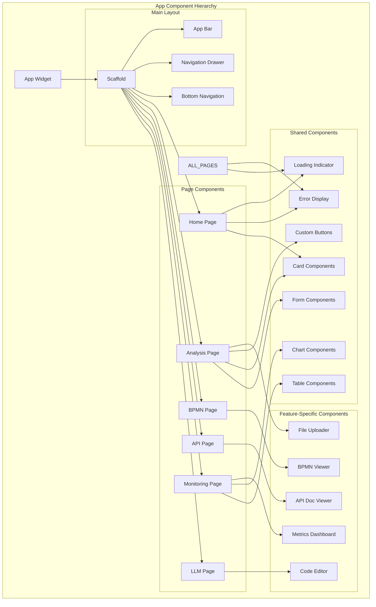

### Custom Widget Architecture

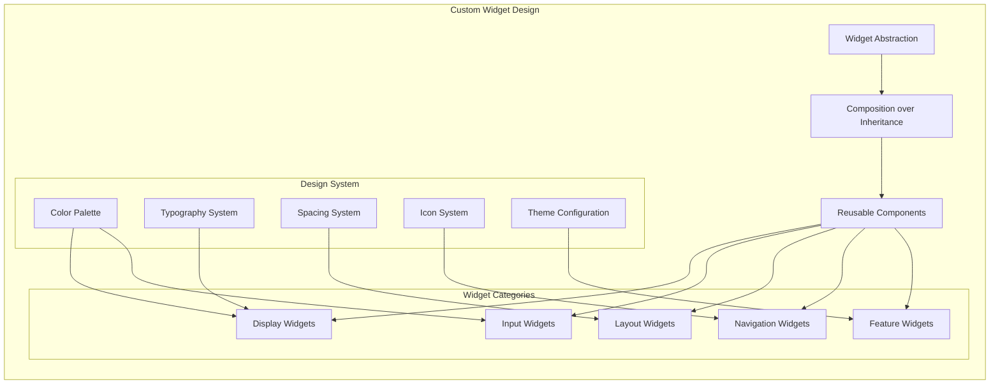

## Real-time Communication Architecture

### WebSocket Implementation

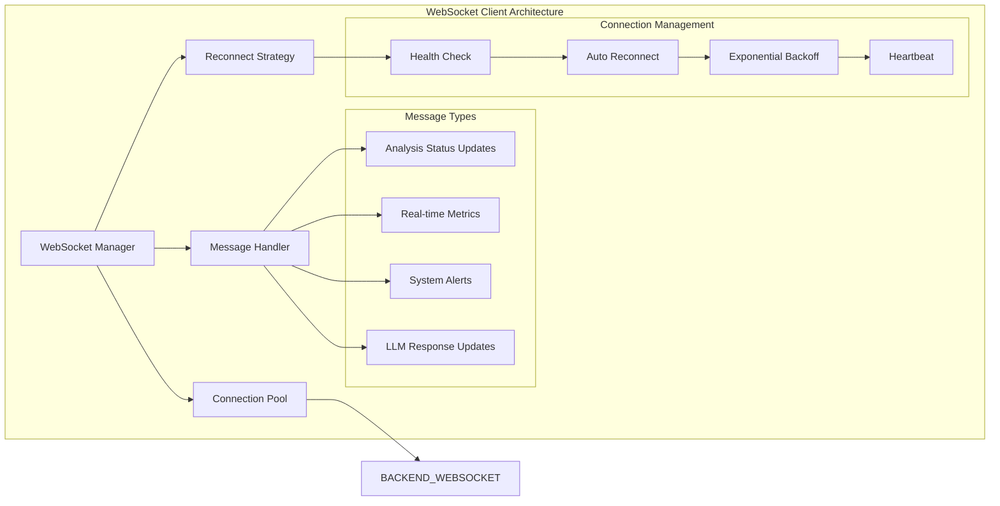

### Real-time Data Flow

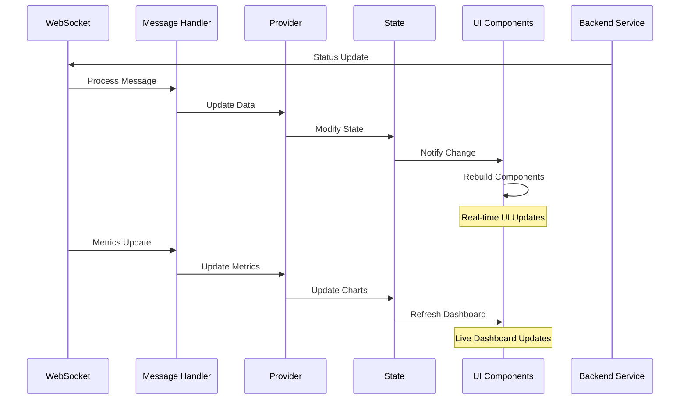

## Data Management Architecture

### Repository Pattern Implementation

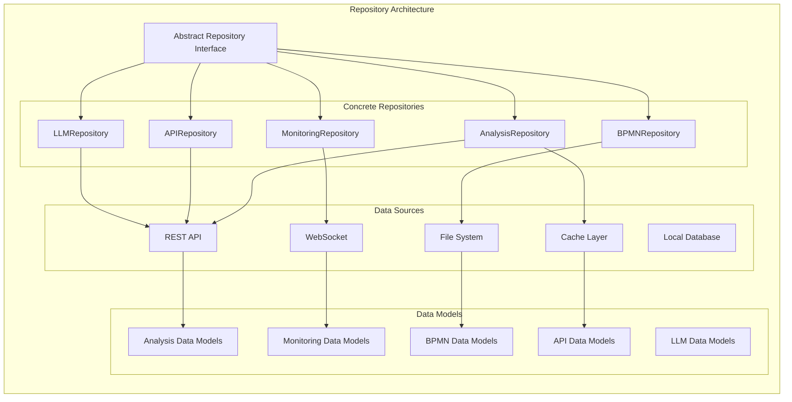

### Local Storage Strategy

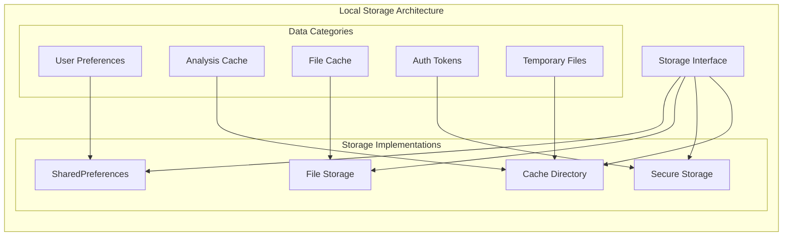

## Performance Optimization Architecture

### Caching Strategy

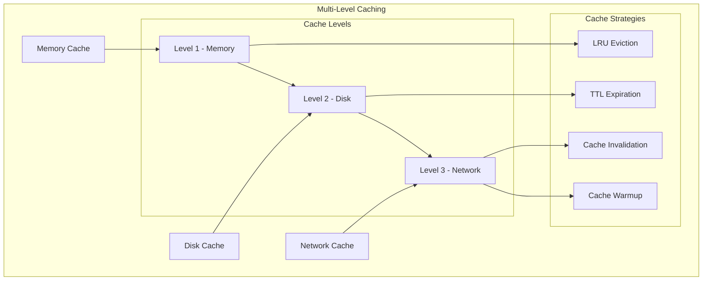

### Lazy Loading & Virtualization

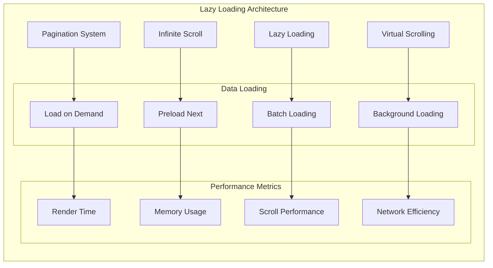

## Responsive Design Architecture

### Layout Adaptation Strategy

```mermaid
graph TB
    subgraph "Responsive Design System"
        BREAKPOINTS[Breakpoint System]
        
        subgraph "Device Categories"
            MOBILE[Mobile (< 768px)]
            TABLET[Tablet (768px - 1024px)]
            DESKTOP[Desktop (> 1024px)]
            LARGE_DESKTOP[Large Desktop (> 1440px)]
        end
        
        subgraph "Layout Adaptations"
            SINGLE_COLUMN[Single Column]
            TWO_COLUMN[Two Column]
            THREE_COLUMN[Three Column]
            GRID_LAYOUT[Grid Layout]
        end
        
        subgraph "Navigation Adaptations"
            BOTTOM_NAV[Bottom Navigation]
            DRAWER_NAV[Drawer Navigation]
            TOP_NAV[Top Navigation]
            SIDE_NAV[Side Navigation]
        end
        
        subgraph "Component Adaptations"
            COMPACT_MODE[Compact Mode]
            COMFORTABLE_MODE[Comfortable Mode]
            DETAILED_MODE[Detailed Mode]
        end
    end
    
    BREAKPOINTS --> MOBILE
    BREAKPOINTS --> TABLET
    BREAKPOINTS --> DESKTOP
    BREAKPOINTS --> LARGE_DESKTOP
    
    MOBILE --> SINGLE_COLUMN
    MOBILE --> BOTTOM_NAV
    MOBILE --> COMPACT_MODE
    
    TABLET --> TWO_COLUMN
    TABLET --> DRAWER_NAV
    TABLET --> COMFORTABLE_MODE
    
    DESKTOP --> THREE_COLUMN
    DESKTOP --> SIDE_NAV
    DESKTOP --> DETAILED_MODE
    
    LARGE_DESKTOP --> GRID_LAYOUT
    LARGE_DESKTOP --> TOP_NAV
    LARGE_DESKTOP --> DETAILED_MODE
```

## Theme & Styling Architecture

### Design System Implementation

```mermaid
graph LR
    subgraph "Design System"
        BASE_THEME[Base Theme]
        
        subgraph "Color System"
            PRIMARY[Primary Colors]
            SECONDARY[Secondary Colors]
            SURFACE[Surface Colors]
            ERROR[Error Colors]
            SUCCESS[Success Colors]
            WARNING[Warning Colors]
        end
        
        subgraph "Typography System"
            HEADINGS[Heading Styles]
            BODY[Body Text]
            CAPTION[Caption Text]
            CODE[Code Text]
        end
        
        subgraph "Component Library"
            BUTTONS[Button Components]
            INPUTS[Input Components]
            CARDS[Card Components]
            MODALS[Modal Components]
            NAVIGATION[Navigation Components]
        end
        
        subgraph "Spacing System"
            BASE_UNIT[Base Unit (8px)]
            SCALE[Spacing Scale]
            GRID[Grid System]
        end
    end
    
    BASE_THEME --> PRIMARY
    BASE_THEME --> SECONDARY
    BASE_THEME --> SURFACE
    BASE_THEME --> ERROR
    BASE_THEME --> SUCCESS
    BASE_THEME --> WARNING
    
    BASE_THEME --> HEADINGS
    BASE_THEME --> BODY
    BASE_THEME --> CAPTION
    BASE_THEME --> CODE
    
    PRIMARY --> BUTTONS
    SECONDARY --> INPUTS
    SURFACE --> CARDS
    ERROR --> MODALS
    
    BASE_UNIT --> SCALE
    SCALE --> GRID
    
    GRID --> BUTTONS
    GRID --> INPUTS
    GRID --> CARDS
```

## Security & Performance Considerations

### Frontend Security Architecture

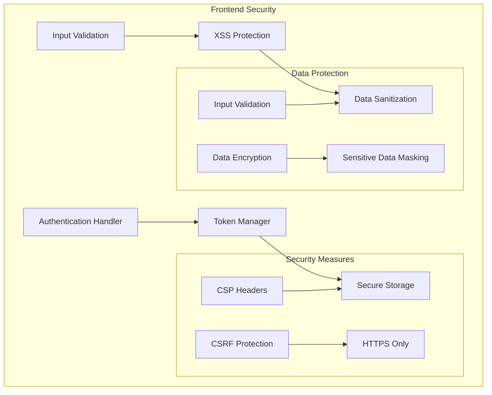

### Performance Monitoring

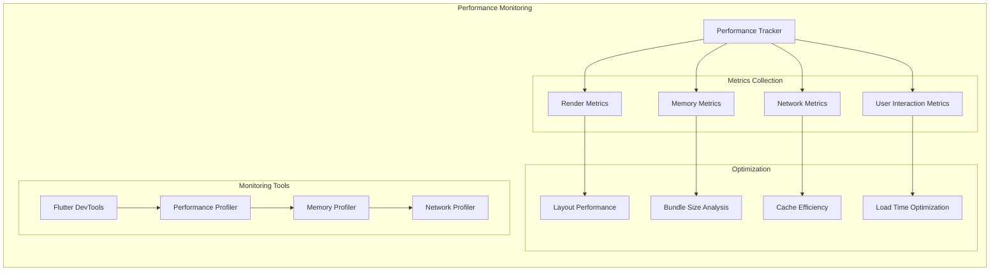

This frontend architecture provides a modern, scalable, and maintainable foundation for the Security Orchestrator web application, ensuring excellent user experience, performance, and security while supporting complex security testing workflows and real-time monitoring capabilities.