# Security Orchestrator - Integration Architecture

## Overview

The Security Orchestrator implements a comprehensive **enterprise integration architecture** designed to seamlessly connect with diverse enterprise systems, cloud services, and third-party applications. The architecture follows modern integration patterns including event-driven architecture, API-first design, and microservices communication to provide scalable, maintainable, and robust enterprise integrations.

## Integration Architecture Overview

```mermaid
graph TB
    %% Security Orchestrator Core
    subgraph "Security Orchestrator Core"
        ORCHESTRATOR[Security Orchestrator Platform]
        
        subgraph "Core Services"
            ANALYSIS_SERVICE[Analysis Service]
            BPMN_SERVICE[BPMN Service]
            API_SERVICE[API Service]
            LLM_SERVICE[LLM Service]
            MONITORING_SERVICE[Monitoring Service]
        end
        
        subgraph "Integration Layer"
            API_GATEWAY[API Gateway]
            MESSAGE_BROKER[Message Broker]
            DATA_CONNECTORS[Data Connectors]
            WEBHOOK_MANAGER[Webhook Manager]
        end
    end
    
    %% Enterprise Systems
    subgraph "Enterprise Systems"
        subgraph "ERP Systems"
            SAP[SAP S/4HANA]
            ORACLE_ERP[Oracle ERP]
            WORKDAY[Workday]
        end
        
        subgraph "CRM Systems"
            SALESFORCE[Salesforce]
            DYNAMICS[Microsoft Dynamics]
            HUBSPOT[HubSpot]
        end
        
        subgraph "ITSM Systems"
            SERVICENOW[ServiceNow]
            JIRA[Jira Service Desk]
            BMC[BMC Helix]
        end
        
        subgraph "Authentication Systems"
            ACTIVE_DIRECTORY[Active Directory]
            AZURE_AD[Azure Active Directory]
            OKTA[Okta]
            AUTH0[Auth0]
        end
    end
    
    %% Message Brokers & Event Streaming
    subgraph "Message Brokers & Event Streaming"
        KAFKA[Apache Kafka]
        RABBITMQ[RabbitMQ]
        AWS_SQS[AWS SQS/SNS]
        AZURE_SERVICE_BUS[Azure Service Bus]
    end
    
    %% Database Systems
    subgraph "Database Systems"
        ORACLE[Oracle Database]
        POSTGRESQL[PostgreSQL]
        SQL_SERVER[SQL Server]
        MYSQL[MySQL]
        MONGODB[MongoDB]
    end
    
    %% Cloud Providers
    subgraph "Cloud Providers"
        subgraph "AWS Services"
            S3[Amazon S3]
            LAMBDA[AWS Lambda]
            RDS[RDS]
            COGNITO[Cognito]
        end
        
        subgraph "Azure Services"
            BLOB_STORAGE[Azure Blob Storage]
            FUNCTIONS[Azure Functions]
            SQL_DATABASE[Azure SQL Database]
            B2C[Azure AD B2C]
        end
        
        subgraph "GCP Services"
            CLOUD_STORAGE[Cloud Storage]
            CLOUD_FUNCTIONS[Cloud Functions]
            CLOUD_SQL[Cloud SQL]
            IDENTITY[Cloud Identity]
        end
    end
    
    %% Third-party Services
    subgraph "Third-party Integrations"
        LLM_PROVIDERS[LLM Providers]
        MONITORING_TOOLS[Monitoring Tools]
        SECURITY_TOOLS[Security Tools]
        NOTIFICATION_SERVICES[Notification Services]
    end
    
    %% API Gateway connections
    ORCHESTRATOR --> API_GATEWAY
    ANALYSIS_SERVICE --> API_GATEWAY
    BPMN_SERVICE --> API_GATEWAY
    API_SERVICE --> API_GATEWAY
    LLM_SERVICE --> API_GATEWAY
    MONITORING_SERVICE --> API_GATEWAY
    
    %% Message Broker connections
    API_GATEWAY --> MESSAGE_BROKER
    MESSAGE_BROKER --> KAFKA
    MESSAGE_BROKER --> RABBITMQ
    MESSAGE_BROKER --> AWS_SQS
    MESSAGE_BROKER --> AZURE_SERVICE_BUS
    
    %% Data Connector connections
    API_GATEWAY --> DATA_CONNECTORS
    DATA_CONNECTORS --> SAP
    DATA_CONNECTORS --> SALESFORCE
    DATA_CONNECTORS --> SERVICENOW
    DATA_CONNECTORS --> ACTIVE_DIRECTORY
    
    %% Webhook Manager connections
    API_GATEWAY --> WEBHOOK_MANAGER
    WEBHOOK_MANAGER --> LLM_PROVIDERS
    WEBHOOK_MANAGER --> MONITORING_TOOLS
    WEBHOOK_MANAGER --> SECURITY_TOOLS
    WEBHOOK_MANAGER --> NOTIFICATION_SERVICES
    
    %% Database connections
    ANALYSIS_SERVICE --> ORACLE
    BPMN_SERVICE --> POSTGRESQL
    API_SERVICE --> SQL_SERVER
    MONITORING_SERVICE --> MYSQL
    LLM_SERVICE --> MONGODB
    
    %% Cloud provider connections
    API_GATEWAY --> S3
    API_GATEWAY --> BLOB_STORAGE
    API_GATEWAY --> CLOUD_STORAGE
    ANALYSIS_SERVICE --> LAMBDA
    BPMN_SERVICE --> FUNCTIONS
    API_SERVICE --> CLOUD_FUNCTIONS
    
    %% Styling
    classDef core fill:#e3f2fd
    classDef enterprise fill:#f3e5f5
    classDef broker fill:#e8f5e8
    classDef database fill:#fff3e0
    classDef cloud fill:#ffebee
    classDef thirdparty fill:#f1f8e9
    
    class ORCHESTRATOR,ANALYSIS_SERVICE,BPMN_SERVICE,API_SERVICE,LLM_SERVICE,MONITORING_SERVICE,API_GATEWAY,MESSAGE_BROKER,DATA_CONNECTORS,WEBHOOK_MANAGER core
    class SAP,ORACLE_ERP,WORKDAY,SALESFORCE,DYNAMICS,HUBSPOT,SERVICENOW,JIRA,BMC,ACTIVE_DIRECTORY,AZURE_AD,OKTA,AUTH0 enterprise
    class KAFKA,RABBITMQ,AWS_SQS,AZURE_SERVICE_BUS broker
    class ORACLE,POSTGRESQL,SQL_SERVER,MYSQL,MONGODB database
    class S3,LAMBDA,RDS,COGNITO,BLOB_STORAGE,FUNCTIONS,SQL_DATABASE,B2C,CLOUD_STORAGE,CLOUD_FUNCTIONS,CLOUD_SQL,IDENTITY cloud
    class LLM_PROVIDERS,MONITORING_TOOLS,SECURITY_TOOLS,NOTIFICATION_SERVICES thirdparty
```

## Enterprise Integration Patterns

### API-First Integration Strategy

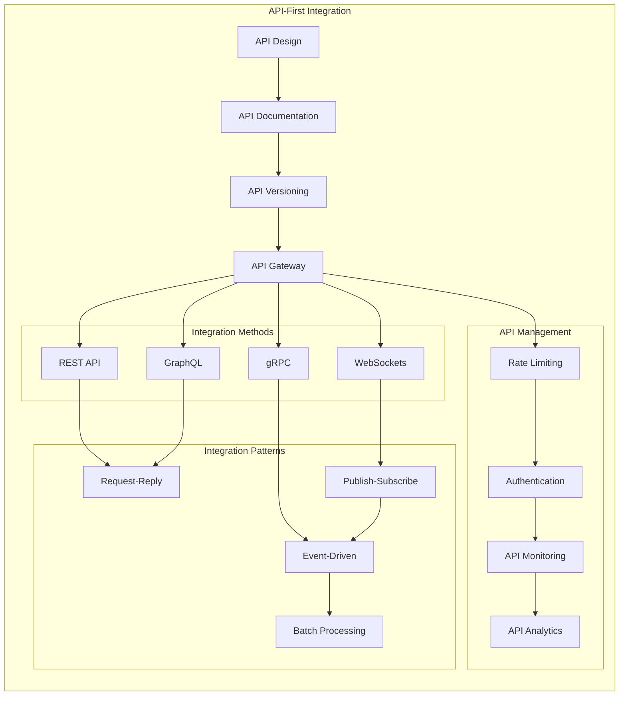

### Event-Driven Architecture

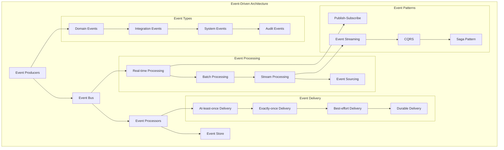

## Message Broker Integration

### Apache Kafka Integration

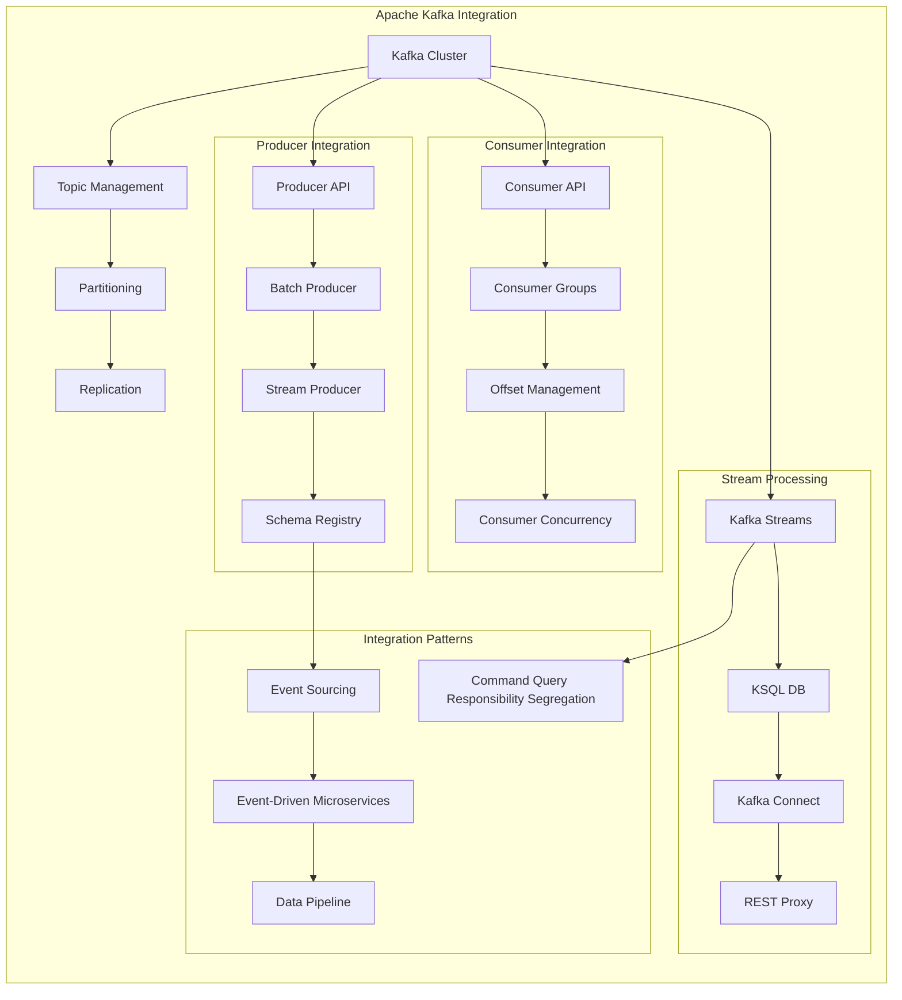

### RabbitMQ Integration

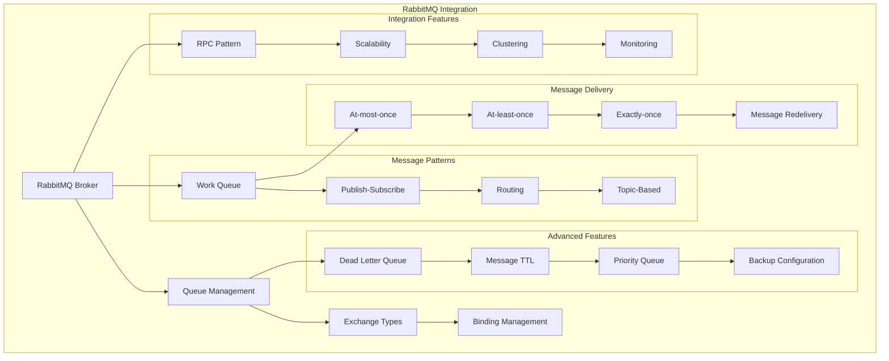

## Database Integration Architecture

### Multi-Database Integration

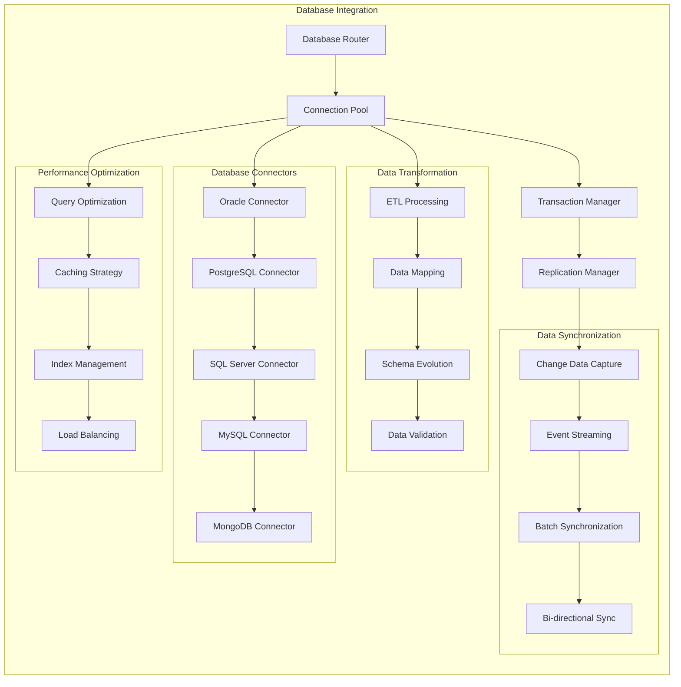

### Enterprise Database Connectors

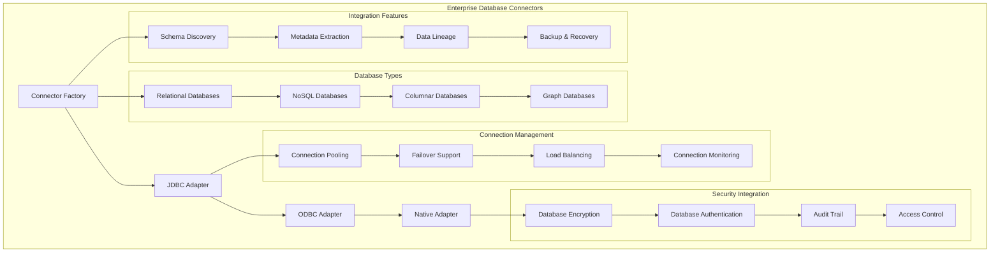

## Cloud Provider Integrations

### AWS Integration Architecture

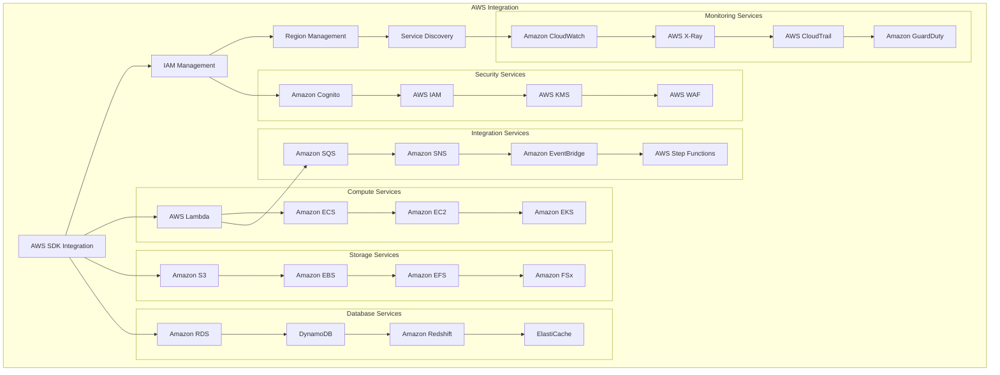

### Azure Integration Architecture

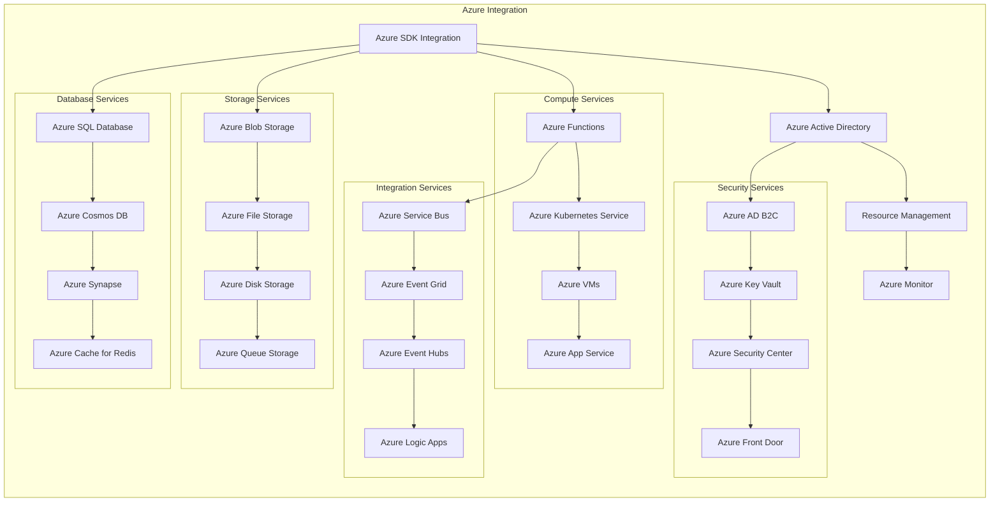

### GCP Integration Architecture

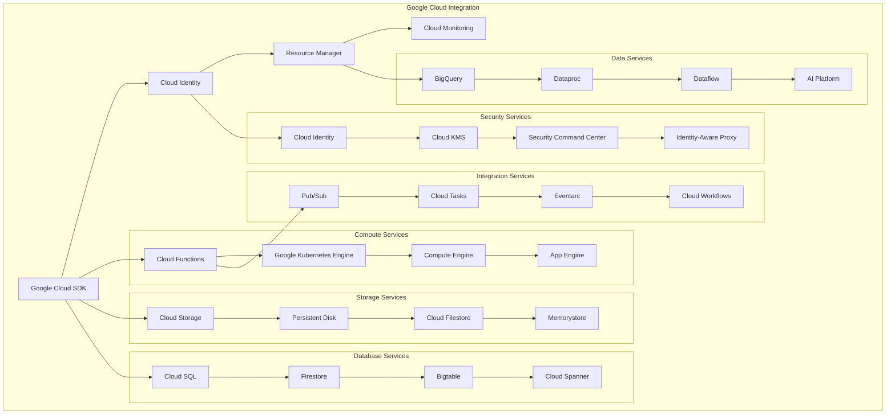

## Webhook Architecture

### Webhook Management System

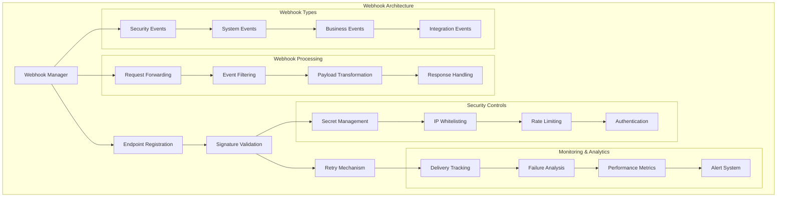

### Webhook Security & Authentication

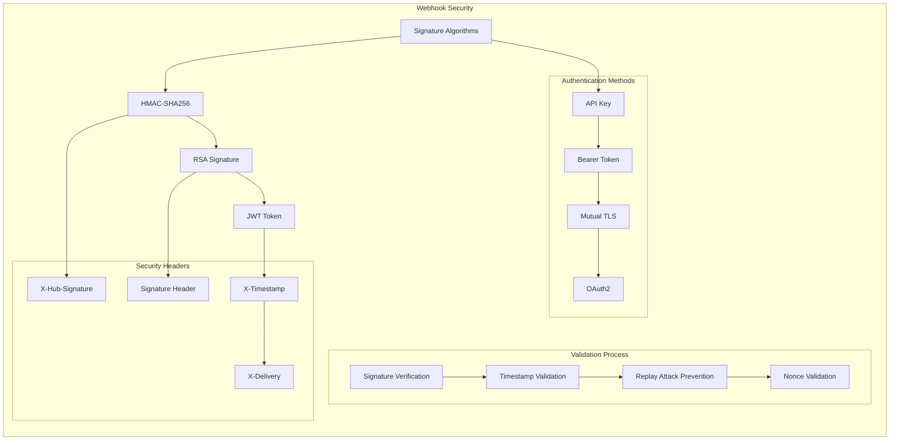

## API Integration Patterns

### REST API Integration

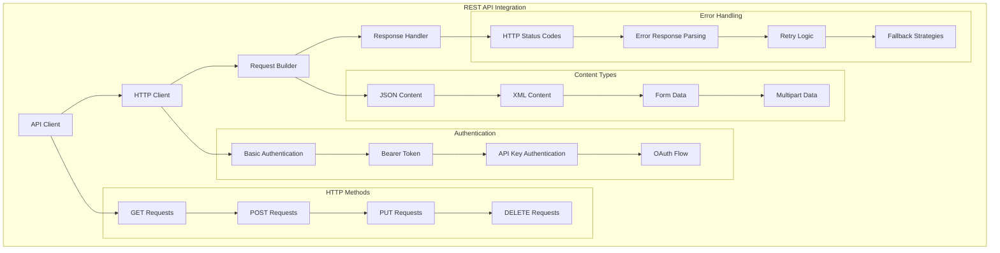

### GraphQL Integration

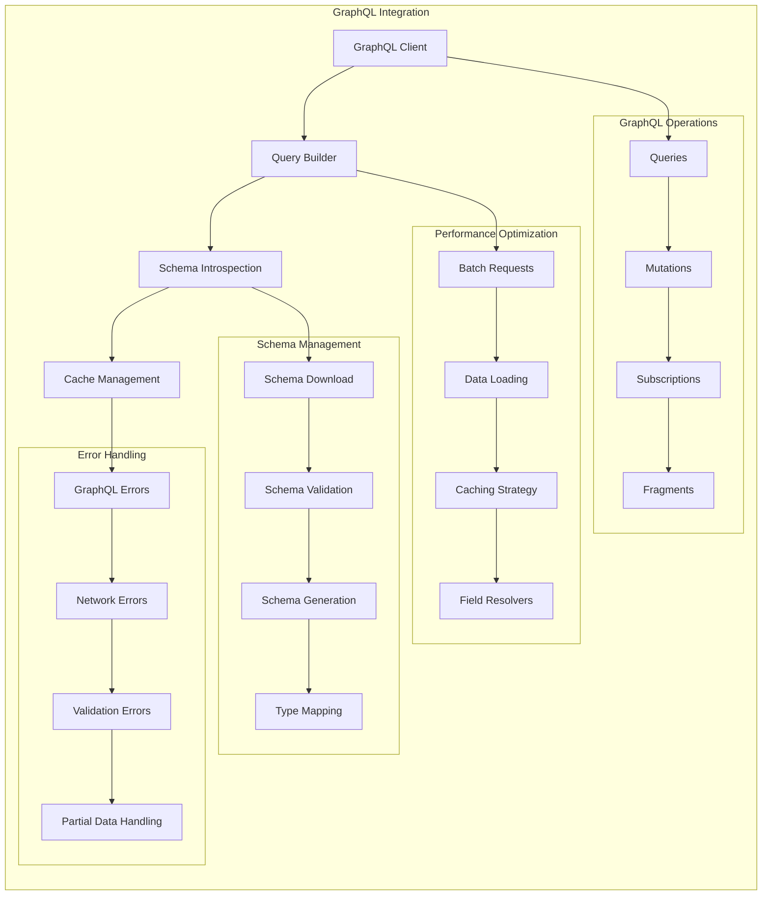

## Integration Monitoring & Analytics

### Integration Monitoring Architecture

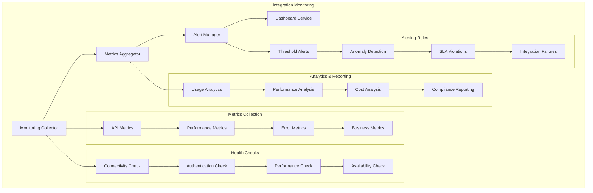

### Integration Performance Optimization

```mermaid
graph LR
    subgraph "Performance Optimization"
        PERFORMANCE_MONITOR[Performance Monitor]
        OPTIMIZATION_ENGINE[Optimization Engine]
        CACHE_MANAGER[Cache Manager]
        LOAD_BALANCER[Load Balancer]
        
        subgraph "Caching Strategies"
            MEMORY_CACHE[Memory Cache]
            DISTRIBUTED_CACHE[Distributed Cache]
            CDN_CACHE[CDN Cache]
            APPLICATION_CACHE[Application Cache]
        end
        
        subgraph "Connection Optimization"
            CONNECTION_POOLING[Connection Pooling]
            KEEP_ALIVE[Keep-Alive]
            COMPRESSION[Response Compression]
            BATCH_PROCESSING[Batch Processing]
        end
        
        subgraph "Request Optimization"
            REQUEST_BATCHING[Request Batching]
            ASYNC_PROCESSING[Async Processing]
            PAGINATION[Pagination]
            DATA_COMPRESSION[Data Compression]
        end
        
        subgraph "Load Management"
            AUTO_SCALING[Auto Scaling]
            TRAFFIC_ROUTING[Traffic Routing]
            FAILOVER[Failover]
            CIRCUIT_BREAKER[Circuit Breaker]
        end
    end
    
    PERFORMANCE_MONITOR --> OPTIMIZATION_ENGINE
    OPTIMIZATION_ENGINE --> CACHE_MANAGER
    CACHE_MANAGER --> LOAD_BALANCER
    
    MEMORY_CACHE --> DISTRIBUTED_CACHE
    DISTRIBUTED_CACHE --> CDN_CACHE
    CDN_CACHE --> APPLICATION_CACHE
    
    CONNECTION_POOLING --> KEEP_ALIVE
    KEEP_ALIVE --> COMPRESSION
    COMPRESSION --> BATCH_PROCESSING
    
    REQUEST_BATCHING --> ASYNC_PROCESSING
    ASYNC_PROCESSING --> PAGINATION
    PAGINATION --> DATA_COMPRESSION
    
    AUTO_SCALING --> TRAFFIC_ROUTING
    TRAFFIC_ROUTING --> FAILOVER
    FAILOVER --> CIRCUIT_BREAKER
```

This comprehensive integration architecture provides the Security Orchestrator with robust, scalable, and secure enterprise integration capabilities, supporting diverse systems and providing seamless connectivity while maintaining high performance and reliability standards.