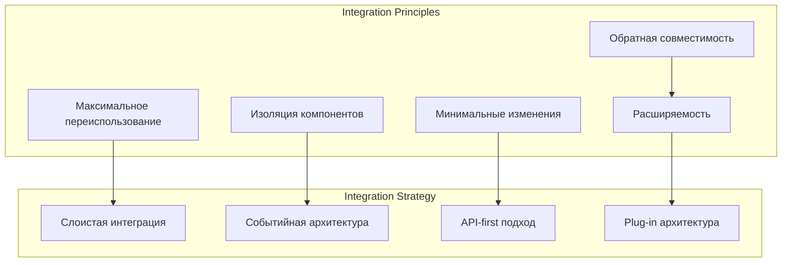
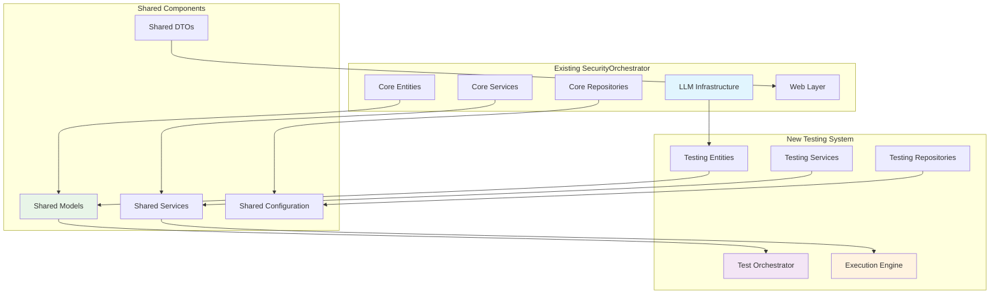
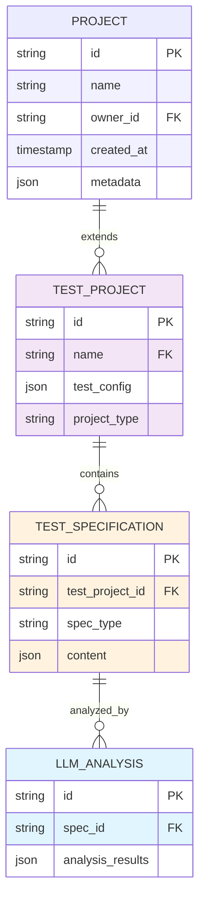

# Руководство по интеграции системы автоматического тестирования

## 1. Обзор интеграции

### 1.1 Цели интеграции

Интеграция системы автоматического тестирования с существующей архитектурой SecurityOrchestrator направлена на:

- **Максимальное переиспользование** существующих компонентов
- **Минимальные изменения** в текущей архитектуре
- **Сохранение** существующей функциональности
- **Плавное внедрение** новых возможностей
- **Совместимость** с текущими API и интерфейсами

### 1.2 Принципы интеграции



## 2. Анализ существующих компонентов

### 2.1 LLM Infrastructure (для переиспользования)

**Существующие компоненты:**
```java
// Используем существующую LLM инфраструктуру
@Component
public class TestingLLMIntegration {
    
    @Autowired
    private OpenRouterClient openRouterClient;
    
    @Autowired
    private LocalLLMService localLLMService;
    
    @Autowired
    private LLMConfig llmConfig;
    
    public CompletableFuture<SecurityAnalysisResult> analyzeApiSecurity(
            OpenApiSpec spec) {
        // Используем существующие LLM сервисы
        String prompt = buildSecurityAnalysisPrompt(spec);
        
        ChatCompletionRequest request = ChatCompletionRequest.builder()
            .model("anthropic/claude-3-haiku")
            .messages(List.of(new ChatMessage("user", prompt)))
            .maxTokens(2000)
            .temperature(0.1)
            .build();
        
        return openRouterClient.createChatCompletion(request)
            .thenApply(this::parseSecurityAnalysis);
    }
}
```

**Преимущества интеграции:**
- ✅ Уже реализованные OpenRouter и Ollama клиенты
- ✅ Конфигурация и настройки LLM
- ✅ Мониторинг производительности
- ✅ Кэширование результатов
- ✅ Обработка ошибок

### 2.2 Domain Models (для расширения)

**Существующие модели для расширения:**
```java
// Расширяем существующие доменные модели
@Entity
public class TestProject extends Project { // Наследуем от существующего Project
    @OneToMany(mappedBy = "testProject", cascade = CascadeType.ALL)
    private List<TestSpecification> specifications = new ArrayList<>();
    
    @OneToMany(mappedBy = "testProject", cascade = CascadeType.ALL)
    private List<TestScenario> scenarios = new ArrayList<>();
    
    @Enumerated(EnumType.STRING)
    private TestProjectType type = TestProjectType.API_TESTING;
    
    // Используем существующие методы из Project
    public void addSpecification(TestSpecification spec) {
        specifications.add(spec);
        spec.setTestProject(this);
    }
}
```

### 2.3 Repository Infrastructure (для повторного использования)

```java
// Используем существующую инфраструктуру репозиториев
@Repository
public class JpaTestProjectRepository extends JpaRepository<TestProject, Long> 
        implements TestProjectRepository {
    
    // Наследуем от существующего JpaRepository
    // Используем существующие паттерны
    
    public List<TestProject> findByStatus(TestProjectStatus status) {
        return findByStatusAndType(status, TestProjectType.API_TESTING);
    }
    
    public List<TestProject> findByUserAndStatus(User user, TestProjectStatus status) {
        return findByOwnerAndStatusAndType(user, status, TestProjectType.API_TESTING);
    }
}
```

## 3. Схема интеграции архитектуры

### 3.1 Интеграция на уровне архитектуры



### 3.2 Интеграция на уровне данных



## 4. Пошаговая интеграция

### 4.1 Фаза 1: Подготовка существующей системы

#### 1.1 Расширение конфигурации

```java
@Configuration
@EnableJpaRepositories
public class TestingConfiguration {
    
    @Bean
    public TestProjectRepository testProjectRepository(
            EntityManager entityManager) {
        return new JpaTestProjectRepository(entityManager);
    }
    
    @Bean
    public TestOrchestrator testOrchestrator(
            LLMService llmService,
            TestProjectRepository projectRepository,
            TestExecutionService executionService) {
        return new TestOrchestratorImpl(
            llmService,
            projectRepository,
            executionService
        );
    }
}
```

#### 1.2 Обновление application.properties

```properties
# Existing SecurityOrchestrator properties
spring.datasource.url=jdbc:h2:mem:testdb
spring.datasource.username=sa
spring.datasource.password=

# LLM Configuration (existing)
llm.openRouterApiKey=${OPENROUTER_API_KEY:}
llm.localServerUrl=http://localhost:11434

# New Testing System properties
securityorchestrator.testing.enabled=true
securityorchestrator.testing.owasp.enabled=true
securityorchestrator.testing.bpmn.enabled=true
securityorchestrator.testing.websocket.enabled=true
securityorchestrator.testing.execution.parallel-workers=5
securityorchestrator.testing.execution.timeout-seconds=300
```

#### 1.3 Добавление модуля в build.gradle

```kotlin
// Existing modules
implementation(project(":core"))
implementation(project(":security"))

// New testing module
implementation(project(":testing"))

dependencies {
    // OpenAPI parsing
    implementation("io.swagger.parser.v3:swagger-parser:2.1.22")
    
    // BPMN processing
    implementation("org.camunda.bpm:camunda-bpmn-model:7.21.0")
    
    // WebSocket for real-time updates
    implementation("org.springframework.boot:spring-boot-starter-websocket")
    implementation("org.springframework:spring-messaging")
    
    // HTTP testing
    testImplementation("io.rest-assured:rest-assured:5.3.2")
}
```

### 4.2 Фаза 2: Интеграция сервисов

#### 2.1 Создание bridge сервисов

```java
@Service
public class TestingBridgeService {
    
    private final TestOrchestrator testOrchestrator;
    private final ExistingProjectService existingProjectService;
    private final LLMAnalysisService llmAnalysisService;
    
    public TestingBridgeService(
            TestOrchestrator testOrchestrator,
            ExistingProjectService existingProjectService,
            LLMAnalysisService llmAnalysisService) {
        this.testOrchestrator = testOrchestrator;
        this.existingProjectService = existingProjectService;
        this.llmAnalysisService = llmAnalysisService;
    }
    
    @Async("integrationExecutor")
    public CompletableFuture<IntegrationResult> integrateTestSystem(
            String projectId, 
            TestIntegrationRequest request) {
        
        return CompletableFuture.supplyAsync(() -> {
            try {
                // 1. Создание тестового проекта на основе существующего
                TestProject testProject = createTestProject(projectId, request);
                
                // 2. Анализ спецификаций с помощью существующей LLM
                List<LLMAnalysisResult> analyses = analyzeSpecifications(request);
                
                // 3. Генерация тестов
                List<TestScenario> scenarios = generateTests(testProject, analyses);
                
                // 4. Интеграция результатов
                return IntegrationResult.success(testProject, scenarios, analyses);
                
            } catch (Exception e) {
                log.error("Integration failed for project: {}", projectId, e);
                return IntegrationResult.error(e.getMessage());
            }
        });
    }
    
    private TestProject createTestProject(String projectId, TestIntegrationRequest request) {
        // Используем существующую сущность Project как базу
        Project existingProject = existingProjectService.findById(projectId);
        
        TestProject testProject = TestProject.builder()
            .name("Test Suite for " + existingProject.getName())
            .baseProject(existingProject)
            .type(request.getTestType())
            .configuration(request.getConfiguration())
            .build();
            
        return testProjectRepository.save(testProject);
    }
}
```

#### 2.2 Интеграция с существующими контроллерами

```java
@RestController
@RequestMapping("/api/v1/integration")
public class IntegrationController {
    
    private final TestingBridgeService bridgeService;
    private final ExistingProjectService existingProjectService;
    
    @PostMapping("/test-system")
    public CompletableFuture<ResponseEntity<ApiResponse<IntegrationResult>>> integrateTestingSystem(
            @Valid @RequestBody TestIntegrationRequest request) {
        
        return bridgeService.integrateTestSystem(
            request.getProjectId(), 
            request
        ).thenApply(result -> {
            if (result.isSuccess()) {
                return ResponseEntity.ok(
                    ApiResponse.success("Testing system integrated successfully", result)
                );
            } else {
                return ResponseEntity.badRequest().body(
                    ApiResponse.error("Integration failed: " + result.getErrorMessage())
                );
            }
        });
    }
    
    @GetMapping("/projects/{id}/test-suite")
    public ResponseEntity<ApiResponse<TestProject>> getTestSuite(@PathVariable String id) {
        TestProject testProject = testProjectRepository.findByBaseProjectId(id);
        
        if (testProject != null) {
            return ResponseEntity.ok(ApiResponse.success(testProject));
        } else {
            return ResponseEntity.notFound().build();
        }
    }
}
```

### 4.3 Фаза 3: Интеграция пользовательского интерфейса

#### 3.1 Расширение существующего Frontend

```dart
// Расширяем существующий Flutter frontend
class SecurityOrchestratorApp extends StatelessWidget {
  @override
  Widget build(BuildContext context) {
    return MaterialApp(
      title: 'SecurityOrchestrator',
      theme: AppTheme.currentTheme,
      routes: {
        // Existing routes
        '/': (context) => MainDashboard(),
        '/projects': (context) => ProjectsListScreen(),
        '/project/:id': (context) => ProjectDetailScreen(),
        
        // New testing routes
        '/testing/create': (context) => TestCreationWizard(),
        '/testing/project/:id': (context) => TestingDashboard(),
        '/testing/execution/:id': (context) => ExecutionMonitor(),
        '/testing/results/:id': (context) => ResultsDashboard(),
      },
    );
  }
}

// Добавляем TestingProvider к существующему state management
class TestingProvider extends StateNotifier<TestingState> {
  final TestingService _testingService;
  final WebSocketService _webSocketService;
  
  TestingProvider(this._testingService, this._webSocketService) 
      : super(TestingState.initial()) {
    _initializeWebSocket();
  }
  
  void _initializeWebSocket() {
    _webSocketService.onTestExecutionUpdate((update) {
      state = state.updateExecution(update);
    });
  }
}
```

#### 3.2 Добавление testing разделов в существующее меню

```dart
// Расширяем существующее навигационное меню
class MainNavigation extends StatelessWidget {
  @override
  Widget build(BuildContext context) {
    return Drawer(
      child: ListView(
        children: [
          // Existing navigation items
          ListTile(
            leading: Icon(Icons.dashboard),
            title: Text('Dashboard'),
            onTap: () => Navigator.pushNamed(context, '/'),
          ),
          ListTile(
            leading: Icon(Icons.folder),
            title: Text('Projects'),
            onTap: () => Navigator.pushNamed(context, '/projects'),
          ),
          
          Divider(),
          
          // New testing section
          DrawerHeader(
            child: Text('Testing', style: Theme.of(context).textTheme.titleLarge),
            decoration: BoxDecoration(color: Theme.of(context).primaryColor),
          ),
          ListTile(
            leading: Icon(Icons.play_circle_outline),
            title: Text('Create Tests'),
            onTap: () => Navigator.pushNamed(context, '/testing/create'),
          ),
          ListTile(
            leading: Icon(Icons.analytics),
            title: Text('Testing Dashboard'),
            onTap: () => Navigator.pushNamed(context, '/testing/dashboard'),
          ),
          ListTile(
            leading: Icon(Icons.bug_report),
            title: Text('Security Scans'),
            onTap: () => Navigator.pushNamed(context, '/testing/security'),
          ),
        ],
      ),
    );
  }
}
```

## 5. Миграция данных

### 5.1 Скрипт миграции схемы БД

```sql
-- Создание новых таблиц для тестирования
CREATE TABLE test_projects (
    id VARCHAR(255) PRIMARY KEY,
    base_project_id VARCHAR(255),
    name VARCHAR(500) NOT NULL,
    project_type VARCHAR(50) NOT NULL,
    configuration JSON,
    status VARCHAR(50) DEFAULT 'ACTIVE',
    created_at TIMESTAMP DEFAULT CURRENT_TIMESTAMP,
    updated_at TIMESTAMP DEFAULT CURRENT_TIMESTAMP,
    FOREIGN KEY (base_project_id) REFERENCES projects(id)
);

CREATE TABLE test_specifications (
    id VARCHAR(255) PRIMARY KEY,
    test_project_id VARCHAR(255) NOT NULL,
    specification_type VARCHAR(20) NOT NULL,
    file_name VARCHAR(255),
    file_content TEXT NOT NULL,
    metadata JSON,
    analysis_status VARCHAR(50) DEFAULT 'PENDING',
    created_at TIMESTAMP DEFAULT CURRENT_TIMESTAMP,
    FOREIGN KEY (test_project_id) REFERENCES test_projects(id)
);

CREATE TABLE test_scenarios (
    id VARCHAR(255) PRIMARY KEY,
    test_project_id VARCHAR(255) NOT NULL,
    name VARCHAR(500) NOT NULL,
    description TEXT,
    owasp_categories JSON,
    priority VARCHAR(20) DEFAULT 'MEDIUM',
    execution_config JSON,
    is_automated BOOLEAN DEFAULT false,
    created_at TIMESTAMP DEFAULT CURRENT_TIMESTAMP,
    FOREIGN KEY (test_project_id) REFERENCES test_projects(id)
);

CREATE TABLE test_executions (
    id VARCHAR(255) PRIMARY KEY,
    scenario_id VARCHAR(255) NOT NULL,
    execution_id VARCHAR(255) UNIQUE NOT NULL,
    status VARCHAR(50) DEFAULT 'PENDING',
    execution_type VARCHAR(50) DEFAULT 'MANUAL',
    initiated_by VARCHAR(255),
    environment JSON,
    execution_context JSON,
    performance_metrics JSON,
    started_at TIMESTAMP,
    completed_at TIMESTAMP,
    total_duration_ms BIGINT,
    created_at TIMESTAMP DEFAULT CURRENT_TIMESTAMP,
    FOREIGN KEY (scenario_id) REFERENCES test_scenarios(id)
);

-- Создание индексов
CREATE INDEX idx_test_projects_base ON test_projects(base_project_id);
CREATE INDEX idx_test_specifications_project ON test_specifications(test_project_id);
CREATE INDEX idx_test_scenarios_project ON test_scenarios(test_project_id);
CREATE INDEX idx_test_executions_scenario ON test_executions(scenario_id);
```

### 5.2 Миграция конфигурации

```java
@Configuration
public class DataMigrationConfig {
    
    @Bean
    public DataMigrationService dataMigrationService() {
        return new DataMigrationService(
            testProjectRepository,
            existingProjectRepository,
            testSpecificationRepository
        );
    }
    
    @PostConstruct
    public void runMigration() {
        dataMigrationService.migrateExistingProjects();
    }
}

@Component
public class DataMigrationService {
    
    public void migrateExistingProjects() {
        List<Project> projects = existingProjectRepository.findAll();
        
        for (Project project : projects) {
            if (!testProjectRepository.existsByBaseProjectId(project.getId())) {
                TestProject testProject = createTestProjectFromProject(project);
                testProjectRepository.save(testProject);
                log.info("Migrated project: {} to test project: {}", 
                    project.getId(), testProject.getId());
            }
        }
    }
}
```

## 6. Тестирование интеграции

### 6.1 Интеграционные тесты

```java
@SpringBootTest
@TestPropertySource(properties = {
    "securityorchestrator.testing.enabled=true",
    "spring.jpa.hibernate.ddl-auto=create-drop"
})
@TestMethodOrder(OrderAnnotation.class)
public class TestingIntegrationTest {
    
    @Autowired
    private TestingBridgeService bridgeService;
    
    @Autowired
    private ExistingProjectService existingProjectService;
    
    @Autowired
    private TestProjectRepository testProjectRepository;
    
    @Test
    @Order(1)
    public void testCreateTestProjectFromExistingProject() {
        // Создаем существующий проект
        Project project = Project.builder()
            .name("Test API Project")
            .description("Test project for integration")
            .build();
        project = existingProjectRepository.save(project);
        
        // Создаем тестовый проект
        TestProject testProject = TestProject.builder()
            .name("Test Suite for " + project.getName())
            .baseProject(project)
            .type(TestProjectType.API_TESTING)
            .configuration(TestConfiguration.defaultConfig())
            .build();
        testProject = testProjectRepository.save(testProject);
        
        // Проверяем
        assertThat(testProject).isNotNull();
        assertThat(testProject.getBaseProject()).isEqualTo(project);
        assertThat(testProject.getType()).isEqualTo(TestProjectType.API_TESTING);
    }
    
    @Test
    @Order(2)
    public void testLLMIntegration() throws Exception {
        // Готовим OpenAPI спецификацию
        String openApiSpec = """
            openapi: 3.0.0
            info:
              title: Test API
              version: 1.0.0
            paths:
              /users:
                get:
                  summary: Get users
                  responses:
                    '200':
                      description: Success
            """;
        
        TestSpecification spec = TestSpecification.builder()
            .specificationType(SpecificationType.OPENAPI)
            .fileContent(openApiSpec)
            .build();
        
        // Анализируем с помощью LLM
        CompletableFuture<LLMAnalysisResult> analysis = llmAnalysisService.analyzeSpecification(spec);
        
        // Ждем результата
        LLMAnalysisResult result = analysis.get(30, TimeUnit.SECONDS);
        
        // Проверяем
        assertThat(result).isNotNull();
        assertThat(result.getFindings()).isNotEmpty();
    }
    
    @Test
    @Order(3)
    public void testEndToEndWorkflow() throws Exception {
        TestIntegrationRequest request = TestIntegrationRequest.builder()
            .projectId("test-project-1")
            .testType(TestProjectType.API_TESTING)
            .addSpecification(SpecificationType.OPENAPI, "openapi.yaml")
            .addSpecification(SpecificationType.BPMN, "process.bpmn")
            .build();
        
        CompletableFuture<IntegrationResult> result = bridgeService.integrateTestSystem(
            request.getProjectId(), 
            request
        );
        
        IntegrationResult integrationResult = result.get(60, TimeUnit.SECONDS);
        
        assertThat(integrationResult.isSuccess()).isTrue();
        assertThat(integrationResult.getTestProject()).isNotNull();
        assertThat(integrationResult.getTestScenarios()).isNotEmpty();
    }
}
```

## 7. Мониторинг интеграции

### 7.1 Health Checks для новых компонентов

```java
@Component
public class TestingSystemHealthIndicator implements HealthIndicator {
    
    @Autowired
    private TestOrchestrator testOrchestrator;
    
    @Autowired
    private TestExecutionService executionService;
    
    @Autowired
    private LLMAnalysisService llmAnalysisService;
    
    @Override
    public Health health() {
        Health.Builder builder = Health.up();
        
        try {
            // Проверка оркестратора тестов
            boolean orchestratorHealthy = testOrchestrator.isHealthy();
            builder.withDetail("test-orchestrator", orchestratorHealthy ? "UP" : "DOWN");
            
            // Проверка движка выполнения
            boolean executionEngineHealthy = executionService.isHealthy();
            builder.withDetail("execution-engine", executionEngineHealthy ? "UP" : "DOWN");
            
            // Проверка LLM анализа
            boolean llmAnalysisHealthy = llmAnalysisService.isHealthy();
            builder.withDetail("llm-analysis", llmAnalysisHealthy ? "UP" : "DOWN");
            
            // Общий статус
            if (orchestratorHealthy && executionEngineHealthy && llmAnalysisHealthy) {
                builder.up();
            } else {
                builder.down();
            }
            
        } catch (Exception e) {
            builder.down()
                .withDetail("error", e.getMessage());
        }
        
        return builder.build();
    }
}
```

### 7.2 Метрики интеграции

```java
@Component
public class TestingMetricsCollector {
    
    private final Counter totalTestProjects;
    private final Counter activeExecutions;
    private final Timer analysisDuration;
    private final Timer testExecutionDuration;
    
    public TestingMetricsCollector(MeterRegistry meterRegistry) {
        this.totalTestProjects = Counter.builder("testing.projects.total")
            .description("Total number of test projects")
            .register(meterRegistry);
            
        this.activeExecutions = Counter.builder("testing.executions.active")
            .description("Number of active test executions")
            .register(meterRegistry);
            
        this.analysisDuration = Timer.builder("testing.analysis.duration")
            .description("Time taken for LLM analysis")
            .register(meterRegistry);
            
        this.testExecutionDuration = Timer.builder("testing.execution.duration")
            .description("Time taken for test execution")
            .register(meterRegistry);
    }
    
    public void incrementTestProjects() {
        totalTestProjects.increment();
    }
    
    public void recordAnalysisDuration(Duration duration) {
        analysisDuration.record(duration);
    }
    
    public void recordExecutionDuration(Duration duration) {
        testExecutionDuration.record(duration);
    }
}
```

## 8. Обратная совместимость

### 8.1 Сохранение существующих API

```java
// Сохраняем существующие API endpoints
@RestController
@RequestMapping("/api/v1")
public class ExistingProjectController {
    
    // Существующие endpoints остаются без изменений
    @GetMapping("/projects")
    public List<Project> getAllProjects() {
        return projectService.findAll();
    }
    
    // Добавляем новые endpoints для тестирования
    @GetMapping("/projects/{id}/test-suite")
    public TestProject getTestSuite(@PathVariable String id) {
        return testProjectService.getByBaseProjectId(id);
    }
    
    @PostMapping("/projects/{id}/create-tests")
    public CompletableFuture<ResponseEntity<ApiResponse<IntegrationResult>>> createTests(
            @PathVariable String id,
            @RequestBody TestCreationRequest request) {
        // Логика создания тестов
    }
}
```

### 8.2 Миграция пользователей

```java
@Service
public class UserMigrationService {
    
    public void migrateUserToTesting(Project owner, String newRole) {
        // Если пользователь не имеет прав на тестирование, добавляем их
        if (!owner.getRoles().contains("TESTING_USER")) {
            owner.getRoles().add("TESTING_USER");
            projectRepository.save(owner);
            
            // Уведомляем пользователя
            notificationService.notifyUser(
                owner.getEmail(),
                "You have been granted access to the new Testing System"
            );
        }
    }
}
```

## 9. План развертывания

### 9.1 Поэтапное развертывание

```mermaid
graph LR
    subgraph "Phase 1: Infrastructure"
        P1A[Deploy database schema]
        P1B[Configure LLM integration]
        P1C[Setup testing services]
    end
    
    subgraph "Phase 2: Core Services"
        P2A[Deploy test orchestrator]
        P2B[Deploy execution engine]
        P2C[Deploy analysis services]
    end
    
    subgraph "Phase 3: User Interface"
        P3A[Deploy testing frontend]
        P3B[Configure WebSocket]
        P3C[Setup real-time updates]
    end
    
    subgraph "Phase 4: Integration"
        P4A[Migrate existing projects]
        P4B[Test integration]
        P4C[Enable features]
    end
    
    P1A --> P1B
    P1B --> P1C
    P1C --> P2A
    P2A --> P2B
    P2B --> P2C
    P2C --> P3A
    P3A --> P3B
    P3B --> P3C
    P3C --> P4A
    P4A --> P4B
    P4B --> P4C
```



### 9.2 Rollback план

```java
@Configuration
public class RollbackConfiguration {
    
    @EventListener
    public void handleDeploymentError(DeploymentErrorEvent event) {
        if (event.isTestingSystemError()) {
            log.error("Testing system deployment error, initiating rollback");
            initiateRollback();
        }
    }
    
    @ConditionalOnProperty(name = "securityorchestrator.testing.rollback.enabled", havingValue = "true")
    public void initiateRollback() {
        try {
            // 1. Отключаем новые features
            featureToggleService.disable("testing-system");
            
            // 2. Восстанавливаем старые endpoints
            endpointService.restoreOriginalEndpoints();
            
            // 3. Восстанавливаем базу данных
            databaseService.restoreFromBackup();
            
            // 4. Уведомляем администраторов
            alertService.sendAlert("Testing system rollback completed");
            
        } catch (Exception e) {
            log.error("Rollback failed, manual intervention required", e);
        }
    }
}
```

Это руководство по интеграции обеспечивает:
- **Плавную интеграцию** с минимальными изменениями
- **Сохранение** существующей функциональности
- **Поэтапное развертывание** с возможностью отката
- **Полную совместимость** с текущей системой
- **Мониторинг** и метрики для отслеживания интеграции