# Security Orchestrator - LLM Integration Architecture

## Overview

The Security Orchestrator features a sophisticated **LLM (Large Language Model) Integration Architecture** that provides intelligent analysis, test generation, and automation capabilities. The system supports multiple LLM providers including local Ollama instances and cloud-based providers like OpenRouter, with specialized integration for the qwen3-coder:480b-cloud model for code analysis and security assessment.

## LLM Integration Architecture Overview

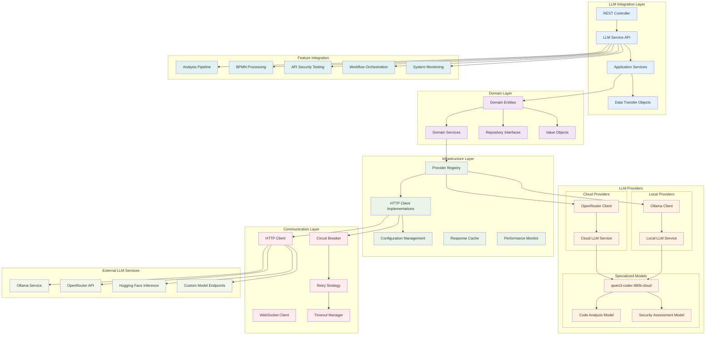

## Domain Layer Architecture

### Core LLM Entities

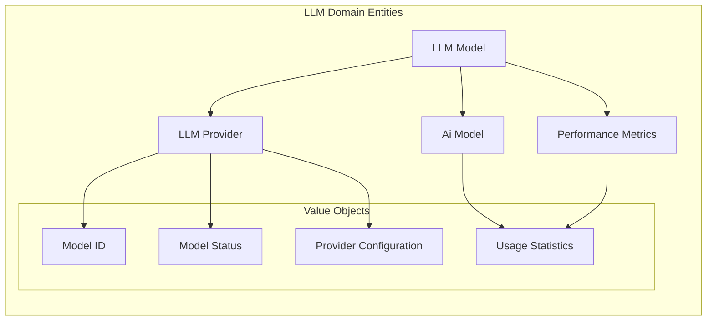

### Domain Services

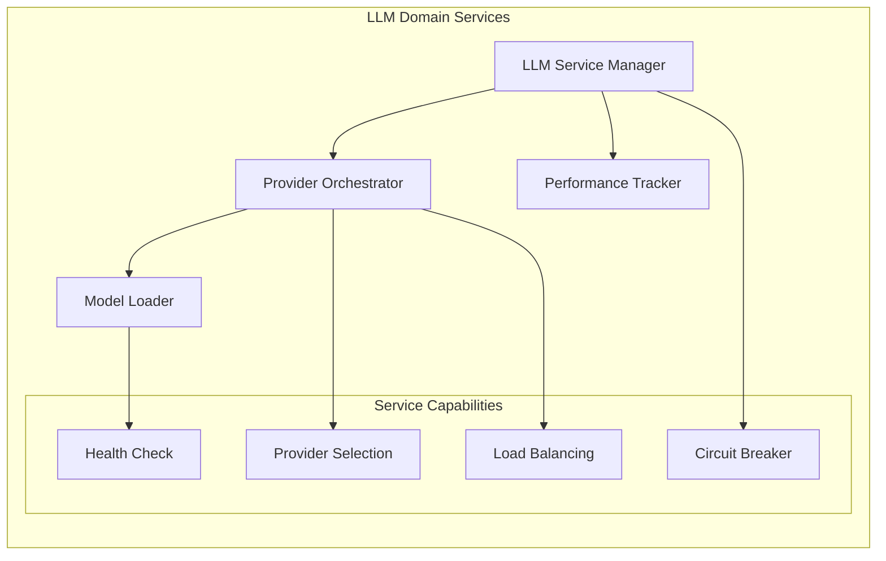

## Provider Registry Architecture

### Provider Management System

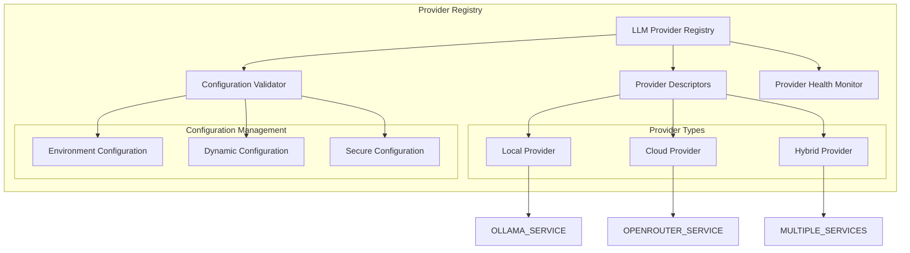

## HTTP Client Implementation

### Client Architecture

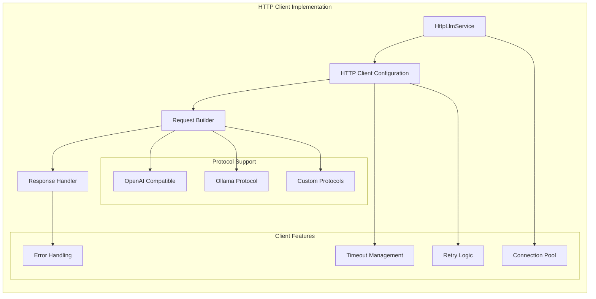

### Request/Response Flow

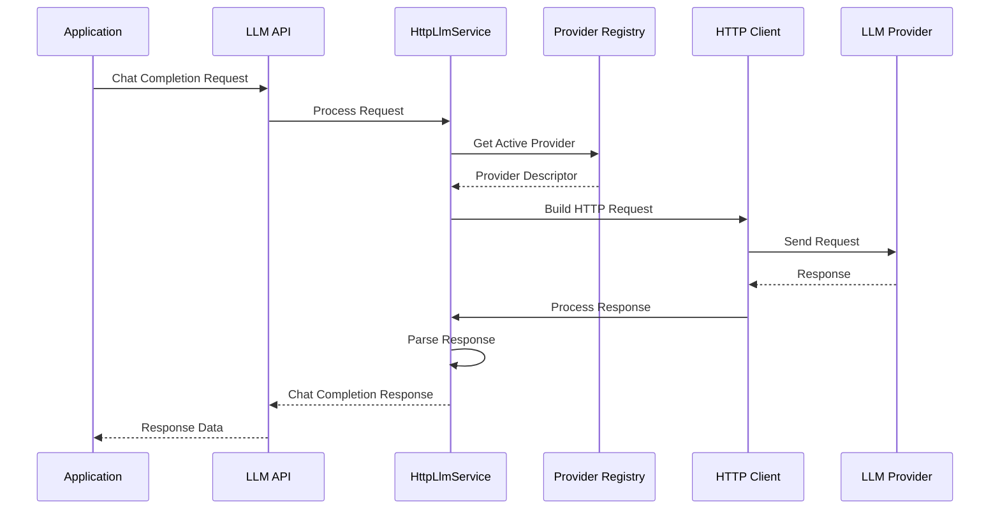

## LLM Provider Implementations

### Ollama Local Provider

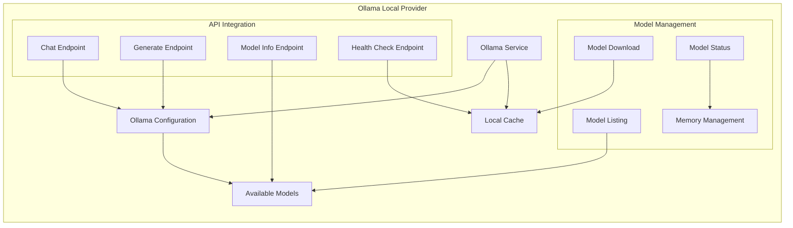

### OpenRouter Cloud Provider

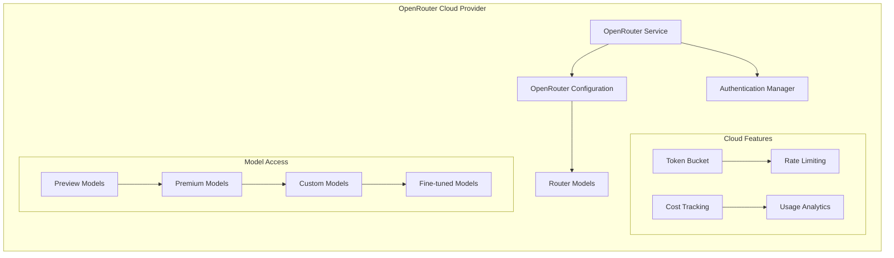

## Specialized Model Integration

### qwen3-coder:480b-cloud Model

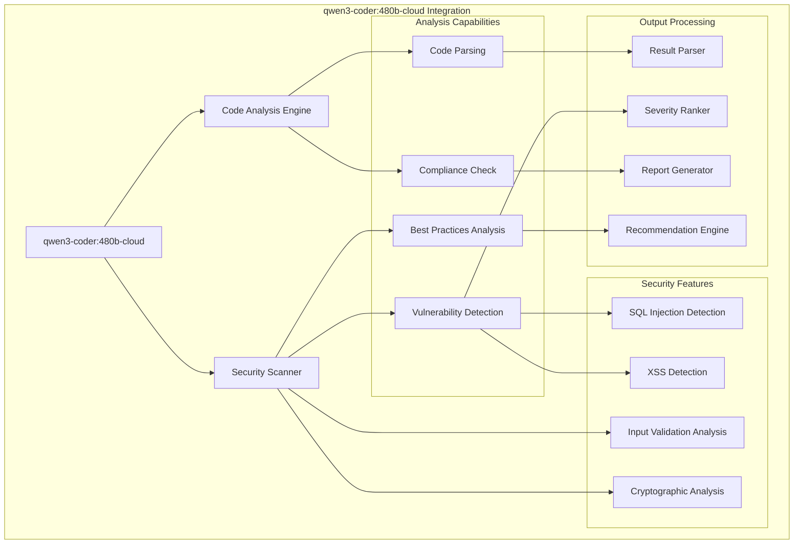

### Model Selection Logic

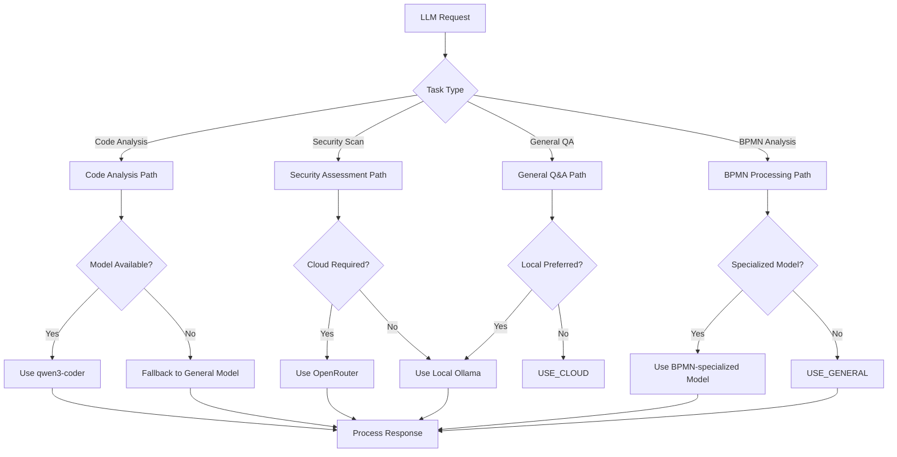

## Circuit Breaker & Resilience Pattern

### Circuit Breaker Implementation

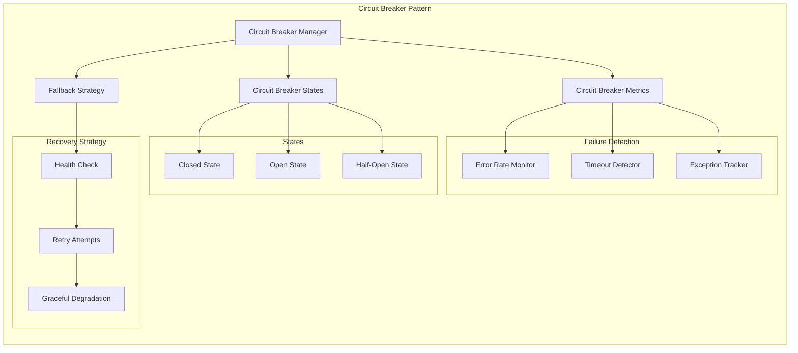

### Failover Strategy

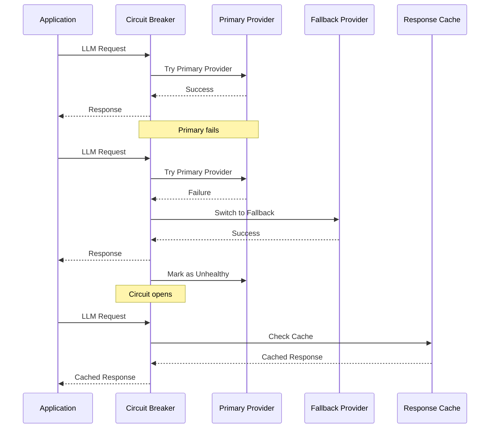

## Performance Monitoring & Analytics

### Performance Tracking System

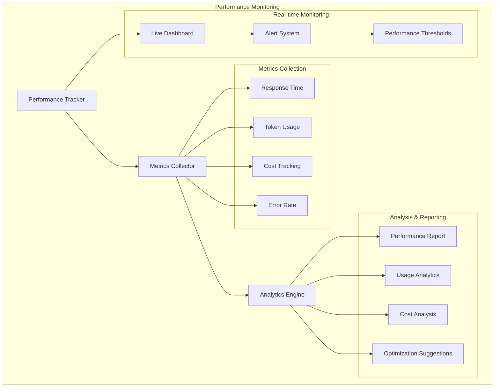

### Cost Optimization Strategy

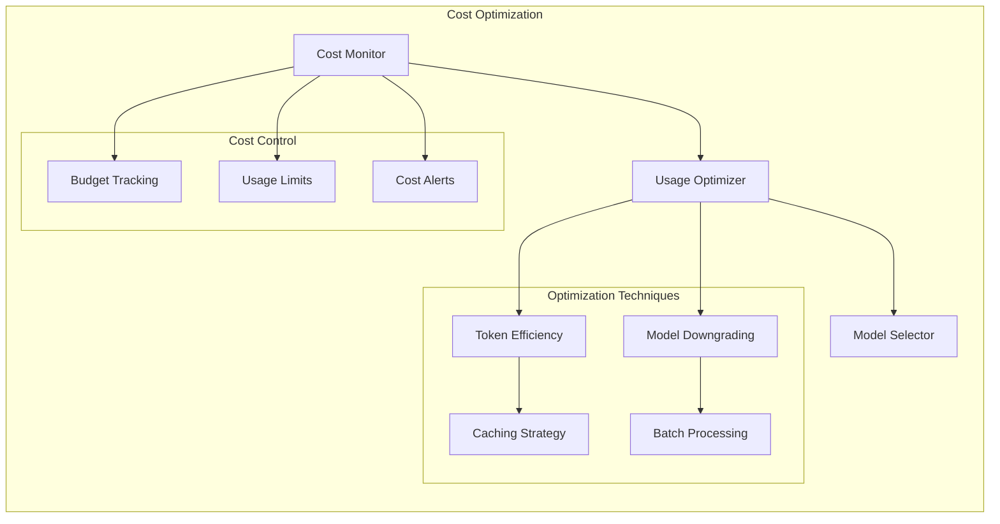

## Integration with Security Features

### Security Analysis Pipeline

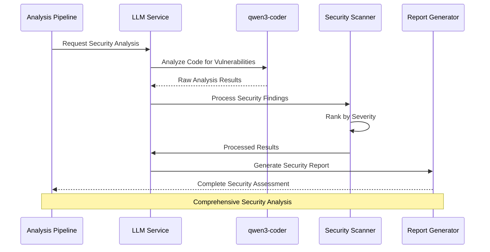

### Compliance Checking Integration

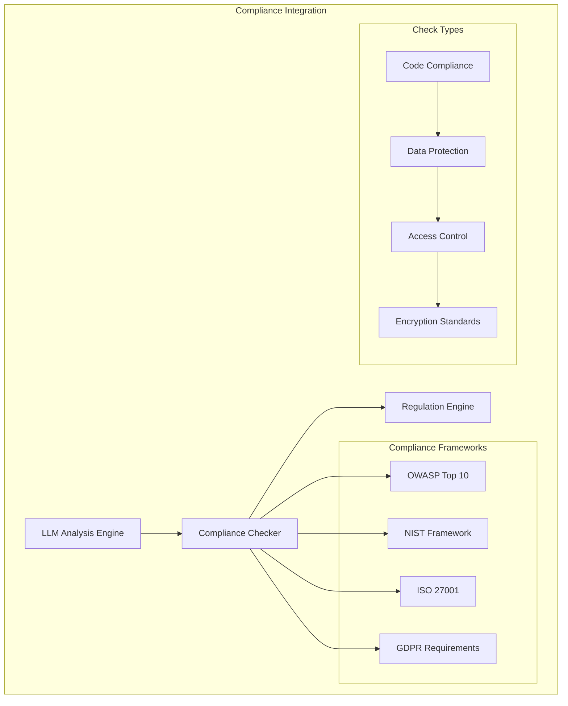

## Configuration Management

### Dynamic Configuration System

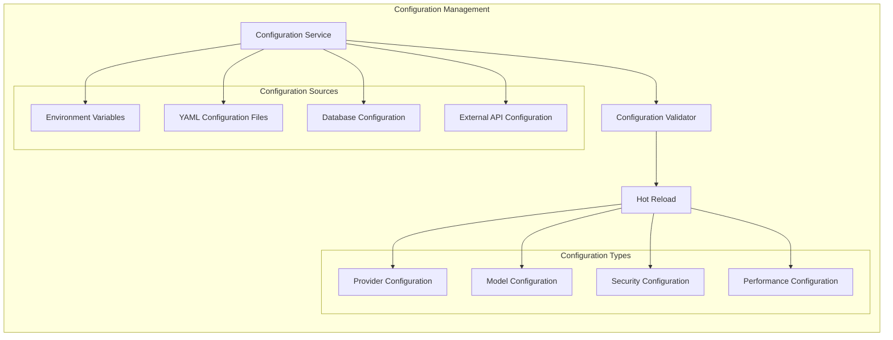

### Secure Configuration Handling

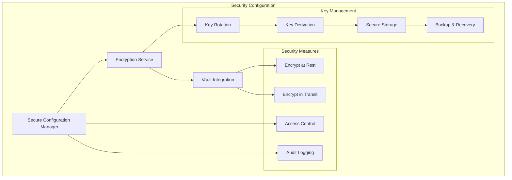

This comprehensive LLM Integration Architecture provides a robust, scalable, and secure foundation for intelligent analysis capabilities within the Security Orchestrator platform, supporting multiple providers, specialized models, and enterprise-grade reliability features.