# Security Orchestrator - Microservices Architecture

## Overview

The Security Orchestrator follows a **feature-first microservices architecture** where each business capability is implemented as an independent module with clear boundaries and well-defined interfaces. This architecture enables independent deployment, scaling, and development of each feature while maintaining loose coupling through well-defined APIs and event-driven communication.

## Microservices Architecture Overview

```mermaid
graph TB
    %% API Gateway Layer
    subgraph "API Gateway & Load Balancing"
        GATEWAY[Spring Cloud Gateway]
        LB[Load Balancer]
        REGISTRY[Service Discovery]
        CIRCUIT[Circuit Breaker]
    end
    
    %% Core Microservices
    subgraph "Core Feature Microservices"
        ANALYSIS[Analysis Pipeline Service]
        BPMN[BPMN Processing Service]
        OPENAPI[OpenAPI Service]
        ORCHESTRATION[Orchestration Service]
        MONITORING[Monitoring Service]
        LLM[LLM Integration Service]
        TESTDATA[Test Data Service]
    end
    
    %% Shared Services
    subgraph "Shared Infrastructure"
        CONFIG[Configuration Service]
        AUTH[Authentication Service]
        LOGGING[Centralized Logging]
        METRICS[Metrics Service]
    end
    
    %% Communication Patterns
    subgraph "Message Brokers & Communication"
        KAFKA[Apache Kafka]
        RABBIT[RabbitMQ]
        REST[REST APIs]
        WS[WebSocket]
    end
    
    %% Data Layer
    subgraph "Data Services"
        DB_SERVICE[Database Service]
        FILE_SERVICE[File Storage Service]
        CACHE_SERVICE[Cache Service]
    end
    
    %% External Systems
    subgraph "External Integrations"
        LLM_PROVIDERS[LLM Providers]
        ENTERPRISE[Enterprise Systems]
        TARGET_APIS[Target APIs]
    end
    
    %% Gateway connections
    GATEWAY --> LB
    LB --> REGISTRY
    REGISTRY --> CIRCUIT
    
    %% Service communications
    GATEWAY --> ANALYSIS
    GATEWAY --> BPMN
    GATEWAY --> OPENAPI
    GATEWAY --> ORCHESTRATION
    GATEWAY --> MONITORING
    
    %% Internal service communication
    ORCHESTRATION --> ANALYSIS
    ORCHESTRATION --> BPMN
    ORCHESTRATION --> OPENAPI
    ORCHESTRATION --> LLM
    ANALYSIS --> TESTDATA
    
    %% Message broker connections
    ANALYSIS --> KAFKA
    ORCHESTRATION --> KAFKA
    MONITORING --> KAFKA
    LLM --> KAFKA
    
    BPMN --> RABBIT
    OPENAPI --> RABBIT
    MONITORING --> RABBIT
    
    %% WebSocket connections
    MONITORING --> WS
    ORCHESTRATION --> WS
    
    %% Data services
    ANALYSIS --> DB_SERVICE
    BPMN --> DB_SERVICE
    OPENAPI --> DB_SERVICE
    ORCHESTRATION --> DB_SERVICE
    MONITORING --> DB_SERVICE
    
    ANALYSIS --> CACHE_SERVICE
    LLM --> CACHE_SERVICE
    
    BPMN --> FILE_SERVICE
    OPENAPI --> FILE_SERVICE
    
    %% External integrations
    LLM --> LLM_PROVIDERS
    ANALYSIS --> ENTERPRISE
    ORCHESTRATION --> ENTERPRISE
    OPENAPI --> TARGET_APIS
    
    %% Shared services
    ALL_SERVICES --> CONFIG
    ALL_SERVICES --> AUTH
    ALL_SERVICES --> LOGGING
    ALL_SERVICES --> METRICS
    
    %% Styling
    classDef gateway fill:#e3f2fd
    classDef service fill:#f3e5f5
    classDef shared fill:#e8f5e8
    classDef broker fill:#fff3e0
    classDef data fill:#ffebee
    classDef external fill:#f1f8e9
    
    class GATEWAY,LB,REGISTRY,CIRCUIT gateway
    class ANALYSIS,BPMN,OPENAPI,ORCHESTRATION,MONITORING,LLM,TESTDATA service
    class CONFIG,AUTH,LOGGING,METRICS shared
    class KAFKA,RABBIT,REST,WS broker
    class DB_SERVICE,FILE_SERVICE,CACHE_SERVICE data
    class LLM_PROVIDERS,ENTERPRISE,TARGET_APIS external
```

## Feature Microservices Detail

### 1. Analysis Pipeline Service

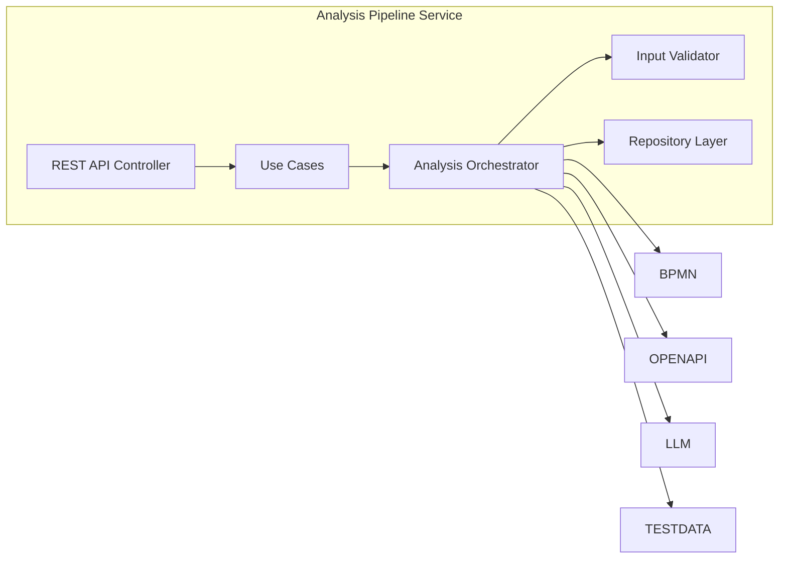

**Responsibilities:**
- Coordinates end-to-end security analysis workflows
- Manages analysis sessions and their lifecycle
- Orchestrates communication between BPMN, OpenAPI, LLM, and Test Data services
- Provides comprehensive security assessment capabilities
- Handles analysis input validation and preprocessing

### 2. BPMN Processing Service

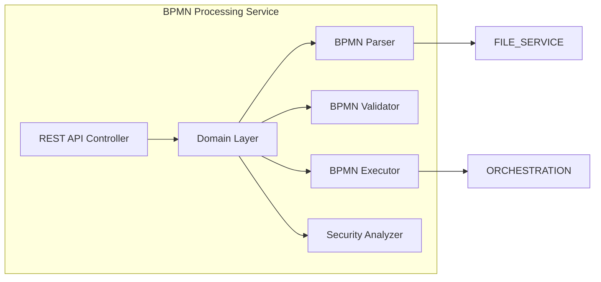

**Responsibilities:**
- Parse and validate BPMN 2.0 workflow definitions
- Execute BPMN workflows in isolation
- Analyze workflows for security vulnerabilities
- Provide workflow execution tracking and monitoring
- Generate security assessment reports for workflows

### 3. OpenAPI Service

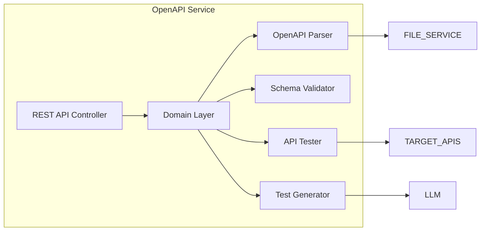

**Responsibilities:**
- Parse and validate OpenAPI/Swagger specifications
- Generate security test cases from API specifications
- Execute automated API security testing
- Analyze API schemas for security vulnerabilities
- Provide comprehensive API security reports

### 4. Orchestration Service

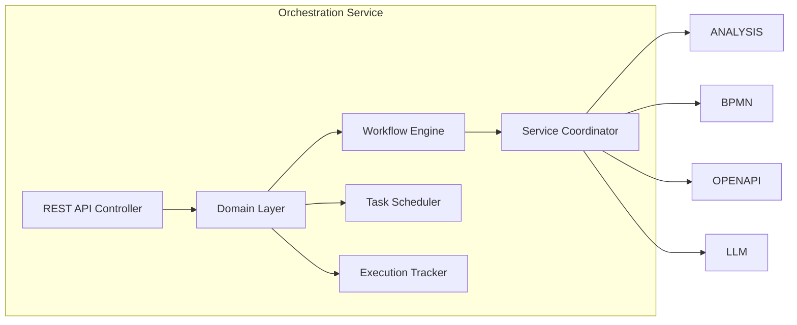

**Responsibilities:**
- Coordinate complex multi-service workflows
- Manage task scheduling and execution
- Track cross-service dependencies and state
- Provide workflow visualization and monitoring
- Handle error recovery and compensation logic

### 5. LLM Integration Service

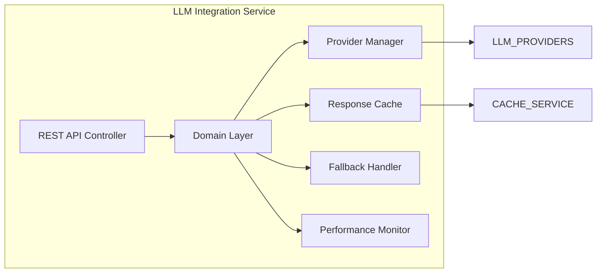

**Responsibilities:**
- Manage multiple LLM providers (Ollama, OpenRouter)
- Provide intelligent analysis and test generation
- Handle provider failover and load balancing
- Cache and optimize LLM responses
- Monitor LLM performance and costs

### 6. Monitoring Service

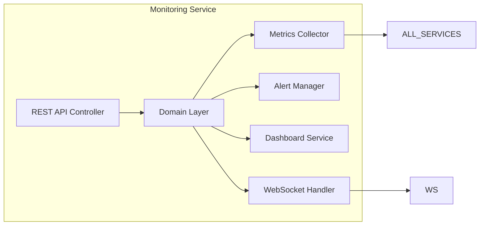

**Responsibilities:**
- Collect and aggregate system metrics
- Manage alerts and notifications
- Provide real-time monitoring dashboards
- Handle health checks and service discovery
- Support distributed tracing and monitoring

## Inter-Service Communication Patterns

### 1. Synchronous Communication (REST APIs)

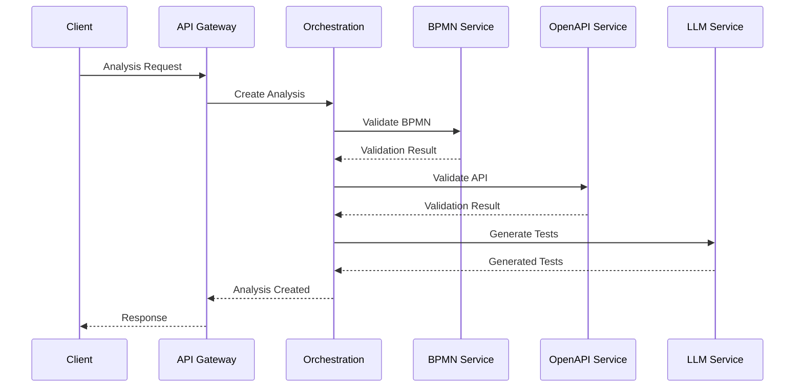

### 2. Asynchronous Communication (Event-Driven)

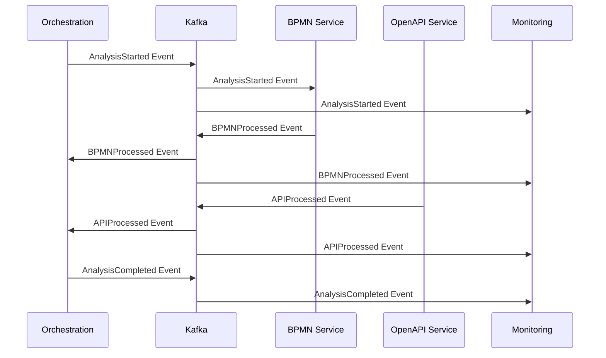

## Service Dependencies & Communication Matrix

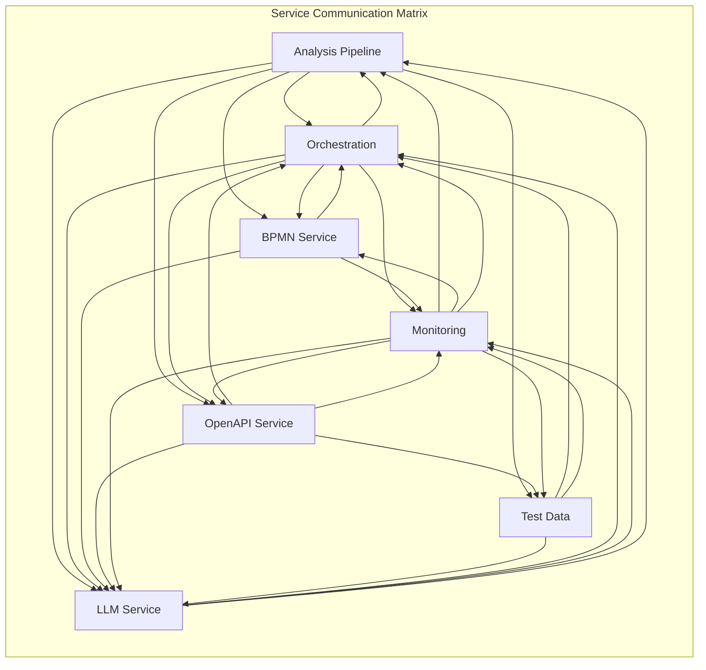

## API Gateway & Service Discovery

### API Gateway Configuration

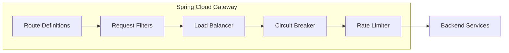

**Gateway Routes:**
- `/api/analysis/*` → Analysis Pipeline Service
- `/api/bpmn/*` → BPMN Processing Service
- `/api/openapi/*` → OpenAPI Service
- `/api/orchestration/*` → Orchestration Service
- `/api/monitoring/*` → Monitoring Service
- `/api/llm/*` → LLM Integration Service

### Service Discovery Pattern

```mermaid
graph LR
    subgraph "Eureka Service Discovery"
        REGISTRY[Service Registry]
        HEARTBEAT[Heartbeat Monitor]
        HEALTH[Health Check]
        CLIENT[Service Client]
    end
    
    ANALYSIS -.-> REGISTRY: Register
    BPMN -.-> REGISTRY: Register
    OPENAPI -.-> REGISTRY: Register
    ORCHESTRATION -.-> REGISTRY: Register
    MONITORING -.-> REGISTRY: Register
    LLM -.-> REGISTRY: Register
    
    CLIENT --> REGISTRY: Service Lookup
    REGISTRY --> CLIENT: Available Instances
    
    HEARTBEAT --> ANALYSIS
    HEARTBEAT --> BPMN
    HEARTBEAT --> OPENAPI
    HEARTBEAT --> ORCHESTRATION
    HEARTBEAT --> MONITORING
    HEARTBEAT --> LLM
```

## Fault Tolerance & Resilience Patterns

### 1. Circuit Breaker Pattern

```mermaid
graph LR
    subgraph "Circuit Breaker Implementation"
        CLIENT[Service Client]
        CB[Circuit Breaker]
        SERVICE[Target Service]
        FALLBACK[Fallback Service]
    end
    
    CLIENT --> CB
    CB --> SERVICE
    CB -.-> FALLBACK: When OPEN
    SERVICE -.-> CB: Health Status
    
    CB --> CLIENT: Service Response
    CB --> CLIENT: Fallback Response
```

**Circuit Breaker Configuration:**
- **Failure Threshold**: 50% of requests fail
- **Timeout**: 30 seconds
- **Recovery Timeout**: 60 seconds
- **Fallback Strategy**: Cache responses or default values

### 2. Retry & Backoff Pattern

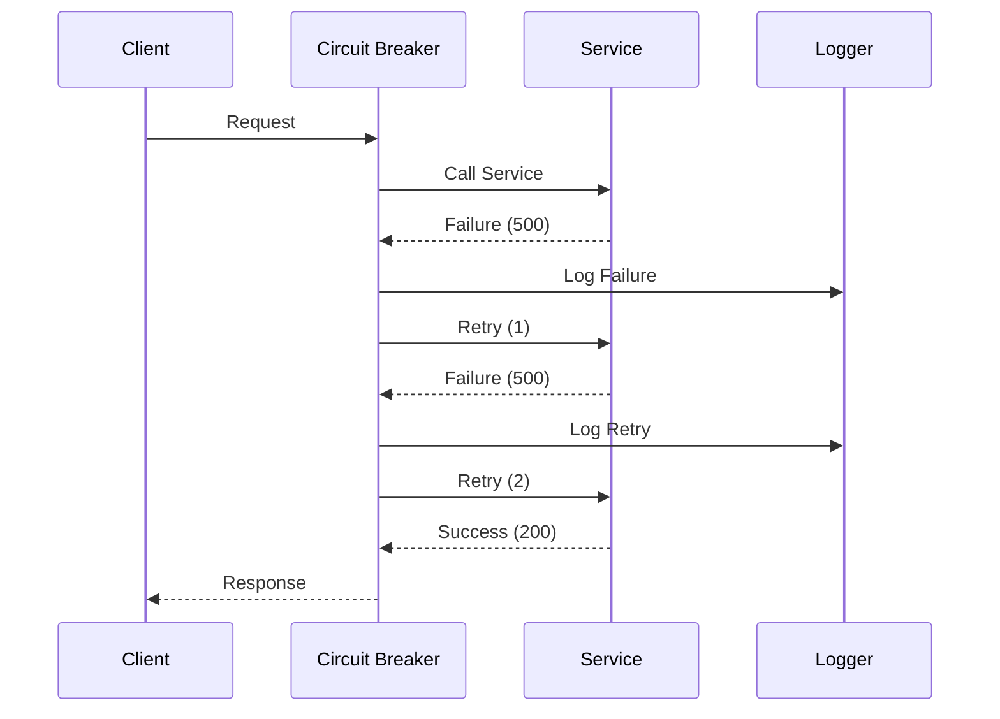

## Data Consistency & Transaction Management

### Event Sourcing Pattern

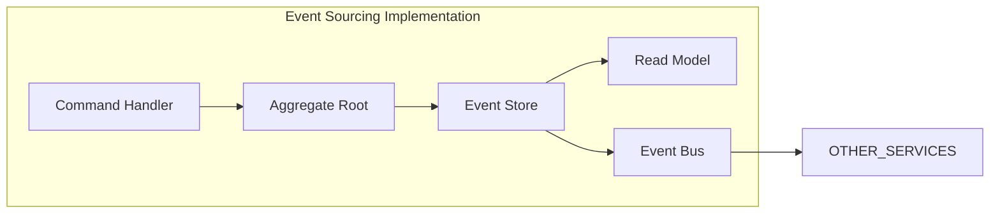

### Saga Pattern for Distributed Transactions

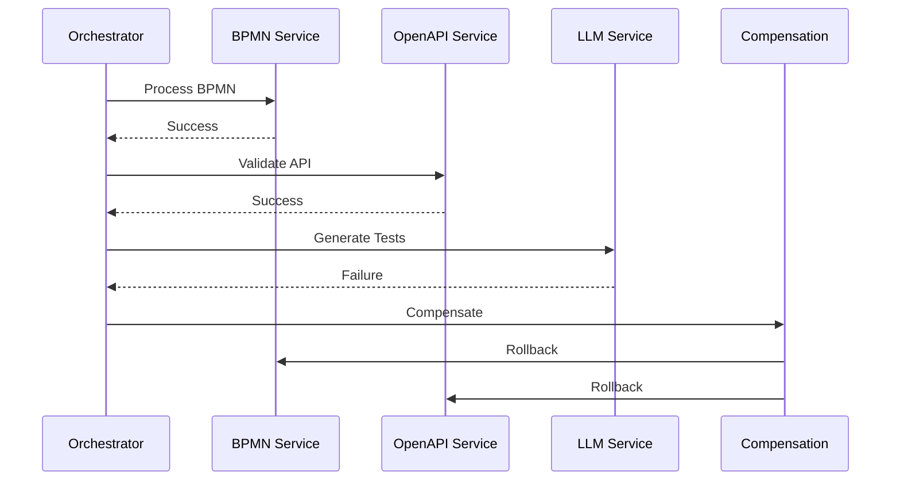

## Load Balancing & Scaling Strategies

### Horizontal Pod Autoscaling

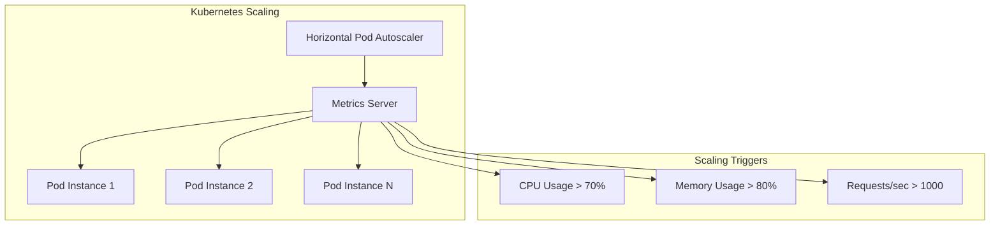

### Service-Specific Scaling Rules

| Service | Scaling Trigger | Min Pods | Max Pods |
|---------|----------------|----------|----------|
| Analysis Pipeline | CPU > 60% | 2 | 10 |
| BPMN Service | Memory > 70% | 1 | 5 |
| OpenAPI Service | Request Rate > 500/s | 2 | 8 |
| Orchestration | Active Workflows > 100 | 1 | 6 |
| Monitoring | Metrics Volume > 10K/min | 1 | 4 |
| LLM Service | Queue Length > 50 | 2 | 12 |

## Service Monitoring & Observability

### Distributed Tracing

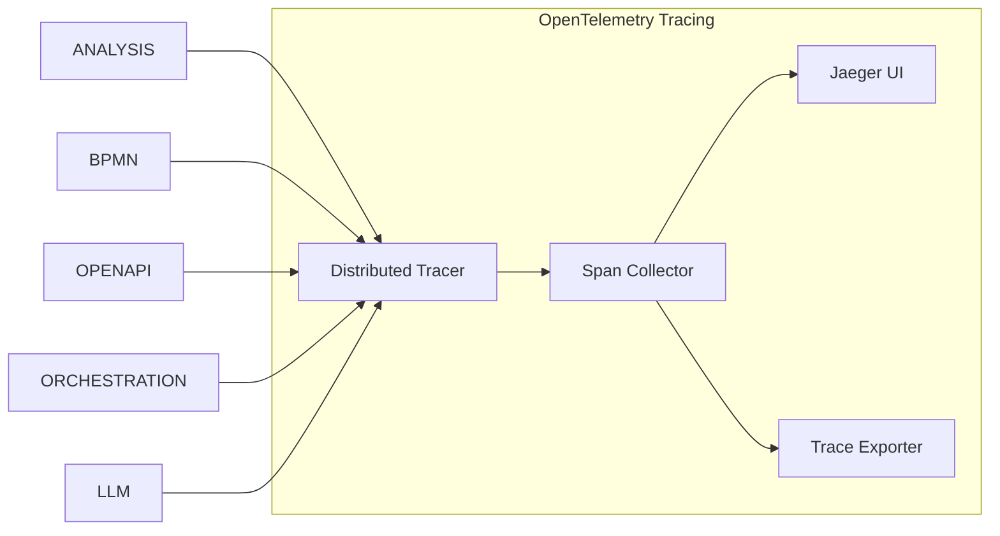

### Metrics Collection

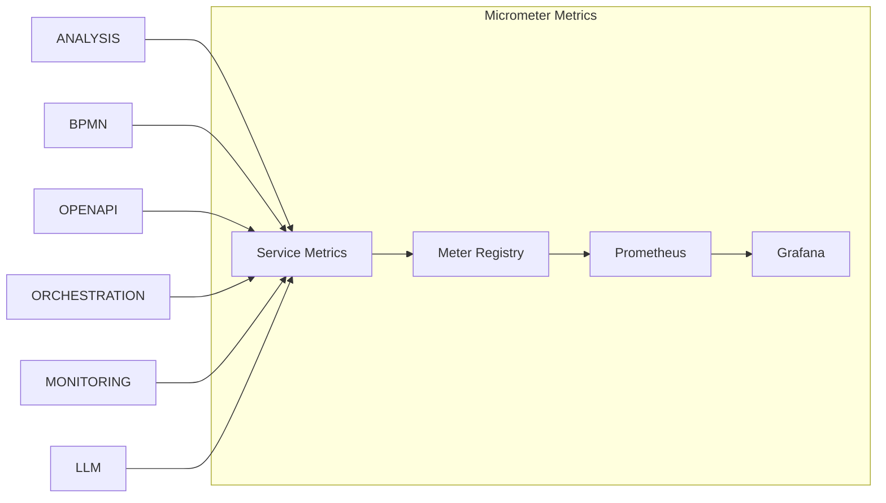

This microservices architecture provides a robust, scalable, and maintainable foundation for the Security Orchestrator platform, enabling independent development, deployment, and scaling of each business capability while maintaining system-wide coherence and reliability.