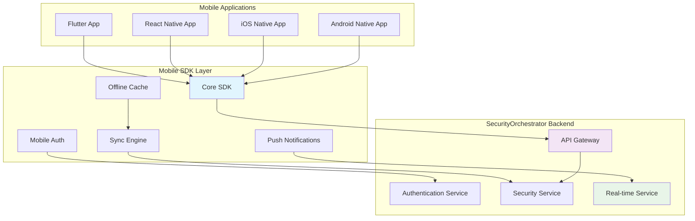

# SecurityOrchestrator - Mobile Integration Guide

## Исполнительное резюме

**Дата**: 2025-11-22  
**Версия**: 1.0.0  
**Цель**: Полная документация по интеграции с мобильными приложениями  
**Платформа**: SecurityOrchestrator - Enterprise-grade интеграционная платформа с мобильной поддержкой  

---

## 1. Обзор мобильной архитектуры

### 1.1 Принципы мобильной интеграции

SecurityOrchestrator предоставляет comprehensive мобильную поддержку для enterprise среды:



### 1.2 Поддерживаемые платформы

| Платформа | Технология | SDK | Статус | Версия |
|-----------|------------|-----|---------|---------|
| Android | Native Java/Kotlin | Android SDK | ✅ Поддерживается | 1.0.0 |
| iOS | Native Swift/Objective-C | iOS SDK | ✅ Поддерживается | 1.0.0 |
| Cross-platform | Flutter | Flutter SDK | ✅ Поддерживается | 1.0.0 |
| Cross-platform | React Native | React Native SDK | ✅ Поддерживается | 1.0.0 |

---

## 2. Flutter Mobile Integration

### 2.1 Flutter SDK Setup

```yaml
# pubspec.yaml
name: security_orchestrator_flutter
description: SecurityOrchestrator Flutter Application

dependencies:
  flutter_secure_storage: ^8.0.0
  http: ^1.1.0
  web_socket_channel: ^2.4.0
  shared_preferences: ^2.2.0
  permission_handler: ^11.0.0
  local_auth: ^2.1.6
  push_notifications_flutter: ^2.0.0
  cached_network_image: ^3.3.0
  connectivity_plus: ^4.0.2
  drift: ^2.14.0
  provider: ^6.0.5
```

### 2.2 Core Flutter SDK

```dart
// lib/core/security_orchestrator_sdk.dart
class SecurityOrchestratorSdk {
  static const String _baseUrl = 'https://api.securityorchestrator.com';
  static const String _webSocketUrl = 'wss://api.securityorchestrator.com/ws';
  
  late final AuthenticationService _authService;
  late final SecurityAnalysisService _analysisService;
  late final NotificationService _notificationService;
  late final OfflineStorageService _storageService;
  late final WebSocketService _webSocketService;
  
  SecurityOrchestratorSdk._internal() {
    _authService = AuthenticationService();
    _analysisService = SecurityAnalysisService();
    _notificationService = NotificationService();
    _storageService = OfflineStorageService();
    _webSocketService = WebSocketService();
  }
  
  static final SecurityOrchestratorSdk _instance = SecurityOrchestratorSdk._internal();
  static SecurityOrchestratorSdk get instance => _instance;
  
  // Authentication
  Future<AuthResult> login(String username, String password, {bool useBiometric = false}) async {
    try {
      if (useBiometric) {
        final biometricResult = await _authService.authenticateWithBiometric();
        if (!biometricResult.success) {
          return AuthResult.failure(biometricResult.error!);
        }
      }
      
      final result = await _authService.login(username, password);
      if (result.isSuccess) {
        await _initializeServices(result.token!);
      }
      return result;
    } catch (e) {
      return AuthResult.failure('Authentication failed: $e');
    }
  }
  
  Future<void> _initializeServices(String token) async {
    await _analysisService.initialize(token);
    await _notificationService.initialize(token);
    await _storageService.initialize(token);
    await _webSocketService.connect(token);
  }
  
  // Security Analysis
  Future<AnalysisResult> startSecurityAnalysis({
    required String projectId,
    required AnalysisType type,
    List<String>? targetApis,
  }) async {
    try {
      final result = await _analysisService.startAnalysis(
        projectId: projectId,
        type: type,
        targetApis: targetApis,
      );
      
      _webSocketService.subscribeToAnalysis(result.analysisId);
      return result;
    } catch (e) {
      return AnalysisResult.failure('Analysis failed to start: $e');
    }
  }
  
  // Real-time Updates
  Stream<SecurityAlert> getSecurityAlerts() => _webSocketService.stream<SecurityAlert>('security.alerts');
  Stream<AnalysisProgress> getAnalysisProgress() => _webSocketService.stream<AnalysisProgress>('analysis.progress');
  
  // Offline Support
  Future<List<AnalysisResult>> getCachedAnalyses() => _storageService.getCachedAnalyses();
  Future<void> syncOfflineData() => _storageService.syncWithServer();
}
```

### 2.3 Flutter State Management

```dart
// lib/providers/security_orchestrator_provider.dart
class SecurityOrchestratorProvider extends ChangeNotifier {
  final SecurityOrchestratorSdk _sdk = SecurityOrchestratorSdk.instance;
  
  late AnalysisSession _currentAnalysis;
  List<AnalysisResult> _analyses = [];
  List<SecurityAlert> _alerts = [];
  bool _isOfflineMode = false;
  
  AnalysisSessionState _state = AnalysisSessionState.initial();
  
  // Getters
  AnalysisSessionState get state => _state;
  List<AnalysisResult> get analyses => _analyses;
  List<SecurityAlert> get alerts => _alerts;
  bool get isOfflineMode => _isOfflineMode;
  
  SecurityOrchestratorProvider() {
    _initializeProvider();
  }
  
  Future<void> _initializeProvider() async {
    _subscribeToEvents();
    _checkConnectivity();
  }
  
  void _subscribeToEvents() {
    _sdk.getAnalysisProgress().listen((progress) {
      if (progress.analysisId == _currentAnalysis.id) {
        _updateAnalysisProgress(progress);
      }
    });
    
    _sdk.getSecurityAlerts().listen((alert) {
      _alerts.insert(0, alert);
      _showSecurityAlertNotification(alert);
      notifyListeners();
    });
  }
  
  Future<void> startAnalysis({
    required String projectId,
    required AnalysisType type,
    List<String>? targetApis,
  }) async {
    try {
      _state = AnalysisSessionState.loading();
      notifyListeners();
      
      final result = await _sdk.startSecurityAnalysis(
        projectId: projectId,
        type: type,
        targetApis: targetApis,
      );
      
      if (result.isSuccess) {
        _currentAnalysis = result.session!;
        _state = AnalysisSessionState.inProgress(result.session!);
      } else {
        _state = AnalysisSessionState.error(result.error!);
      }
    } catch (e) {
      _state = AnalysisSessionState.error(e.toString());
    }
    
    notifyListeners();
  }
  
  void _updateAnalysisProgress(AnalysisProgress progress) {
    _state = _state.copyWith(
      progressPercentage: progress.percentage,
      currentStage: progress.currentStage,
    );
    notifyListeners();
  }
  
  void _showSecurityAlertNotification(SecurityAlert alert) {
    _notificationService.showLocalNotification(
      title: 'Security Alert',
      body: alert.title,
      priority: NotificationPriority.high,
    );
  }
  
  void _checkConnectivity() {
    _sdk.connectivityService.isOnline.listen((isOnline) {
      _isOfflineMode = !isOnline;
      if (!isOnline) {
        _state = AnalysisSessionState.offline();
      }
      notifyListeners();
    });
  }
}
```

---

## 3. React Native Integration

### 3.1 React Native SDK Setup

```javascript
// src/services/SecurityOrchestratorSdk.js
import AsyncStorage from '@react-native-async-storage/async-storage';
import NetInfo from '@react-native-community/netinfo';
import PushNotification from 'react-native-push-notification';
import WebSocket from 'react-native-websocket';

class SecurityOrchestratorSdk {
  constructor() {
    this.baseUrl = 'https://api.securityorchestrator.com';
    this.webSocketUrl = 'wss://api.securityorchestrator.com/ws';
    this.token = null;
    this.ws = null;
    this.eventListeners = new Map();
    
    this.initialize();
  }
  
  async initialize() {
    await this.initializePushNotifications();
    await this.initializeConnectivity();
    await this.loadStoredToken();
    
    if (this.token) {
      this.connectWebSocket();
    }
  }
  
  async initializePushNotifications() {
    PushNotification.configure({
      onNotification: (notification) => {
        this.handlePushNotification(notification);
      },
      permissions: {
        alert: true,
        badge: true,
        sound: true,
      },
    });
  }
  
  async loadStoredToken() {
    try {
      const token = await AsyncStorage.getItem('auth_token');
      if (token) {
        this.token = token;
      }
    } catch (error) {
      console.error('Failed to load stored token:', error);
    }
  }
  
  // Authentication
  async login(username, password, useBiometric = false) {
    try {
      if (useBiometric) {
        const biometricResult = await this.authenticateWithBiometric();
        if (!biometricResult.success) {
          return { success: false, error: biometricResult.error };
        }
      }
      
      const response = await fetch(`${this.baseUrl}/api/v1/auth/login`, {
        method: 'POST',
        headers: { 'Content-Type': 'application/json' },
        body: JSON.stringify({ username, password }),
      });
      
      const result = await response.json();
      
      if (result.success) {
        this.token = result.token;
        await AsyncStorage.setItem('auth_token', result.token);
        this.connectWebSocket();
      }
      
      return result;
    } catch (error) {
      return { success: false, error: error.message };
    }
  }
  
  async authenticateWithBiometric() {
    try {
      const Biometrics = require('react-native-biometrics');
      const { available } = await Biometrics.isSensorAvailable();
      
      if (!available) {
        return { success: false, error: 'Biometric authentication not available' };
      }
      
      const result = await Biometrics.simplePrompt({
        promptMessage: 'Confirm your identity',
        fallbackLabel: 'Use password instead',
      });
      
      return result ? { success: true } : { success: false, error: 'Authentication failed' };
    } catch (error) {
      return { success: false, error: error.message };
    }
  }
  
  // Security Analysis
  async startSecurityAnalysis({ projectId, type, targetApis }) {
    try {
      const response = await fetch(`${this.baseUrl}/api/v1/security/analyze`, {
        method: 'POST',
        headers: {
          'Content-Type': 'application/json',
          'Authorization': `Bearer ${this.token}`,
        },
        body: JSON.stringify({ projectId, type, targetApis }),
      });
      
      const result = await response.json();
      
      if (result.success) {
        this.subscribeToAnalysis(result.data.analysisId);
      }
      
      return result;
    } catch (error) {
      return { success: false, error: error.message };
    }
  }
  
  connectWebSocket() {
    if (this.ws) this.ws.close();
    
    this.ws = WebSocket.connect(`${this.webSocketUrl}?token=${this.token}`, {
      onOpen: () => console.log('WebSocket connected'),
      onMessage: (data) => this.handleWebSocketMessage(data),
      onError: (error) => console.error('WebSocket error:', error),
      onClose: () => {
        console.log('WebSocket disconnected');
        setTimeout(() => {
          if (this.token) this.connectWebSocket();
        }, 5000);
      },
    });
  }
  
  handleWebSocketMessage(data) {
    try {
      const message = JSON.parse(data);
      this.emit(message.type, message.data);
    } catch (error) {
      console.error('Failed to parse WebSocket message:', error);
    }
  }
  
  subscribeToEvent(eventType, callback) {
    if (!this.eventListeners.has(eventType)) {
      this.eventListeners.set(eventType, []);
    }
    this.eventListeners.get(eventType).push(callback);
  }
  
  emit(eventType, data) {
    const listeners = this.eventListeners.get(eventType);
    if (listeners) {
      listeners.forEach(callback => callback(data));
    }
  }
}

export default new SecurityOrchestratorSdk();
```

---

## 4. Native iOS Integration

### 4.1 iOS SDK

```swift
// SecurityOrchestratorSDK/SecurityOrchestratorSDK.swift
import Foundation
import Network

public class SecurityOrchestratorSDK: ObservableObject {
    
    public static let shared = SecurityOrchestratorSDK()
    
    private let baseURL = "https://api.securityorchestrator.com"
    private let webSocketURL = "wss://api.securityorchestrator.com/ws"
    
    private var authService: SOAuthenticationService!
    private var analysisService: SOAnalysisService!
    private var webSocketService: SOWebSocketService!
    
    private init() {
        setupServices()
    }
    
    private func setupServices() {
        authService = SOAuthenticationService(baseURL: baseURL)
        analysisService = SOAnalysisService(baseURL: baseURL, authService: authService)
        webSocketService = SOWebSocketService(url: webSocketURL, authService: authService)
    }
    
    public func login(username: String, password: String, useBiometric: Bool = false, completion: @escaping (Result<SOLoginResult, Error>) -> Void) {
        Task {
            do {
                var result = try await authService.login(username: username, password: password)
                
                if useBiometric {
                    let biometricResult = await authenticateWithBiometric()
                    if !biometricResult.success {
                        completion(.failure(NSError(domain: "SecurityOrchestratorSDK", code: 1001, userInfo: [NSLocalizedDescriptionKey: biometricResult.error ?? "Biometric authentication failed"])))
                        return
                    }
                }
                
                await initializeServices()
                completion(.success(result))
            } catch {
                completion(.failure(error))
            }
        }
    }
    
    public func startSecurityAnalysis(projectId: String, type: SOAnalysisType, targetApis: [String]? = nil, completion: @escaping (Result<SOAnalysisSession, Error>) -> Void) {
        Task {
            do {
                let session = try await analysisService.startAnalysis(
                    projectId: projectId,
                    type: type,
                    targetApis: targetApis
                )
                
                webSocketService.subscribeToAnalysis(session.id) { progress in
                    DispatchQueue.main.async {
                        NotificationCenter.default.post(name: .analysisProgressUpdated, object: progress)
                    }
                }
                
                completion(.success(session))
            } catch {
                completion(.failure(error))
            }
        }
    }
    
    private func initializeServices() async {
        await analysisService.setToken(authService.getToken())
        await webSocketService.setToken(authService.getToken())
    }
    
    private func authenticateWithBiometric() async -> (success: Bool, error: String?) {
        let context = LAContext()
        var error: NSError?
        
        let isAvailable = context.canEvaluatePolicy(.deviceOwnerAuthenticationWithBiometrics, error: &error)
        
        guard isAvailable else {
            return (false, error?.localizedDescription ?? "Biometric authentication not available")
        }
        
        do {
            let result = try await context.evaluatePolicy(
                .deviceOwnerAuthenticationWithBiometrics,
                localizedReason: "Confirm your identity to access SecurityOrchestrator"
            )
            
            return (result, nil)
        } catch {
            return (false, error.localizedDescription)
        }
    }
}

extension Notification.Name {
    static let analysisProgressUpdated = Notification.Name("AnalysisProgressUpdated")
    static let securityAlertReceived = Notification.Name("SecurityAlertReceived")
}
```

---

## 5. Native Android Integration

### 5.1 Android SDK

```kotlin
// src/main/java/com/securityorchestrator/android/SecurityOrchestratorSDK.kt
class SecurityOrchestratorSDK private constructor(private val context: Context) {
    
    companion object {
        @Volatile
        private var INSTANCE: SecurityOrchestratorSDK? = null
        
        const val BASE_URL = "https://api.securityorchestrator.com"
        const val WEBSOCKET_URL = "wss://api.securityorchestrator.com/ws"
        
        fun getInstance(context: Context): SecurityOrchestratorSDK {
            return INSTANCE ?: synchronized(this) {
                INSTANCE ?: SecurityOrchestratorSDK(context.applicationContext).also { INSTANCE = it }
            }
        }
    }
    
    private var token: String? = null
    private var webSocket: WebSocket? = null
    
    // Events
    private val _analysisProgressFlow = MutableSharedFlow<AnalysisProgress>(replay = 0)
    val analysisProgressFlow: Flow<AnalysisProgress> = _analysisProgressFlow.asSharedFlow()
    
    private val _securityAlertFlow = MutableSharedFlow<SecurityAlert>(replay = 0)
    val securityAlertFlow: Flow<SecurityAlert> = _securityAlertFlow.asSharedFlow()
    
    private val _connectivityFlow = MutableStateFlow(true)
    val connectivityFlow: StateFlow<Boolean> = _connectivityFlow.asStateFlow()
    
    // Authentication
    suspend fun login(username: String, password: String, useBiometric: Boolean = false): Result<LoginResult> {
        return try {
            if (useBiometric) {
                val biometricResult = authenticateWithBiometric()
                if (!biometricResult.success) {
                    return Result.failure(Exception(biometricResult.error))
                }
            }
            
            val response = authService.login(LoginRequest(username, password))
            
            if (response.isSuccessful && response.body() != null) {
                val result = response.body()!!
                if (result.success) {
                    token = result.token
                    connectWebSocket()
                }
                Result.success(result)
            } else {
                Result.failure(Exception("Login failed: ${response.message()}"))
            }
        } catch (e: Exception) {
            Result.failure(e)
        }
    }
    
    private suspend fun authenticateWithBiometric(): BiometricResult {
        val biometricManager = BiometricManager.from(context)
        return when (biometricManager.canAuthenticate(BiometricManager.Authenticators.BIOMETRIC_WEAK)) {
            BiometricManager.BIOMETRIC_SUCCESS -> BiometricResult(success = true, error = null)
            BiometricManager.BIOMETRIC_ERROR_NO_HARDWARE -> BiometricResult(success = false, error = "No biometric hardware available")
            BiometricManager.BIOMETRIC_ERROR_HW_UNAVAILABLE -> BiometricResult(success = false, error = "Biometric hardware unavailable")
            BiometricManager.BIOMETRIC_ERROR_NONE_ENROLLED -> BiometricResult(success = false, error = "No biometric data enrolled")
            else -> BiometricResult(success = false, error = "Unknown biometric error")
        }
    }
    
    // Security Analysis
    suspend fun startSecurityAnalysis(projectId: String, type: AnalysisType, targetApis: List<String>? = null): Result<AnalysisSession> {
        return try {
            val request = AnalysisRequest(projectId, type, targetApis)
            val response = analysisService.startAnalysis("Bearer $token", request)
            
            if (response.isSuccessful && response.body() != null) {
                val session = response.body()!!
                subscribeToAnalysis(session.id)
                Result.success(session)
            } else {
                Result.failure(Exception("Analysis failed to start: ${response.message()}"))
            }
        } catch (e: Exception) {
            Result.failure(e)
        }
    }
    
    // WebSocket Management
    private fun connectWebSocket() {
        webSocket?.close(1000, "Reconnecting")
        
        val request = okhttp3.Request.Builder()
            .url("$WEBSOCKET_URL?token=$token")
            .build()
            
        webSocket = okHttpClient.newWebSocket(request, object : WebSocketListener() {
            override fun onOpen(webSocket: WebSocket, response: okhttp3.Response) {
                Log.d(TAG, "WebSocket connected")
            }
            
            override fun onMessage(webSocket: WebSocket, text: String) {
                handleWebSocketMessage(text)
            }
            
            override fun onFailure(webSocket: WebSocket, t: Throwable, response: okhttp3.Response?) {
                Log.e(TAG, "WebSocket failed", t)
                // Reconnect logic
                Handler(Looper.getMainLooper()).postDelayed({
                    if (token != null && _connectivityFlow.value) {
                        connectWebSocket()
                    }
                }, 5000)
            }
        })
    }
    
    private fun handleWebSocketMessage(message: String) {
        try {
            val jsonObject = JSONObject(message)
            val type = jsonObject.getString("type")
            val data = jsonObject.getJSONObject("data")
            
            when (type) {
                "ANALYSIS_PROGRESS" -> handleAnalysisProgress(data)
                "SECURITY_ALERT" -> handleSecurityAlert(data)
            }
        } catch (e: Exception) {
            Log.e(TAG, "Failed to parse WebSocket message", e)
        }
    }
    
    private fun handleAnalysisProgress(data: JSONObject) {
        val progress = AnalysisProgress(
            analysisId = data.getString("analysisId"),
            progress = data.getInt("progress"),
            status = AnalysisStatus.valueOf(data.getString("status")),
            currentStage = data.getString("currentStage")
        )
        
        GlobalScope.launch {
            _analysisProgressFlow.emit(progress)
        }
    }
    
    private fun handleSecurityAlert(data: JSONObject) {
        val alert = SecurityAlert(
            id = data.getString("id"),
            title = data.getString("title"),
            severity = data.getString("severity"),
            description = data.getString("description"),
            timestamp = System.currentTimeMillis()
        )
        
        GlobalScope.launch {
            _securityAlertFlow.emit(alert)
        }
    }
    
    companion object {
        private const val TAG = "SecurityOrchestratorSDK"
    }
}
```

---

## 6. Push Notification Integration

### 6.1 Cross-Platform Push Notifications

```dart
// lib/services/notification_service.dart
class NotificationService {
  late final FirebaseMessaging _firebaseMessaging;
  late final FlutterLocalNotificationsPlugin _localNotifications;
  
  NotificationService() {
    _initializeFirebase();
    _initializeLocalNotifications();
  }
  
  Future<void> _initializeFirebase() async {
    _firebaseMessaging = FirebaseMessaging.instance;
    
    // Request permissions
    await _firebaseMessaging.requestPermission(
      alert: true,
      badge: true,
      sound: true,
    );
    
    // Get FCM token
    String? token = await _firebaseMessaging.getToken();
    if (token != null) {
      await _registerDeviceToken(token);
    }
    
    // Handle messages
    _firebaseMessaging.onMessage.listen((RemoteMessage message) {
      _handleForegroundMessage(message);
    });
    
    _firebaseMessaging.onMessageOpenedApp.listen((RemoteMessage message) {
      _handleNotificationTap(message);
    });
  }
  
  Future<void> _initializeLocalNotifications() async {
    _localNotifications = FlutterLocalNotificationsPlugin();
    
    const AndroidInitializationSettings initializationSettingsAndroid =
        AndroidInitializationSettings('@mipmap/ic_launcher');
        
    const IOSInitializationSettings initializationSettingsIOS =
        IOSInitializationSettings(
          requestAlertPermission: true,
          requestBadgePermission: true,
          requestSoundPermission: true,
        );
        
    const InitializationSettings initializationSettings = InitializationSettings(
      android: initializationSettingsAndroid,
      iOS: initializationSettingsIOS,
    );
    
    await _localNotifications.initialize(
      initializationSettings,
      onSelectNotification: _handleNotificationTapPayload,
    );
  }
  
  void _handleForegroundMessage(RemoteMessage message) {
    final data = message.data;
    
    switch (data['type']) {
      case 'SECURITY_ALERT':
        _showSecurityAlertNotification(data);
        break;
      case 'ANALYSIS_PROGRESS':
        _showAnalysisProgressNotification(data);
        break;
      case 'ANALYSIS_COMPLETED':
        _showAnalysisCompletedNotification(data);
        break;
    }
  }
  
  void _showSecurityAlertNotification(Map<String, dynamic> data) {
    const androidNotificationDetails = AndroidNotificationDetails(
      'security_alerts',
      'Security Alerts',
      channelDescription: 'Security alerts and notifications',
      importance: Importance.max,
      priority: Priority.high,
      icon: '@mipmap/ic_launcher',
    );
    
    const iosNotificationDetails = IOSNotificationDetails(
      presentAlert: true,
      presentBadge: true,
      presentSound: true,
    );
    
    final notificationDetails = NotificationDetails(
      android: androidNotificationDetails,
      iOS: iosNotificationDetails,
    );
    
    _localNotifications.show(
      DateTime.now().millisecondsSinceEpoch ~/ 1000,
      data['title'] ?? 'Security Alert',
      data['body'] ?? 'A new security alert has been detected',
      notificationDetails,
      payload: jsonEncode(data),
    );
  }
  
  Future<void> _handleNotificationTapPayload(String? payload) async {
    if (payload != null) {
      final data = jsonDecode(payload) as Map<String, dynamic>;
      
      switch (data['type']) {
        case 'SECURITY_ALERT':
          await _navigateToSecurityAlert(data);
          break;
        case 'ANALYSIS_COMPLETED':
          await _navigateToAnalysisResults(data);
          break;
      }
    }
  }
}
```

---

## 7. Offline Capabilities

### 7.1 Offline Data Management

```dart
// lib/services/offline_storage_service.dart
class OfflineStorageService {
  static const String _databaseName = 'security_orchestrator_offline';
  
  late final Database _database;
  late final SecureStorage _secureStorage;
  
  OfflineStorageService() {
    _secureStorage = const SecureStorage();
  }
  
  Future<void> initialize(String token) async {
    _database = await openDatabase(
      '$_databaseName.db',
      version: 1,
      onCreate: _createDatabase,
    );
    
    await _secureStorage.write(key: 'auth_token', value: token);
  }
  
  Future<void> _createDatabase(Database db, int version) async {
    await db.execute('''
      CREATE TABLE analyses (
        id TEXT PRIMARY KEY,
        projectId TEXT NOT NULL,
        type TEXT NOT NULL,
        status TEXT NOT NULL,
        progress INTEGER DEFAULT 0,
        result TEXT,
        createdAt INTEGER NOT NULL,
        isSynced INTEGER DEFAULT 0
      )
    ''');
    
    await db.execute('''
      CREATE TABLE sync_queue (
        id INTEGER PRIMARY KEY AUTOINCREMENT,
        action TEXT NOT NULL,
        tableName TEXT NOT NULL,
        recordId TEXT NOT NULL,
        data TEXT NOT NULL,
        createdAt INTEGER NOT NULL,
        retryCount INTEGER DEFAULT 0
      )
    ''');
  }
  
  Future<void> cacheAnalysisResult(AnalysisResult result) async {
    await _database.insert('analyses', {
      'id': result.id,
      'projectId': result.projectId,
      'type': result.type.toString(),
      'status': result.status.toString(),
      'progress': result.progress ?? 0,
      'result': jsonEncode(result.toJson()),
      'createdAt': result.createdAt.millisecondsSinceEpoch,
      'isSynced': 0,
    });
    
    await _addToSyncQueue('UPSERT', 'analyses', result.id, result.toJson());
  }
  
  Future<List<AnalysisResult>> getCachedAnalyses() async {
    final maps = await _database.query(
      'analyses',
      orderBy: 'createdAt DESC',
    );
    
    final results = <AnalysisResult>[];
    
    for (final map in maps) {
      try {
        final result = AnalysisResult.fromJson(
          jsonDecode(map['result'] as String) as Map<String, dynamic>,
        );
        results.add(result);
      } catch (e) {
        log('Failed to parse cached analysis: $e');
      }
    }
    
    return results;
  }
  
  Future<void> syncWithServer() async {
    try {
      final token = await _secureStorage.read(key: 'auth_token');
      if (token == null) {
        throw Exception('No authentication token available');
      }
      
      final syncItems = await _database.query('sync_queue');
      
      for (final item in syncItems) {
        try {
          await _syncItem(item, token);
          await _database.delete(
            'sync_queue',
            where: 'id = ?',
            whereArgs: [item['id']],
          );
        } catch (e) {
          log('Failed to sync item ${item['id']}: $e');
        }
      }
      
    } catch (e) {
      log('Sync with server failed: $e');
      rethrow;
    }
  }
}
```

---

## 8. Testing и Deployment

### 8.1 Mobile App Testing

```dart
// test/integration/security_orchestrator_test.dart
import 'package:flutter_test/flutter_test.dart';
import 'package:mockito/mockito.dart';
import 'package:mockito/annotations.dart';

import 'package:security_orchestrator_flutter/core/security_orchestrator_sdk.dart';

@GenerateMocks([AuthenticationService, SecurityAnalysisService])
import 'security_orchestrator_test.mocks.dart';

void main() {
  group('SecurityOrchestratorSDK Integration Tests', () {
    late SecurityOrchestratorSdk sdk;
    late MockAuthenticationService mockAuthService;
    late MockSecurityAnalysisService mockAnalysisService;
    
    setUp(() {
      mockAuthService = MockAuthenticationService();
      mockAnalysisService = MockSecurityAnalysisService();
      
      sdk = SecurityOrchestratorSdk();
    });
    
    testWidgets('should authenticate with biometric', (WidgetTester tester) async {
      // Arrange
      when(mockAuthService.authenticateWithBiometric())
          .thenAnswer((_) async => BiometricResult(success: true));
      when(mockAuthService.login('test', 'password'))
          .thenAnswer((_) async => AuthResult.success('token'));
      when(mockAnalysisService.initialize('token'))
          .thenAnswer((_) async => {});
      
      // Act
      final result = await sdk.login('test', 'password', useBiometric: true);
      
      // Assert
      expect(result.isSuccess, true);
      verify(mockAuthService.authenticateWithBiometric()).called(1);
      verify(mockAuthService.login('test', 'password')).called(1);
    });
    
    testWidgets('should start security analysis', (WidgetTester tester) async {
      // Arrange
      final mockSession = AnalysisSession(id: 'test-analysis', status: AnalysisStatus.inProgress);
      when(mockAnalysisService.startAnalysis(
        projectId: 'project-123',
        type: AnalysisType.security,
        targetApis: null,
      )).thenAnswer((_) async => AnalysisResult.success(mockSession));
      
      // Act
      final result = await sdk.startSecurityAnalysis(
        projectId: 'project-123',
        type: AnalysisType.security,
      );
      
      // Assert
      expect(result.isSuccess, true);
      expect(result.session?.id, 'test-analysis');
    });
  });
}
```

### 8.2 Mobile App Deployment

```yaml
# .github/workflows/mobile-deployment.yml
name: Mobile App Deployment

on:
  push:
    branches: [ main, develop ]

jobs:
  flutter-build:
    runs-on: ubuntu-latest
    
    steps:
    - uses: actions/checkout@v3
    
    - name: Setup Flutter
      uses: subosito/flutter-action@v2
      with:
        flutter-version: '3.16.0'
        
    - name: Install dependencies
      run: flutter pub get
      
    - name: Run tests
      run: flutter test
      
    - name: Analyze code
      run: flutter analyze
      
    - name: Build APK
      run: flutter build apk --release
      
    - name: Build iOS
      uses: subosito/flutter-action@v2
      if: runner.os == 'macOS'
      with:
        flutter-version: '3.16.0'
        xcode-version: '14.2'
    - name: Build iOS
      if: runner.os == 'macOS'
      run: flutter build ios --release
      
    - name: Upload artifacts
      uses: actions/upload-artifact@v3
      with:
        name: mobile-apps
        path: |
          build/app/outputs/flutter-apk/app-release.apk
          build/ios/iphoneos/*.ipa
```

---

## 9. Заключение

Данное руководство по мобильной интеграции предоставляет комплексную информацию по созданию мобильных приложений на базе SecurityOrchestrator.

### Ключевые возможности:

1. **Cross-Platform SDK**: Единый SDK для Flutter и React Native
2. **Native Support**: Поддержка нативных iOS и Android приложений
3. **Real-time Updates**: WebSocket для реалтайм уведомлений
4. **Push Notifications**: Firebase Cloud Messaging и локальные уведомления
5. **Biometric Authentication**: Поддержка TouchID/FaceID и сканеров отпечатков
6. **Offline Support**: Кэширование данных и синхронизация
7. **State Management**: Управление состоянием приложения
8. **Testing Framework**: Comprehensive тестирование мобильных приложений

### Поддерживаемые платформы:

- ✅ **Flutter**: Кроссплатформенная разработка
- ✅ **React Native**: JavaScript-based разработка
- ✅ **iOS Native**: Swift/Objective-C приложения
- ✅ **Android Native**: Java/Kotlin приложения
- ✅ **Push Notifications**: Firebase и локальные уведомления
- ✅ **Biometric Auth**: TouchID, FaceID, Fingerprint
- ✅ **Offline Mode**: Кэширование и синхронизация
- ✅ **Real-time Updates**: WebSocket интеграция

### Рекомендации по использованию:

- Используйте Flutter для максимального переиспользования кода
- Настройте biometric authentication для enterprise безопасности
- Реализуйте comprehensive offline поддержку для мобильных пользователей
- Используйте push notifications для критических security alerts
- Тестируйте на реальных устройствах для оптимальной производительности
- Настройте CI/CD pipelines для автоматического развертывания

**Статус**: Готово к использованию всех мобильных интеграций  
**Дата**: 2025-11-22  
**Версия**: 1.0.0