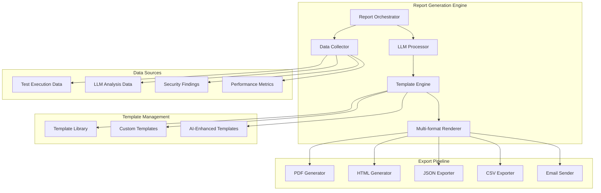
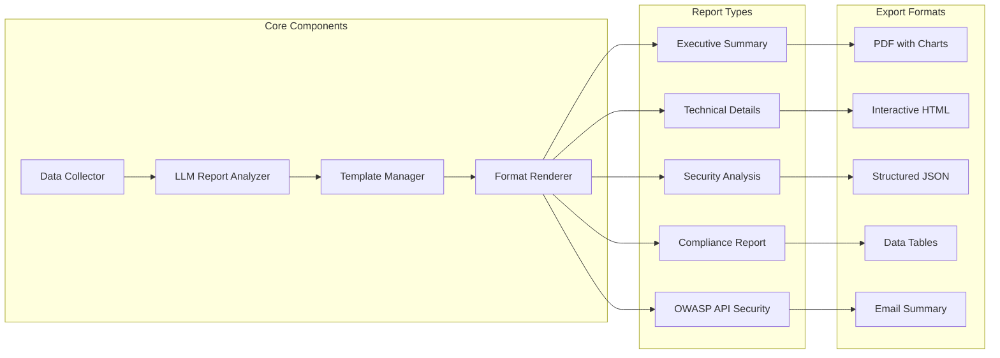
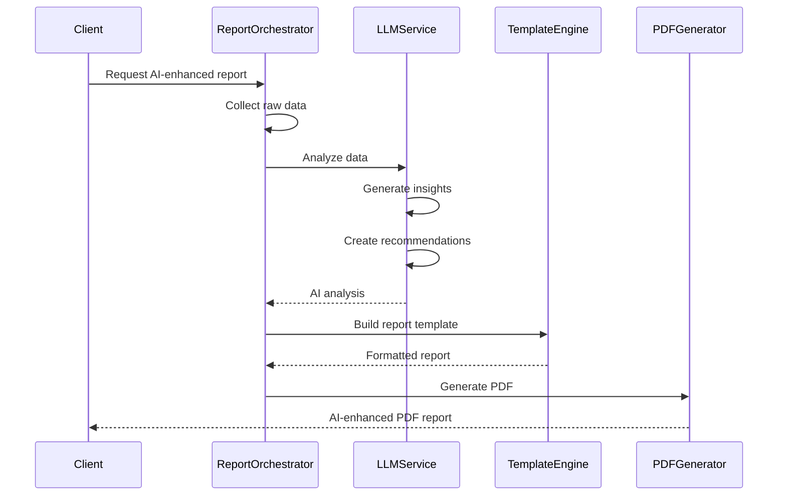
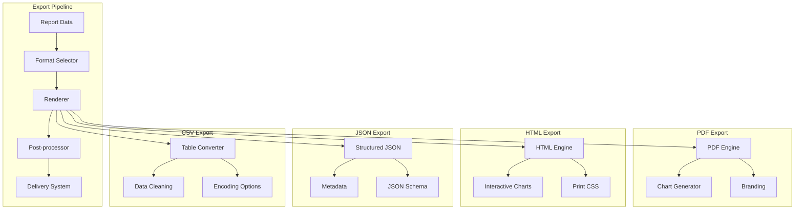
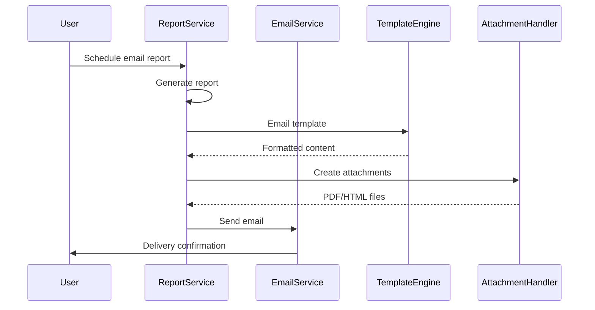
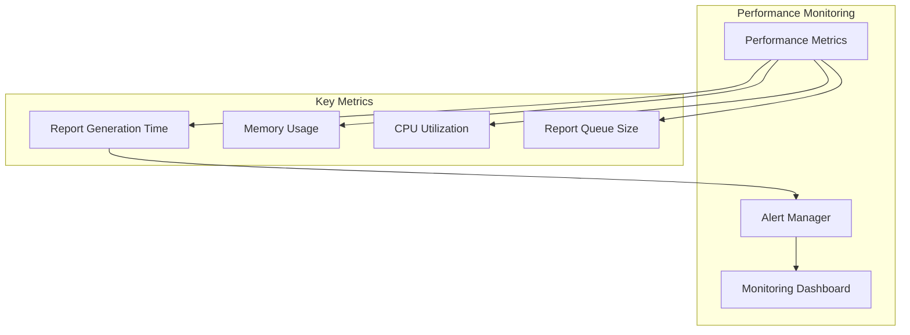
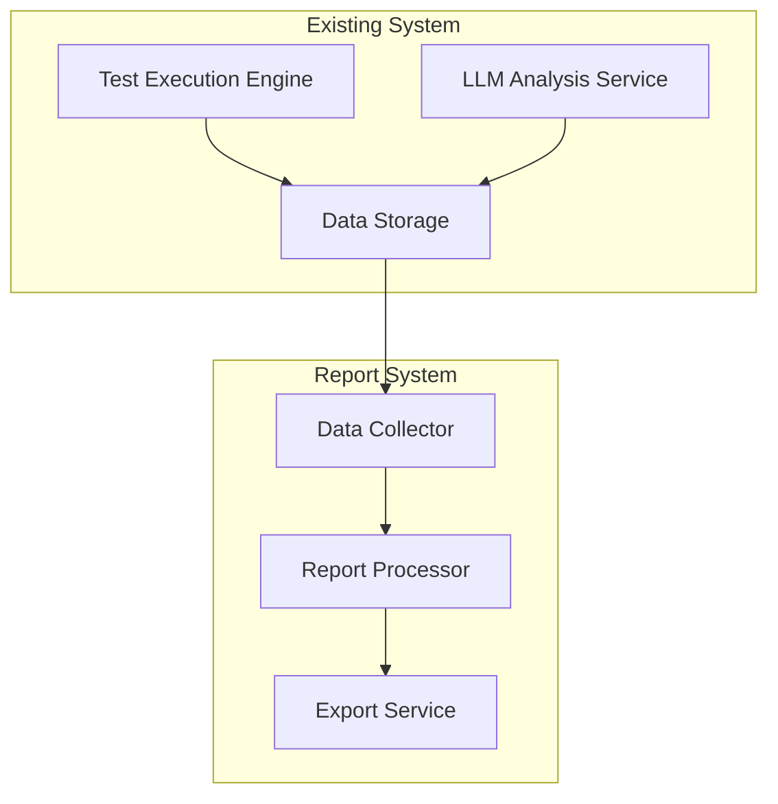

# Детальная система генерации отчетов для SecurityOrchestrator

## Обзор системы отчетности

Система генерации отчетов SecurityOrchestrator обеспечивает комплексное создание, настройку и экспорт тестовых отчетов в различных форматах с использованием LLM для автоматического анализа и комментариев.

## 1. Архитектура системы отчетов

### 1.1 Высокоуровневая архитектура



### 1.2 Компоненты системы



## 2. Типы отчетов

### 2.1 Executive Summary Report

**Назначение:** Высокоуровневый отчет для руководства и стейкхолдеров

**Содержание:**
- Общая статистика тестирования
- Ключевые метрики безопасности
- Критические находки
- Рекомендации по улучшению
- Сравнение с предыдущими периодами

**Структура:**
```yaml
Executive Summary:
  - Project Overview
    - Test Coverage: 87%
    - Total Tests: 156
    - Success Rate: 94.2%
    - Security Score: A+
  
  - Key Findings
    - Critical: 2 issues
    - High: 5 issues
    - Medium: 12 issues
    - Low: 8 issues
  
  - Recommendations
    - Implement rate limiting
    - Add input validation
    - Update authentication tokens
```

### 2.2 Technical Detailed Report

**Назначение:** Подробный технический отчет для разработчиков

**Содержание:**
- Детальные результаты тестирования каждого endpoint
- Логи выполнения тестов
- Временные метрики
- Валидация схем API
- BPMN процесс анализ

**Структура:**
```yaml
Technical Report:
  - API Testing Results
    - Endpoints Tested: 45
    - Response Times: avg 125ms
    - Schema Validation: 98% passed
    - Error Rate: 1.2%
  
  - BPMN Analysis
    - Process Steps: 23
    - Gateways: 5
    - Parallel Execution: 3 paths
    - Average Duration: 2.3 seconds
```

### 2.3 Security Analysis Report

**Назначение:** Специализированный отчет по безопасности

**Содержание:**
- OWASP API Security Top 10 анализ
- Уязвимости по категориям
- Векторы атак
- Рекомендации по устранению
- Risk Assessment

**Структура:**
```yaml
Security Report:
  - OWASP Categories
    - Broken Object Level Authorization: 3 issues
    - Broken User Authentication: 1 issue
    - Excessive Data Exposure: 2 issues
    - Lack of Resources & Rate Limiting: 4 issues
    - Broken Function Level Authorization: 1 issue
  
  - Risk Assessment
    - Overall Risk: Medium
    - Critical Risk: High
    - Compliance Score: 85%
```

### 2.4 OWASP API Security Report

**Назначение:** Специализированный отчет по OWASP стандартам

**Содержание:**
- Детальный анализ по каждому OWASP пункту
- Код примеры уязвимых мест
- Практические рекомендации
- Compliance mapping

**Структура:**
```yaml
OWASP Report:
  - API1:2019 Broken Object Level Authorization
    - Test Cases: 12
    - Failed: 3
    - Severity: High
    - Recommendation: Implement object-level authorization
  
  - API2:2019 Broken User Authentication
    - Test Cases: 8
    - Failed: 1
    - Severity: Critical
    - Recommendation: Strengthen token validation
```

## 3. LLM-Enhanced отчеты

### 3.1 AI-анализ результатов



### 3.2 Интеллектуальные комментарии

**LLM анализ включает:**
- Автоматическое выявление паттернов в ошибках
- Предиктивный анализ потенциальных проблем
- Контекстуальные рекомендации
- Сравнение с industry best practices
- Анализ compliance с регуляторными требованиями

**Пример LLM комментариев:**
```yaml
LLM Analysis:
  patterns_identified:
    - "Rate limiting consistently fails on POST requests"
    - "Authentication tokens expire 30% earlier than documented"
    - "Schema validation errors follow specific pattern"
  
  recommendations:
    - "Consider implementing circuit breaker pattern for rate limiting"
    - "Update API documentation to reflect actual token expiration"
    - "Investigate potential schema design issues"
  
  risk_assessment:
    - "Current security posture: Medium risk"
    - "Primary concerns: Authentication and rate limiting"
    - "Estimated remediation effort: 2-3 sprints"
```

## 4. Шаблоны отчетов

### 4.1 Template Engine Architecture

```mermaid
graph TB
    subgraph "Template System"
        TEMPLATE_PARSER[Template Parser]
        VARIABLE_RESOLVER[Variable Resolver]
        CONDITION_ENGINE[Condition Engine]
        LOOP_PROCESSOR[Loop Processor]
        FUNCTION_LIBRARY[Function Library]
    end

    subgraph "Data Binding"
        DATA_MAPPER[Data Mapper]
        CONTEXT_BUILDER[Context Builder]
        VALIDATOR[Template Validator]
    end

    subgraph "Customization"
        PARAMETER_EDITOR[Parameter Editor]
        STYLE_ENGINE[Style Engine]
        BRAND_ENGINE[Branding Engine]
    end

    TEMPLATE_PARSER --> VARIABLE_RESOLVER
    VARIABLE_RESOLVER --> CONDITION_ENGINE
    CONDITION_ENGINE --> LOOP_PROCESSOR
    LOOP_PROCESSOR --> FUNCTION_LIBRARY
    DATA_MAPPER --> CONTEXT_BUILDER
    CONTEXT_BUILDER --> VALIDATOR
    PARAMETER_EDITOR --> STYLE_ENGINE
    STYLE_ENGINE --> BRAND_ENGINE
```



### 4.2 Template Types

**Статические шаблоны:**
- Предопределенные макеты
- Фиксированная структура
- Минимальная настройка

**Динамические шаблоны:**
- Настраиваемые разделы
- Условное отображение
- Динамические таблицы

**AI-Enhanced шаблоны:**
- LLM-генерируемые секции
- Интеллектуальные рекомендации
- Адаптивный контент

### 4.3 Template Examples

**Executive Summary Template:**
```handlebars
# {{project_name}} - Security Testing Report

**Generated on:** {{generation_date}}
**Test Coverage:** {{coverage_percentage}}%
**Overall Security Score:** {{security_score}}

## Key Metrics
- Total Tests: {{total_tests}}
- Passed: {{tests_passed}}
- Failed: {{tests_failed}}
- Success Rate: {{success_rate}}%

## Critical Findings
{{#if critical_findings}}
{{#each critical_findings}}
- **{{title}}** ({{severity}}): {{description}}
{{/each}}
{{else}}
No critical findings identified.
{{/if}}

## LLM Analysis & Recommendations
{{ai_analysis}}
```

**Technical Report Template:**
```handlebars
# Technical Test Results

## API Testing Summary
{{#each api_endpoints}}
### {{method}} {{path}}
- Status: {{status}}
- Response Time: {{response_time}}ms
- Schema Valid: {{schema_valid}}
- Issues: {{#if issues}}{{issues.length}} found{{else}}None{{/if}}

{{#if issues}}
#### Issues Found:
{{#each issues}}
- {{type}}: {{description}} (Severity: {{severity}})
{{/each}}
{{/if}}
{{/each}}

## BPMN Process Analysis
- Total Steps: {{bpmn_steps}}
- Parallel Paths: {{parallel_paths}}
- Average Duration: {{avg_duration}}s
- Bottlenecks: {{#if bottlenecks}}{{bottlenecks.length}} identified{{else}}None{{/if}}
```

## 5. Экспорт и доставка

### 5.1 Форматы экспорта



### 5.2 PDF Generation

**Возможности PDF экспорта:**
- Высококачественные графики и диаграммы
- Кастомное брендирование
- Интерактивные закладки
- Метаданные документа
- Защита паролем

**Технические детали:**
```java
@Component
public class PDFReportGenerator {
    
    public byte[] generatePDF(ReportData data) {
        Document document = new Document();
        ByteArrayOutputStream stream = new ByteArrayOutputStream();
        
        // Add branding and headers
        addBrandHeader(document);
        
        // Add executive summary
        addExecutiveSummary(document, data);
        
        // Add charts and visualizations
        addSecurityCharts(document, data);
        
        // Add detailed findings
        addDetailedFindings(document, data);
        
        // Add LLM analysis
        addLLMAnalysis(document, data);
        
        // Generate PDF
        PdfWriter.getInstance(document, stream);
        document.close();
        
        return stream.toByteArray();
    }
}
```

### 5.3 Интерактивный HTML

**Возможности HTML экспорта:**
- Интерактивные диаграммы (Chart.js, D3.js)
- Фильтрация и поиск
- Responsive дизайн
- Экспорт в печать
- Темная/светлая тема

**Структура HTML отчета:**
```html
<!DOCTYPE html>
<html>
<head>
    <title>Security Testing Report</title>
    <link rel="stylesheet" href="report-styles.css">
    <script src="chart.js"></script>
</head>
<body>
    <header>
        <h1>Security Testing Report</h1>
        <div class="filters">
            <select id="severity-filter">
                <option value="all">All Severities</option>
                <option value="critical">Critical</option>
                <option value="high">High</option>
            </select>
        </div>
    </header>
    
    <main>
        <section id="summary">
            <div class="metric-cards">
                <div class="card" data-severity="all">
                    <h3>Total Tests</h3>
                    <span class="value">156</span>
                </div>
            </div>
        </section>
        
        <section id="charts">
            <canvas id="securityChart"></canvas>
        </section>
        
        <section id="findings">
            <table id="findings-table">
                <!-- Dynamic content -->
            </table>
        </section>
    </main>
    
    <script>
        // Interactive functionality
        initializeFilters();
        renderCharts();
        populateTable();
    </script>
</body>
</html>
```

### 5.4 Email доставка



## 6. API Endpoints для отчетов

### 6.1 Report Management

```yaml
# Report Generation
POST   /api/v1/reports/generate          # Generate new report
GET    /api/v1/reports/{id}              # Get report details
GET    /api/v1/reports/{id}/download     # Download report
POST   /api/v1/reports/{id}/email        # Email report
DELETE /api/v1/reports/{id}              # Delete report

# Report Templates
GET    /api/v1/reports/templates         # List available templates
POST   /api/v1/reports/templates         # Create custom template
PUT    /api/v1/reports/templates/{id}    # Update template
DELETE /api/v1/reports/templates/{id}    # Delete template

# Report Scheduling
POST   /api/v1/reports/schedule          # Schedule recurring reports
GET    /api/v1/reports/schedules         # List scheduled reports
PUT    /api/v1/reports/schedules/{id}    # Update schedule
DELETE /api/v1/reports/schedules/{id}    # Cancel schedule
```

### 6.2 Report Configuration

```yaml
# Report Configuration
POST   /api/v1/reports/configure         # Configure report settings
GET    /api/v1/reports/config/{type}     # Get report type config
PUT    /api/v1/reports/config/{type}     # Update report config

# Export Options
GET    /api/v1/reports/formats           # Available export formats
POST   /api/v1/reports/export/{id}       # Export in specific format

# Branding & Customization
POST   /api/v1/reports/branding          # Set branding options
GET    /api/v1/reports/branding/{id}     # Get branding config
PUT    /api/v1/reports/branding/{id}     # Update branding
```

## 7. Performance и масштабирование

### 7.1 Оптимизация генерации

**Кэширование:**
- Кэш шаблонов
- Кэш данных отчетов
- Кэш графиков и изображений

**Асинхронная генерация:**
- Фоновые задачи для больших отчетов
- Progress tracking через WebSocket
- Email уведомления о готовности

**Память-эффективность:**
- Streaming генерация для больших отчетов
- Очистка ресурсов после генерации
- Оптимизация изображений

### 7.2 Мониторинг производительности



## 8. Интеграция с существующей системой

### 8.1 Data Flow интеграция



### 8.2 Configuration Integration

Система отчетов интегрируется с существующей конфигурацией SecurityOrchestrator:

```yaml
# Application configuration
reporting:
  enabled: true
  default_format: "pdf"
  template_directory: "templates/reports"
  export_directory: "exports/reports"
  retention_days: 30
  
  llm_enhancement:
    enabled: true
    provider: "openrouter"
    model: "claude-3-sonnet"
    max_tokens: 2048
  
  email:
    smtp_host: "localhost"
    smtp_port: 587
    default_recipients: []
  
  scheduling:
    enabled: true
    daily_reports: "08:00"
    weekly_reports: "monday 09:00"
```

Эта детальная система генерации отчетов обеспечивает комплексное решение для создания, настройки и экспорта профессиональных отчетов с использованием LLM технологий для интеллектуального анализа и рекомендаций.