# Security Orchestrator - Security Architecture

## Overview

The Security Orchestrator implements a **comprehensive multi-layered security architecture** designed to protect enterprise-grade security testing workflows and sensitive data. The system follows defense-in-depth principles with security controls at every layer - from network infrastructure to application logic, data storage, and user interface.

## Security Architecture Overview

```mermaid
graph TB
    %% Network Security Layer
    subgraph "Network Security Layer"
        WAF[Web Application Firewall]
        DDOS[DDoS Protection]
        LOAD_BALANCER[Load Balancer]
        VPN[VPN Gateway]
        NETWORK_ISOLATION[Network Isolation]
    end
    
    %% Perimeter Security
    subgraph "Perimeter Security"
        EDGE_PROTECTION[Edge Protection]
        INTRUSION_DETECTION[Intrusion Detection]
        THREAT_INTELLIGENCE[Threat Intelligence]
        GEO_BLOCKING[Geo-blocking]
    end
    
    %% Application Security Layer
    subgraph "Application Security Layer"
        API_GATEWAY[API Gateway Security]
        AUTH_SERVICE[Authentication Service]
        AUTHORIZATION[Authorization Service]
        INPUT_VALIDATION[Input Validation]
        OUTPUT_ENCRYPTION[Output Encryption]
    end
    
    %% Business Logic Security
    subgraph "Business Logic Security"
        SECURE_CODE[Secure Code Implementation]
        BUSINESS_LOGIC_PROTECTION[Business Logic Protection]
        FRAUD_DETECTION[Fraud Detection]
        SESSION_MANAGEMENT[Session Management]
        CSRF_PROTECTION[CSRF Protection]
    end
    
    %% Data Security Layer
    subgraph "Data Security Layer"
        ENCRYPTION_AT_REST[Encryption at Rest]
        ENCRYPTION_IN_TRANSIT[Encryption in Transit]
        DATA_MASKING[Data Masking]
        ACCESS_CONTROL[Data Access Control]
        AUDIT_LOGGING[Audit Logging]
    end
    
    %% Identity & Access Management
    subgraph "Identity & Access Management"
        SSO[Single Sign-On]
        MFA[Multi-Factor Authentication]
        ROLE_BASED_ACCESS[Role-Based Access Control]
        IDENTITY_PROVIDER[Identity Provider Integration]
        PRIVILEGE_MANAGEMENT[Privilege Management]
    end
    
    %% Compliance & Governance
    subgraph "Compliance & Governance"
        COMPLIANCE_FRAMEWORK[Compliance Framework]
        POLICY_ENGINE[Policy Engine]
        RISK_ASSESSMENT[Risk Assessment]
        COMPLIANCE_MONITORING[Compliance Monitoring]
        AUDIT_TRAIL[Audit Trail]
    end
    
    %% Monitoring & Incident Response
    subgraph "Security Monitoring"
        SIEM[Security Information and Event Management]
        INCIDENT_RESPONSE[Incident Response]
        THREAT_HUNTING[Threat Hunting]
        SECURITY_ANALYTICS[Security Analytics]
        ALERT_MANAGEMENT[Alert Management]
    end
    
    %% External Security Controls
    subgraph "External Security Controls"
        THIRD_PARTY_SCAN[Third-party Security Scans]
        VULNERABILITY_SCANNING[Vulnerability Scanning]
        PENETRATION_TESTING[Penetration Testing]
        SECURITY_ASSESSMENT[Security Assessment]
    end
    
    %% Connections
    WAF --> DDOS
    DDOS --> LOAD_BALANCER
    LOAD_BALANCER --> VPN
    VPN --> NETWORK_ISOLATION
    
    NETWORK_ISOLATION --> EDGE_PROTECTION
    EDGE_PROTECTION --> INTRUSION_DETECTION
    INTRUSION_DETECTION --> THREAT_INTELLIGENCE
    THREAT_INTELLIGENCE --> GEO_BLOCKING
    
    GEO_BLOCKING --> API_GATEWAY
    API_GATEWAY --> AUTH_SERVICE
    AUTH_SERVICE --> AUTHORIZATION
    AUTHORIZATION --> INPUT_VALIDATION
    INPUT_VALIDATION --> OUTPUT_ENCRYPTION
    
    OUTPUT_ENCRYPTION --> SECURE_CODE
    SECURE_CODE --> BUSINESS_LOGIC_PROTECTION
    BUSINESS_LOGIC_PROTECTION --> FRAUD_DETECTION
    FRAUD_DETECTION --> SESSION_MANAGEMENT
    SESSION_MANAGEMENT --> CSRF_PROTECTION
    
    CSRF_PROTECTION --> ENCRYPTION_AT_REST
    ENCRYPTION_AT_REST --> ENCRYPTION_IN_TRANSIT
    ENCRYPTION_IN_TRANSIT --> DATA_MASKING
    DATA_MASKING --> ACCESS_CONTROL
    ACCESS_CONTROL --> AUDIT_LOGGING
    
    ACCESS_CONTROL --> SSO
    SSO --> MFA
    MFA --> ROLE_BASED_ACCESS
    ROLE_BASED_ACCESS --> IDENTITY_PROVIDER
    IDENTITY_PROVIDER --> PRIVILEGE_MANAGEMENT
    
    PRIVILEGE_MANAGEMENT --> COMPLIANCE_FRAMEWORK
    COMPLIANCE_FRAMEWORK --> POLICY_ENGINE
    POLICY_ENGINE --> RISK_ASSESSMENT
    RISK_ASSESSMENT --> COMPLIANCE_MONITORING
    COMPLIANCE_MONITORING --> AUDIT_TRAIL
    
    AUDIT_TRAIL --> SIEM
    SIEM --> INCIDENT_RESPONSE
    INCIDENT_RESPONSE --> THREAT_HUNTING
    THREAT_HUNTING --> SECURITY_ANALYTICS
    SECURITY_ANALYTICS --> ALERT_MANAGEMENT
    
    ALERT_MANAGEMENT --> THIRD_PARTY_SCAN
    THIRD_PARTY_SCAN --> VULNERABILITY_SCANNING
    VULNERABILITY_SCANNING --> PENETRATION_TESTING
    PENETRATION_TESTING --> SECURITY_ASSESSMENT
    
    %% Styling
    classDef network fill:#e8f5e8
    classDef perimeter fill:#e3f2fd
    classDef application fill:#f3e5f5
    classDef business fill:#fff3e0
    classDef data fill:#ffebee
    classDef identity fill:#e0f2f1
    classDef compliance fill:#f1f8e9
    classDef monitoring fill:#fce4ec
    classDef external fill:#f3e5f5
    
    class WAF,DDOS,LOAD_BALANCER,VPN,NETWORK_ISOLATION network
    class EDGE_PROTECTION,INTRUSION_DETECTION,THREAT_INTELLIGENCE,GEO_BLOCKING perimeter
    class API_GATEWAY,AUTH_SERVICE,AUTHORIZATION,INPUT_VALIDATION,OUTPUT_ENCRYPTION application
    class SECURE_CODE,BUSINESS_LOGIC_PROTECTION,FRAUD_DETECTION,SESSION_MANAGEMENT,CSRF_PROTECTION business
    class ENCRYPTION_AT_REST,ENCRYPTION_IN_TRANSIT,DATA_MASKING,ACCESS_CONTROL,AUDIT_LOGGING data
    class SSO,MFA,ROLE_BASED_ACCESS,IDENTITY_PROVIDER,PRIVILEGE_MANAGEMENT identity
    class COMPLIANCE_FRAMEWORK,POLICY_ENGINE,RISK_ASSESSMENT,COMPLIANCE_MONITORING,AUDIT_TRAIL compliance
    class SIEM,INCIDENT_RESPONSE,THREAT_HUNTING,SECURITY_ANALYTICS,ALERT_MANAGEMENT monitoring
    class THIRD_PARTY_SCAN,VULNERABILITY_SCANNING,PENETRATION_TESTING,SECURITY_ASSESSMENT external
```

## Identity & Access Management (IAM)

### Authentication Architecture

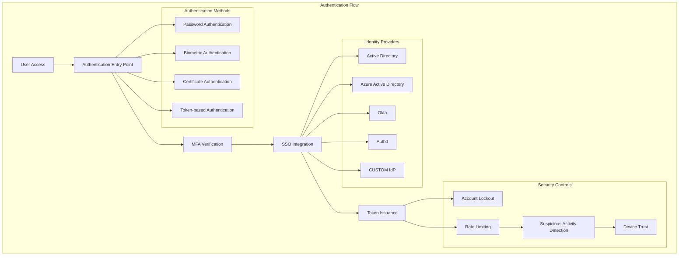

### Authorization & Access Control

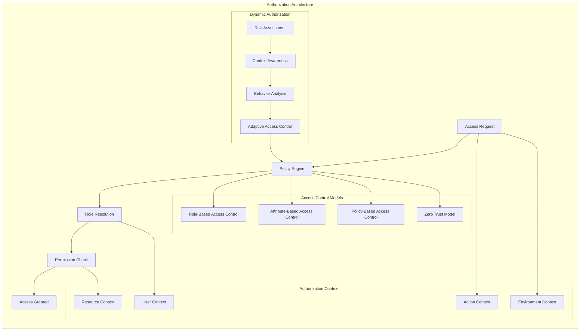

### Session Management Security

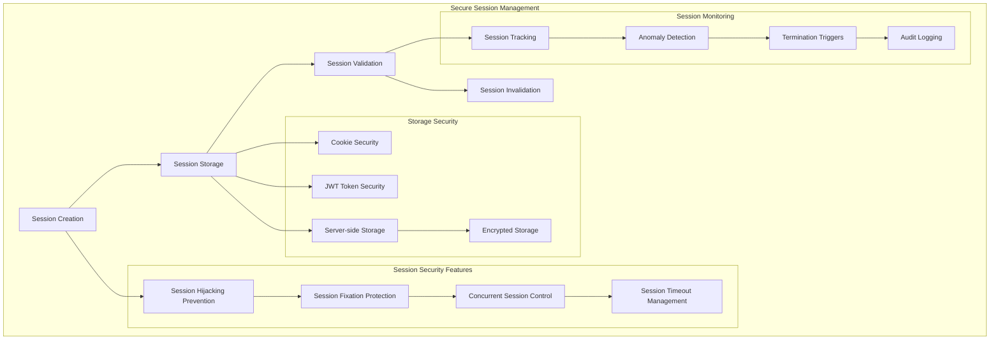

## API Security Architecture

### API Gateway Security

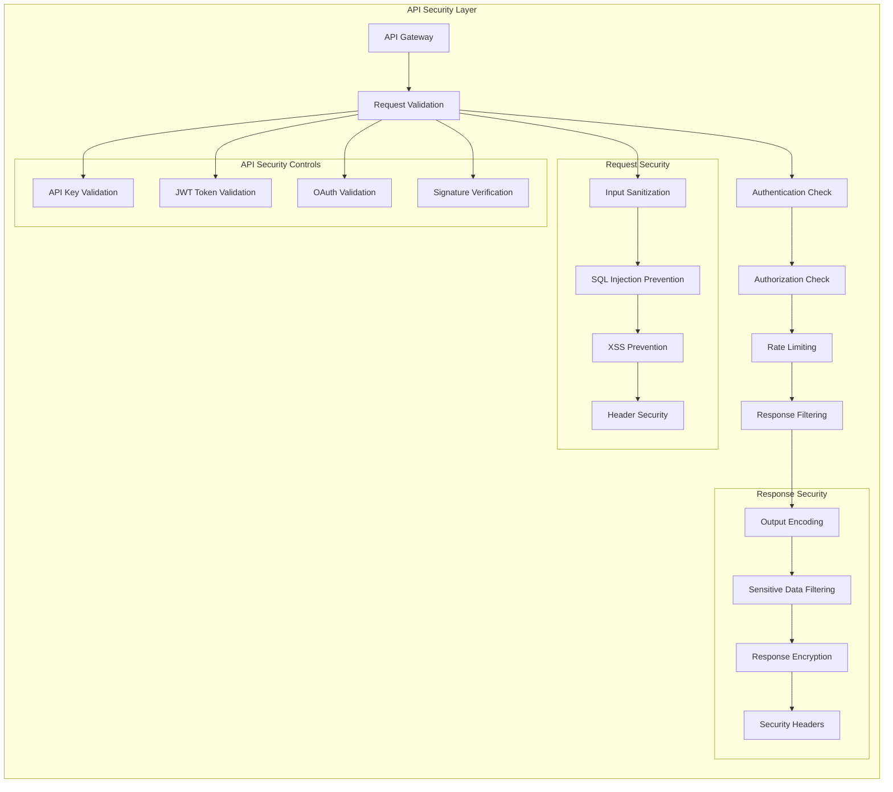

### Web Application Firewall (WAF)

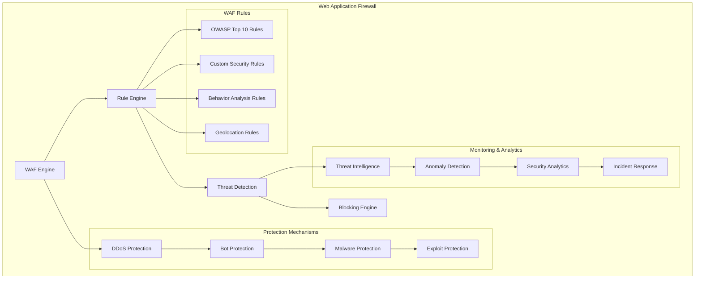

## Data Security Architecture

### Encryption & Data Protection

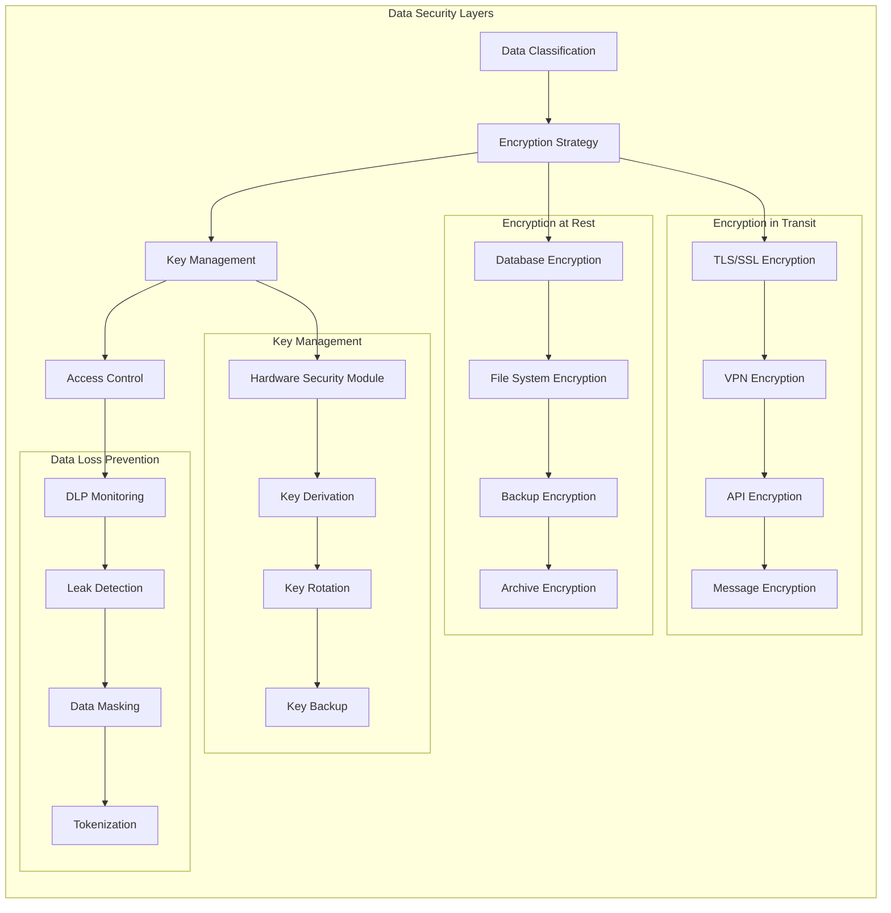

### Database Security Architecture

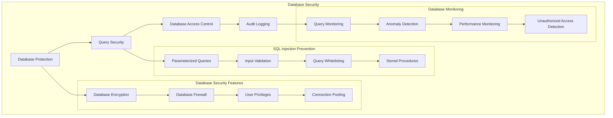

## Network Security Architecture

### Network Segmentation

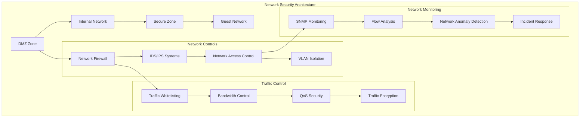

### Zero Trust Architecture

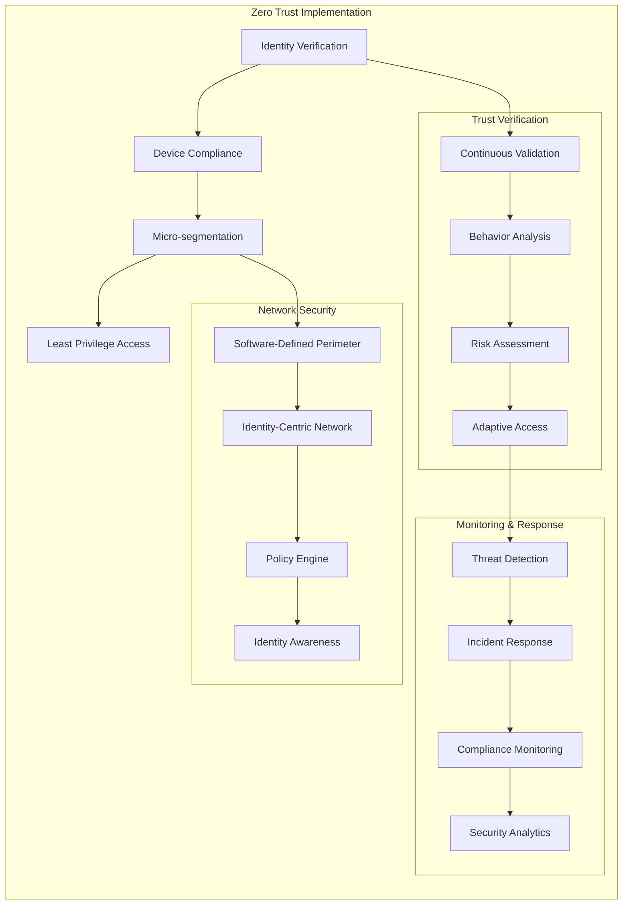

## Compliance & Governance

### Compliance Framework

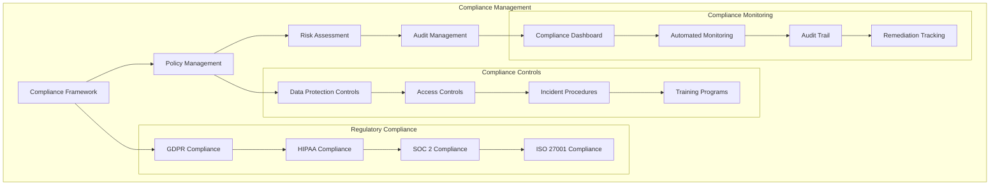

### Risk Management Framework

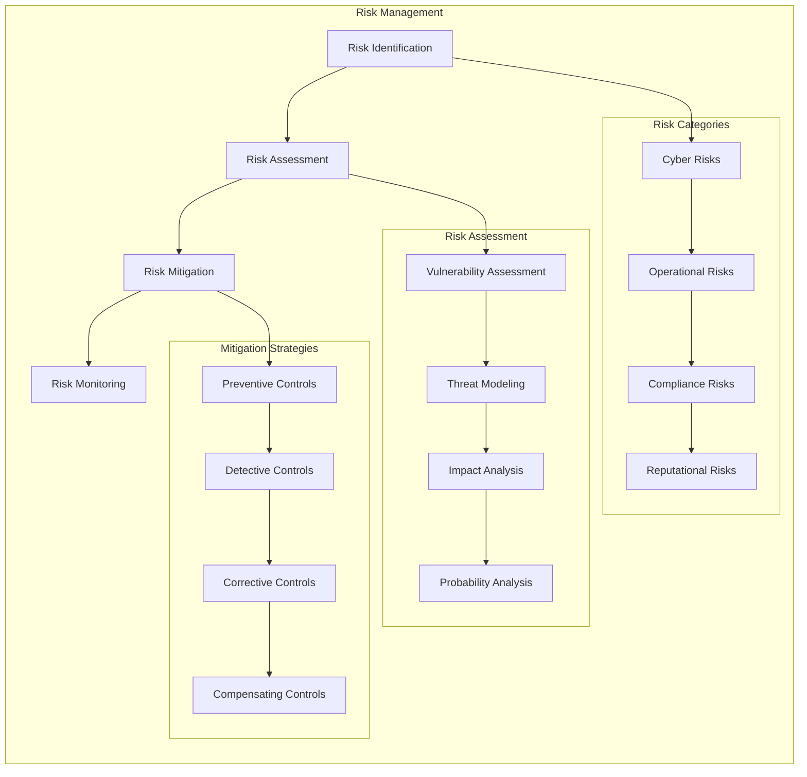

## Security Monitoring & Incident Response

### Security Operations Center (SOC)

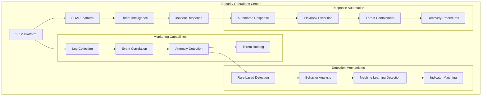

### Incident Response Workflow

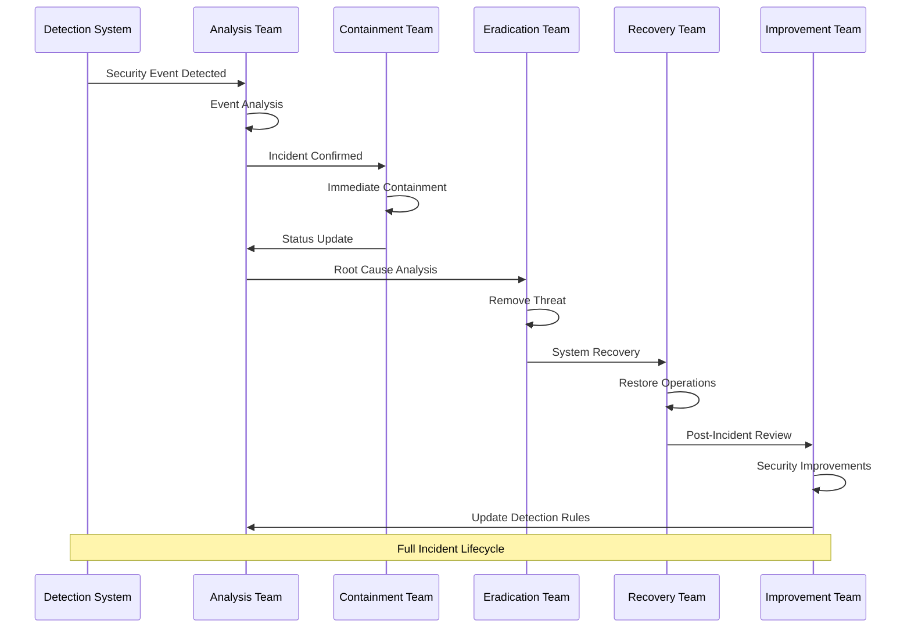

## Security Testing & Validation

### Security Testing Framework

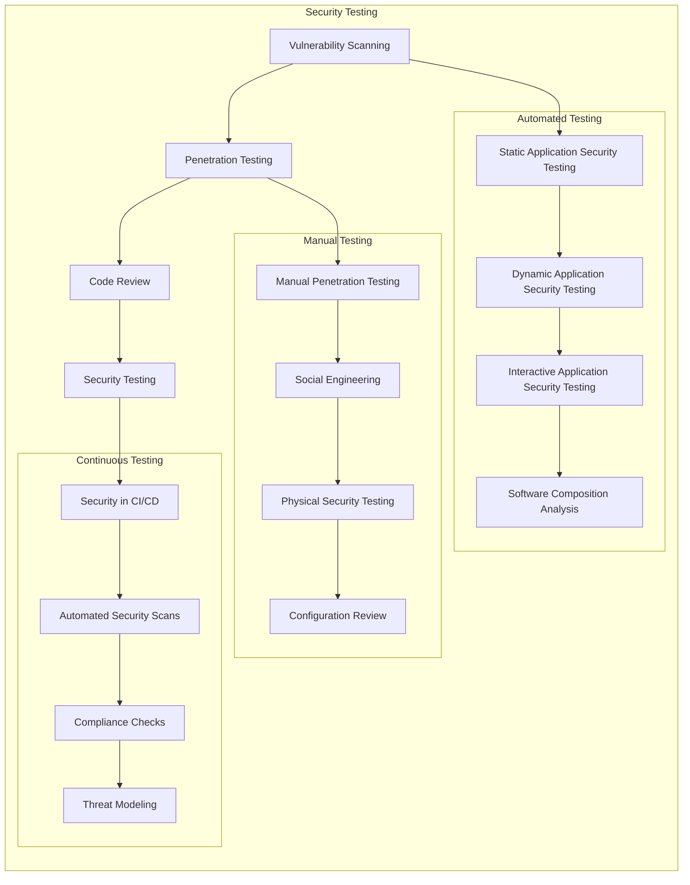

This comprehensive security architecture provides enterprise-grade protection for the Security Orchestrator platform, ensuring confidentiality, integrity, availability, and compliance across all system layers while maintaining operational efficiency and user experience.