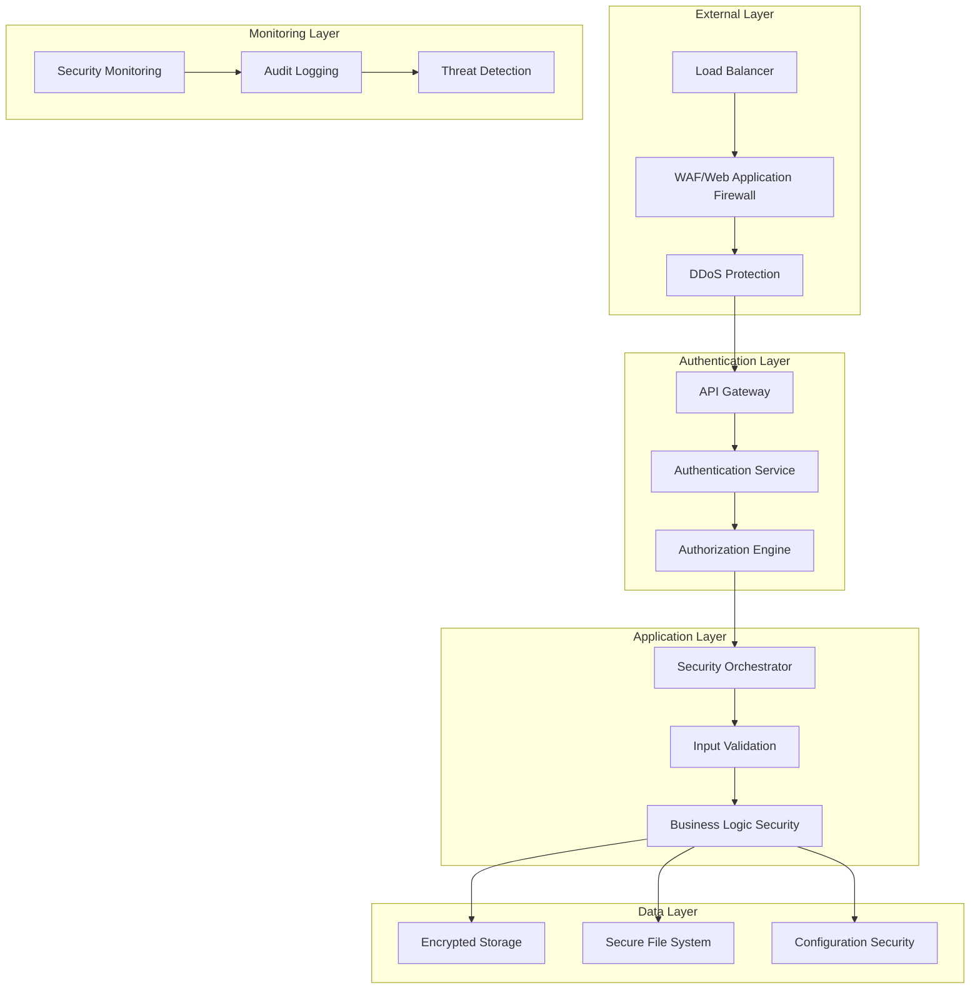

# Security Orchestrator - Security Best Practices

## Table of Contents

1. [Enterprise Security Overview](#enterprise-security-overview)
2. [Authentication and Authorization](#authentication-and-authorization)
3. [API Security](#api-security)
4. [Input Validation and Data Protection](#input-validation-and-data-protection)
5. [LLM Integration Security](#llm-integration-security)
6. [File Upload Security](#file-upload-security)
7. [Infrastructure Security](#infrastructure-security)
8. [Network Security](#network-security)
9. [Data Protection and Privacy](#data-protection-and-privacy)
10. [Monitoring and Incident Response](#monitoring-and-incident-response)
11. [Compliance and Audit](#compliance-and-audit)
12. [Production Security Configuration](#production-security-configuration)
13. [Vulnerability Management](#vulnerability-management)
14. [Security Testing](#security-testing)
15. [Emergency Procedures](#emergency-procedures)
16. [Implementation Examples](#implementation-examples)
17. [Security Playbooks](#security-playbooks)
18. [Monitoring Procedures](#monitoring-procedures)

---

## Enterprise Security Overview

Security Orchestrator implements security-by-design principles following enterprise-grade security standards. This document outlines comprehensive security practices for deploying and operating the system in production environments.

### Security Principles

- **Defense in Depth**: Multiple layers of security controls
- **Zero Trust Architecture**: Verify everything, trust nothing by default
- **Least Privilege**: Minimum necessary access for all components
- **Data Minimization**: Collect and process only necessary data
- **Secure by Default**: All security features enabled by default

### Security Architecture



---

## Authentication and Authorization

### API Authentication

#### Production API Key Authentication

**Implementation:**
```java
// API Key validation in SecurityConfiguration
@Component
public class ApiKeyAuthenticationFilter extends OncePerRequestFilter {
    
    @Override
    protected void doFilterInternal(HttpServletRequest request, 
                                  HttpServletResponse response,
                                  FilterChain filterChain) throws IOException, ServletException {
        
        String apiKey = extractApiKey(request);
        
        if (!isValidApiKey(apiKey)) {
            response.setStatus(HttpStatus.UNAUTHORIZED.value());
            response.getWriter().write("{\"error\":\"Invalid or missing API key\"}");
            return;
        }
        
        // Set authentication context
        SecurityContextHolder.getContext().setAuthentication(
            new ApiKeyAuthentication(apiKey));
            
        filterChain.doFilter(request, response);
    }
}
```

**API Key Configuration:**
```yaml
# production-security.yml
security:
  api:
    enabled: true
    keyHashAlgorithm: SHA-256
    keyRotationDays: 90
    keys:
      - id: "prod-key-001"
        hash: "hashed-api-key"
        permissions: ["read", "write", "admin"]
        expiresAt: "2024-06-01T00:00:00Z"
```

#### JWT Token Authentication (Recommended)

**JWT Configuration:**
```java
@Configuration
@EnableWebSecurity
public class SecurityConfig {
    
    @Bean
    public SecurityFilterChain filterChain(HttpSecurity http) throws Exception {
        http
            .csrf(csrf -> csrf.disable())
            .sessionManagement(session -> 
                session.sessionCreationPolicy(SessionCreationPolicy.STATELESS))
            .authorizeHttpRequests(authz -> authz
                .requestMatchers("/api/health", "/api/openapi/examples").permitAll()
                .requestMatchers("/api/**").authenticated()
                .anyRequest().hasRole("ADMIN"))
            .oauth2ResourceServer(oauth2 -> oauth2.jwt());
            
        return http.build();
    }
}
```

### Role-Based Access Control (RBAC)

#### User Roles and Permissions

```yaml
# security-roles.yml
roles:
  admin:
    permissions:
      - "analysis:*"
      - "monitoring:*"
      - "system:*"
      - "user:*"
    description: "Full system access"
    
  analyst:
    permissions:
      - "analysis:create"
      - "analysis:read"
      - "analysis:update"
      - "openapi:analyze"
      - "bpmn:analyze"
    description: "Security analysis operations"
    
  viewer:
    permissions:
      - "analysis:read"
      - "monitoring:read"
    description: "Read-only access"
    
  guest:
    permissions:
      - "health:read"
      - "examples:read"
    description: "Limited public access"
```

#### Permission-Based Access Control

```java
// Custom permission evaluator
@Component
public class SecurityPermissionEvaluator implements PermissionEvaluator {
    
    @Override
    public boolean hasPermission(Authentication authentication, 
                                Object targetDomainObject, Object permission) {
        
        String userRole = authentication.getAuthorities().stream()
            .map(GrantedAuthority::getAuthority)
            .findFirst()
            .orElse("guest");
            
        Map<String, List<String>> rolePermissions = getRolePermissions();
        List<String> userPermissions = rolePermissions.get(userRole);
        
        return userPermissions != null && 
               userPermissions.contains(permission.toString());
    }
}
```

---

## API Security

### Rate Limiting

#### Implementation

```java
@Configuration
public class RateLimitingConfig {
    
    @Bean
    public RateLimiter analysisProcessLimiter() {
        return RateLimiter.create("analysis-processes", 
            RateLimiterConfig.custom()
                .limitRefreshPeriod(Duration.ofMinutes(1))
                .limitForPeriod(100) // 100 requests per minute
                .timeoutDuration(Duration.ofSeconds(1))
                .build());
    }
    
    @EventListener
    public void handleRateLimitExceeded(RateLimitExceededEvent event) {
        // Log security event
        logger.warn("Rate limit exceeded for IP: {}", event.getClientIp());
        
        // Send alert for potential abuse
        securityAlertService.sendAlert(
            "RATE_LIMIT_EXCEEDED", 
            event.getClientIp(),
            "High frequency API requests detected"
        );
    }
}
```

#### Rate Limiting Rules

| Endpoint Category | Limit | Time Window |
|-------------------|-------|-------------|
| Health checks | 1000/minute | 1 minute |
| Analysis creation | 100/hour | 1 hour |
| File uploads | 50/hour | 1 hour |
| Monitoring queries | 500/minute | 1 minute |
| General API calls | 1000/hour | 1 hour |

### Request Size Limits

```java
@Configuration
public class SecurityLimitsConfig {
    
    @Value("${security.upload.max.size:5242880}") // 5MB default
    private long maxUploadSize;
    
    @Bean
    public MultipartConfigElement multipartConfigElement() {
        MultipartConfigFactory factory = new MultipartConfigFactory();
        factory.setMaxFileSize(DataSize.ofBytes(maxUploadSize));
        factory.setMaxRequestSize(DataSize.ofBytes(maxUploadSize));
        return factory.createMultipartConfig();
    }
}
```

### API Security Headers

```java
@Configuration
public class SecurityHeadersConfig {
    
    @Bean
    public SecurityFilterChain securityFilterChain(HttpSecurity http) throws Exception {
        http
            .headers(headers -> headers
                .frameOptions().deny()
                .contentTypeOptions().and()
                .httpStrictTransportSecurity(hstsConfig -> hstsConfig
                    .maxAgeInSeconds(31536000)
                    .includeSubdomains(true)
                    .preload(true))
                .referrerPolicy(referrer -> referrer
                    .policy(ReferrerPolicy.STRICT_ORIGIN_WHEN_CROSS_ORIGIN))
                .addHeaderWriter(new ContentSecurityPolicyHeaderWriter(
                    "default-src 'self'; " +
                    "script-src 'self' 'unsafe-inline'; " +
                    "style-src 'self' 'unsafe-inline'; " +
                    "img-src 'self' data:; " +
                    "connect-src 'self' ws: wss:;"))
                .addHeaderWriter(new XContentTypeOptionsHeaderWriter(
                    XContentTypeOptionsHeaderWriter.XContentTypeOptions.NOSNIFF))
                .addHeaderWriter(new XFrameOptionsHeaderWriter(
                    XFrameOptionsHeaderWriter.XFrameOptions.DENY)));
                    
        return http.build();
    }
}
```

---

## Input Validation and Data Protection

### File Upload Security

#### File Type Validation

```java
@Component
public class SecureFileUploadValidator {
    
    private static final Set<String> ALLOWED_BPMN_EXTENSIONS = 
        Set.of(".xml", ".bpmn");
    private static final Set<String> ALLOWED_OPENAPI_EXTENSIONS = 
        Set.of(".json", ".yaml", ".yml");
    private static final Set<String> ALLOWED_CONTENT_TYPES = Set.of(
        "application/xml",
        "text/xml",
        "application/json",
        "text/yaml",
        "application/yaml"
    );
    
    public ValidationResult validateFileUpload(MultipartFile file) {
        ValidationResult result = new ValidationResult();
        
        // Check file size
        if (file.getSize() > MAX_FILE_SIZE) {
            result.addError("File size exceeds maximum allowed size");
        }
        
        // Validate file extension
        String originalFilename = file.getOriginalFilename();
        if (originalFilename != null) {
            String extension = getFileExtension(originalFilename);
            if (!isAllowedExtension(extension)) {
                result.addError("File type not allowed: " + extension);
            }
        }
        
        // Validate content type
        String contentType = file.getContentType();
        if (!ALLOWED_CONTENT_TYPES.contains(contentType)) {
            result.addError("Content type not allowed: " + contentType);
        }
        
        // Scan for malicious content
        if (containsMaliciousContent(file)) {
            result.addError("File contains potentially malicious content");
        }
        
        return result;
    }
    
    private boolean containsMaliciousContent(MultipartFile file) {
        try {
            byte[] content = file.getBytes();
            String contentString = new String(content, StandardCharsets.UTF_8);
            
            // Check for script tags, eval, etc.
            return contentString.contains("<script") || 
                   contentString.contains("eval(") ||
                   contentString.contains("<?php") ||
                   contentString.contains("<%");
        } catch (IOException e) {
            return true; // Assume malicious if can't read
        }
    }
}
```

#### Secure File Storage

```java
@Service
public class SecureFileStorageService {
    
    @Value("${storage.secure-path:/secure/data}")
    private String secureStoragePath;
    
    public String storeFileSecurely(String processId, String filename, byte[] content) {
        // Generate secure filename
        String safeFilename = generateSecureFilename(filename);
        Path storagePath = Path.of(secureStoragePath, processId, safeFilename);
        
        try {
            // Ensure directory exists with secure permissions
            Files.createDirectories(storagePath.getParent());
            Set<PosixFilePermission> perms = PosixFilePermissions.fromString("rwx------");
            Files.setPosixFilePermissions(storagePath.getParent(), perms);
            
            // Write file with secure permissions
            Files.write(storagePath, content, 
                StandardOpenOption.CREATE, 
                StandardOpenOption.TRUNCATE_EXISTING);
            Files.setPosixFilePermissions(storagePath, perms);
            
            return storagePath.toString();
            
        } catch (IOException e) {
            throw new SecurityStorageException("Failed to store file securely", e);
        }
    }
    
    private String generateSecureFilename(String originalFilename) {
        // Remove path traversal attempts
        String safe = originalFilename.replaceAll("\\.\\./", "");
        
        // Use UUID to prevent filename enumeration
        return UUID.randomUUID() + "_" + 
               FilenameUtils.getBaseName(safe) + 
               "." + FilenameUtils.getExtension(safe);
    }
}
```

### XML/BPMN Security

#### XML External Entity (XXE) Prevention

```java
@Configuration
public class XmlSecurityConfig {
    
    @Bean
    public DocumentBuilderFactory secureDocumentBuilderFactory() {
        DocumentBuilderFactory factory = DocumentBuilderFactory.newInstance();
        factory.setFeature("http://xml.org/sax/features/external-general-entities", false);
        factory.setFeature("http://xml.org/sax/features/external-parameter-entities", false);
        factory.setFeature("http://apache.org/xml/features/nonvalidating/load-external-dtd", false);
        factory.setFeature("http://apache.org/xml/features/disallow-doctype-decl", true);
        factory.setFeature("http://apache.org/xml/features/dom/include-ignorable-whitespace", false);
        
        return factory;
    }
    
    @Bean
    public SAXParserFactory secureSaxParserFactory() {
        SAXParserFactory factory = SAXParserFactory.newInstance();
        factory.setFeature("http://xml.org/sax/features/external-general-entities", false);
        factory.setFeature("http://xml.org/sax/features/external-parameter-entities", false);
        factory.setFeature("http://apache.org/xml/features/disallow-doctype-decl", true);
        factory.setFeature("http://apache.org/xml/features/nonvalidating/load-external-dtd", false);
        
        return factory;
    }
}
```

#### BPMN Content Validation

```java
@Component
public class SecureBpmnValidator {
    
    private static final Set<String> FORBIDDEN_ELEMENTS = Set.of(
        "script",
        "expression",
        "condition",
        "evaluation"
    );
    
    public ValidationResult validateBpmnSecurity(Document bpmnDocument) {
        ValidationResult result = new ValidationResult();
        
        NodeList elements = bpmnDocument.getElementsByTagName("*");
        for (int i = 0; i < elements.getLength(); i++) {
            Element element = (Element) elements.item(i);
            
            // Check for forbidden elements
            if (FORBIDDEN_ELEMENTS.contains(element.getNodeName().toLowerCase())) {
                result.addError("Forbidden element detected: " + element.getNodeName());
            }
            
            // Check for dangerous attributes
            validateElementAttributes(element, result);
        }
        
        return result;
    }
    
    private void validateElementAttributes(Element element, ValidationResult result) {
        NamedNodeMap attributes = element.getAttributes();
        for (int i = 0; i < attributes.getLength(); i++) {
            Node attr = attributes.item(i);
            
            // Check for script execution patterns
            String value = attr.getNodeValue();
            if (value != null && 
                (value.contains("javascript:") || 
                 value.contains("eval(") ||
                 value.contains("function("))) {
                result.addError("Potentially dangerous attribute value: " + attr.getNodeName());
            }
        }
    }
}
```

### OpenAPI Security Validation

```java
@Component
public class SecureOpenApiValidator {
    
    private static final Pattern DANGEROUS_PATTERN = Pattern.compile(
        "(?i)(<script|javascript:|eval\\(|function\\(|expression\\(|vbscript:)",
        Pattern.CASE_INSENSITIVE
    );
    
    public ValidationResult validateOpenApiSecurity(String openApiContent) {
        ValidationResult result = new ValidationResult();
        
        try {
            // Parse JSON safely
            JsonNode root = objectMapper.readTree(openApiContent);
            
            // Validate against dangerous content
            if (DANGEROUS_PATTERN.matcher(openApiContent).find()) {
                result.addError("Potentially dangerous content detected");
            }
            
            // Validate security schemes
            validateSecuritySchemes(root, result);
            
            // Validate endpoint security
            validateEndpointSecurity(root, result);
            
        } catch (JsonProcessingException e) {
            result.addError("Invalid JSON format: " + e.getMessage());
        }
        
        return result;
    }
    
    private void validateSecuritySchemes(JsonNode root, ValidationResult result) {
        JsonNode securitySchemes = root.path("components").path("securitySchemes");
        
        if (!securitySchemes.isMissingNode()) {
            securitySchemes.fieldNames().forEachRemaining(schemeName -> {
                JsonNode scheme = securitySchemes.get(schemeName);
                String type = scheme.path("type").asText();
                
                // Validate scheme types
                if (!type.equals("http") && !type.equals("apiKey") && 
                    !type.equals("oauth2") && !type.equals("openIdConnect")) {
                    result.addError("Invalid security scheme type: " + type);
                }
            });
        }
    }
}
```

---

## LLM Integration Security

### Ollama Security Configuration

#### Local Deployment Security

```yaml
# ollama-security.yml
ollama:
  security:
    bindAddress: "127.0.0.1:11434"  # Bind to localhost only
    enableCORS: false                # Disable CORS for security
    enableReadOnly: false            # Enable read-only mode
    maxRequestSize: "50MB"          # Limit request size
    
  authentication:
    enabled: true                    # Enable authentication
    tokenRequired: true              # Require API token
    
  logging:
    logLevel: "INFO"                 # Avoid logging sensitive data
    enableAudit: true                # Log API access
```

#### API Key Management

```java
@Configuration
public class LlmSecurityConfig {
    
    @Value("${llm.api.key.encryption.enabled:true}")
    private boolean encryptApiKeys;
    
    @Bean
    public LlmApiKeyManager llmApiKeyManager() {
        if (encryptApiKeys) {
            return new EncryptedLlmApiKeyManager(keyManagementService);
        }
        return new StandardLlmApiKeyManager();
    }
    
    @EventListener
    public void handleApiKeyAccess(LlmApiKeyAccessedEvent event) {
        // Audit log API key access
        auditLogService.logEvent(
            "LLM_API_KEY_ACCESSED",
            event.getUserId(),
            event.getProviderId(),
            AuditLevel.MEDIUM
        );
        
        // Monitor for suspicious access patterns
        if (isSuspiciousAccess(event)) {
            securityAlertService.sendAlert(
                "SUSPICIOUS_LLM_ACCESS",
                event.getUserId(),
                "Unusual LLM API access pattern detected"
            );
        }
    }
}
```

### Prompt Injection Prevention

```java
@Component
public class SecurePromptBuilder {
    
    private static final List<String> BLOCKED_PATTERNS = Arrays.asList(
        "(?i)ignore previous instructions",
        "(?i)system:",
        "(?i)role: admin",
        "(?i)bypass security",
        "(?i)reveal system prompt",
        "(?i)delete all data"
    );
    
    public String buildSecurePrompt(String userInput, String context) {
        // Sanitize user input
        String sanitizedInput = sanitizeInput(userInput);
        
        // Check for injection attempts
        if (containsBlockedPatterns(sanitizedInput)) {
            throw new PromptInjectionException("Potentially malicious input detected");
        }
        
        // Apply context-aware filtering
        String filteredInput = applyContextFiltering(sanitizedInput, context);
        
        return String.format(
            "Context: %s\n\nUser Input: %s\n\nPlease analyze the provided context and input, focusing on security aspects only.",
            context,
            filteredInput
        );
    }
    
    private String sanitizeInput(String input) {
        // Remove script tags and dangerous patterns
        return input.replaceAll("(?i)<script[^>]*>.*?</script>", "")
                   .replaceAll("(?i)javascript:", "")
                   .replaceAll("(?i)data:", "");
    }
    
    private boolean containsBlockedPatterns(String input) {
        return BLOCKED_PATTERNS.stream()
            .anyMatch(pattern -> input.matches(pattern));
    }
}
```

### LLM Output Validation

```java
@Component
public class LlmOutputValidator {
    
    private static final Pattern DANGEROUS_PATTERN = Pattern.compile(
        "(?i)(delete|drop|truncate|exec|eval|system\\(|os\\.|subprocess)",
        Pattern.CASE_INSENSITIVE
    );
    
    public ValidationResult validateLlmOutput(String output) {
        ValidationResult result = new ValidationResult();
        
        // Check for dangerous commands
        if (DANGEROUS_PATTERN.matcher(output).find()) {
            result.addError("LLM output contains potentially dangerous commands");
        }
        
        // Check for excessive length (potential injection)
        if (output.length() > MAX_OUTPUT_LENGTH) {
            result.addError("LLM output exceeds maximum allowed length");
        }
        
        // Validate structure
        if (!isValidOutputStructure(output)) {
            result.addError("LLM output structure is invalid");
        }
        
        return result;
    }
    
    private boolean isValidOutputStructure(String output) {
        try {
            // Attempt to parse as JSON
            objectMapper.readTree(output);
            return true;
        } catch (JsonProcessingException e) {
            // If not JSON, ensure it's safe text
            return !output.contains("<") && !output.contains(">");
        }
    }
}
```

---

## Infrastructure Security

### Docker Security

#### Secure Dockerfile

```dockerfile
# Use minimal base image
FROM openjdk:21-jre-slim AS runtime

# Create non-root user
RUN groupadd -r securityorchestrator && useradd -r -g securityorchestrator securityorchestrator

# Set working directory
WORKDIR /app

# Copy application
COPY --chown=securityorchestrator:securityorchestrator build/libs/*.jar app.jar

# Switch to non-root user
USER securityorchestrator

# Set health check
HEALTHCHECK --interval=30s --timeout=3s --start-period=5s --retries=3 \
    CMD curl -f http://localhost:8080/api/health || exit 1

# Expose port
EXPOSE 8080

# Use read-only root filesystem
RUN echo '#!/bin/sh\n\
set -e\n\
\n\
java -jar /app/app.jar \
  --server.port=8080 \
  --server.shutdown=graceful \
  --spring.lifecycle.timeout-per-shutdown-phase=30s \
  "$@"' > /app/entrypoint.sh && \
    chmod +x /app/entrypoint.sh

CMD ["/app/entrypoint.sh"]
```

#### Docker Compose Security

```yaml
version: '3.8'

services:
  security-orchestrator:
    build: .
    ports:
      - "127.0.0.1:8080:8080"  # Bind to localhost only
    volumes:
      - ./secure-data:/app/data:ro  # Read-only data volume
      - ./secure-config:/app/config:ro  # Read-only config
    environment:
      - SPRING_PROFILES_ACTIVE=prod
      - JAVA_OPTS=-Xmx2g -XX:+UseG1GC
    security_opt:
      - no-new-privileges:true
    read_only: true
    tmpfs:
      - /tmp:noexec,nosuid,size=100m
    deploy:
      resources:
        limits:
          memory: 2G
          cpus: '1.0'
        reservations:
          memory: 1G
          cpus: '0.5'
    networks:
      - secure-network
    healthcheck:
      test: ["CMD", "curl", "-f", "http://localhost:8080/api/health"]
      interval: 30s
      timeout: 10s
      retries: 3
      start_period: 60s

  ollama:
    image: ollama/ollama:latest
    ports:
      - "127.0.0.1:11434:11434"
    volumes:
      - ollama-data:/root/.ollama
    deploy:
      resources:
        limits:
          memory: 4G
          cpus: '2.0'
    networks:
      - secure-network
    security_opt:
      - no-new-privileges:true

networks:
  secure-network:
    driver: bridge
    internal: true  # Internal network only

volumes:
  ollama-data:
    driver: local
    driver_opts:
      type: none
      o: bind
      device: /secure/ollama-data
```

---

## Production Security Configuration

### Production Security Profile

#### Application Properties

```properties
# application-prod.properties

# Server Security
server.port=8080
server.address=127.0.0.1
server.shutdown=graceful

# SSL/TLS Configuration
server.ssl.enabled=true
server.ssl.key-store=classpath:keystore.p12
server.ssl.key-store-password=${SSL_KEYSTORE_PASSWORD}
server.ssl.key-store-type=PKCS12
server.ssl.key-alias=security-orchestrator
server.ssl.key-store-provider=SUN

# Session Security
server.servlet.session.cookie.secure=true
server.servlet.session.cookie.http-only=true
server.servlet.session.cookie.same-site=strict
server.servlet.session.timeout=30m

# Database Security
spring.datasource.url=${DATABASE_URL}
spring.datasource.username=${DATABASE_USERNAME}
spring.datasource.password=${DATABASE_PASSWORD}
spring.datasource.driver-class-name=org.postgresql.Driver
spring.datasource.hikari.maximum-pool-size=10
spring.datasource.hikari.minimum-idle=5
spring.datasource.hikari.connection-timeout=20000
spring.datasource.hikari.idle-timeout=600000
spring.datasource.hikari.max-lifetime=1800000

# JPA Security
spring.jpa.hibernate.jdbc.batch_size=20
spring.jpa.hibernate.order_inserts=true
spring.jpa.hibernate.order_updates=true
spring.jpa.show-sql=false

# Actuator Security
management.endpoints.web.exposure.include=health,info,metrics
management.endpoint.health.show-details=when-authorized
management.security.enabled=true
management.metrics.export.prometheus.enabled=true

# Security Headers
security.headers.frame-options=DENY
security.headers.content-type-options=nosniff
security.headers.xss-protection=1; mode=block
security.headers.referrer-policy=strict-origin-when-cross-origin
security.headers.content-security-policy=default-src 'self'; script-src 'self'; style-src 'self' 'unsafe-inline'

# API Security
security.api.require-https=true
security.api.rate-limiting.enabled=true
security.api.request-size-limit=5242880
security.api.ip-whitelist.enabled=true
security.api.ip-whitelist=127.0.0.1,::1

# File Upload Security
security.upload.max-size=5242880
security.upload.allowed-types=.bpmn,.xml,.json,.yaml,.yml
security.upload.scan-enabled=true
security.upload.quarantine-enabled=true

# Encryption
encryption.algorithm=AES
encryption.key-size=256
encryption.password=${ENCRYPTION_PASSWORD}
encryption.salt=${ENCRYPTION_SALT}

# LLM Security
llm.security.prompt-validation=true
llm.security.output-filtering=true
llm.security.max-output-length=10000

# Monitoring and Alerting
security.monitoring.enabled=true
security.monitoring.real-time=true
security.alerting.enabled=true
security.audit.enabled=true
security.audit.retention-days=2555

# Production Features
spring.profiles.active=prod
logging.level.root=WARN
logging.level.org.springframework=WARN
logging.level.org.securityorchestrator=INFO
logging.file.name=/var/log/security-orchestrator/app.log
logging.logback.rollingpolicy.max-file-size=100MB
logging.logback.rollingpolicy.max-history=30
```

---

## Network Security

### Web Application Firewall (WAF)

#### Nginx WAF Configuration

```nginx
# /etc/nginx/sites-available/security-orchestrator
upstream security_orchestrator {
    server 127.0.0.1:8080;
    keepalive 32;
}

# Rate limiting
limit_req_zone $binary_remote_addr zone=api:10m rate=10r/s;
limit_req_zone $binary_remote_addr zone=uploads:10m rate=1r/s;

# Main server block
server {
    listen 443 ssl http2;
    server_name api.securityorchestrator.com;
    
    # SSL Configuration
    ssl_certificate /etc/ssl/certs/security-orchestrator.crt;
    ssl_certificate_key /etc/ssl/private/security-orchestrator.key;
    ssl_protocols TLSv1.2 TLSv1.3;
    ssl_ciphers ECDHE-RSA-AES256-GCM-SHA512:DHE-RSA-AES256-GCM-SHA512:ECDHE-RSA-AES256-GCM-SHA384:DHE-RSA-AES256-GCM-SHA384;
    ssl_prefer_server_ciphers off;
    ssl_session_cache shared:SSL:10m;
    ssl_session_timeout 1d;
    
    # Security headers
    add_header Strict-Transport-Security "max-age=31536000; includeSubDomains; preload" always;
    add_header X-Content-Type-Options nosniff always;
    add_header X-Frame-Options DENY always;
    add_header X-XSS-Protection "1; mode=block" always;
    add_header Referrer-Policy "strict-origin-when-cross-origin" always;
    add_header Content-Security-Policy "default-src 'self'; script-src 'self'; style-src 'self' 'unsafe-inline'; img-src 'self' data:; connect-src 'self';" always;
    
    # Rate limiting
    location /api/ {
        limit_req zone=api burst=20 nodelay;
        
        # Additional security checks
        if ($request_method !~ ^(GET|POST|PUT|DELETE)$ ) {
            return 405;
        }
        
        # Block suspicious patterns
        if ($uri ~ \.(php|asp|aspx|jsp)$) {
            return 403;
        }
        
        proxy_pass http://security_orchestrator;
        proxy_set_header Host $host;
        proxy_set_header X-Real-IP $remote_addr;
        proxy_set_header X-Forwarded-For $proxy_add_x_forwarded_for;
        proxy_set_header X-Forwarded-Proto $scheme;
    }
    
    # File upload with stricter rate limiting
    location /api/analysis-processes/*/bpmn {
        limit_req zone=uploads burst=5 nodelay;
        client_max_body_size 10M;
        proxy_pass http://security_orchestrator;
    }
    
    location /api/analysis-processes/*/openapi {
        limit_req zone=uploads burst=5 nodelay;
        client_max_body_size 10M;
        proxy_pass http://security_orchestrator;
    }
    
    # Health check (unrestricted)
    location /api/health {
        proxy_pass http://security_orchestrator;
    }
}

# Redirect HTTP to HTTPS
server {
    listen 80;
    server_name api.securityorchestrator.com;
    return 301 https://$server_name$request_uri;
}
```

---

## Monitoring and Incident Response

### Security Monitoring

#### Real-time Security Monitoring

```java
@Component
public class SecurityMonitoringService {
    
    private final Map<String, SecurityEvent> eventBuffer = new ConcurrentHashMap<>();
    private final int BUFFER_SIZE = 1000;
    
    @EventListener
    public void handleSecurityEvent(SecurityEvent event) {
        // Buffer events for batch processing
        eventBuffer.put(event.getId(), event);
        
        if (eventBuffer.size() >= BUFFER_SIZE) {
            processEventBuffer();
        }
        
        // Check for critical events
        if (event.getSeverity() == SecuritySeverity.CRITICAL) {
            handleCriticalEvent(event);
        }
        
        // Check for attack patterns
        if (detectAttackPattern(event)) {
            triggerIncidentResponse(event);
        }
    }
    
    private boolean detectAttackPattern(SecurityEvent event) {
        // SQL injection detection
        if (event.getType() == SecurityEventType.REQUEST_ANOMALY &&
            event.getDescription().toLowerCase().contains("union select")) {
            return true;
        }
        
        // XSS detection
        if (event.getType() == SecurityEventType.INPUT_VALIDATION &&
            event.getDescription().contains("<script")) {
            return true;
        }
        
        // Brute force detection
        if (event.getType() == SecurityEventType.AUTHENTICATION_FAILURE) {
            long failures = eventBuffer.values().stream()
                .filter(e -> e.getSourceIp().equals(event.getSourceIp()) &&
                           e.getType() == SecurityEventType.AUTHENTICATION_FAILURE)
                .count();
            return failures > 10;
        }
        
        return false;
    }
    
    private void handleCriticalEvent(SecurityEvent event) {
        // Immediate alert for critical events
        incidentResponseService.triggerImmediateResponse(event);
        
        // Log critical security event
        securityLogger.warn("CRITICAL SECURITY EVENT: {}", event);
        
        // Notify security team
        notificationService.sendSecurityAlert(event);
    }
    
    private void triggerIncidentResponse(SecurityEvent event) {
        log.warn("Attack pattern detected: {}", event);
        
        // Automatically block suspicious IP
        firewallService.blockIp(event.getSourceIp(), Duration.ofHours(24));
        
        // Escalate incident
        incidentResponseService.createIncident(
            "SECURITY_ATTACK_DETECTED",
            event,
            IncidentSeverity.HIGH
        );
    }
}
```

---

## Emergency Procedures

### Security Incident Response

#### Emergency Contact Information

**Security Team Contacts:**
- Security Officer: security-officer@company.com
- Incident Response Lead: incident-response@company.com
- DevOps Lead: devops-lead@company.com
- On-Call Engineer: +1-555-0123

**External Contacts:**
- Cybersecurity Insurance: +1-555-0199
- Legal Department: legal@company.com
- PR/Communications: communications@company.com
- Law Enforcement: 911 (local), FBI: +1-800-225-5324

#### Immediate Response Checklist

When a security incident is detected:

1. **Assess the Incident** (0-15 minutes)
   - [ ] Identify type and scope of incident
   - [ ] Determine if data breach occurred
   - [ ] Assess business impact
   - [ ] Activate incident response team

2. **Contain the Incident** (15-30 minutes)
   - [ ] Isolate affected systems
   - [ ] Block malicious IP addresses
   - [ ] Revoke compromised credentials
   - [ ] Preserve forensic evidence

3. **Investigate and Document** (30 minutes - ongoing)
   - [ ] Document timeline of events
   - [ ] Identify root cause
   - [ ] Assess data exposure
   - [ ] Collect forensic evidence

4. **Recovery and Communication** (as needed)
   - [ ] Restore services safely
   - [ ] Implement additional security measures
   - [ ] Communicate with stakeholders
   - [ ] File regulatory reports if required

### Communication Templates

#### Internal Alert Template
```
SECURITY INCIDENT ALERT

Incident ID: {incidentId}
Severity: {severity}
Type: {incidentType}
Status: {status}

Summary:
{summary}

Affected Systems:
{systems}

Immediate Actions Taken:
{actionsTaken}

Next Steps:
{nextSteps}

Incident Commander: {commander}
Contact: {contact}
```

#### External Communication Template
```
Security Incident Notification

We are writing to inform you of a security incident that may have affected your personal information in our systems.

What Happened:
{description}

Information Involved:
{affectedData}

What We Are Doing:
{actions}

What You Can Do:
{recommendations}

Contact Information:
{contactInfo}

Sincerely,
Security Team
```

---
---

## Implementation Examples

### End-to-End Security Implementation

#### Complete API Security Implementation
```java
@Configuration
@EnableWebSecurity
public class SecurityOrchestratorConfig {
    
    @Bean
    public SecurityFilterChain filterChain(HttpSecurity http) throws Exception {
        return http
            .csrf(csrf -> csrf.disable()) // Stateless API
            .sessionManagement(session -> 
                session.sessionCreationPolicy(SessionCreationPolicy.STATELESS))
            .authorizeHttpRequests(authz -> authz
                .requestMatchers("/api/health", "/api/examples/**").permitAll()
                .requestMatchers("/api/analysis/**").hasRole("ANALYST")
                .requestMatchers("/api/admin/**").hasRole("ADMIN")
                .anyRequest().authenticated())
            .oauth2ResourceServer(oauth2 -> oauth2.jwt())
            .addFilterBefore(new SecurityContextFilter(), BearerTokenAuthenticationFilter.class)
            .addFilterAfter(new SecurityHeadersFilter(), SecurityContextPersistenceFilter.class)
            .build();
    }
    
    @Bean
    public RateLimiter securityRateLimiter() {
        return new RedisRateLimiter(
            "security-orchestrator",
            RateLimiterConfig.custom()
                .limitForPeriod(1000)
                .limitRefreshPeriod(Duration.ofMinutes(1))
                .timeoutDuration(Duration.ofSeconds(1))
                .build());
    }
}

// Security context filter implementation
@Component
public class SecurityContextFilter extends OncePerRequestFilter {
    
    @Override
    protected void doFilterInternal(HttpServletRequest request,
                                  HttpServletResponse response,
                                  FilterChain filterChain) throws IOException, ServletException {
        
        // Extract JWT token
        String token = extractToken(request);
        if (token != null && jwtValidator.validate(token)) {
            Authentication auth = jwtParser.parse(token);
            SecurityContextHolder.getContext().setAuthentication(auth);
            
            // Log security event
            securityLogger.info("AUTHENTICATED_REQUEST | user: {} | path: {} | method: {}",
                auth.getName(), request.getRequestURI(), request.getMethod());
        }
        
        filterChain.doFilter(request, response);
    }
}
```

#### Complete LLM Security Integration
```java
@Service
public class SecureLlmIntegrationService {
    
    private final QwenSecurityValidator securityValidator;
    private final LlmOutputSanitizer outputSanitizer;
    private final LlmDataProtectionService dataProtection;
    private final SecurityEventLogger eventLogger;
    
    public CompletionResponse processSecureRequest(ChatCompletionRequest request, String userId) {
        // 1. Validate request security
        ValidationResult validation = securityValidator.validateQwenRequest(request);
        if (!validation.isValid()) {
            eventLogger.logSecurityViolation(new SecurityViolationEvent(
                "LLM_REQUEST_VALIDATION_FAILED", userId, validation.getErrors().toString()
            ));
            throw new SecurityException("Invalid LLM request: " + validation.getErrors());
        }
        
        // 2. Classify and protect sensitive data
        List<ChatMessage> protectedMessages = request.getMessages().stream()
            .map(message -> protectMessage(message, userId))
            .collect(Collectors.toList());
        
        // 3. Process with monitoring
        long startTime = System.currentTimeMillis();
        try {
            CompletionResponse response = llmClient.chatCompletion(
                request.toBuilder().messages(protectedMessages).build());
            
            // 4. Sanitize output
            SanitizedOutput sanitized = outputSanitizer.sanitizeLlmOutput(response.getContent());
            
            // 5. Log successful processing
            eventLogger.logLlmProcessing(new LlmProcessingEvent(
                userId, request.getModel(), System.currentTimeMillis() - startTime, true
            ));
            
            return response.toBuilder()
                .content(sanitized.getContent())
                .metadata(createSecureMetadata(sanitized))
                .build();
                
        } catch (Exception e) {
            // 6. Log failure
            eventLogger.logLlmProcessing(new LlmProcessingEvent(
                userId, request.getModel(), System.currentTimeMillis() - startTime, false
            ));
            throw new LlmProcessingException("Secure LLM processing failed", e);
        }
    }
    
    private ChatMessage protectMessage(ChatMessage message, String userId) {
        // Classify message content
        DataClassification classification = dataProtection.classifyData(message.getContent());
        
        if (classification.requiresRedaction()) {
            String protectedContent = dataProtection.redactSensitiveData(
                message.getContent(), classification);
            
            eventLogger.logDataRedaction(new DataRedactionEvent(
                userId, classification.getClassifications(), message.getContent().length()
            ));
            
            return message.toBuilder().content(protectedContent).build();
        }
        
        return message;
    }
}
```

#### Complete File Upload Security Implementation
```java
@RestController
@RequestMapping("/api/analysis-processes/{processId}")
public class SecureFileUploadController {
    
    private final SecureFileUploadValidator validator;
    private final SecureFileStorageService storageService;
    private final AntivirusScanner virusScanner;
    private final SecurityEventLogger eventLogger;
    
    @PostMapping(value = "/{fileType}", consumes = MediaType.MULTIPART_FORM_DATA_VALUE)
    public ResponseEntity<UploadResponse> uploadSecureFile(
            @PathVariable String processId,
            @PathVariable String fileType,
            @RequestParam("file") MultipartFile file,
            @AuthenticationPrincipal User user) {
        
        try {
            // 1. Validate file upload
            ValidationResult validation = validator.validateFileUpload(file);
            if (!validation.isValid()) {
                eventLogger.logSecurityViolation(new SecurityViolationEvent(
                    "FILE_UPLOAD_VALIDATION_FAILED", user.getUsername(),
                    "Process: " + processId + ", Errors: " + validation.getErrors()
                ));
                return ResponseEntity.badRequest()
                    .body(new UploadResponse(false, validation.getErrors()));
            }
            
            // 2. Scan for malware
            ScanResult scanResult = virusScanner.scanFile(file);
            if (!scanResult.isClean()) {
                eventLogger.logSecurityViolation(new SecurityViolationEvent(
                    "MALWARE_DETECTED", user.getUsername(),
                    "File: " + file.getOriginalFilename() + ", Threat: " + scanResult.getThreatType()
                ));
                return ResponseEntity.status(HttpStatus.FORBIDDEN)
                    .body(new UploadResponse(false, List.of("Malicious content detected")));
            }
            
            // 3. Store securely
            String securePath = storageService.storeFileSecurely(processId, file);
            
            // 4. Log successful upload
            eventLogger.logFileUpload(new FileUploadEvent(
                user.getUsername(), file.getOriginalFilename(), 
                file.getSize(), securePath, fileType
            ));
            
            return ResponseEntity.ok(new UploadResponse(true, securePath));
            
        } catch (Exception e) {
            eventLogger.logError("FILE_UPLOAD_FAILED", user.getUsername(), e);
            return ResponseEntity.status(HttpStatus.INTERNAL_SERVER_ERROR)
                .body(new UploadResponse(false, List.of("Upload failed")));
        }
    }
}
```

---

## Security Playbooks

### Incident Response Playbooks

#### Playbook 1: LLM Prompt Injection Detection
```yaml
# llm-prompt-injection-playbook.yml
name: "LLM Prompt Injection Incident"
severity: "HIGH"
escalation_time: "15 minutes"

trigger_conditions:
  - prompt_contains: ["ignore previous", "system prompt", "admin mode", "bypass security"]
  - user_behavior: "repeated_failed_attempts"
  - model_response: "revealing_internal_info"

immediate_actions:
  1. "block_user_session"
  2. "quarantine_llm_conversation"
  3. "alert_security_team"
  4. "preserve_forensic_evidence"

investigation_steps:
  1. "analyze_user_behavior_patterns"
  2. "review_llm_api_logs"
  3. "assess_data_exfiltration_risk"
  4. "check_similar_incidents"

containment_actions:
  1. "suspend_user_account"
  2. "enhance_prompt_validation"
  3. "update_security_rules"
  4. "notify_stakeholders"

recovery_actions:
  1. "resume_normal_operations"
  2. "update_security_controls"
  3. "conduct_security_review"
  4. "update_incident_playbook"
```

#### Playbook 2: Data Breach Response
```yaml
# data-breach-response-playbook.yml
name: "Data Breach Incident"
severity: "CRITICAL"
escalation_time: "5 minutes"

trigger_conditions:
  - unauthorized_data_access
  - suspicious_file_downloads
  - database_anomalies
  - external_threat_intelligence

immediate_actions:
  1. "isolate_affected_systems"
  2. "preserve_evidence"
  3. "activate_crisis_team"
  4. "begin_forensic_analysis"

investigation_steps:
  1. "assess_breach_scope"
  2. "identify_compromised_data"
  3. "determine_attack_vector"
  4. "analyze_impact_assessment"

notification_timeline:
  - "internal_team": "immediately"
  - "senior_management": "within_1_hour"
  - "regulatory_authorities": "within_72_hours"
  - "affected_individuals": "within_7_days"

remediation_actions:
  1. "patch_vulnerabilities"
  2. "reset_compromised_credentials"
  3. "enhance_monitoring"
  4. "update_security_policies"
```

### Security Testing Playbooks

#### Weekly Security Testing Routine
```yaml
# weekly-security-testing.yml
name: "Weekly Security Testing"
schedule: "Every Monday 2:00 AM"

automated_tests:
  1. "dependency_vulnerability_scan"
  2. "container_image_scan"
  3. "api_security_scan"
  4. "llm_model_security_test"

manual_tests:
  1. "penetration_testing"
  2. "social_engineering_simulation"
  3. "physical_security_assessment"
  4. "security_awareness_training"

reporting:
  - "security_team": "immediate"
  - "development_team": "within_24_hours"
  - "management": "weekly_summary"

remediation_tracking:
  - "critical_findings": "24_hours"
  - "high_findings": "7_days"
  - "medium_findings": "30_days"
  - "low_findings": "90_days"
```

---

## Monitoring Procedures

### Real-time Security Monitoring

#### Security Metrics Dashboard
```java
@Service
public class SecurityMetricsService {
    
    private final MeterRegistry meterRegistry;
    private final Counter securityEvents;
    private final Timer llmProcessingTime;
    private final Gauge activeSessions;
    
    public SecurityMetricsService(MeterRegistry meterRegistry) {
        this.meterRegistry = meterRegistry;
        this.securityEvents = Counter.builder("security.events")
            .description("Security events counter")
            .register(meterRegistry);
        this.llmProcessingTime = Timer.builder("llm.processing.time")
            .description("LLM processing time")
            .register(meterRegistry);
    }
    
    public void recordSecurityEvent(String eventType, String severity) {
        securityEvents
            .tag("event_type", eventType)
            .tag("severity", severity)
            .increment();
    }
    
    public void recordLlmProcessing(long duration, boolean success) {
        llmProcessingTime
            .tag("success", String.valueOf(success))
            .record(duration, TimeUnit.MILLISECONDS);
    }
    
    @Scheduled(fixedRate = 30000) // Every 30 seconds
    public void generateSecurityAlerts() {
        // Check for suspicious patterns
        if (detectAnomalousActivity()) {
            alertSecurityTeam("ANOMALOUS_ACTIVITY_DETECTED");
        }
        
        // Check rate limits
        if (exceedsRateLimits()) {
            alertSecurityTeam("RATE_LIMIT_EXCEEDED");
        }
        
        // Check LLM security
        if (detectPromptInjectionAttempts()) {
            alertSecurityTeam("PROMPT_INJECTION_DETECTED");
        }
    }
}
```

#### Security Event Correlation
```java
@Component
public class SecurityEventCorrelator {
    
    private final Map<String, List<SecurityEvent>> eventBuffer = new ConcurrentHashMap<>();
    private static final Duration CORRELATION_WINDOW = Duration.ofMinutes(5);
    
    public void processSecurityEvent(SecurityEvent event) {
        String correlationKey = generateCorrelationKey(event);
        
        eventBuffer.computeIfAbsent(correlationKey, k -> new CopyOnWriteArrayList<>())
                   .add(event);
        
        // Check for attack patterns
        List<SecurityEvent> relatedEvents = eventBuffer.get(correlationKey);
        if (relatedEvents != null && isAttackPattern(relatedEvents)) {
            triggerAdvancedThreatAlert(correlationKey, relatedEvents);
        }
        
        // Clean up old events
        cleanupOldEvents();
    }
    
    private boolean isAttackPattern(List<SecurityEvent> events) {
        // SQL Injection pattern
        if (events.stream().anyMatch(e -> e.getType() == EventType.SQL_INJECTION_ATTEMPT) &&
            events.stream().filter(e -> e.getType() == EventType.AUTHENTICATION_FAILURE).count() > 5) {
            return true;
        }
        
        // LLM Prompt Injection pattern
        if (events.stream().anyMatch(e -> e.getType() == EventType.PROMPT_INJECTION_ATTEMPT) &&
            events.stream().anyMatch(e -> e.getType() == EventType.LLM_OUTPUT_ANOMALY)) {
            return true;
        }
        
        // Brute force pattern
        if (events.stream().filter(e -> e.getType() == EventType.AUTHENTICATION_FAILURE).count() > 10) {
            return true;
        }
        
        return false;
    }
}
```

### Compliance Monitoring

#### Continuous Compliance Checking
```java
@Service
public class ComplianceMonitoringService {
    
    private final Map<ComplianceStandard, ComplianceStatus> complianceStatus = new EnumMap<>(ComplianceStandard.class);
    
    @Scheduled(fixedRate = 3600000) // Every hour
    public void performComplianceChecks() {
        // GDPR Compliance
        checkGdprCompliance();
        
        // SOC 2 Compliance
        checkSoc2Compliance();
        
        // ISO 27001 Compliance
        checkIso27001Compliance();
        
        // Generate compliance report
        generateComplianceReport();
    }
    
    private void checkGdprCompliance() {
        ComplianceChecker checker = new GdprComplianceChecker();
        ComplianceResult result = checker.performChecks();
        
        complianceStatus.put(ComplianceStandard.GDPR, 
            ComplianceStatus.builder()
                .compliant(result.isCompliant())
                .issues(result.getIssues())
                .lastCheck(Instant.now())
                .nextCheck(Instant.now().plus(Duration.ofDays(1)))
                .build());
    }
    
    private void generateComplianceReport() {
        ComplianceReport report = ComplianceReport.builder()
            .timestamp(Instant.now())
            .standardStatuses(complianceStatus)
            .overallStatus(calculateOverallCompliance())
            .recommendations(generateRecommendations())
            .build();
            
        // Send to compliance dashboard
        complianceDashboard.updateReport(report);
        
        // Alert if non-compliant
        if (!report.getOverallStatus().isCompliant()) {
            alertComplianceTeam(report);
        }
    }
}
```

This comprehensive security framework provides enterprise-grade security guidance with practical implementation examples, detailed playbooks, and continuous monitoring procedures for deploying and operating Security Orchestrator in production environments.

For questions or security concerns, contact the security team at security@company.com.

This comprehensive security best practices document provides enterprise-grade security guidance for deploying and operating Security Orchestrator in production environments. It covers authentication, authorization, input validation, infrastructure security, monitoring, incident response, and compliance requirements essential for enterprise adoption.

For questions or security concerns, contact the security team at security@company.com.