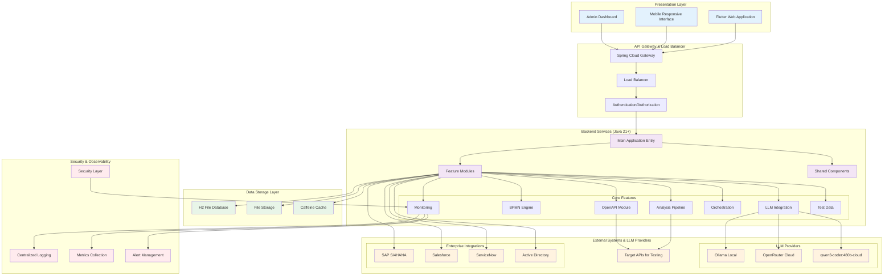
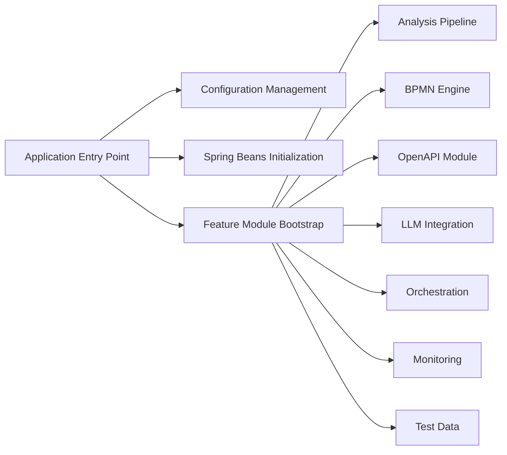
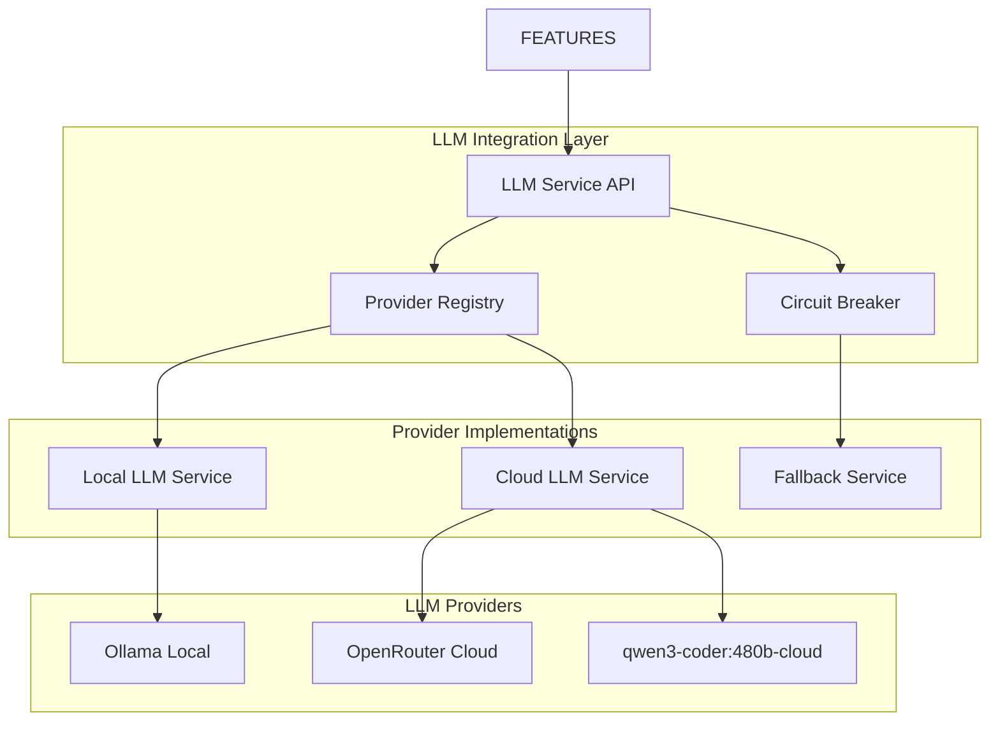
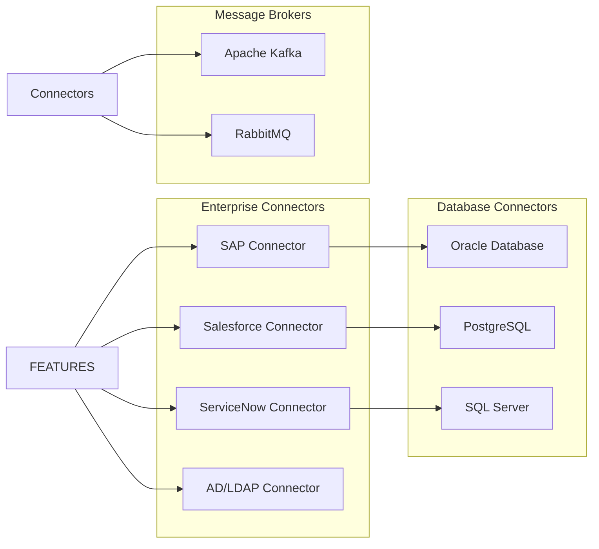
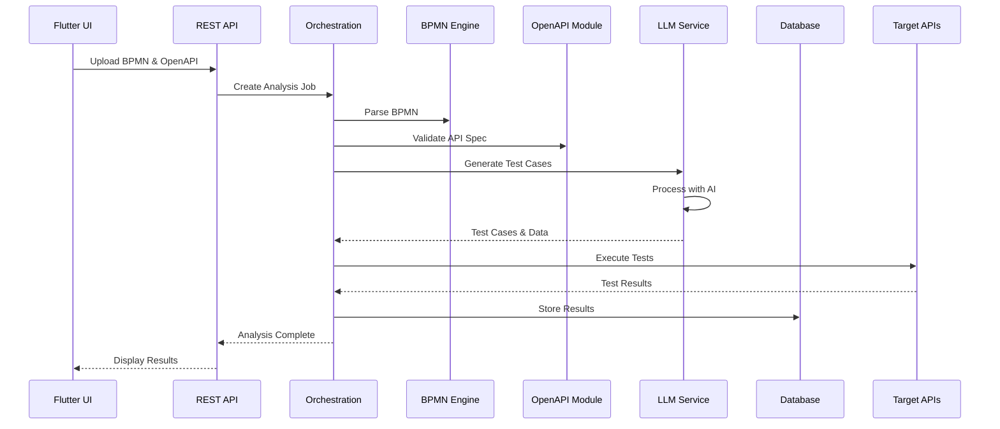
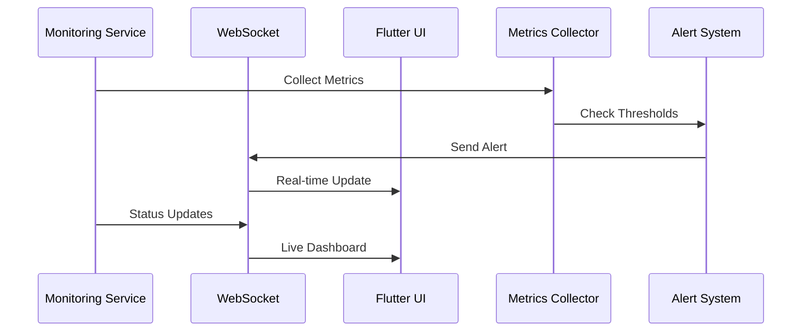
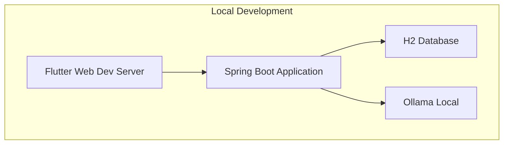
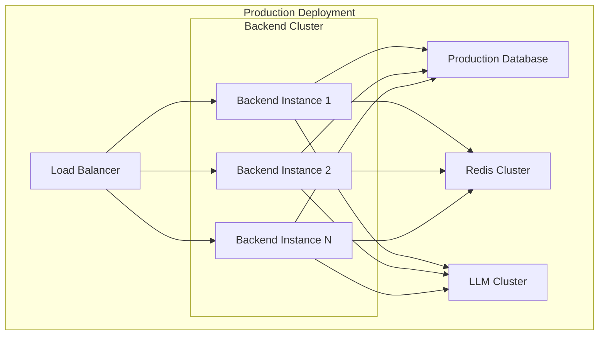

# Security Orchestrator - System Architecture

## Overview

Security Orchestrator is an enterprise-grade platform for comprehensive security testing and orchestration. The system follows a modern microservices architecture with feature-first modular design, integrating LLM-powered analysis capabilities for BPMN workflows, API specifications, and automated security testing.

## High-Level System Architecture

## System Components Overview

### 1. Presentation Layer
- **Flutter Web Application**: Modern, responsive web interface with Material Design components
- **State Management**: Provider pattern with flutter_riverpod for reactive state management
- **Real-time Updates**: WebSocket connections for live monitoring and notifications
- **Mobile Responsive**: Optimized for desktop, tablet, and mobile devices

### 2. API Gateway & Load Balancing
- **Spring Cloud Gateway**: Centralized API gateway with routing, authentication, and rate limiting
- **Load Balancer**: Distributes requests across multiple backend instances
- **Authentication/Authorization**: JWT-based authentication with enterprise SSO support

### 3. Backend Services Architecture

#### Core Application Entry

#### Feature-First Modular Architecture
Each feature module follows clean architecture with domain, application, infrastructure, and presentation layers:

- **Domain Layer**: Business entities, value objects, domain services
- **Application Layer**: Use cases, DTOs, application services
- **Infrastructure Layer**: External integrations, persistence, frameworks
- **Presentation Layer**: REST controllers, WebSocket handlers

### 4. Data Storage Strategy
- **H2 File Database**: Primary data persistence for development and small deployments
- **File Storage**: BPMN files, OpenAPI specifications, test reports
- **Caffeine Cache**: High-performance caching for frequently accessed data

### 5. LLM Integration Architecture

### 6. Enterprise Integration Capabilities

## Data Flow Architecture

### 1. Analysis Workflow Data Flow

### 2. Real-time Monitoring Flow

## Technology Stack Summary

### Backend Technologies
- **Java 21+**: Latest LTS with enhanced performance and features
- **Spring Boot 3.x**: Modern application framework with native support
- **Gradle**: Advanced build automation and dependency management
- **Feature-First Architecture**: Business capability focused modular design

### Frontend Technologies
- **Flutter Web**: Cross-platform UI framework
- **Material Design 3**: Modern UI components and theming
- **Provider Pattern**: Reactive state management
- **GoRouter**: Declarative routing solution

### Data & Storage
- **H2 Database**: File-based relational database for portability
- **Caffeine**: High-performance caching library
- **File System**: Local storage for documents and reports

### AI & LLM Integration
- **Ollama**: Local LLM runtime for privacy-sensitive operations
- **OpenRouter**: Cloud LLM provider with multiple model access
- **qwen3-coder:480b-cloud**: Specialized coding assistant model
- **Circuit Breaker**: Resilient service communication

### Integration & Communication
- **Spring Cloud Gateway**: API gateway and load balancing
- **Apache Kafka**: Event streaming and message queuing
- **RabbitMQ**: Reliable message delivery
- **WebSocket**: Real-time communication

### Security & Monitoring
- **JWT Authentication**: Stateless authentication mechanism
- **SAML 2.0**: Enterprise single sign-on
- **SLF4J + Logback**: Structured logging framework
- **Micrometer**: Application metrics and monitoring

## Deployment Architecture

### Development Environment

### Production Environment

## Scalability & Performance

### Horizontal Scaling
- **Stateless Backend Services**: Easy horizontal scaling with load balancing
- **Feature Module Independence**: Independent scaling of specific capabilities
- **Database Clustering**: Support for read replicas and sharding

### Performance Optimization
- **Asynchronous Processing**: Non-blocking I/O operations
- **Caching Strategy**: Multi-level caching for optimal performance
- **Connection Pooling**: Efficient resource utilization
- **Circuit Breaker**: Fault tolerance and resilience

## Security Architecture

### Multi-Layer Security
1. **Network Security**: HTTPS, VPN, firewall protection
2. **Application Security**: Input validation, authentication, authorization
3. **Data Security**: Encryption at rest and in transit
4. **API Security**: Rate limiting, API keys, JWT tokens

### Compliance & Audit
- **Audit Logging**: Comprehensive activity tracking
- **Data Protection**: GDPR and enterprise compliance
- **Security Monitoring**: Real-time threat detection
- **Incident Response**: Automated alert and response systems

This system architecture provides a robust, scalable, and secure foundation for the Security Orchestrator platform, supporting enterprise-grade security testing and orchestration capabilities.