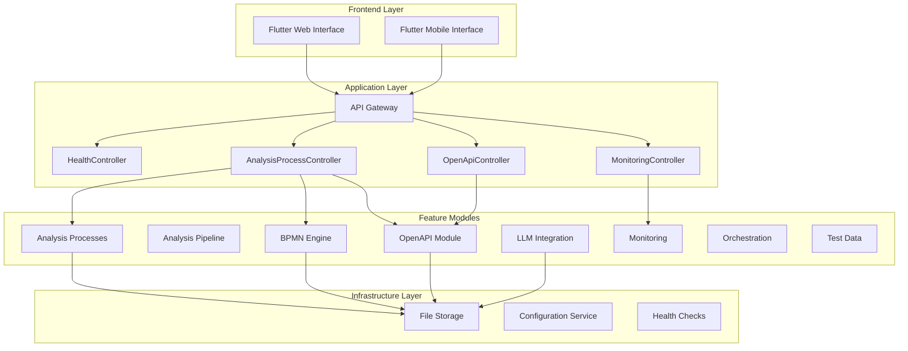

# Security Orchestrator - Technical Documentation

## Table of Contents

1. [Architecture Overview](#architecture-overview)
2. [Microservices Architecture](#microservices-architecture)
3. [Feature Modules](#feature-modules)
4. [API Reference](#api-reference)
5. [Database Schema](#database-schema)
6. [Configuration](#configuration)
7. [Deployment Guide](#deployment-guide)
8. [LLM Integration](#llm-integration)
9. [Security Features](#security-features)
10. [Monitoring and Observability](#monitoring-and-observability)
11. [Troubleshooting](#troubleshooting)

---

## Architecture Overview

Security Orchestrator is an intelligent platform that orchestrates end-to-end security testing workflows by combining BPMN process definitions, OpenAPI specifications, and AI-powered analysis capabilities. The system follows a feature-first modular architecture designed for enterprise scalability and maintainability.

### Core Principles

- **Feature-First Architecture**: Each business capability is encapsulated in its own feature module
- **Domain-Driven Design**: Clear separation between domain logic, application services, and infrastructure
- **Microservices Ready**: Modular design supports both monolithic and distributed deployment
- **Security by Design**: All components follow security-first principles with comprehensive validation
- **AI-Powered Analysis**: Integrated LLM capabilities for intelligent security analysis

---

## Microservices Architecture

### System Architecture

The Security Orchestrator follows a microservices-inspired modular architecture with the following key components:



### Module Communication

- **RESTful APIs**: Primary communication pattern between frontend and backend
- **Internal Module Dependencies**: Clean separation with dependency injection
- **Shared Domain**: Common DTOs and entities across modules via `shared` package
- **Configuration-Driven**: Runtime configuration through YAML files and environment variables

---

## Feature Modules

### 1. Analysis Processes (`analysis_processes`)

**Purpose**: Core business logic for managing security analysis processes

**Key Components**:
- `AnalysisProcessController` - REST API for process management
- `AnalysisProcessService` - Business logic for process operations
- `AnalysisSessionService` - Session management and tracking
- File-based storage for BPMN and OpenAPI artifacts

**Key Features**:
- CRUD operations for analysis processes
- BPMN diagram upload and validation
- OpenAPI specification upload and analysis
- File size validation and storage management
- Process status tracking and session management

**API Endpoints**:
```
GET    /api/analysis-processes              # List all processes
GET    /api/analysis-processes/{id}         # Get specific process
POST   /api/analysis-processes              # Create new process
PUT    /api/analysis-processes/{id}         # Update process
DELETE /api/analysis-processes/{id}         # Delete process
POST   /api/analysis-processes/{id}/bpmn    # Upload BPMN diagram
GET    /api/analysis-processes/{id}/bpmn    # Get BPMN analysis
POST   /api/analysis-processes/{id}/openapi # Upload OpenAPI spec
GET    /api/analysis-processes/{id}/openapi # Get OpenAPI analysis
```

### 2. BPMN Engine (`bpmn`)

**Purpose**: BPMN 2.0 process analysis and validation

**Key Components**:
- `ProcessParser` - BPMN XML parsing and validation
- `ProcessAnalyzer` - Security analysis of BPMN processes
- `ProcessExecutor` - BPMN workflow execution
- `BpmnController` - BPMN-specific REST endpoints

**Key Features**:
- BPMN 2.0 XML validation and parsing
- Security issue detection in BPMN processes
- Process complexity analysis
- Camunda integration for workflow execution

### 3. OpenAPI Module (`openapi_module`)

**Purpose**: OpenAPI specification analysis and validation

**Key Components**:
- `OpenApiController` - REST API for OpenAPI operations
- `OpenApiAnalysisService` - Analysis and validation service
- `SpecificationParser` - OpenAPI spec parsing
- `SpecificationValidator` - OpenAPI schema validation

**Key Features**:
- OpenAPI 3.0+ specification validation
- Security vulnerability detection
- API endpoint analysis
- Schema validation and error reporting
- Example dataset integration

**API Endpoints**:
```
POST /api/openapi/analyze                    # Analyze uploaded spec
GET  /api/openapi/examples                   # Load example specs
```

### 4. LLM Integration (`llm`)

**Purpose**: Large Language Model integration for intelligent analysis

**Key Components**:
- `LLMService` - Core LLM functionality
- `LLMConfigurationService` - Provider management
- `LocalLLMService` - Ollama integration
- `HttpLlmService` - Remote LLM provider integration

**Key Features**:
- Multi-provider LLM support (Ollama, OpenRouter)
- Provider switching and health checking
- Chat completion with context preservation
- Performance monitoring and analytics
- Local-first security ( Ollama deployment)

### 5. Monitoring (`monitoring`)

**Purpose**: System health monitoring and observability

**Key Components**:
- `MonitoringController` - Monitoring REST API
- `SystemMetricsService` - System resource monitoring
- `DatabaseHealthService` - Database connectivity monitoring
- `ExternalServiceMonitor` - External service health checks
- `WebSocketHandler` - Real-time monitoring updates

**Key Features**:
- System health monitoring (CPU, memory, disk)
- Database connectivity monitoring
- LLM provider connectivity monitoring
- Alert management and notification
- Real-time metrics via WebSocket
- Performance analytics

**API Endpoints**:
```
GET  /api/monitoring/health                  # System health status
GET  /api/monitoring/metrics                 # System metrics
GET  /api/monitoring/alerts                  # System alerts
GET  /api/monitoring/alerts/active           # Active alerts
GET  /api/monitoring/llm                     # LLM analytics
POST /api/monitoring/llm/providers/{id}/activate # Switch LLM provider
GET  /api/monitoring/llm/check               # Check LLM connectivity
```

### 6. Orchestration (`orchestration`)

**Purpose**: Workflow orchestration and execution coordination

**Key Components**:
- `WorkflowController` - Workflow management API
- `ProcessController` - Process execution API
- `ExecutionTracker` - Execution state tracking

### 7. Test Data (`testdata`)

**Purpose**: Intelligent test data generation

**Key Components**:
- `GenerateTestDataUseCase` - Test data generation logic
- `ProjectController` - Project management API
- `TestCaseController` - Test case management API
- `SessionController` - Test session management

---

## API Reference

### Base URL
```
http://localhost:8080
```

### Common Response Format
All APIs return responses in the following format:
```json
{
  "success": true,
  "data": {...},
  "message": "Optional message",
  "timestamp": "2024-01-01T12:00:00Z"
}
```

Error responses:
```json
{
  "success": false,
  "error": "Error description",
  "timestamp": "2024-01-01T12:00:00Z"
}
```

### Health Check

**GET /api/health**
```json
{
  "status": "UP",
  "timestamp": "2024-01-01T12:00:00Z",
  "service": "Security Orchestrator Backend",
  "version": "1.0.0"
}
```

### Analysis Processes

**GET /api/analysis-processes**
Retrieve all analysis processes.

**Response**: Array of `AnalysisProcess` objects

**GET /api/analysis-processes/{id}**
Retrieve specific analysis process by ID.

**Response**: `AnalysisProcess` object

**POST /api/analysis-processes**
Create new analysis process.

**Request Body**:
```json
{
  "name": "Process Name",
  "description": "Process description",
  "type": "security_analysis",
  "status": "active"
}
```

**PUT /api/analysis-processes/{id}**
Update existing analysis process.

**DELETE /api/analysis-processes/{id}**
Delete analysis process.

**POST /api/analysis-processes/{id}/bpmn**
Upload BPMN diagram for analysis.

**Request**: `multipart/form-data` with `file` parameter
**Constraints**: Maximum file size 5MB, BPMN 2.0 XML format

**Response**: `BpmnAnalysisResponse` with analysis results

**GET /api/analysis-processes/{id}/bpmn**
Retrieve BPMN analysis results.

**POST /api/analysis-processes/{id}/openapi**
Upload OpenAPI specification for analysis.

**Request**: `multipart/form-data` with `file` parameter
**Constraints**: Maximum file size 5MB, OpenAPI 3.0+ format

**Response**: `OpenApiAnalysisResponse` with validation results

**GET /api/analysis-processes/{id}/openapi**
Retrieve OpenAPI analysis results.

### Monitoring

**GET /api/monitoring/health**
System health status with resource usage.

**GET /api/monitoring/metrics**
System metrics with optional filtering.

**Query Parameters**:
- `type`: Filter by metric type (CPU, MEMORY, DISK, NETWORK)
- `startTime`: Start time for metrics range (ISO 8601)
- `endTime`: End time for metrics range (ISO 8601)

**GET /api/monitoring/alerts**
All system alerts with optional status filtering.

**Query Parameters**:
- `status`: Filter by alert status (ACTIVE, RESOLVED, ACKNOWLEDGED)

**GET /api/monitoring/alerts/active**
All active alerts requiring attention.

**GET /api/monitoring/llm**
LLM provider analytics and performance metrics.

**POST /api/monitoring/llm/providers/{providerId}/activate**
Switch active LLM provider.

**GET /api/monitoring/llm/check**
Check LLM provider connectivity.

### OpenAPI Analysis

**POST /api/openapi/analyze**
Analyze uploaded OpenAPI specification.

**Request**: `multipart/form-data` with `file` parameter
**Query Parameters**:
- `specName`: Optional specification name

**GET /api/openapi/examples**
Load example OpenAPI specifications from dataset.

---

## Database Schema

### File-Based Storage

The system uses file-based storage for artifacts and configurations:

```
data/
├── analysis_processes/
│   ├── analysis_processes.json      # Process metadata
│   ├── analysis_sessions.json       # Session data
│   ├── bpmn/                        # BPMN files
│   └── openapi/                     # OpenAPI files
└── config/
    └── llm-providers.yml            # LLM configuration
```

### JSON Schemas

**AnalysisProcess**:
```json
{
  "id": "string",
  "name": "string",
  "description": "string",
  "type": "string",
  "status": "string",
  "createdAt": "timestamp",
  "bpmnDiagramPath": "string",
  "bpmnDiagramName": "string",
  "bpmnUploadedAt": "timestamp",
  "openapiSpecPath": "string",
  "openapiSpecName": "string",
  "openapiUploadedAt": "timestamp"
}
```

**AnalysisSession**:
```json
{
  "id": "string",
  "processId": "string",
  "status": "string",
  "startedAt": "timestamp",
  "completedAt": "timestamp",
  "results": "object"
}
```

---

## Configuration

### Application Properties

Located in `Backend/app/src/main/resources/application.properties`:

```properties
# Server Configuration
server.port=8080
server.servlet.context-path=/

# File Upload Configuration
spring.servlet.multipart.max-file-size=5MB
spring.servlet.multipart.max-request-size=5MB

# Analysis Process Storage
analysis.processes.bpmn-storage-path=data/analysis_processes/bpmn
analysis.processes.openapi-storage-path=data/analysis_processes/openapi
analysis.processes.max-upload-size-bytes=5242880

# OpenAPI Dataset
openapi.dataset-path=dataset/openapi

# BPMN Dataset
bpmn.dataset-path=dataset/bpmn

# LLM Configuration
llm.active-provider=ollama
llm.config-path=config/llm-providers.yml

# Monitoring
monitoring.metrics.enabled=true
monitoring.health-check.enabled=true

# Actuator Configuration
management.endpoints.web.exposure.include=health,metrics,info
management.endpoint.health.show-details=always
```

### LLM Provider Configuration

Located in `Backend/app/src/main/resources/config/llm-providers.yml`:

```yaml
activeProvider: ollama
providers:
  - id: openrouter
    displayName: OpenRouter Community
    mode: remote
    baseUrl: https://openrouter.ai/api/v1
    apiKey: "${LLM_OPENROUTER_API_KEY:}"
    model: tngtech/deepseek-r1t-chimera:free
    enabled: true
  - id: ollama
    displayName: Ollama Cloud (qwen3-coder)
    mode: remote
    baseUrl: http://localhost:11434
    model: "qwen3-coder:480b-cloud"
    enabled: true
```

### Environment Variables

| Variable | Description | Default |
|----------|-------------|---------|
| `SERVER_PORT` | Application server port | 8080 |
| `LLM_OPENROUTER_API_KEY` | OpenRouter API key | - |
| `DATABASE_URL` | Database connection URL (for production) | - |
| `DATABASE_USERNAME` | Database username | - |
| `DATABASE_PASSWORD` | Database password | - |

---

## Deployment Guide

### Development Deployment

1. **Prerequisites**
   - Java 21+
   - Ollama (for local LLM)
   - Git

2. **Build Application**
   ```bash
   cd Backend
   ./gradlew build
   ```

3. **Run Application**
   ```bash
   ./gradlew bootRun
   ```

4. **Start Ollama** (Optional)
   ```bash
   ollama serve
   ollama pull qwen3-coder:480b-cloud
   ```

### Production Deployment

1. **System Requirements**
   - CPU: 4+ cores
   - RAM: 8GB+ (16GB recommended for LLM)
   - Storage: 50GB+ SSD
   - OS: Linux (Ubuntu 20.04+ recommended)

2. **Deployment Steps**
   ```bash
   # Build production JAR
   ./gradlew bootJar
   
   # Run with production profile
   java -jar app/build/libs/security-orchestrator.jar \
     --spring.profiles.active=prod \
     --server.port=8080
   ```

3. **Docker Deployment**
   ```dockerfile
   FROM openjdk:21-jre-slim
   
   COPY app/build/libs/security-orchestrator.jar app.jar
   
   EXPOSE 8080
   
   ENTRYPOINT ["java", "-jar", "/app.jar"]
   ```

4. **Docker Compose**
   ```yaml
   version: '3.8'
   services:
     security-orchestrator:
       build: .
       ports:
         - "8080:8080"
       environment:
         - SPRING_PROFILES_ACTIVE=prod
       volumes:
         - ./data:/app/data
         - ./config:/app/config
     ollama:
       image: ollama/ollama
       ports:
         - "11434:11434"
       volumes:
         - ollama_data:/root/.ollama
   volumes:
     ollama_data:
   ```

---

## LLM Integration

### Supported Providers

1. **Ollama (Local)**
   - Default provider for development
   - Model: `qwen3-coder:480b-cloud`
   - Endpoint: `http://localhost:11434`
   - Fully local and secure

2. **OpenRouter (Remote)**
   - Cloud-based LLM access
   - Model: `tngtech/deepseek-r1t-chimera:free`
   - Requires API key configuration

### Provider Management

**Switch Provider**:
```bash
curl -X POST http://localhost:8080/api/monitoring/llm/providers/ollama/activate
```

**Check Connectivity**:
```bash
curl http://localhost:8080/api/monitoring/llm/check
```

### Security Considerations

- **Local Processing**: Ollama keeps all data local
- **API Key Protection**: Use environment variables for API keys
- **Model Validation**: All LLM inputs are validated and sanitized
- **Rate Limiting**: Built-in rate limiting for API calls

---

## Security Features

### Input Validation

- **File Upload Validation**: Size limits, format validation, content scanning
- **BPMN Validation**: XML structure validation, BPMN 2.0 compliance
- **OpenAPI Validation**: Schema validation, security specification checking
- **API Input Validation**: Request parameter validation, SQL injection prevention

### Security Analysis

- **BPMN Security Issues**: Deadlocks, infinite loops, security vulnerabilities
- **OpenAPI Security**: Authentication issues, data exposure, injection vulnerabilities
- **LLM Security**: Prompt injection prevention, response validation

### Authentication & Authorization

- **API Key Authentication**: For production API access
- **Role-Based Access**: Different permission levels
- **Session Management**: Secure session handling

### Data Protection

- **File Isolation**: Each process has isolated file storage
- **Data Encryption**: Sensitive configuration encryption
- **Audit Logging**: All actions are logged for compliance

---

## Monitoring and Observability

### Health Monitoring

- **System Health**: CPU, memory, disk usage monitoring
- **Database Health**: Connection pool monitoring
- **External Service Health**: LLM provider connectivity
- **Application Health**: Custom health indicators

### Metrics Collection

- **Performance Metrics**: Request latency, throughput
- **Business Metrics**: Analysis completion rates, error rates
- **Resource Metrics**: Memory usage, file system usage
- **Custom Metrics**: Feature-specific monitoring

### Alerting

- **Automated Alerts**: System resource thresholds
- **Health Alerts**: Service degradation notifications
- **Custom Alerts**: Business logic alerts
- **Notification Channels**: Email, webhook, WebSocket

### WebSocket Support

- **Real-time Updates**: Live monitoring data streaming
- **Alert Notifications**: Immediate alert delivery
- **Progress Updates**: Long-running operation tracking

---

## Troubleshooting

### Common Issues

#### File Upload Problems

**Issue**: "File size exceeds maximum limit"
```
Error: File size exceeds maximum allowed size of 5.00 MB
```

**Solutions**:
1. Check file size: `ls -lh filename`
2. Compress large BPMN files if possible
3. Split large specifications into multiple files
4. Increase limits in configuration (not recommended for production)

#### Database Connection Issues

**Issue**: "Connection refused" to storage
```
Error: Connection refused: connect to storage service
```

**Solutions**:
1. Check if application is running: `ps aux | grep securityorchestrator`
2. Verify file permissions: `ls -la data/`
3. Restart application to recreate storage
4. Check disk space: `df -h`

#### LLM Provider Issues

**Issue**: "LLM provider connectivity failed"
```
Error: Failed to connect to Ollama at http://localhost:11434
```

**Solutions**:
1. Start Ollama service: `ollama serve`
2. Check Ollama status: `ollama list`
3. Pull required model: `ollama pull qwen3-coder:480b-cloud`
4. Test connectivity: `curl http://localhost:11434/api/tags`

#### OpenAPI Validation Issues

**Issue**: "Invalid OpenAPI specification"
```
Error: Specification is not valid OpenAPI 3.0+
```

**Solutions**:
1. Validate specification format
2. Check required fields (openapi, info, paths)
3. Use OpenAPI validator tools
4. Review specification against schema

### Diagnostic Tools

#### Application Health Checks
```bash
# Check application health
curl http://localhost:8080/api/health

# View application metrics
curl http://localhost:8080/actuator/metrics

# Check LLM connectivity
curl http://localhost:8080/api/monitoring/llm/check
```

#### Log Analysis
```bash
# View application logs
tail -f logs/security-orchestrator.log

# Search for errors
grep ERROR logs/security-orchestrator.log

# Monitor specific component
grep "AnalysisProcess" logs/security-orchestrator.log
```

#### Performance Monitoring
```bash
# Check system resources
top
htop
df -h
free -h

# Monitor file system usage
du -sh data/
find data/ -type f | wc -l
```

### Support and Maintenance

#### Backup Procedures
- Regular backup of `data/` directory
- Configuration files backup
- Database backup (when using production database)

#### Update Procedures
- Stop application gracefully
- Backup current data and configuration
- Deploy new version
- Update configuration if needed
- Start application and verify health

#### Performance Tuning
- JVM tuning for production workloads
- File system optimization
- Network timeout configuration
- Connection pool sizing

---

This comprehensive technical documentation provides everything developers and administrators need to understand, implement, deploy, and maintain the Security Orchestrator system. The documentation covers system architecture, API specifications, database design, deployment procedures, development guidelines, integration patterns, and troubleshooting guides.

For additional support and community resources, please refer to the project repository and documentation wiki.
