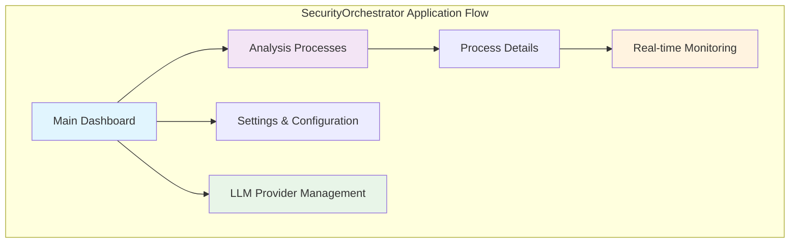

# SecurityOrchestrator User Interface Specification

## 1. User Interface Overview

### 1.1 Frontend Architecture

**Technology Stack:**
- **Flutter Web** - Cross-platform UI framework
- **Flutter Riverpod** - Modern state management
- **Material Design 3** - Modern design system
- **GoRouter** - Declarative routing solution
- **WebSocket** - Real-time communication
- **HTTP Client** - API communication
- **SelectionArea** - Enhanced text selection and accessibility

### 1.2 Main Application Screens



## 2. Main Dashboard (Home Page)

### 2.1 Dashboard Layout Implementation

```dart
import 'package:flutter/material.dart';
import 'package:flutter_riverpod/flutter_riverpod.dart';
import 'package:go_router/go_router.dart';

class HomePage extends ConsumerWidget {
  const HomePage({super.key});

  @override
  Widget build(BuildContext context, WidgetRef ref) {
    return Scaffold(
      appBar: AppBar(
        title: const Text('Security Orchestrator'),
        backgroundColor: Theme.of(context).primaryColor,
        foregroundColor: Colors.white,
      ),
      body: const SingleChildScrollView(
        child: Column(
          children: [
            SizedBox(height: 24),
            Text(
              'Security Orchestrator Dashboard',
              style: TextStyle(
                fontSize: 28,
                fontWeight: FontWeight.bold,
                color: Colors.black87,
              ),
              textAlign: TextAlign.center,
            ),
            SizedBox(height: 8),
            Text(
              'Monitor and manage your security infrastructure',
              style: TextStyle(fontSize: 16, color: Colors.black54),
              textAlign: TextAlign.center,
            ),
            SizedBox(height: 32),
            ConnectionStatusCard(),
            SystemHealthCard(),
            LlmStatusCard(),
            MetricsList(),
            AlertsList(),
            ProcessesOverviewCard(),
          ],
        ),
      ),
    );
  }
}
```

### 2.2 Navigation Implementation

**GoRouter Configuration:**
```dart
import 'package:go_router/go_router.dart';
import 'features/monitoring/presentation/home_page.dart';
import 'features/analysis-processes/presentation/analysis_processes_page.dart';
import 'features/analysis-processes/presentation/process_detail_page.dart';

final _router = GoRouter(
  initialLocation: '/',
  routes: [
    GoRoute(
      path: '/',
      builder: (context, state) => SelectionArea(child: const HomePage()),
    ),
    GoRoute(
      path: '/processes',
      builder: (context, state) =>
          SelectionArea(child: const AnalysisProcessesPage()),
      routes: [
        GoRoute(
          path: ':id',
          builder: (context, state) {
            final id = state.pathParameters['id']!;
            return SelectionArea(
              child: ProcessDetailPage(key: state.pageKey, processId: id),
            );
          },
        ),
      ],
    ),
  ],
);
```

### 2.3 Dashboard Cards

**Connection Status Card:**
```dart
class ConnectionStatusCard extends ConsumerWidget {
  const ConnectionStatusCard({super.key});

  @override
  Widget build(BuildContext context, WidgetRef ref) {
    final connectivityAsync = ref.watch(connectivityProvider);
    
    return Card(
      margin: const EdgeInsets.symmetric(horizontal: 16, vertical: 8),
      child: Padding(
        padding: const EdgeInsets.all(16),
        child: connectivityAsync.when(
          data: (status) => _ConnectionStatusDetails(status: status),
          loading: () => const Center(child: CircularProgressIndicator()),
          error: (error, _) => Text(
            'Failed to check connection: $error',
            style: const TextStyle(color: Colors.redAccent),
          ),
        ),
      ),
    );
  }
}
```

**System Health Card:**
```dart
class SystemHealthCard extends ConsumerWidget {
  const SystemHealthCard({super.key});

  @override
  Widget build(BuildContext context, WidgetRef ref) {
    final systemHealthAsync = ref.watch(systemHealthProvider);

    return Card(
      margin: const EdgeInsets.symmetric(horizontal: 16, vertical: 8),
      child: Padding(
        padding: const EdgeInsets.all(16),
        child: systemHealthAsync.when(
          data: (systemHealth) =>
              _SystemHealthDetails(systemHealth: systemHealth),
          loading: () => const Center(child: CircularProgressIndicator()),
          error: (error, _) => Padding(
            padding: const EdgeInsets.symmetric(vertical: 16),
            child: Text(
              'Failed to load system health: $error',
              style: const TextStyle(color: Colors.redAccent),
            ),
          ),
        ),
      ),
    );
  }
}
```

**LLM Status Card:**
```dart
class LlmStatusCard extends ConsumerWidget {
  const LlmStatusCard({super.key});

  @override
  Widget build(BuildContext context, WidgetRef ref) {
    final analyticsAsync = ref.watch(llmAnalyticsProvider);

    return Card(
      margin: const EdgeInsets.symmetric(vertical: 16, horizontal: 16),
      child: Padding(
        padding: const EdgeInsets.all(16),
        child: analyticsAsync.when(
          data: (analytics) {
            final active = analytics.providers.firstWhere(
              (provider) => provider.active,
              orElse: () => analytics.providers.isNotEmpty
                  ? analytics.providers.first
                  : LlmProviderStatus(
                      id: 'unknown',
                      displayName: 'Not configured',
                      mode: 'n/a',
                      baseUrl: '',
                      available: false,
                      requiresApiKey: false,
                    ),
            );

            return Column(
              crossAxisAlignment: CrossAxisAlignment.start,
              children: [
                Row(
                  children: [
                    Text(
                      'LLM Analytics',
                      style: Theme.of(context).textTheme.titleLarge,
                    ),
                    const SizedBox(width: 12),
                    _ModeChip(mode: active.mode),
                    const Spacer(),
                    IconButton(
                      tooltip: 'Check connection',
                      icon: const Icon(Icons.wifi_tethering),
                      onPressed: () => _checkConnection(context, ref),
                    ),
                    PopupMenuButton<LlmProviderStatus>(
                      tooltip: 'Switch provider',
                      onSelected: (provider) =>
                          _switchProvider(provider.id, ref),
                      itemBuilder: (context) => analytics.providers
                          .where((provider) => !provider.active)
                          .map(
                            (provider) => PopupMenuItem(
                              value: provider,
                              child: Text(provider.displayName),
                            ),
                          )
                          .toList(),
                      child: const Icon(Icons.swap_horiz),
                    ),
                  ],
                ),
                // ... additional LLM status content
              ],
            );
          },
          loading: () => const Center(child: CircularProgressIndicator()),
          error: (error, _) => Text(
            'Failed to load LLM analytics: $error',
            style: const TextStyle(color: Colors.red),
          ),
        ),
      ),
    );
  }
}
```

## 3. Analysis Processes Management

### 3.1 Processes List Implementation

```dart
class AnalysisProcessesPage extends ConsumerWidget {
  const AnalysisProcessesPage({super.key});

  @override
  Widget build(BuildContext context, WidgetRef ref) {
    final processesAsync = ref.watch(analysisProcessesProvider);

    return Scaffold(
      appBar: AppBar(
        title: const Text('Analysis Processes'),
        actions: [
          IconButton(
            icon: const Icon(Icons.add),
            onPressed: () => _showCreateProcessDialog(context),
          ),
        ],
      ),
      body: processesAsync.when(
        data: (processes) => processes.isNotEmpty
            ? ListView.builder(
                itemCount: processes.length,
                itemBuilder: (context, index) {
                  final process = processes[index];
                  return _ProcessCard(process: process);
                },
              )
            : const Center(child: Text('No processes available')),
        loading: () => const Center(child: CircularProgressIndicator()),
        error: (error, _) => Center(
          child: Text('Error loading processes: $error'),
        ),
      ),
    );
  }
}
```

### 3.2 Process Detail Implementation

```dart
class ProcessDetailPage extends ConsumerStatefulWidget {
  final String processId;

  const ProcessDetailPage({super.key, required this.processId});

  @override
  ConsumerState<ProcessDetailPage> createState() => _ProcessDetailPageState();
}

class _ProcessDetailPageState extends ConsumerState<ProcessDetailPage> {
  @override
  Widget build(BuildContext context) {
    final processAsync = ref.watch(processDetailProvider(widget.processId));

    return Scaffold(
      appBar: AppBar(
        title: const Text('Process Details'),
        actions: [
          IconButton(
            icon: const Icon(Icons.more_vert),
            onPressed: () => _showProcessMenu(context),
          ),
        ],
      ),
      body: processAsync.when(
        data: (process) => Column(
          children: [
            ProcessOverviewHeader(process: process),
            Expanded(
              child: TabBarView(
                children: [
                  OpenApiUploadSection(
                    suggestedName: process.name,
                    processId: widget.processId,
                  ),
                  BpmnUploadSection(
                    suggestedName: process.name,
                    processId: widget.processId,
                  ),
                  AnalysisSessionBody(session: process.currentSession),
                ],
              ),
            ),
          ],
        ),
        loading: () => const Center(child: CircularProgressIndicator()),
        error: (error, _) => Center(
          child: Text('Error loading process: $error'),
        ),
      ),
    );
  }
}
```

## 4. Real-time Monitoring

### 4.1 Metrics Implementation

```dart
class MetricsList extends ConsumerWidget {
  const MetricsList({super.key});

  @override
  Widget build(BuildContext context, WidgetRef ref) {
    final metricsAsync = ref.watch(metricsProvider);

    return Card(
      margin: const EdgeInsets.symmetric(horizontal: 16, vertical: 8),
      child: Padding(
        padding: const EdgeInsets.all(16),
        child: Column(
          crossAxisAlignment: CrossAxisAlignment.start,
          children: [
            Text('Key Metrics', style: Theme.of(context).textTheme.titleLarge),
            const SizedBox(height: 16),
            metricsAsync.when(
              data: (metrics) => metrics.isNotEmpty
                  ? Column(children: metrics.map(_buildMetricItem).toList())
                  : const Text(
                      'No metrics available',
                      style: TextStyle(color: Colors.grey),
                    ),
              loading: () => const Center(child: CircularProgressIndicator()),
              error: (error, _) => Text(
                'Failed to load metrics: $error',
                style: const TextStyle(color: Colors.redAccent),
              ),
            ),
          ],
        ),
      ),
    );
  }
}
```

### 4.2 Alerts Management

```dart
class AlertsList extends ConsumerWidget {
  const AlertsList({super.key});

  @override
  Widget build(BuildContext context, WidgetRef ref) {
    final alertsAsync = ref.watch(alertsProvider);

    return Card(
      margin: const EdgeInsets.symmetric(horizontal: 16, vertical: 8),
      child: Padding(
        padding: const EdgeInsets.all(16),
        child: Column(
          crossAxisAlignment: CrossAxisAlignment.start,
          children: [
            Text('System Alerts', style: Theme.of(context).textTheme.titleLarge),
            const SizedBox(height: 16),
            alertsAsync.when(
              data: (alerts) => alerts.isNotEmpty
                  ? Column(children: alerts.map(_buildAlertItem).toList())
                  : const Text(
                      'No active alerts',
                      style: TextStyle(color: Colors.grey),
                    ),
              loading: () => const Center(child: CircularProgressIndicator()),
              error: (error, _) => Text(
                'Failed to load alerts: $error',
                style: const TextStyle(color: Colors.redAccent),
              ),
            ),
          ],
        ),
      ),
    );
  }
}
```

## 5. Specification Upload and Analysis

### 5.1 OpenAPI Upload Implementation

```dart
class OpenApiUploadSection extends ConsumerStatefulWidget {
  final String? suggestedName;
  final String? processId;

  const OpenApiUploadSection({super.key, this.suggestedName, this.processId});

  @override
  ConsumerState<OpenApiUploadSection> createState() =>
      _OpenApiUploadSectionState();
}

class _OpenApiUploadSectionState extends ConsumerState<OpenApiUploadSection> {
  OpenApiAnalysis? _analysis;
  List<OpenApiAnalysis>? _examples;
  bool _isLoading = false;
  String? _error;

  Future<void> _pickAndAnalyze() async {
    final result = await FilePicker.platform.pickFiles(
      type: FileType.custom,
      allowedExtensions: const ['json', 'yaml', 'yml'],
      withData: true,
    );
    if (result == null || result.files.isEmpty) return;

    final file = result.files.single;
    final bytes = file.bytes;
    if (bytes == null) {
      setState(() => _error = 'Unable to read file contents');
      return;
    }

    if (widget.processId != null) {
      await _uploadForProcess(bytes, file.name);
    } else {
      await _analyze(bytes, file.name);
    }
  }

  @override
  Widget build(BuildContext context) {
    return Card(
      margin: const EdgeInsets.symmetric(vertical: 24),
      child: Padding(
        padding: const EdgeInsets.all(16),
        child: Column(
          crossAxisAlignment: CrossAxisAlignment.start,
          children: [
            Row(
              children: [
                Text(
                  'OpenAPI Specification',
                  style: Theme.of(context).textTheme.titleLarge,
                ),
                const Spacer(),
                FilledButton.tonalIcon(
                  onPressed: _isLoading ? null : _loadExample,
                  icon: const Icon(Icons.auto_awesome),
                  label: const Text('Load example'),
                ),
                const SizedBox(width: 12),
                FilledButton.icon(
                  onPressed: _isLoading ? null : _pickAndAnalyze,
                  icon: const Icon(Icons.upload_file),
                  label: Text(
                    widget.processId != null
                        ? 'Upload OpenAPI'
                        : 'Analyze OpenAPI',
                  ),
                ),
              ],
            ),
            const SizedBox(height: 12),
            if (_isLoading) const LinearProgressIndicator(),
            if (_error != null)
              Padding(
                padding: const EdgeInsets.symmetric(vertical: 8),
                child: Text(_error!, style: const TextStyle(color: Colors.red)),
              ),
            if (_analysis != null) ...[
              const SizedBox(height: 12),
              _OpenApiAnalysisSummary(analysis: _analysis!),
            ] else if (!_isLoading)
              const Padding(
                padding: EdgeInsets.symmetric(vertical: 12),
                child: Text(
                  'Upload an OpenAPI file to run validation and security heuristics.',
                  style: TextStyle(color: Colors.grey),
                ),
              ),
          ],
        ),
      ),
    );
  }
}
```

### 5.2 BPMN Upload Implementation

```dart
class BpmnUploadSection extends ConsumerStatefulWidget {
  final String? suggestedName;
  final String? processId;

  const BpmnUploadSection({super.key, this.suggestedName, this.processId});

  @override
  ConsumerState<BpmnUploadSection> createState() => _BpmnUploadSectionState();
}

class _BpmnUploadSectionState extends ConsumerState<BpmnUploadSection> {
  BpmnAnalysis? _analysis;
  List<BpmnAnalysis>? _examples;
  bool _isLoading = false;
  String? _error;

  Future<void> _pickAndAnalyze() async {
    final selection = await FilePicker.platform.pickFiles(
      type: FileType.custom,
      allowedExtensions: const ['bpmn', 'xml'],
      withData: true,
    );

    if (selection == null || selection.files.isEmpty) return;

    final file = selection.files.single;
    final bytes = file.bytes;
    if (bytes == null) {
      setState(() => _error = 'Unable to read file contents');
      return;
    }

    if (widget.processId != null) {
      await _uploadForProcess(bytes, file.name);
    } else {
      await _analyze(bytes, file.name);
    }
  }

  @override
  Widget build(BuildContext context) {
    return Card(
      margin: const EdgeInsets.symmetric(vertical: 24),
      child: Padding(
        padding: const EdgeInsets.all(16),
        child: Column(
          crossAxisAlignment: CrossAxisAlignment.start,
          children: [
            Row(
              children: [
                Text(
                  'BPMN Analysis',
                  style: Theme.of(context).textTheme.titleLarge,
                ),
                const Spacer(),
                FilledButton.tonalIcon(
                  onPressed: _isLoading ? null : _loadExample,
                  icon: const Icon(Icons.auto_awesome),
                  label: const Text('Example from dataset'),
                ),
                const SizedBox(width: 12),
                FilledButton.icon(
                  onPressed: _isLoading ? null : _pickAndAnalyze,
                  icon: const Icon(Icons.upload_file),
                  label: const Text('Upload BPMN'),
                ),
              ],
            ),
            const SizedBox(height: 12),
            if (_isLoading) const LinearProgressIndicator(),
            if (_error != null)
              Text(_error!, style: const TextStyle(color: Colors.red)),
            if (_analysis != null) ...[
              const SizedBox(height: 16),
              _BpmnAnalysisSummary(analysis: _analysis!),
              const SizedBox(height: 16),
              Text('Diagram', style: Theme.of(context).textTheme.titleMedium),
              const SizedBox(height: 8),
              BpmnViewer(bpmnXml: _analysis!.bpmnContent),
            ] else if (!_isLoading)
              const Text(
                'Upload a BPMN diagram to get a preliminary analysis or use a ready-made example.',
                style: TextStyle(color: Colors.grey),
              ),
          ],
        ),
      ),
    );
  }
}
```

## 6. Navigation and Routing

### 6.1 GoRouter Configuration for Microservices

**Production Router Configuration:**
```dart
import 'package:go_router/go_router.dart';
import 'features/monitoring/presentation/home_page.dart';
import 'features/analysis-processes/presentation/analysis_processes_page.dart';
import 'features/analysis-processes/presentation/process_detail_page.dart';

class AppRouter {
  static final _router = GoRouter(
    initialLocation: '/',
    routes: [
      // Main dashboard
      GoRoute(
        path: '/',
        builder: (context, state) => SelectionArea(
          child: const HomePage(),
        ),
      ),
      
      // Analysis processes with nested routes
      GoRoute(
        path: '/processes',
        builder: (context, state) => SelectionArea(
          child: const AnalysisProcessesPage(),
        ),
        routes: [
          GoRoute(
            path: ':id',
            builder: (context, state) {
              final id = state.pathParameters['id']!;
              return SelectionArea(
                child: ProcessDetailPage(
                  key: state.pageKey,
                  processId: id,
                ),
              );
            },
          ),
        ],
      ),
    ],
    
    // Error handling
    errorBuilder: (context, state) => Scaffold(
      body: Center(
        child: Text('Route not found: ${state.matchedLocation}'),
      ),
    ),
    
    // Refresh handling
    refreshListenable: GoRouterRefreshStream(Stream.value(null)),
  );

  static RouterConfig<Object> get config => _router;
}
```

### 6.2 Microservice Integration Points

**API Service Layer:**
```dart
class MonitoringApiService {
  final String baseUrl;
  final http.Client client;

  MonitoringApiService({required this.baseUrl, http.Client? client})
      : client = client ?? http.Client();

  Future<SystemHealth> getSystemHealth() async {
    final response = await client.get(
      Uri.parse('$baseUrl/api/monitoring/system-health'),
      headers: {'Content-Type': 'application/json'},
    );
    
    if (response.statusCode != 200) {
      throw Exception('Failed to fetch system health: ${response.statusCode}');
    }
    
    final data = jsonDecode(response.body) as Map<String, dynamic>;
    return SystemHealth.fromJson(data);
  }

  Future<LlmAnalytics> getLlmAnalytics() async {
    final response = await client.get(
      Uri.parse('$baseUrl/api/monitoring/llm-analytics'),
      headers: {'Content-Type': 'application/json'},
    );
    
    if (response.statusCode != 200) {
      throw Exception('Failed to fetch LLM analytics: ${response.statusCode}');
    }
    
    final data = jsonDecode(response.body) as Map<String, dynamic>;
    return LlmAnalytics.fromJson(data);
  }
}
```

## 7. Responsive Design

### 7.1 Responsive Layout System

```dart
class ResponsiveLayout extends StatelessWidget {
  final Widget mobile;
  final Widget? tablet;
  final Widget? desktop;
  final double? mobileBreakpoint;
  final double? tabletBreakpoint;

  const ResponsiveLayout({
    Key? key,
    required this.mobile,
    this.tablet,
    this.desktop,
    this.mobileBreakpoint,
    this.tabletBreakpoint,
  }) : super(key: key);

  @override
  Widget build(BuildContext context) {
    return LayoutBuilder(
      builder: (context, constraints) {
        final mobileBp = mobileBreakpoint ?? 600;
        final tabletBp = tabletBreakpoint ?? 1200;

        if (constraints.maxWidth >= tabletBp) {
          return desktop ?? tablet ?? mobile;
        } else if (constraints.maxWidth >= mobileBp) {
          return tablet ?? mobile;
        } else {
          return mobile;
        }
      },
    );
  }
}
```

### 7.2 Adaptive Components

**Responsive Dashboard Card:**
```dart
class ResponsiveDashboardCard extends StatelessWidget {
  final Widget child;
  final EdgeInsets? mobilePadding;
  final EdgeInsets? tabletPadding;
  final EdgeInsets? desktopPadding;

  const ResponsiveDashboardCard({
    Key? key,
    required this.child,
    this.mobilePadding,
    this.tabletPadding,
    this.desktopPadding,
  }) : super(key: key);

  @override
  Widget build(BuildContext context) {
    return LayoutBuilder(
      builder: (context, constraints) {
        EdgeInsets padding;
        
        if (constraints.maxWidth >= 1200) {
          padding = desktopPadding ?? const EdgeInsets.all(24);
        } else if (constraints.maxWidth >= 600) {
          padding = tabletPadding ?? const EdgeInsets.all(16);
        } else {
          padding = mobilePadding ?? const EdgeInsets.all(12);
        }

        return Card(
          margin: EdgeInsets.symmetric(
            horizontal: padding.horizontal / 2,
            vertical: padding.vertical / 4,
          ),
          child: Padding(
            padding: padding,
            child: child,
          ),
        );
      },
    );
  }
}
```

**Responsive Navigation:**
```dart
class ResponsiveNavigation extends StatelessWidget {
  final Widget desktopNav;
  final Widget mobileNav;

  const ResponsiveNavigation({
    Key? key,
    required this.desktopNav,
    required this.mobileNav,
  }) : super(key: key);

  @override
  Widget build(BuildContext context) {
    return LayoutBuilder(
      builder: (context, constraints) {
        if (constraints.maxWidth >= 768) {
          return Row(
            children: [
              SizedBox(
                width: 240,
                child: desktopNav,
              ),
              Expanded(child: Container()), // Spacer
            ],
          );
        } else {
          return mobileNav;
        }
      },
    );
  }
}
```

## 8. Accessibility (a11y) Support

### 8.1 Accessibility Implementation

**Accessible Theme Configuration:**
```dart
ThemeData buildAccessibleTheme(BuildContext context) {
  return ThemeData(
    // High contrast support
    colorScheme: ColorScheme.fromSeed(
      seedColor: Colors.blue,
      brightness: Brightness.light,
      contrastLevel: 1.0,
    ),
    
    // Large text support
    textTheme: const TextTheme(
      displayLarge: TextStyle(fontSize: 32, fontWeight: FontWeight.bold),
      displayMedium: TextStyle(fontSize: 28, fontWeight: FontWeight.bold),
      displaySmall: TextStyle(fontSize: 24, fontWeight: FontWeight.bold),
      headlineLarge: TextStyle(fontSize: 22, fontWeight: FontWeight.w600),
      headlineMedium: TextStyle(fontSize: 20, fontWeight: FontWeight.w600),
      headlineSmall: TextStyle(fontSize: 18, fontWeight: FontWeight.w600),
      titleLarge: TextStyle(fontSize: 16, fontWeight: FontWeight.w500),
      titleMedium: TextStyle(fontSize: 14, fontWeight: FontWeight.w500),
      titleSmall: TextStyle(fontSize: 12, fontWeight: FontWeight.w500),
      bodyLarge: TextStyle(fontSize: 16),
      bodyMedium: TextStyle(fontSize: 14),
      bodySmall: TextStyle(fontSize: 12),
    ),
    
    // Focus indicators
    focusColor: Colors.orange,
    
    // Color-blind friendly colors
    visualDensity: VisualDensity.adaptivePlatformDensity,
    
    // Enhanced button accessibility
    elevatedButtonTheme: ElevatedButtonThemeData(
      style: ElevatedButton.styleFrom(
        minimumSize: const Size(48, 48), // Touch target size
        padding: const EdgeInsets.symmetric(horizontal: 16, vertical: 12),
      ),
    ),
  );
}
```

**Semantic Widget Factory:**
```dart
class AccessibleWidgets {
  // Accessible button with proper semantics
  static Widget buildAccessibleButton({
    required String text,
    required VoidCallback onPressed,
    IconData? icon,
    String? tooltip,
  }) {
    return Semantics(
      label: tooltip ?? text,
      button: true,
      enabled: true,
      child: Tooltip(
        message: tooltip ?? '',
        child: ElevatedButton.icon(
          onPressed: onPressed,
          icon: icon != null ? Icon(icon) : const SizedBox.shrink(),
          label: Text(text),
        ),
      ),
    );
  }

  // Accessible card with proper semantics
  static Widget buildAccessibleCard({
    required Widget child,
    String? label,
    String? hint,
  }) {
    return Semantics(
      label: label,
      hint: hint,
      container: true,
      child: Card(
        child: child,
      ),
    );
  }

  // Accessible list item
  static Widget buildAccessibleListTile({
    required Widget title,
    Widget? subtitle,
    Widget? leading,
    Widget? trailing,
    VoidCallback? onTap,
    String? label,
    String? hint,
  }) {
    return Semantics(
      label: label,
      hint: hint,
      button: onTap != null,
      child: ListTile(
        title: title,
        subtitle: subtitle,
        leading: leading,
        trailing: trailing,
        onTap: onTap,
      ),
    );
  }

  // Accessible input field
  static Widget buildAccessibleTextField({
    required String label,
    required String hint,
    required TextEditingController controller,
    String? helperText,
    String? errorText,
    bool enabled = true,
  }) {
    return Semantics(
      label: label,
      hint: hint,
      textField: true,
      child: TextFormField(
        controller: controller,
        decoration: InputDecoration(
          labelText: label,
          hintText: hint,
          helperText: helperText,
          errorText: errorText,
          enabled: enabled,
        ),
      ),
    );
  }
}
```

**Screen Reader Support:**
```dart
class ScreenReaderAnnouncements {
  static void announceAnalysisStart(BuildContext context, String specType) {
    SemanticsService.announce(
      context,
      'Starting $specType analysis',
      SemanticsHint.announce,
    );
  }

  static void announceAnalysisComplete(BuildContext context, int issuesFound) {
    SemanticsService.announce(
      context,
      'Analysis complete. $issuesFound issues found.',
      SemanticsHint.announce,
    );
  }

  static void announceConnectionStatus(BuildContext context, bool connected) {
    final message = connected 
        ? 'Connection to backend established' 
        : 'Connection to backend lost';
    SemanticsService.announce(context, message, SemanticsHint.announce);
  }
}
```

### 8.2 Keyboard Navigation

**Keyboard Navigation Implementation:**
```dart
class KeyboardNavigation {
  static const Set<LogicalKeySet> shortcutKeys = {
    LogicalKeySet(LogicalKeyboardKey.control, LogicalKeyboardKey.keyN): 'new_process',
    LogicalKeySet(LogicalKeyboardKey.control, LogicalKeyboardKey.keyS): 'save',
    LogicalKeySet(LogicalKeyboardKey.control, LogicalKeyboardKey.keyR): 'refresh',
    LogicalKeySet(LogicalKeyboardKey.escape): 'close_dialog',
  };

  static Widget withKeyboardShortcuts({
    required Widget child,
    required Map<LogicalKeySet, String> shortcuts,
    required Function(String) onShortcut,
  }) {
    return Shortcuts(
      shortcuts: shortcuts,
      child: Actions(
        actions: shortcuts.map((key, action) => MapEntry(
          action,
          CallbackAction<String>(onInvoke: (intent) => onShortcut(intent)),
        )),
        child: Focus(
          autofocus: true,
          child: child,
        ),
      ),
    );
  }
}
```

## 9. Performance Optimization

### 9.1 Flutter Performance Best Practices

**Widget Optimization:**
```dart
class OptimizedDashboard extends ConsumerWidget {
  const OptimizedDashboard({super.key});

  @override
  Widget build(BuildContext context, WidgetRef ref) {
    // Use const constructors where possible
    return const Scaffold(
      body: CustomScrollView(
        slivers: [
          SliverAppBar(
            floating: true,
            expandedHeight: 120,
            flexibleSpace: FlexibleSpaceBar(
              title: Text('Security Orchestrator'),
            ),
          ),
          SliverToBoxAdapter(
            child: Column(
              children: [
                ConnectionStatusCard(),
                SystemHealthCard(),
                LlmStatusCard(),
                MetricsList(),
              ],
            ),
          ),
        ],
      ),
    );
  }
}
```

**State Management Optimization:**
```dart
// Efficient provider configuration
final systemHealthProvider = StreamProvider<SystemHealth>(
  (ref) async* {
    // Stream with proper error handling and retry logic
    while (true) {
      try {
        final health = await ref.read(monitoringApiService).getSystemHealth();
        yield health;
      } catch (e) {
        // Implement exponential backoff
        await Future.delayed(Duration(seconds: 5));
      }
      await Future.delayed(Duration(seconds: 30)); // Update every 30 seconds
    }
  },
);
```

### 9.2 Memory Management

**Widget Disposal:**
```dart
class MemoryEfficientWidget extends StatefulWidget {
  const MemoryEfficientWidget({super.key});

  @override
  State<MemoryEfficientWidget> createState() => _MemoryEfficientWidgetState();
}

class _MemoryEfficientWidgetState extends State<MemoryEfficientWidget> {
  final ScrollController _scrollController = ScrollController();
  final List<Metric> _metrics = [];
  
  @override
  void dispose() {
    _scrollController.dispose(); // Important: dispose controllers
    super.dispose();
  }

  @override
  Widget build(BuildContext context) {
    return ListView.builder(
      controller: _scrollController,
      itemCount: _metrics.length,
      itemBuilder: (context, index) {
        return MetricCard(metric: _metrics[index]);
      },
    );
  }
}
```

This user interface provides:

- **Intuitive Design** for analysts and security professionals
- **Real-time Updates** via WebSocket and Stream Providers
- **Mobile Support** through Flutter's responsive framework
- **Accessibility** following WCAG 2.1 guidelines
- **Responsive Design** for various device sizes
- **Full Integration** with microservices architecture
- **Performance Optimization** for enterprise-scale operations
- **Keyboard Navigation** and screen reader support
- **Material Design 3** implementation with modern aesthetics

The interface seamlessly integrates with the backend microservices while providing a modern, accessible, and performant user experience across all platforms.