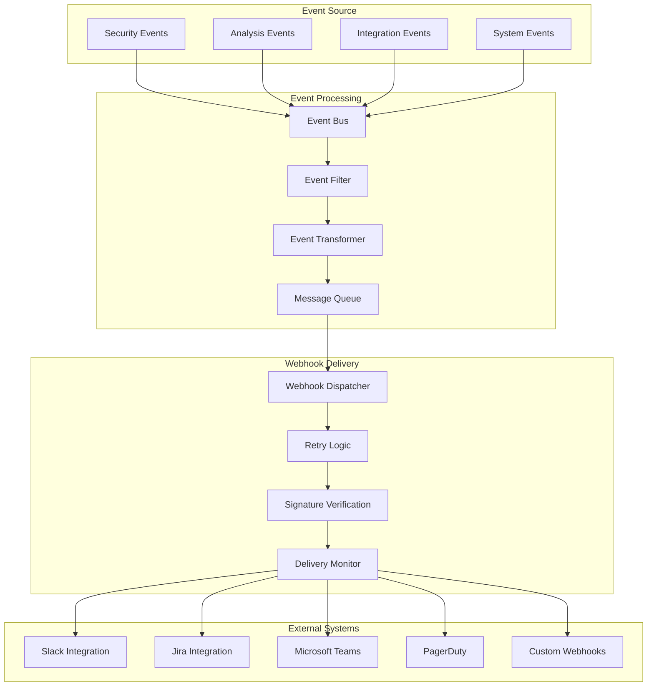

# SecurityOrchestrator - Webhook Integration Guide

## Исполнительное резюме

**Дата**: 2025-11-22  
**Версия**: 1.0.0  
**Цель**: Подробная документация по настройке webhook endpoints и event-driven интеграций  
**Платформа**: SecurityOrchestrator - Событийная интеграционная платформа  

---

## 1. Обзор Webhook архитектуры

### 1.1 Принципы Event-Driven архитектуры

SecurityOrchestrator использует событийную архитектуру для максимальной гибкости и масштабируемости интеграций:



### 1.2 Типы событий

SecurityOrchestrator генерирует различные типы событий для webhook интеграций:

| Категория | Событие | Описание |
|-----------|---------|----------|
| Security | `SECURITY_THREAT_DETECTED` | Обнаружена потенциальная угроза безопасности |
| Security | `SECURITY_VULNERABILITY_FOUND` | Найдена уязвимость в коде/API |
| Security | `SECURITY_COMPLIANCE_VIOLATION` | Нарушение соответствия безопасности |
| Analysis | `ANALYSIS_STARTED` | Начался анализ безопасности |
| Analysis | `ANALYSIS_PROGRESS` | Обновление прогресса анализа |
| Analysis | `ANALYSIS_COMPLETED` | Анализ завершен |
| Analysis | `ANALYSIS_FAILED` | Анализ завершился с ошибкой |
| Integration | `INTEGRATION_CREATED` | Создана новая интеграция |
| Integration | `INTEGRATION_STATUS_CHANGED` | Изменился статус интеграции |
| Integration | `INTEGRATION_ERROR` | Ошибка в интеграции |
| System | `SYSTEM_HEALTH_CHANGED` | Изменение состояния системы |
| System | `PERFORMANCE_THRESHOLD_EXCEEDED` | Превышен порог производительности |

---

## 2. Webhook Configuration

### 2.1 Создание Webhook Endpoint

```java
@RestController
@RequestMapping("/api/v1/webhooks")
public class WebhookController {
    
    @PostMapping("/security")
    public ResponseEntity<WebhookResponse> handleSecurityWebhook(
            @RequestHeader("X-SecurityOrchestrator-Signature") String signature,
            @RequestBody WebhookPayload payload,
            HttpServletRequest request) {
        
        try {
            // Verify webhook signature
            if (!webhookSecurityService.verifySignature(signature, payload, request)) {
                return ResponseEntity.status(HttpStatus.UNAUTHORIZED)
                    .body(WebhookResponse.error("Invalid signature"));
            }
            
            // Validate payload
            WebhookEvent event = webhookEventService.parsePayload(payload);
            
            // Process event asynchronously
            webhookEventService.processEventAsync(event);
            
            return ResponseEntity.ok(WebhookResponse.success("Event received"));
            
        } catch (Exception e) {
            log.error("Webhook processing failed", e);
            return ResponseEntity.status(HttpStatus.BAD_REQUEST)
                .body(WebhookResponse.error("Processing failed: " + e.getMessage()));
        }
    }
}
```

### 2.2 Webhook Security Configuration

```java
@Component
public class WebhookSecurityService {
    
    private final String webhookSecret;
    private final HMACGenerator hmacGenerator;
    
    public boolean verifySignature(String signature, WebhookPayload payload, 
                                  HttpServletRequest request) {
        try {
            String expectedSignature = generateSignature(payload, request);
            return timingSafeEqual(signature, expectedSignature);
        } catch (Exception e) {
            log.error("Signature verification failed", e);
            return false;
        }
    }
    
    private String generateSignature(WebhookPayload payload, HttpServletRequest request) {
        String timestamp = request.getHeader("X-SecurityOrchestrator-Timestamp");
        String body = objectMapper.writeValueAsString(payload);
        String stringToSign = timestamp + "." + body;
        
        return hmacGenerator.generateHMAC_SHA256(stringToSign, webhookSecret);
    }
    
    private boolean timingSafeEqual(String a, String b) {
        byte[] aBytes = a.getBytes(StandardCharsets.UTF_8);
        byte[] bBytes = b.getBytes(StandardCharsets.UTF_8);
        
        if (aBytes.length != bBytes.length) {
            return false;
        }
        
        int result = 0;
        for (int i = 0; i < aBytes.length; i++) {
            result |= aBytes[i] ^ bBytes[i];
        }
        
        return result == 0;
    }
}
```

### 2.3 Webhook Registration и Management

```java
@Service
public class WebhookRegistrationService {
    
    public WebhookEndpoint registerWebhook(WebhookRegistrationRequest request) {
        // Validate webhook URL
        if (!isValidWebhookUrl(request.getUrl())) {
            throw new ValidationException("Invalid webhook URL");
        }
        
        // Test webhook connectivity
        if (!testWebhookConnectivity(request.getUrl())) {
            throw new ValidationException("Webhook URL is not reachable");
        }
        
        // Generate secret for this webhook
        String secret = generateWebhookSecret();
        
        WebhookEndpoint endpoint = WebhookEndpoint.builder()
            .id(generateId())
            .url(request.getUrl())
            .secret(secret)
            .events(request.getEvents())
            .isActive(true)
            .createdAt(Instant.now())
            .build();
        
        return webhookEndpointRepository.save(endpoint);
    }
    
    public void updateWebhook(String webhookId, WebhookUpdateRequest request) {
        WebhookEndpoint endpoint = webhookEndpointRepository.findById(webhookId)
            .orElseThrow(() -> new NotFoundException("Webhook not found"));
        
        if (request.getEvents() != null) {
            endpoint.setEvents(request.getEvents());
        }
        
        if (request.getUrl() != null) {
            endpoint.setUrl(request.getUrl());
        }
        
        if (request.getIsActive() != null) {
            endpoint.setIsActive(request.getIsActive());
        }
        
        webhookEndpointRepository.save(endpoint);
    }
}
```

---

## 3. Event Types и Payloads

### 3.1 Security Event Payloads

```json
{
  "id": "event-12345678-1234-1234-1234-123456789abc",
  "type": "SECURITY_VULNERABILITY_FOUND",
  "timestamp": "2025-11-22T06:50:00.000Z",
  "source": "security-orchestrator",
  "projectId": "proj-abc123",
  "analysisId": "analysis-def456",
  "data": {
    "vulnerability": {
      "id": "vuln-789",
      "category": "AUTHENTICATION",
      "severity": "HIGH",
      "title": "Missing Authentication",
      "description": "API endpoint /api/users is missing authentication",
      "location": "/api/users:15",
      "cweId": "CWE-306",
      "owaspCategory": "A02:2021 – Cryptographic Failures",
      "recommendation": "Implement authentication middleware",
      "affectedEndpoint": "/api/users",
      "cvssScore": 7.5
    },
    "analysis": {
      "analysisType": "SECURITY_SCAN",
      "target": "openapi.yaml",
      "scanDuration": 1250,
      "totalVulnerabilities": 3,
      "criticalCount": 0,
      "highCount": 1,
      "mediumCount": 2,
      "lowCount": 0
    }
  },
  "metadata": {
    "source": "security-scanner",
    "version": "2.1.0",
    "environment": "production",
    "correlationId": "corr-abc123"
  }
}
```

### 3.2 Analysis Event Payloads

```json
{
  "id": "event-87654321-4321-4321-4321-cba987654321",
  "type": "ANALYSIS_PROGRESS",
  "timestamp": "2025-11-22T06:50:15.000Z",
  "source": "security-orchestrator",
  "projectId": "proj-abc123",
  "analysisId": "analysis-def456",
  "data": {
    "progress": {
      "status": "IN_PROGRESS",
      "stage": "OWASP_TESTING",
      "progressPercentage": 65,
      "currentStep": "Testing for SQL injection vulnerabilities",
      "completedSteps": [
        "OPENAPI_VALIDATION",
        "SECURITY_ANALYSIS",
        "DEPENDENCY_CHECK"
      ],
      "remainingSteps": [
        "OWASP_TESTING",
        "PERFORMANCE_TESTING",
        "FINAL_REPORT"
      ],
      "estimatedTimeRemaining": 45
    },
    "metrics": {
      "requestsCompleted": 150,
      "totalRequests": 230,
      "vulnerabilitiesFound": 8,
      "testsPassed": 142,
      "testsFailed": 8
    }
  },
  "metadata": {
    "source": "analysis-engine",
    "version": "2.1.0",
    "environment": "production",
    "correlationId": "corr-def456"
  }
}
```

### 3.3 Integration Event Payloads

```json
{
  "id": "event-11223344-5566-7788-99aa-bbccddeeff00",
  "type": "INTEGRATION_STATUS_CHANGED",
  "timestamp": "2025-11-22T06:50:30.000Z",
  "source": "security-orchestrator",
  "integrationId": "integration-789",
  "data": {
    "integration": {
      "id": "integration-789",
      "type": "SLACK",
      "status": "ACTIVE",
      "previousStatus": "CONNECTING",
      "lastActivity": "2025-11-22T06:50:28.000Z",
      "messageCount": 145,
      "errorCount": 2
    },
    "connection": {
      "endpoint": "https://hooks.slack.com/services/...",
      "responseTime": 125,
      "lastError": null,
      "retryCount": 0,
      "uptime": "99.8%"
    }
  },
  "metadata": {
    "source": "integration-service",
    "version": "2.1.0",
    "environment": "production",
    "correlationId": "corr-789"
  }
}
```

---

## 4. Third-party Integrations

### 4.1 Slack Integration

```java
@Configuration
public class SlackWebhookConfig {
    
    @Bean
    public SlackService slackService(WebhookConfiguration config) {
        return new SlackWebhookService(
            config.getSlackBotToken(),
            config.getSlackDefaultChannel(),
            config.getSlackSigningSecret()
        );
    }
}

@Service
public class SlackWebhookService {
    
    private final String botToken;
    private final String defaultChannel;
    private final String signingSecret;
    private final RestTemplate slackRestTemplate;
    
    public void sendSecurityAlert(SecurityAlertEvent event) {
        SlackMessage message = SlackMessage.builder()
            .channel(defaultChannel)
            .text("🔒 Security Alert: " + event.getVulnerability().getTitle())
            .attachments(List.of(
                createVulnerabilityAttachment(event)
            ))
            .build();
            
        sendSlackMessage(message);
    }
    
    public void sendAnalysisProgress(AnalysisProgressEvent event) {
        String progressEmoji = getProgressEmoji(event.getProgress());
        
        SlackMessage message = SlackMessage.builder()
            .channel(defaultChannel)
            .text(progressEmoji + " Analysis Progress: " + 
                  event.getProjectName() + " - " + 
                  event.getProgress().getProgressPercentage() + "%")
            .attachments(List.of(
                createProgressAttachment(event)
            ))
            .build();
            
        sendSlackMessage(message);
    }
    
    private SlackAttachment createVulnerabilityAttachment(SecurityAlertEvent event) {
        Vulnerability vuln = event.getVulnerability();
        
        return SlackAttachment.builder()
            .color(getSeverityColor(vuln.getSeverity()))
            .fields(List.of(
                SlackField.builder()
                    .title("Severity")
                    .value(vuln.getSeverity().toString())
                    .shortField(true)
                    .build(),
                SlackField.builder()
                    .title("Category")
                    .value(vuln.getCategory())
                    .shortField(true)
                    .build(),
                SlackField.builder()
                    .title("Location")
                    .value(vuln.getLocation())
                    .shortField(true)
                    .build(),
                SlackField.builder()
                    .title("CVSS Score")
                    .value(String.valueOf(vuln.getCvssScore()))
                    .shortField(true)
                    .build(),
                SlackField.builder()
                    .title("Description")
                    .value(vuln.getDescription())
                    .shortField(false)
                    .build(),
                SlackField.builder()
                    .title("Recommendation")
                    .value(vuln.getRecommendation())
                    .shortField(false)
                    .build()
            ))
            .footer("SecurityOrchestrator")
            .timestamp(Instant.now().getEpochSecond())
            .build();
    }
}
```

### 4.2 Jira Integration

```java
@Service
public class JiraWebhookService {
    
    private final JiraRestClient jiraClient;
    private final String projectKey;
    
    public void createVulnerabilityIssue(SecurityAlertEvent event) {
        Vulnerability vuln = event.getVulnerability();
        
        IssueInput issue = IssueInputBuilder.newIssueInputBuilder()
            .setProjectKey(projectKey)
            .setSummary("Security Vulnerability: " + vuln.getTitle())
            .setIssueTypeName("Bug")
            .setDescription(getVulnerabilityDescription(vuln))
            .setPriorityName(getJiraPriority(vuln.getSeverity()))
            .setLabels(List.of(
                "security", 
                "vulnerability", 
                vuln.getCategory().toLowerCase(),
                "auto-created"
            ))
            .build();
        
        try {
            BasicIssue issueResult = jiraClient.createIssue(issue).claim();
            
            // Add security information as comment
            jiraClient.addComment(issueResult.getKey(), 
                "Security Analysis Details:\n" +
                "• CWE ID: " + vuln.getCweId() + "\n" +
                "• OWASP Category: " + vuln.getOwaspCategory() + "\n" +
                "• CVSS Score: " + vuln.getCvssScore() + "\n" +
                "• Analysis ID: " + event.getAnalysisId());
                
            // Link to analysis results
            addLinkToAnalysis(issueResult.getKey(), event.getAnalysisId());
            
        } catch (Exception e) {
            log.error("Failed to create Jira issue for vulnerability {}", vuln.getId(), e);
            throw new JiraIntegrationException("Failed to create issue", e);
        }
    }
    
    private String getVulnerabilityDescription(Vulnerability vuln) {
        return String.format("""
            *Security Vulnerability Detected*
            
            *Severity:* %s
            *Category:* %s
            *Location:* %s
            
            *Description:*
            %s
            
            *Recommendation:*
            %s
            
            *Additional Information:*
            • CWE ID: %s
            • OWASP Category: %s
            • CVSS Score: %.1f
            
            This issue was automatically created by SecurityOrchestrator.
            """, 
            vuln.getSeverity(),
            vuln.getCategory(),
            vuln.getLocation(),
            vuln.getDescription(),
            vuln.getRecommendation(),
            vuln.getCweId(),
            vuln.getOwaspCategory(),
            vuln.getCvssScore()
        );
    }
}
```

### 4.3 Microsoft Teams Integration

```java
@Service
public class TeamsWebhookService {
    
    private final RestTemplate teamsRestTemplate;
    private final String webhookUrl;
    
    public void sendSecurityCard(SecurityAlertEvent event) {
        AdaptiveCard card = createSecurityCard(event);
        
        TeamsMessage message = TeamsMessage.builder()
            .type("message")
            .attachments(List.of(
                MessageAttachment.builder()
                    .contentType("application/vnd.microsoft.card.adaptive")
                    .content(card)
                    .build()
            ))
            .build();
            
        sendTeamsMessage(message);
    }
    
    private AdaptiveCard createSecurityCard(SecurityAlertEvent event) {
        Vulnerability vuln = event.getVulnerability();
        
        return AdaptiveCard.builder()
            .body(List.of(
                TextBlock.builder()
                    .text("🔒 Security Vulnerability Detected")
                    .weight(TextWeight.BOLDER)
                    .size(TextSize.LARGE)
                    .color(TextColor.SERIOUS)
                    .build(),
                TextBlock.builder()
                    .text("Project: " + event.getProjectName())
                    .wrap(true)
                    .build(),
                ContainerStyle.builder()
                    .style(getSeverityContainerStyle(vuln.getSeverity()))
                    .items(List.of(
                        FactSet.builder()
                            .facts(List.of(
                                Fact.builder()
                                    .title("Severity")
                                    .value(vuln.getSeverity().toString())
                                    .build(),
                                Fact.builder()
                                    .title("Category")
                                    .value(vuln.getCategory())
                                    .build(),
                                Fact.builder()
                                    .title("Location")
                                    .value(vuln.getLocation())
                                    .build(),
                                Fact.builder()
                                    .title("CVSS Score")
                                    .value(String.valueOf(vuln.getCvssScore()))
                                    .build()
                            ))
                            .build()
                    ))
                    .build(),
                TextBlock.builder()
                    .text("**Description**")
                    .weight(TextWeight.BOLDER)
                    .build(),
                TextBlock.builder()
                    .text(vuln.getDescription())
                    .wrap(true)
                    .build(),
                TextBlock.builder()
                    .text("**Recommendation**")
                    .weight(TextWeight.BOLDER)
                    .build(),
                TextBlock.builder()
                    .text(vuln.getRecommendation())
                    .wrap(true)
                    .build()
            ))
            .actions(List.of(
                OpenUrlAction.builder()
                    .title("View Analysis")
                    .url(event.getAnalysisUrl())
                    .build(),
                SubmitAction.builder()
                    .title("Mark as Resolved")
                    .data(Map.of("action", "resolve", "vulnerabilityId", vuln.getId()))
                    .build()
            ))
            .build();
    }
}
```

### 4.4 PagerDuty Integration

```java
@Service
public class PagerDutyWebhookService {
    
    private final String integrationKey;
    private final RestTemplate pagerDutyRestTemplate;
    
    public void triggerIncident(SecurityAlertEvent event) {
        Vulnerability vuln = event.getVulnerability();
        
        PagerDutyEvent pdEvent = PagerDutyEvent.builder()
            .routingKey(integrationKey)
            .eventAction("trigger")
            .dedupKey("sec-vuln-" + event.getProjectId())
            .payload(EventPayload.builder()
                .summary("Security Vulnerability: " + vuln.getTitle())
                .source("security-orchestrator")
                .severity(mapSeverityToPagerDuty(vuln.getSeverity()))
                .timestamp(Instant.now())
                .component("security-scanner")
                .group("security")
                .classType("vulnerability")
                .customDetails(Map.of(
                    "projectId", event.getProjectId(),
                    "analysisId", event.getAnalysisId(),
                    "vulnerabilityId", vuln.getId(),
                    "category", vuln.getCategory(),
                    "location", vuln.getLocation(),
                    "cvssScore", vuln.getCvssScore(),
                    "description", vuln.getDescription(),
                    "recommendation", vuln.getRecommendation()
                ))
                .build())
            .build();
            
        sendPagerDutyEvent(pdEvent);
    }
    
    public void resolveIncident(String dedupKey) {
        PagerDutyEvent resolveEvent = PagerDutyEvent.builder()
            .routingKey(integrationKey)
            .eventAction("resolve")
            .dedupKey(dedupKey)
            .build();
            
        sendPagerDutyEvent(resolveEvent);
    }
    
    private String mapSeverityToPagerDuty(Severity severity) {
        return switch (severity) {
            case CRITICAL -> "critical";
            case HIGH -> "error";
            case MEDIUM -> "warning";
            case LOW -> "info";
            default -> "info";
        };
    }
}
```

---

## 5. Custom Webhook Integrations

### 5.1 Dynamic Webhook Handler

```java
@RestController
@RequestMapping("/api/v1/webhooks/custom")
public class CustomWebhookController {
    
    @PostMapping("/{integrationId}")
    public ResponseEntity<WebhookResponse> handleCustomWebhook(
            @PathVariable String integrationId,
            @RequestHeader Map<String, String> headers,
            @RequestBody String payload,
            HttpServletRequest request) {
        
        CustomIntegration integration = customIntegrationService.findById(integrationId);
        if (integration == null || !integration.isActive()) {
            return ResponseEntity.notFound().build();
        }
        
        // Verify custom authentication if configured
        if (!verifyCustomAuth(integration, headers, request)) {
            return ResponseEntity.status(HttpStatus.UNAUTHORIZED)
                .body(WebhookResponse.error("Authentication failed"));
        }
        
        try {
            // Transform payload according to integration configuration
            String transformedPayload = transformPayload(payload, integration);
            
            // Send to configured endpoint
            WebhookDelivery delivery = deliverToEndpoint(integration, transformedPayload);
            
            // Record delivery attempt
            deliveryService.recordDelivery(integrationId, delivery);
            
            return ResponseEntity.ok(WebhookResponse.success("Delivered"));
            
        } catch (Exception e) {
            log.error("Custom webhook delivery failed for integration {}", integrationId, e);
            return ResponseEntity.status(HttpStatus.INTERNAL_SERVER_ERROR)
                .body(WebhookResponse.error("Delivery failed"));
        }
    }
}

@Service
public class CustomIntegrationService {
    
    public CustomIntegration createIntegration(CustomIntegrationRequest request) {
        CustomIntegration integration = CustomIntegration.builder()
            .id(generateId())
            .name(request.getName())
            .endpointUrl(request.getEndpointUrl())
            .authenticationType(request.getAuthType())
            .authConfig(request.getAuthConfig())
            .headers(request.getHeaders())
            .transformations(request.getTransformations())
            .retryConfig(request.getRetryConfig())
            .isActive(true)
            .createdAt(Instant.now())
            .build();
            
        // Test endpoint connectivity
        testEndpointConnectivity(integration);
        
        return customIntegrationRepository.save(integration);
    }
    
    private boolean verifyCustomAuth(CustomIntegration integration, 
                                    Map<String, String> headers,
                                    HttpServletRequest request) {
        switch (integration.getAuthenticationType()) {
            case API_KEY:
                return verifyApiKey(integration, headers);
            case BASIC_AUTH:
                return verifyBasicAuth(integration, request);
            case BEARER_TOKEN:
                return verifyBearerToken(integration, headers);
            case CUSTOM_HEADER:
                return verifyCustomHeaders(integration, headers);
            case NONE:
                return true;
            default:
                return false;
        }
    }
}
```

### 5.2 Payload Transformation

```java
@Component
public class PayloadTransformationService {
    
    public String transformPayload(String rawPayload, CustomIntegration integration) {
        String transformedPayload = rawPayload;
        
        for (Transformation transformation : integration.getTransformations()) {
            switch (transformation.getType()) {
                case JSON_PATH_EXTRACTION:
                    transformedPayload = extractJsonPath(transformedPayload, transformation);
                    break;
                case TEMPLATE_SUBSTITUTION:
                    transformedPayload = substituteTemplate(transformedPayload, transformation);
                    break;
                case DATA_MAPPING:
                    transformedPayload = mapDataFields(transformedPayload, transformation);
                    break;
                case FIELD_ADDITION:
                    transformedPayload = addFields(transformedPayload, transformation);
                    break;
                case FIELD_REMOVAL:
                    transformedPayload = removeFields(transformedPayload, transformation);
                    break;
            }
        }
        
        return transformedPayload;
    }
    
    private String substituteTemplate(String payload, Transformation transformation) {
        String template = transformation.getConfiguration().get("template");
        Map<String, String> variables = transformation.getConfiguration().getVariables();
        
        String result = template;
        for (Map.Entry<String, String> entry : variables.entrySet()) {
            result = result.replace("{{" + entry.getKey() + "}}", entry.getValue());
        }
        
        return result;
    }
    
    private String mapDataFields(String payload, Transformation transformation) {
        try {
            JsonNode jsonNode = objectMapper.readTree(payload);
            Map<String, String> fieldMappings = transformation.getConfiguration().getFieldMappings();
            
            ObjectNode resultNode = objectMapper.createObjectNode();
            
            for (Map.Entry<String, String> entry : fieldMappings.entrySet()) {
                JsonNode sourceField = jsonNode.at(entry.getValue());
                if (!sourceField.isMissingNode()) {
                    resultNode.set(entry.getKey(), sourceField);
                }
            }
            
            return objectMapper.writeValueAsString(resultNode);
            
        } catch (Exception e) {
            log.error("Field mapping transformation failed", e);
            return payload;
        }
    }
}
```

---

## 6. Event Processing и Delivery

### 6.1 Event Bus Implementation

```java
@Component
public class SecurityOrchestratorEventBus {
    
    private final ConcurrentHashMap<String, List<EventListener>> listeners = new ConcurrentHashMap<>();
    private final ConcurrentLinkedQueue<SecurityEvent> eventQueue = new ConcurrentLinkedQueue<>();
    private final ThreadPoolTaskExecutor eventProcessorExecutor;
    private final EventDeliveryService deliveryService;
    
    @EventListener
    @Async("eventProcessorExecutor")
    public void handleSecurityEvent(SecurityEvent event) {
        eventQueue.offer(event);
        processEvent(event);
    }
    
    @EventListener
    @Async("eventProcessorExecutor")
    public void handleAnalysisEvent(AnalysisEvent event) {
        eventQueue.offer(event);
        processEvent(event);
    }
    
    private void processEvent(SecurityEvent event) {
        try {
            List<EventListener> eventListeners = listeners.get(event.getType());
            if (eventListeners != null) {
                for (EventListener listener : eventListeners) {
                    CompletableFuture.runAsync(() -> {
                        try {
                            listener.onEvent(event);
                        } catch (Exception e) {
                            log.error("Event listener processing failed", e);
                        }
                    }, eventProcessorExecutor);
                }
            }
            
            // Check for webhook subscriptions
            checkWebhookSubscriptions(event);
            
        } catch (Exception e) {
            log.error("Event processing failed for event {}", event.getId(), e);
        }
    }
    
    private void checkWebhookSubscriptions(SecurityEvent event) {
        List<WebhookEndpoint> subscribedWebhooks = webhookService
            .getWebhooksSubscribedToEvent(event.getType());
            
        for (WebhookEndpoint webhook : subscribedWebhooks) {
            if (webhook.isActive()) {
                deliveryService.queueEventDelivery(webhook, event);
            }
        }
    }
}
```

### 6.2 Delivery Service с Retry Logic

```java
@Service
public class EventDeliveryService {
    
    private final WebhookEndpointRepository endpointRepository;
    private final RetryService retryService;
    private final Queue<EventDeliveryTask> deliveryQueue = new LinkedList<>();
    private final AtomicBoolean processing = new AtomicBoolean(false);
    
    @Async("deliveryExecutor")
    public void queueEventDelivery(WebhookEndpoint endpoint, SecurityEvent event) {
        EventDeliveryTask task = EventDeliveryTask.builder()
            .webhookId(endpoint.getId())
            .event(event)
            .attempt(1)
            .nextRetryAt(Instant.now())
            .build();
            
        synchronized (deliveryQueue) {
            deliveryQueue.offer(task);
            if (processing.compareAndSet(false, true)) {
                processDeliveryQueue();
            }
        }
    }
    
    private void processDeliveryQueue() {
        while (true) {
            EventDeliveryTask task;
            synchronized (deliveryQueue) {
                task = deliveryQueue.poll();
                if (task == null) {
                    processing.set(false);
                    break;
                }
            }
            
            try {
                deliverEvent(task);
            } catch (Exception e) {
                log.error("Event delivery failed", e);
                
                // Schedule retry if applicable
                if (shouldRetry(task)) {
                    scheduleRetry(task);
                }
            }
        }
    }
    
    private void deliverEvent(EventDeliveryTask task) {
        WebhookEndpoint endpoint = endpointRepository.findById(task.getWebhookId());
        SecurityEvent event = task.getEvent();
        
        // Create webhook payload
        WebhookPayload payload = createWebhookPayload(event);
        
        // Prepare request
        HttpHeaders headers = createWebhookHeaders(endpoint, payload);
        HttpEntity<WebhookPayload> entity = new HttpEntity<>(payload, headers);
        
        // Send webhook
        RestTemplate restTemplate = new RestTemplate();
        ResponseEntity<String> response = restTemplate.postForEntity(
            endpoint.getUrl(), entity, String.class);
            
        // Check response
        if (response.getStatusCode().is2xxSuccessful()) {
            recordSuccessfulDelivery(endpoint, event, task.getAttempt());
        } else {
            throw new WebhookDeliveryException("HTTP " + response.getStatusCode());
        }
    }
    
    private void scheduleRetry(EventDeliveryTask task) {
        Duration delay = retryService.getNextRetryDelay(task.getAttempt());
        Instant nextRetry = Instant.now().plus(delay);
        
        task.setAttempt(task.getAttempt() + 1)
            .setNextRetryAt(nextRetry);
            
        synchronized (deliveryQueue) {
            deliveryQueue.offer(task);
        }
    }
}
```

### 6.3 Circuit Breaker для Webhook Delivery

```java
@Component
public class WebhookCircuitBreaker {
    
    private final Map<String, CircuitBreakerState> circuitStates = new ConcurrentHashMap<>();
    
    public boolean allowRequest(String webhookId) {
        CircuitBreakerState state = circuitStates.get(webhookId);
        if (state == null) {
            state = CircuitBreakerState.builder()
                .state(CircuitBreakerState.CLOSED)
                .failureCount(0)
                .lastFailureTime(null)
                .build();
            circuitStates.put(webhookId, state);
        }
        
        return switch (state.getState()) {
            case CLOSED -> true;
            case OPEN -> {
                if (state.getLastFailureTime().plusMinutes(1).isBefore(Instant.now())) {
                    // Transition to half-open state
                    state.setState(CircuitBreakerState.HALF_OPEN);
                    yield true;
                } else {
                    yield false;
                }
            }
            case HALF_OPEN -> state.getSuccessCount() < 3; // Allow up to 3 requests in half-open state
        };
    }
    
    public void recordSuccess(String webhookId) {
        CircuitBreakerState state = circuitStates.get(webhookId);
        if (state != null) {
            switch (state.getState()) {
                case CLOSED:
                    state.setFailureCount(0);
                    break;
                case HALF_OPEN:
                    state.setSuccessCount(state.getSuccessCount() + 1);
                    if (state.getSuccessCount() >= 3) {
                        state.setState(CircuitBreakerState.CLOSED);
                        state.setSuccessCount(0);
                    }
                    break;
                default:
                    break;
            }
        }
    }
    
    public void recordFailure(String webhookId) {
        CircuitBreakerState state = circuitStates.get(webhookId);
        if (state != null) {
            state.setFailureCount(state.getFailureCount() + 1)
                .setLastFailureTime(Instant.now());
                
            switch (state.getState()) {
                case CLOSED:
                    if (state.getFailureCount() >= 5) { // Threshold: 5 failures
                        state.setState(CircuitBreakerState.OPEN);
                    }
                    break;
                case HALF_OPEN:
                    state.setState(CircuitBreakerState.OPEN);
                    break;
                default:
                    break;
            }
        }
    }
}
```

---

## 7. Monitoring и Analytics

### 7.1 Webhook Delivery Monitoring

```java
@Component
public class WebhookDeliveryMonitor {
    
    private final MeterRegistry meterRegistry;
    private final Counter deliveryAttempts;
    private final Counter deliverySuccesses;
    private final Counter deliveryFailures;
    private final Timer deliveryLatency;
    private final Gauge activeWebhookCount;
    
    public WebhookDeliveryMonitor(MeterRegistry meterRegistry) {
        this.meterRegistry = meterRegistry;
        this.deliveryAttempts = Counter.builder("webhook.delivery.attempts")
            .description("Total webhook delivery attempts")
            .register(meterRegistry);
            
        this.deliverySuccesses = Counter.builder("webhook.delivery.successes")
            .description("Successful webhook deliveries")
            .register(meterRegistry);
            
        this.deliveryFailures = Counter.builder("webhook.delivery.failures")
            .description("Failed webhook deliveries")
            .register(meterRegistry);
            
        this.deliveryLatency = Timer.builder("webhook.delivery.latency")
            .description("Webhook delivery latency")
            .register(meterRegistry);
            
        this.activeWebhookCount = Gauge.builder("webhook.active.count")
            .description("Number of active webhooks")
            .register(meterRegistry, this, WebhookDeliveryMonitor::getActiveWebhookCount);
    }
    
    public void recordDeliveryAttempt(String webhookType, String eventType) {
        deliveryAttempts.increment(Tags.of(
            Tag.of("webhook.type", webhookType),
            Tag.of("event.type", eventType)
        ));
    }
    
    public void recordDeliverySuccess(String webhookType, String eventType, Duration latency) {
        deliverySuccesses.increment(Tags.of(
            Tag.of("webhook.type", webhookType),
            Tag.of("event.type", eventType)
        ));
        deliveryLatency.record(latency, Tags.of(
            Tag.of("webhook.type", webhookType),
            Tag.of("event.type", eventType)
        ));
    }
    
    public void recordDeliveryFailure(String webhookType, String eventType, String errorType) {
        deliveryFailures.increment(Tags.of(
            Tag.of("webhook.type", webhookType),
            Tag.of("event.type", eventType),
            Tag.of("error.type", errorType)
        ));
    }
    
    private int getActiveWebhookCount() {
        return (int) activeWebhookEndpointRepository.countByIsActiveTrue();
    }
}
```

### 7.2 Event Analytics

```java
@Entity
@Table(name = "event_analytics")
public class EventAnalytics {
    
    @Id
    private String id;
    
    @Column(nullable = false)
    private String eventType;
    
    @Column(nullable = false)
    private Instant timestamp;
    
    @Column(nullable = false)
    private String source;
    
    @Column(nullable = false)
    private int webhooksTriggered;
    
    @Column(nullable = false)
    private int successfulDeliveries;
    
    @Column(nullable = false)
    private int failedDeliveries;
    
    @Column(nullable = false)
    private Duration averageDeliveryTime;
    
    @Column(nullable = false)
    private int retryAttempts;
    
    @ElementCollection
    @CollectionTable(name = "event_webhook_breakdown", 
                     joinColumns = @JoinColumn(name = "analytics_id"))
    private List<WebhookDeliveryBreakdown> webhookBreakdown = new ArrayList<>();
}

@Service
public class EventAnalyticsService {
    
    @EventListener
    public void recordEventAnalytics(SecurityEvent event) {
        EventAnalytics analytics = EventAnalytics.builder()
            .id(generateId())
            .eventType(event.getType())
            .timestamp(Instant.now())
            .source(event.getSource())
            .webhooksTriggered(getWebhooksTriggeredCount(event))
            .successfulDeliveries(getSuccessfulDeliveriesCount(event))
            .failedDeliveries(getFailedDeliveriesCount(event))
            .averageDeliveryTime(getAverageDeliveryTime(event))
            .retryAttempts(getTotalRetryAttempts(event))
            .webhookBreakdown(createWebhookBreakdown(event))
            .build();
            
        eventAnalyticsRepository.save(analytics);
    }
    
    public EventAnalyticsSummary generateSummary(Instant from, Instant to) {
        List<EventAnalytics> events = eventAnalyticsRepository
            .findByTimestampBetween(from, to);
            
        return EventAnalyticsSummary.builder()
            .totalEvents((int) events.stream().count())
            .totalWebhooksTriggered(events.stream()
                .mapToInt(EventAnalytics::getWebhooksTriggered).sum())
            .totalSuccessfulDeliveries(events.stream()
                .mapToInt(EventAnalytics::getSuccessfulDeliveries).sum())
            .totalFailedDeliveries(events.stream()
                .mapToInt(EventAnalytics::getFailedDeliveries).sum())
            .averageDeliveryTime(calculateAverageDeliveryTime(events))
            .eventTypeBreakdown(createEventTypeBreakdown(events))
            .webhookTypeBreakdown(createWebhookTypeBreakdown(events))
            .topFailingWebhooks(getTopFailingWebhooks(events))
            .build();
    }
}
```

---

## 8. Testing Strategies

### 8.1 Webhook Testing

```java
@SpringBootTest
@AutoConfigureMockMvc
@TestMethodOrder(OrderAnnotation.class)
public class WebhookIntegrationTest {
    
    @Autowired
    private MockMvc mockMvc;
    
    @MockBean
    private WebhookSecurityService webhookSecurityService;
    
    @Test
    @Order(1)
    public void testSecurityWebhookProcessing() throws Exception {
        SecurityEvent event = SecurityEvent.builder()
            .type("SECURITY_VULNERABILITY_FOUND")
            .projectId("proj-test")
            .data(createTestVulnerability())
            .build();
            
        String payload = objectMapper.writeValueAsString(event);
        String signature = "test-signature";
        
        when(webhookSecurityService.verifySignature(eq(signature), any(), any()))
            .thenReturn(true);
            
        mockMvc.perform(post("/api/v1/webhooks/security")
            .contentType(MediaType.APPLICATION_JSON)
            .header("X-SecurityOrchestrator-Signature", signature)
            .content(payload))
            .andExpect(status().isOk())
            .andExpect(jsonPath("$.success").value(true));
    }
    
    @Test
    @Order(2)
    public void testInvalidSignature() throws Exception {
        SecurityEvent event = createTestSecurityEvent();
        String payload = objectMapper.writeValueAsString(event);
        
        when(webhookSecurityService.verifySignature(any(), any(), any()))
            .thenReturn(false);
            
        mockMvc.perform(post("/api/v1/webhooks/security")
            .contentType(MediaType.APPLICATION_JSON)
            .header("X-SecurityOrchestrator-Signature", "invalid-signature")
            .content(payload))
            .andExpect(status().isUnauthorized())
            .andExpect(jsonPath("$.success").value(false));
    }
    
    @Test
    @Order(3)
    public void testSlackIntegration() throws Exception {
        // Test Slack webhook delivery
        WebhookEndpoint slackWebhook = WebhookEndpoint.builder()
            .url("https://hooks.slack.com/test")
            .events(List.of("SECURITY_VULNERABILITY_FOUND"))
            .isActive(true)
            .build();
            
        SecurityEvent event = createTestSecurityEvent();
        
        slackWebhookService.sendSecurityAlert(event);
        
        // Verify that Slack API was called
        // This would require mocking the Slack REST client
    }
}
```

### 8.2 Load Testing для Webhooks

```java
@Component
public class WebhookLoadTestRunner {
    
    public void runLoadTest(int concurrentUsers, Duration testDuration) {
        ExecutorService executor = Executors.newFixedThreadPool(concurrentUsers);
        CountDownLatch startLatch = new CountDownLatch(1);
        CountDownLatch finishLatch = new CountDownLatch(concurrentUsers);
        List<Future<LoadTestResult>> futures = new ArrayList<>();
        
        for (int i = 0; i < concurrentUsers; i++) {
            futures.add(executor.submit(() -> {
                try {
                    startLatch.await();
                    return performLoadTest(testDuration);
                } catch (InterruptedException e) {
                    return LoadTestResult.error("Test interrupted");
                } finally {
                    finishLatch.countDown();
                }
            }));
        }
        
        startLatch.countDown();
        finishLatch.await();
        
        // Collect results
        List<LoadTestResult> results = futures.stream()
            .map(fut -> {
                try {
                    return fut.get();
                } catch (Exception e) {
                    return LoadTestResult.error(e.getMessage());
                }
            })
            .collect(Collectors.toList());
            
        analyzeLoadTestResults(results);
    }
    
    private LoadTestResult performLoadTest(Duration duration) {
        Instant startTime = Instant.now();
        int successfulDeliveries = 0;
        int failedDeliveries = 0;
        List<Duration> responseTimes = new ArrayList<>();
        
        while (Duration.between(startTime, Instant.now()).compareTo(duration) < 0) {
            try {
                Instant requestStart = Instant.now();
                
                SecurityEvent event = createRandomSecurityEvent();
                String payload = objectMapper.writeValueAsString(event);
                String signature = generateTestSignature(payload);
                
                // Simulate webhook delivery
                ResponseEntity<String> response = testWebSocketClient.postForEntity(
                    "http://localhost:8080/api/v1/webhooks/security",
                    createHttpEntity(payload, signature),
                    String.class
                );
                
                Duration responseTime = Duration.between(requestStart, Instant.now());
                responseTimes.add(responseTime);
                
                if (response.getStatusCode().is2xxSuccessful()) {
                    successfulDeliveries++;
                } else {
                    failedDeliveries++;
                }
                
                // Rate limiting - delay between requests
                Thread.sleep(100);
                
            } catch (Exception e) {
                failedDeliveries++;
            }
        }
        
        return LoadTestResult.builder()
            .successfulDeliveries(successfulDeliveries)
            .failedDeliveries(failedDeliveries)
            .averageResponseTime(calculateAverageResponseTime(responseTimes))
            .minResponseTime(Collections.min(responseTimes))
            .maxResponseTime(Collections.max(responseTimes))
            .build();
    }
}
```

---

## 9. Security Best Practices

### 9.1 Webhook Security Checklist

```java
@Component
public class WebhookSecurityValidator {
    
    public SecurityValidationResult validateWebhookSecurity(WebhookEndpoint endpoint) {
        List<SecurityIssue> issues = new ArrayList<>();
        
        // Check HTTPS requirement
        if (!endpoint.getUrl().startsWith("https://")) {
            issues.add(SecurityIssue.builder()
                .severity(Severity.HIGH)
                .type("INSECURE_PROTOCOL")
                .description("Webhook URL must use HTTPS")
                .recommendation("Use HTTPS for webhook URL")
                .build());
        }
        
        // Check signature verification
        if (endpoint.getSecret() == null || endpoint.getSecret().isEmpty()) {
            issues.add(SecurityIssue.builder()
                .severity(Severity.HIGH)
                .type("MISSING_SIGNATURE_SECRET")
                .description("Webhook does not have a signature secret")
                .recommendation("Configure signature secret for webhook verification")
                .build());
        }
        
        // Check rate limiting configuration
        if (endpoint.getRateLimit() == null) {
            issues.add(SecurityIssue.builder()
                .severity(Severity.MEDIUM)
                .type("NO_RATE_LIMITING")
                .description("Webhook has no rate limiting configured")
                .recommendation("Configure appropriate rate limits")
                .build());
        }
        
        // Check retry configuration
        if (endpoint.getRetryConfig() != null && 
            endpoint.getRetryConfig().getMaxRetries() > 10) {
            issues.add(SecurityIssue.builder()
                .severity(Severity.LOW)
                .type("EXCESSIVE_RETRY_COUNT")
                .description("Webhook has high retry count")
                .recommendation("Limit retries to prevent abuse")
                .build());
        }
        
        return SecurityValidationResult.builder()
            .isSecure(issues.stream().noneMatch(issue -> 
                issue.getSeverity() == Severity.HIGH))
            .issues(issues)
            .overallScore(calculateSecurityScore(issues))
            .build();
    }
}
```

### 9.2 Webhook Rate Limiting

```java
@Component
public class WebhookRateLimiter {
    
    private final ConcurrentHashMap<String, RateLimitBucket> buckets = new ConcurrentHashMap<>();
    private final Duration defaultWindow = Duration.ofMinutes(1);
    private final int defaultLimit = 60; // 60 requests per minute
    
    public boolean allowRequest(String webhookId) {
        RateLimitBucket bucket = buckets.computeIfAbsent(webhookId, 
            k -> RateLimitBucket.builder()
                .webhookId(webhookId)
                .limit(defaultLimit)
                .window(defaultWindow)
                .tokens(defaultLimit)
                .refillTime(Instant.now())
                .build());
                
        return bucket.tryConsumeToken();
    }
    
    public RateLimitInfo getRateLimitInfo(String webhookId) {
        RateLimitBucket bucket = buckets.get(webhookId);
        if (bucket == null) {
            return RateLimitInfo.builder()
                .remaining(defaultLimit)
                .limit(defaultLimit)
                .resetTime(Instant.now().plus(defaultWindow))
                .build();
        }
        
        return RateLimitInfo.builder()
            .remaining(bucket.getTokens())
            .limit(bucket.getLimit())
            .resetTime(bucket.getRefillTime())
            .build();
    }
    
    @Scheduled(fixedRate = 5000) // Check every 5 seconds
    public void refillBuckets() {
        Instant now = Instant.now();
        
        buckets.values().forEach(bucket -> {
            if (now.isAfter(bucket.getRefillTime())) {
                Duration elapsed = Duration.between(bucket.getRefillTime(), now);
                long tokensToAdd = elapsed.toMillis() / bucket.getWindow().toMillis();
                
                if (tokensToAdd > 0) {
                    bucket.setTokens(Math.min(
                        bucket.getLimit(),
                        bucket.getTokens() + (int) tokensToAdd
                    ));
                    
                    bucket.setRefillTime(now.plus(bucket.getWindow()));
                }
            }
        });
    }
}
```

---

## 10. Troubleshooting Guide

### 10.1 Common Webhook Issues

#### Failed Webhook Deliveries

```java
@Component
public class WebhookTroubleshootingService {
    
    public WebhookDiagnosis diagnoseWebhookFailure(String webhookId, String eventId) {
        WebhookEndpoint endpoint = webhookEndpointRepository.findById(webhookId);
        List<WebhookDelivery> deliveries = deliveryRepository
            .findByWebhookIdAndEventIdOrderByAttemptAsc(webhookId, eventId);
            
        List<Diagnosis> diagnoses = new ArrayList<>();
        
        // Check connectivity
        if (!testEndpointConnectivity(endpoint)) {
            diagnoses.add(Diagnosis.builder()
                .severity(Severity.HIGH)
                .category("CONNECTIVITY")
                .issue("Endpoint not reachable")
                .recommendation("Check webhook URL and network connectivity")
                .build());
        }
        
        // Check response codes
        for (WebhookDelivery delivery : deliveries) {
            if (delivery.getStatus() == DeliveryStatus.FAILED) {
                HttpStatus statusCode = HttpStatus.valueOf(delivery.getStatusCode());
                
                if (statusCode == HttpStatus.UNAUTHORIZED) {
                    diagnoses.add(Diagnosis.builder()
                        .severity(Severity.HIGH)
                        .category("AUTHENTICATION")
                        .issue("Unauthorized webhook call")
                        .recommendation("Check authentication credentials and signature verification")
                        .build());
                }
                
                if (statusCode == HttpStatus.TOO_MANY_REQUESTS) {
                    diagnoses.add(Diagnosis.builder()
                        .severity(Severity.MEDIUM)
                        .category("RATE_LIMITING")
                        .issue("Rate limit exceeded")
                        .recommendation("Reduce webhook frequency or request higher rate limits")
                        .build());
                }
                
                if (statusCode.is5xxServerError()) {
                    diagnoses.add(Diagnosis.builder()
                        .severity(Severity.MEDIUM)
                        .category("SERVER_ERROR")
                        .issue("Target server error")
                        .recommendation("Contact target server administrator")
                        .build());
                }
            }
        }
        
        // Check circuit breaker state
        CircuitBreakerState circuitState = circuitBreaker.getState(webhookId);
        if (circuitState.getState() == CircuitBreakerState.OPEN) {
            diagnoses.add(Diagnosis.builder()
                .severity(Severity.HIGH)
                .category("CIRCUIT_BREAKER")
                .issue("Circuit breaker is open")
                .recommendation("Too many failures detected. Check endpoint health.")
                .build());
        }
        
        return WebhookDiagnosis.builder()
            .webhookId(webhookId)
            .eventId(eventId)
            .diagnoses(diagnoses)
            .timestamp(Instant.now())
            .build();
        }
}
```

### 10.2 Performance Issues

```java
@Component
public class WebhookPerformanceAnalyzer {
    
    public PerformanceAnalysis analyzeWebhookPerformance(String webhookId) {
        WebhookEndpoint endpoint = webhookEndpointRepository.findById(webhookId);
        Duration analysisPeriod = Duration.ofHours(1);
        
        List<WebhookDelivery> recentDeliveries = deliveryRepository
            .findByWebhookIdAndTimestampAfter(webhookId, 
                Instant.now().minus(analysisPeriod));
            
        if (recentDeliveries.isEmpty()) {
            return PerformanceAnalysis.noData();
        }
        
        List<Duration> responseTimes = recentDeliveries.stream()
            .filter(d -> d.getDurationMs() != null)
            .map(d -> Duration.ofMillis(d.getDurationMs()))
            .collect(Collectors.toList());
            
        PerformanceMetrics metrics = PerformanceMetrics.builder()
            .totalDeliveries(recentDeliveries.size())
            .successRate(calculateSuccessRate(recentDeliveries))
            .averageResponseTime(calculateAverage(responseTimes))
            .percentile95ResponseTime(calculatePercentile(responseTimes, 95))
            .percentile99ResponseTime(calculatePercentile(responseTimes, 99))
            .errorRate(calculateErrorRate(recentDeliveries))
            .throughput(calculateThroughput(recentDeliveries, analysisPeriod))
            .build();
            
        List<PerformanceIssue> issues = identifyPerformanceIssues(metrics);
        
        return PerformanceAnalysis.builder()
            .webhookId(webhookId)
            .metrics(metrics)
            .issues(issues)
            .recommendations(generateRecommendations(issues))
            .timestamp(Instant.now())
            .build();
    }
    
    private List<PerformanceIssue> identifyPerformanceIssues(PerformanceMetrics metrics) {
        List<PerformanceIssue> issues = new ArrayList<>();
        
        if (metrics.getSuccessRate() < 0.95) {
            issues.add(PerformanceIssue.builder()
                .severity(Severity.HIGH)
                .type("LOW_SUCCESS_RATE")
                .description("Success rate below 95%")
                .threshold(0.95)
                .actual(metrics.getSuccessRate())
                .build());
        }
        
        if (metrics.getAverageResponseTime().compareTo(Duration.ofSeconds(5)) > 0) {
            issues.add(PerformanceIssue.builder()
                .severity(Severity.MEDIUM)
                .type("HIGH_RESPONSE_TIME")
                .description("Average response time exceeds 5 seconds")
                .threshold(Duration.ofSeconds(5))
                .actual(metrics.getAverageResponseTime())
                .build());
        }
        
        if (metrics.getErrorRate() > 0.05) {
            issues.add(PerformanceIssue.builder()
                .severity(Severity.HIGH)
                .type("HIGH_ERROR_RATE")
                .description("Error rate exceeds 5%")
                .threshold(0.05)
                .actual(metrics.getErrorRate())
                .build());
        }
        
        return issues;
    }
}
```

---

## 11. Advanced Features

### 11.1 Conditional Webhooks

```java
@Component
public class ConditionalWebhookProcessor {
    
    public boolean shouldSendWebhook(WebhookEndpoint endpoint, SecurityEvent event) {
        List<WebhookCondition> conditions = endpoint.getConditions();
        
        if (conditions.isEmpty()) {
            return true; // No conditions means send to all
        }
        
        return conditions.stream()
            .map(condition -> evaluateCondition(condition, event))
            .reduce(Boolean::and) // All conditions must be true
            .orElse(false);
    }
    
    private boolean evaluateCondition(WebhookCondition condition, SecurityEvent event) {
        return switch (condition.getType()) {
            case VULNERABILITY_SEVERITY -> {
                SecurityVulnerability vulnerability = event.getVulnerability();
                Severity requiredSeverity = condition.getSeverity();
                yield compareSeverity(vulnerability.getSeverity(), requiredSeverity) >= 0;
            }
            
            case PROJECT_TAG -> {
                String requiredTag = condition.getValue();
                List<String> projectTags = event.getProject().getTags();
                yield projectTags.contains(requiredTag);
            }
            
            case TIME_WINDOW -> {
                Instant now = Instant.now();
                Instant windowStart = now.minus(condition.getDuration());
                yield event.getTimestamp().isAfter(windowStart);
            }
            
            case ANALYSIS_TYPE -> {
                String requiredType = condition.getValue();
                yield requiredType.equals(event.getAnalysisType());
            }
            
            case CUSTOM_FILTER -> evaluateCustomFilter(condition, event);
        };
    }
}
```

### 11.2 Webhook Fan-out

```java
@Component
public class WebhookFanOutProcessor {
    
    @EventListener
    public void handleFanOutEvent(SecurityEvent event) {
        List<WebhookFanOutRule> rules = fanOutRuleRepository
            .findByEventType(event.getType());
            
        for (WebhookFanOutRule rule : rules) {
            if (evaluateFanOutCondition(rule, event)) {
                processFanOut(rule, event);
            }
        }
    }
    
    private void processFanOut(WebhookFanOutRule rule, SecurityEvent event) {
        switch (rule.getFanOutType()) {
            case DUPLICATE -> duplicateEvent(rule, event);
            case TRANSFORM -> transformAndSend(rule, event);
            case FILTER -> filterAndSend(rule, event);
            case BATCH -> batchAndSend(rule, event);
        }
    }
    
    private void transformAndSend(WebhookFanOutRule rule, SecurityEvent event) {
        try {
            // Transform event according to rule
            TransformedEvent transformed = transformationService.transform(event, rule);
            
            // Send to configured webhooks
            for (String webhookId : rule.getTargetWebhookIds()) {
                WebhookEndpoint endpoint = webhookEndpointRepository.findById(webhookId);
                if (endpoint != null && endpoint.isActive()) {
                    deliveryService.queueEventDelivery(endpoint, transformed);
                }
            }
            
        } catch (Exception e) {
            log.error("Fan-out transformation failed for rule {}", rule.getId(), e);
        }
    }
}
```

---

## 12. Заключение

Данное руководство по webhook интеграциям предоставляет комплексную информацию по настройке и использованию событийных интеграций в SecurityOrchestrator.

### Ключевые возможности:

1. **Event-Driven Architecture**: Полная поддержка событийной архитектуры
2. **Security Webhooks**: Безопасная доставка событий с подписями
3. **Third-party Integrations**: Готовые интеграции с Slack, Jira, Teams, PagerDuty
4. **Custom Webhooks**: Поддержка кастомных webhook интеграций
5. **Advanced Delivery**: Retry логика, circuit breaker, rate limiting
6. **Monitoring**: Полная видимость доставки и производительности
7. **Conditional Processing**: Условная отправка webhook'ов
8. **Fan-out Patterns**: Расширенные паттерны обработки событий

### Поддерживаемые события:

- ✅ **Security Events**: Обнаружение уязвимостей, нарушения безопасности
- ✅ **Analysis Events**: Прогресс анализа, завершение, ошибки
- ✅ **Integration Events**: Статус интеграций, подключение, отключение
- ✅ **System Events**: Состояние системы, производительность
- ✅ **Custom Events**: Пользовательские события и уведомления

### Поддерживаемые интеграции:

- ✅ **Slack**: Алерты и уведомления команд
- ✅ **Jira**: Автоматическое создание задач
- ✅ **Microsoft Teams**: Корпоративные уведомления
- ✅ **PagerDuty**: Критические инциденты
- ✅ **Custom Webhooks**: Любые внешние системы
- ✅ **Event Transformation**: Преобразование данных
- ✅ **Conditional Delivery**: Условная доставка

### Рекомендации по использованию:

- Настройте webhook security с подписями для всех внешних интеграций
- Используйте circuit breaker для защиты от cascade failures
- Мониторьте производительность и настройте appropriate timeouts
- Применяйте rate limiting для предотвращения abuse
- Тестируйте webhook endpoints на безопасность и доступность
- Настройте comprehensive logging для troubleshooting

**Статус**: Готово к использованию всех webhook интеграций  
**Дата**: 2025-11-22  
**Версия**: 1.0.0