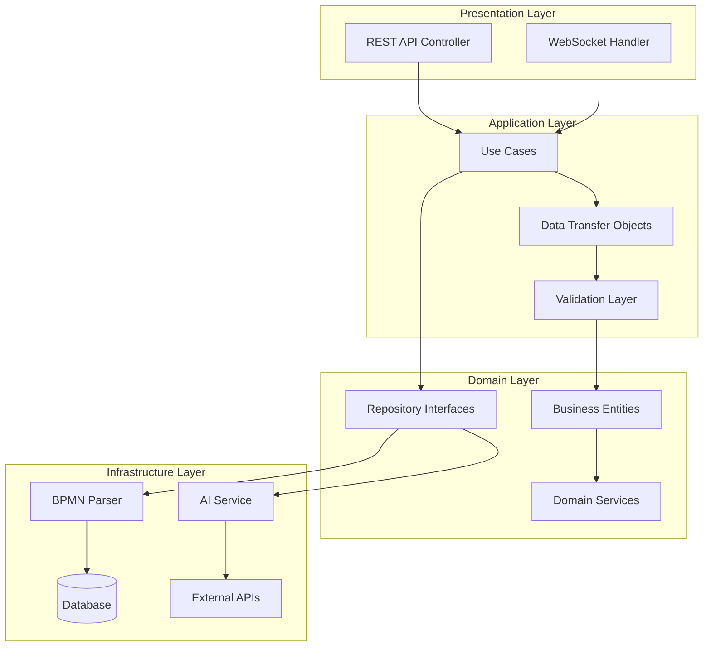
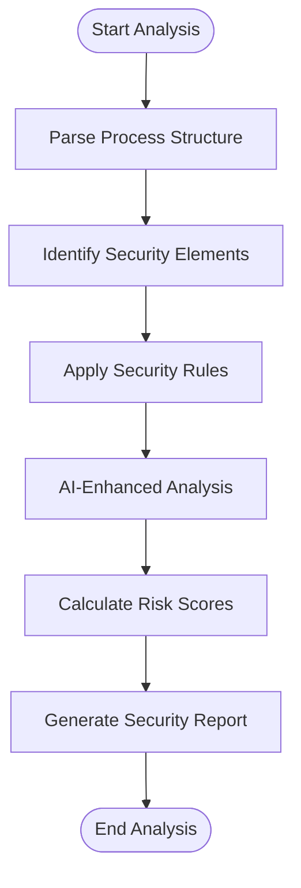

# BPMN Analysis System - Technical Documentation

## Table of Contents

1. [System Architecture](#system-architecture)
2. [Component Overview](#component-overview)
3. [Data Models & Schemas](#data-models--schemas)
4. [Security Analysis Engine](#security-analysis-engine)
5. [AI Integration](#ai-integration)
6. [API Reference](#api-reference)
7. [Integration Patterns](#integration-patterns)
8. [Configuration](#configuration)
9. [Performance Optimization](#performance-optimization)
10. [Extensibility](#extensibility)

## System Architecture

### High-Level Architecture

The BPMN Analysis System follows a modular, microservices-inspired architecture within the SecurityOrchestrator platform. The system is designed with Clean Architecture principles, ensuring separation of concerns and testability.



### Core Components

#### 1. BPMN Parser Engine
**Purpose**: Parse and validate BPMN 2.0 XML files
**Technology**: Camunda BPMN Model API, custom XML parsers
**Responsibilities**:
- XML parsing and validation against BPMN 2.0 schema
- Element extraction and structure analysis
- Process flow mapping and dependency resolution
- Error detection and reporting

#### 2. Security Analysis Engine
**Purpose**: Perform comprehensive security analysis on parsed processes
**Technology**: Custom rule engine, AI integration
**Responsibilities**:
- Vulnerability detection algorithms
- Security control identification
- Compliance mapping
- Risk assessment calculations

#### 3. AI Integration Layer
**Purpose**: Leverage LLMs for intelligent analysis and recommendations
**Technology**: OpenRouter API, Ollama integration
**Responsibilities**:
- Natural language processing of process descriptions
- Context-aware security recommendations
- Test case generation
- Continuous learning from analysis results

#### 4. Test Generation Engine
**Purpose**: Generate security test cases based on process analysis
**Technology**: Template engine, AI-powered generation
**Responsibilities**:
- Automated test case creation
- Test data generation
- Test execution orchestration
- Result validation

## Component Overview

### BPMN Parser Engine

#### Architecture
```java
@Component
public class BPMNParserEngine {
    
    @Autowired
    private BPMNValidator validator;
    
    @Autowired
    private ProcessElementExtractor extractor;
    
    @Autowired
    private SecurityElementIdentifier identifier;
    
    public ParseResult parseBPMNFile(InputStream inputStream) {
        // Parse BPMN XML
        // Validate structure
        // Extract elements
        // Identify security-relevant components
        // Return structured result
    }
}
```

#### Supported BPMN Elements

| Element | Support Level | Security Analysis Features |
|---------|---------------|---------------------------|
| **StartEvent** | Full Support | Entry point validation, authentication requirements |
| **EndEvent** | Full Support | Exit point security, data cleanup verification |
| **UserTask** | Full Support | Role-based access, authentication validation |
| **ServiceTask** | Full Support | API security, input validation, data handling |
| **ExclusiveGateway** | Full Support | Access control, branch authorization |
| **ParallelGateway** | Full Support | Concurrent access control, resource sharing |
| **InclusiveGateway** | Full Support | Multi-branch access validation |
| **SubProcess** | Full Support | Nested security analysis, delegation |
| **CallActivity** | Full Support | External process security integration |
| **TimerEvent** | Full Support | Timeout security, scheduling validation |
| **MessageEvent** | Full Support | Communication security, message validation |
| **ErrorEvent** | Full Support | Error handling security, exception management |
| **SignalEvent** | Full Support | Signal propagation security, synchronization |
| **BoundaryEvent** | Full Support | Exception handling validation |

#### Parsing Flow
1. **File Validation**: Check file format and size constraints
2. **XML Parsing**: Parse BPMN 2.0 XML using Camunda Model API
3. **Schema Validation**: Validate against BPMN 2.0 metamodel
4. **Element Extraction**: Extract all process elements and relationships
5. **Flow Analysis**: Analyze process flow and identify critical paths
6. **Security Annotation**: Annotate elements with security-relevant information
7. **Result Compilation**: Compile parse result with metadata and validation errors

### Security Analysis Engine

#### Core Analysis Types

##### 1. Authentication Analysis
```java
@Service
public class AuthenticationAnalyzer {
    
    public AnalysisResult analyzeAuthenticationRequirements(BPMNProcess process) {
        List<AuthenticationFinding> findings = new ArrayList<>();
        
        for (UserTask userTask : process.getUserTasks()) {
            SecurityAnnotation annotation = userTask.getSecurityAnnotation();
            
            if (annotation == null || !annotation.hasAuthentication()) {
                findings.add(AuthenticationFinding.builder()
                    .taskId(userTask.getId())
                    .severity(Severity.HIGH)
                    .description("User task lacks authentication requirements")
                    .recommendation("Add authentication gateway before user task")
                    .build());
            }
        }
        
        return AnalysisResult.builder()
            .findings(findings)
            .securityScore(calculateSecurityScore(findings))
            .build();
    }
}
```

##### 2. Authorization Analysis
```java
@Service
public class AuthorizationAnalyzer {
    
    public AnalysisResult analyzeAuthorizationControls(BPMNProcess process) {
        // Analyze role-based access control
        // Validate permission requirements
        // Check for privilege escalation risks
        // Evaluate data access controls
    }
}
```

##### 3. Data Protection Analysis
```java
@Service
public class DataProtectionAnalyzer {
    
    public AnalysisResult analyzeDataHandling(BPMNProcess process) {
        // Identify PII data flows
        // Validate data classification
        // Check encryption requirements
        // Evaluate data retention policies
    }
}
```

##### 4. Compliance Analysis
```java
@Service
public class ComplianceAnalyzer {
    
    public AnalysisResult analyzeCompliance(BPMNProcess process, List<ComplianceStandard> standards) {
        Map<ComplianceStandard, ComplianceResult> results = new HashMap<>();
        
        for (ComplianceStandard standard : standards) {
            ComplianceChecker checker = complianceCheckers.get(standard);
            ComplianceResult result = checker.checkCompliance(process);
            results.put(standard, result);
        }
        
        return ComplianceAnalysisResult.builder()
            .complianceResults(results)
            .overallComplianceScore(calculateOverallScore(results))
            .build();
    }
}
```

#### Analysis Algorithms

##### Vulnerability Detection Algorithm


##### Security Scoring Algorithm
```java
public class SecurityScoringEngine {
    
    public double calculateSecurityScore(List<SecurityFinding> findings) {
        double baseScore = 100.0;
        
        for (SecurityFinding finding : findings) {
            double deduction = getDeductionForSeverity(finding.getSeverity());
            deduction *= getWeightForFindingType(finding.getType());
            baseScore -= deduction;
        }
        
        // Apply AI-derived confidence multiplier
        double aiConfidence = calculateAIPercentage(findings);
        double adjustedScore = baseScore * aiConfidence;
        
        return Math.max(0, Math.min(100, adjustedScore));
    }
    
    private double getDeductionForSeverity(Severity severity) {
        return switch (severity) {
            case CRITICAL -> 25.0;
            case HIGH -> 15.0;
            case MEDIUM -> 8.0;
            case LOW -> 3.0;
            case INFO -> 1.0;
        };
    }
}
```

### AI Integration Layer

#### LLM Integration Architecture
```java
@Service
public class AIAnalysisService {
    
    @Autowired
    private LLMProvider openRouterProvider;
    
    @Autowired
    private LLMProvider ollamaProvider;
    
    @Autowired
    private ContextExtractor contextExtractor;
    
    public List<AIRecommendation> generateSecurityRecommendations(BPMNProcess process) {
        // Extract process context
        ProcessContext context = contextExtractor.extractContext(process);
        
        // Prepare AI prompt
        String prompt = buildSecurityAnalysisPrompt(context);
        
        // Generate recommendations using LLM
        LLMResponse response = selectOptimalLLM(context).generateCompletion(prompt);
        
        // Parse and validate recommendations
        return parseRecommendations(response.getContent());
    }
}
```

#### Natural Language Processing
```java
@Component
public class ProcessDescriptionAnalyzer {
    
    public ProcessInsights analyzeProcessDescription(String description) {
        // Extract business context
        BusinessContext context = extractBusinessContext(description);
        
        // Identify security-sensitive operations
        List<SecurityOperation> operations = identifySecurityOperations(context);
        
        // Generate context-aware recommendations
        return ProcessInsights.builder()
            .businessContext(context)
            .securityOperations(operations)
            .recommendations(generateContextualRecommendations(operations))
            .build();
    }
}
```

#### AI-Enhanced Test Generation
```java
@Service
public class AITestGenerationService {
    
    public List<SecurityTestCase> generateIntelligentTestCases(BPMNProcess process) {
        // Analyze process structure and business context
        ProcessAnalysis analysis = analyzeProcessForTesting(process);
        
        // Generate test scenarios using AI
        List<AILGeneratedTestScenario> scenarios = generateTestScenarios(analysis);
        
        // Create test cases from scenarios
        return scenarios.stream()
            .map(this::createSecurityTestCase)
            .collect(Collectors.toList());
    }
}
```

## Data Models & Schemas

### Core Entities

#### BPMN Process Entity
```java
@Entity
@Table(name = "bpmn_processes")
public class BPMNProcess {
    
    @Id
    @GeneratedValue
    private String id;
    
    @Column(nullable = false)
    private String name;
    
    @Column(length = 1000)
    private String description;
    
    @Lob
    @Column(nullable = false)
    private String xmlContent;
    
    @Enumerated(EnumType.STRING)
    private ProcessStatus status;
    
    @OneToMany(mappedBy = "process", cascade = CascadeType.ALL)
    private List<ProcessElement> elements;
    
    @OneToMany(mappedBy = "process", cascade = CascadeType.ALL)
    private List<SecurityAnalysis> analyses;
    
    private LocalDateTime createdAt;
    private LocalDateTime updatedAt;
}
```

#### Security Analysis Entity
```java
@Entity
@Table(name = "security_analyses")
public class SecurityAnalysis {
    
    @Id
    @GeneratedValue
    private String id;
    
    @ManyToOne
    @JoinColumn(name = "process_id")
    private BPMNProcess process;
    
    @Enumerated(EnumType.STRING)
    private AnalysisType analysisType;
    
    @Enumerated(EnumType.STRING)
    private AnalysisStatus status;
    
    @OneToMany(mappedBy = "analysis", cascade = CascadeType.ALL)
    private List<SecurityFinding> findings;
    
    private Double securityScore;
    
    @Lob
    private String detailedReport;
    
    private LocalDateTime startedAt;
    private LocalDateTime completedAt;
}
```

#### Security Finding Entity
```java
@Entity
@Table(name = "security_findings")
public class SecurityFinding {
    
    @Id
    @GeneratedValue
    private String id;
    
    @ManyToOne
    @JoinColumn(name = "analysis_id")
    private SecurityAnalysis analysis;
    
    @Enumerated(EnumType.STRING)
    private FindingType type;
    
    @Enumerated(EnumType.STRING)
    private Severity severity;
    
    @Column(length = 500)
    private String title;
    
    @Column(length = 2000)
    private String description;
    
    @Column(length = 1000)
    private String location;
    
    @Column(length = 1000)
    private String recommendation;
    
    @ElementCollection
    @CollectionTable(name = "finding_evidence")
    private List<String> evidence;
}
```

### DTOs and Request/Response Models

#### Analysis Request DTO
```java
public class AnalysisRequest {
    
    private String processId;
    
    @NotNull
    @Enumerated(EnumType.STRING)
    private AnalysisType analysisType;
    
    @Valid
    @NotEmpty
    private List<ComplianceStandard> complianceStandards;
    
    private AnalysisConfiguration configuration;
    
    // Builder pattern implementation
    public static AnalysisRequestBuilder builder() {
        return new AnalysisRequestBuilder();
    }
}
```

#### Analysis Result DTO
```java
public class AnalysisResult {
    
    private String analysisId;
    
    @Enumerated(EnumType.STRING)
    private AnalysisStatus status;
    
    private Double securityScore;
    
    private List<SecurityFinding> findings;
    
    private List<SecurityRecommendation> recommendations;
    
    private Map<String, Object> metrics;
    
    private String detailedReport;
    
    private LocalDateTime startedAt;
    private LocalDateTime completedAt;
}
```

## Security Analysis Engine

### Rule Engine Architecture

#### Rule Definition Framework
```java
@FunctionalInterface
public interface SecurityRule {
    EvaluationResult evaluate(ProcessElement element, SecurityContext context);
    
    default boolean isApplicable(ProcessElement element) {
        return getApplicableElementTypes().contains(element.getType());
    }
    
    ElementType[] getApplicableElementTypes();
}
```

#### Built-in Security Rules

##### Rule 1: Authentication Required
```java
@Component
public class AuthenticationRequiredRule implements SecurityRule {
    
    @Override
    public EvaluationResult evaluate(ProcessElement element, SecurityContext context) {
        if (element instanceof UserTask userTask) {
            if (!userTask.hasAuthenticationAnnotation()) {
                return EvaluationResult.builder()
                    .finding(SecurityFinding.builder()
                        .type(FindingType.AUTHENTICATION_MISSING)
                        .severity(Severity.HIGH)
                        .description("User task requires authentication")
                        .elementId(userTask.getId())
                        .build())
                    .build();
            }
        }
        return EvaluationResult.noIssue();
    }
    
    @Override
    public ElementType[] getApplicableElementTypes() {
        return new ElementType[] { ElementType.USER_TASK };
    }
}
```

##### Rule 2: Data Classification
```java
@Component
public class DataClassificationRule implements SecurityRule {
    
    @Override
    public EvaluationResult evaluate(ProcessElement element, SecurityContext context) {
        List<SecurityFinding> findings = new ArrayList<>();
        
        // Check for sensitive data in service tasks
        if (element instanceof ServiceTask serviceTask) {
            DataFlowAnalysis dataFlow = analyzeDataFlow(serviceTask);
            
            for (DataElement dataElement : dataFlow.getDataElements()) {
                if (isSensitiveData(dataElement) && !isEncrypted(dataElement)) {
                    findings.add(SecurityFinding.builder()
                        .type(FindingType.SENSITIVE_DATA_UNENCRYPTED)
                        .severity(Severity.CRITICAL)
                        .description("Sensitive data not encrypted in transit")
                        .elementId(serviceTask.getId())
                        .dataElementId(dataElement.getId())
                        .build());
                }
            }
        }
        
        return EvaluationResult.builder().findings(findings).build();
    }
}
```

#### Rule Engine Execution
```java
@Service
public class RuleEngineExecutor {
    
    @Autowired
    private List<SecurityRule> securityRules;
    
    public List<SecurityFinding> executeRules(ProcessElement element, SecurityContext context) {
        return securityRules.stream()
            .filter(rule -> rule.isApplicable(element))
            .map(rule -> rule.evaluate(element, context))
            .flatMap(result -> result.getFindings().stream())
            .collect(Collectors.toList());
    }
}
```

### Risk Assessment Framework

#### Risk Calculation Model
```java
public class RiskAssessment {
    
    public RiskScore calculateRisk(List<SecurityFinding> findings) {
        double baseRisk = calculateBaseRisk(findings);
        double likelihood = calculateLikelihood(findings);
        double impact = calculateImpact(findings);
        
        return RiskScore.builder()
            .overallRisk(baseRisk * likelihood * impact)
            .likelihood(likelihood)
            .impact(impact)
            .riskLevel(determineRiskLevel(baseRisk * likelihood * impact))
            .riskFactors(identifyRiskFactors(findings))
            .build();
    }
    
    private RiskLevel determineRiskLevel(double riskScore) {
        if (riskScore >= 0.8) return RiskLevel.CRITICAL;
        if (riskScore >= 0.6) return RiskLevel.HIGH;
        if (riskScore >= 0.4) return RiskLevel.MEDIUM;
        if (riskScore >= 0.2) return RiskLevel.LOW;
        return RiskLevel.MINIMAL;
    }
}
```

#### Threat Modeling Integration
```java
@Service
public class ThreatModelIntegrator {
    
    public List<Threat> identifyThreats(BPMNProcess process) {
        List<Threat> threats = new ArrayList<>();
        
        // STRIDE threat modeling
        threats.addAll(identifySpoofingThreats(process));
        threats.addAll(identifyTamperingThreats(process));
        threats.addAll(identifyRepudiationThreats(process));
        threats.addAll(identifyInformationDisclosureThreats(process));
        threats.addAll(identifyDenialOfServiceThreats(process));
        threats.addAll(identifyElevationOfPrivilegeThreats(process));
        
        return threats;
    }
}
```

## AI Integration

### LLM Provider Integration

#### Provider Abstraction
```java
public interface LLMProvider {
    
    CompletionResponse generateCompletion(CompletionRequest request);
    
    boolean isHealthy();
    
    ProviderType getType();
    
    List<ModelInfo> getAvailableModels();
}
```

#### OpenRouter Provider Implementation
```java
@Component
public class OpenRouterProvider implements LLMProvider {
    
    @Override
    public CompletionResponse generateCompletion(CompletionRequest request) {
        try {
            OpenRouterRequest orRequest = OpenRouterRequest.builder()
                .model(request.getModel())
                .messages(request.getMessages())
                .maxTokens(request.getMaxTokens())
                .temperature(request.getTemperature())
                .build();
            
            OpenRouterResponse response = restTemplate.postForObject(
                "https://openrouter.ai/api/v1/chat/completions",
                orRequest,
                OpenRouterResponse.class
            );
            
            return convertResponse(response);
        } catch (Exception e) {
            throw new LLMException("Failed to generate completion", e);
        }
    }
}
```

### Context-Aware Analysis

#### Process Context Extraction
```java
@Component
public class ProcessContextExtractor {
    
    public ProcessContext extractContext(BPMNProcess process) {
        return ProcessContext.builder()
            .processName(process.getName())
            .processDescription(process.getDescription())
            .businessDomain(extractBusinessDomain(process))
            .dataClassification(analyzeDataClassification(process))
            .stakeholders(extractStakeholders(process))
            .complianceRequirements(extractComplianceRequirements(process))
            .riskProfile(assessRiskProfile(process))
            .build();
    }
}
```

#### AI Prompt Engineering
```java
@Component
public class SecurityAnalysisPromptBuilder {
    
    public String buildSecurityAnalysisPrompt(ProcessContext context) {
        return String.format("""
            Analyze the following business process for security vulnerabilities and provide recommendations.
            
            Process Name: %s
            Business Domain: %s
            Data Classification: %s
            
            Process Description:
            %s
            
            Please provide:
            1. Security vulnerabilities identified
            2. Risk assessment for each vulnerability
            3. Specific recommendations for mitigation
            4. Compliance considerations
            
            Format your response as structured JSON with clear categorization.
            """,
            context.getProcessName(),
            context.getBusinessDomain(),
            context.getDataClassification(),
            context.getProcessDescription()
        );
    }
}
```

## Configuration

### System Configuration Properties
```yaml
# application-bpmn.yml
bpmn:
  analysis:
    max-process-size: 10MB
    concurrent-analyses: 10
    timeout: 300s
    ai:
      enabled: true
      provider: openrouter
      model: anthropic/claude-3-haiku
      max-tokens: 2048
      temperature: 0.1
    rules:
      enabled:
        - authentication-required
        - data-classification
        - compliance-check
        - authorization-validation
    compliance:
      standards:
        - GDPR
        - HIPAA
        - PCI-DSS
        - ISO27001
    security:
      scoring:
        weights:
          critical: 25
          high: 15
          medium: 8
          low: 3
  processing:
    cache-enabled: true
    cache-ttl: 3600s
    validation:
      strict: false
      xsd-validation: true
```

### LLM Configuration
```java
@Configuration
@ConfigurationProperties(prefix = "bpmn.analysis.ai")
public class AIConfiguration {
    
    @NotBlank
    private String provider;
    
    @NotBlank
    private String model;
    
    private int maxTokens = 2048;
    
    private double temperature = 0.1;
    
    private Duration timeout = Duration.ofSeconds(30);
    
    private List<String> fallbackModels;
    
    // Getters and setters
}
```

## Performance Optimization

### Caching Strategy
```java
@Service
public class CachedBPMNAnalysisService {
    
    @Cacheable(value = "bpmn-analyses", key = "#processId + '_' + #analysisType")
    public AnalysisResult analyzeProcess(String processId, AnalysisType analysisType) {
        // Perform analysis with caching
    }
    
    @CacheEvict(value = "bpmn-analyses", key = "#processId")
    public void invalidateProcessCache(String processId) {
        // Invalidate cache when process is updated
    }
}
```

### Asynchronous Processing
```java
@Service
public class AsyncBPMNAnalysisService {
    
    @Async
    public CompletableFuture<AnalysisResult> performAsyncAnalysis(AnalysisRequest request) {
        return CompletableFuture.supplyAsync(() -> {
            try {
                return performAnalysis(request);
            } catch (Exception e) {
                throw new AnalysisException("Async analysis failed", e);
            }
        });
    }
}
```

### Performance Monitoring
```java
@Component
public class BPMNAnalysisMetrics {
    
    private final MeterRegistry meterRegistry;
    
    public BPMNAnalysisMetrics(MeterRegistry meterRegistry) {
        this.meterRegistry = meterRegistry;
    }
    
    public void recordAnalysisDuration(Duration duration) {
        Timer.Sample sample = Timer.start(meterRegistry);
        sample.stop(Timer.builder("bpmn.analysis.duration")
            .description("Time taken to perform BPMN analysis")
            .register(meterRegistry));
    }
}
```

## Extensibility

### Plugin Architecture
```java
public interface BPMNAnalysisPlugin {
    
    String getName();
    
    String getVersion();
    
    boolean canHandle(ProcessElement element);
    
    List<SecurityFinding> analyze(ProcessElement element, SecurityContext context);
    
    void onAnalysisComplete(AnalysisResult result);
}
```

### Custom Rule Development
```java
public abstract class AbstractSecurityRule implements SecurityRule {
    
    @Override
    public final EvaluationResult evaluate(ProcessElement element, SecurityContext context) {
        if (!isApplicable(element)) {
            return EvaluationResult.noIssue();
        }
        
        return doEvaluate(element, context);
    }
    
    protected abstract EvaluationResult doEvaluate(ProcessElement element, SecurityContext context);
}
```

This comprehensive technical documentation provides the foundation for understanding, implementing, and extending the BPMN Analysis System. The modular architecture ensures maintainability and extensibility while the AI integration provides intelligent, context-aware analysis capabilities.

For implementation examples and integration guides, refer to the [Integration Guide](INTEGRATION_GUIDE.md) and [Examples & Tutorials](EXAMPLES_AND_TUTORIALS.md).