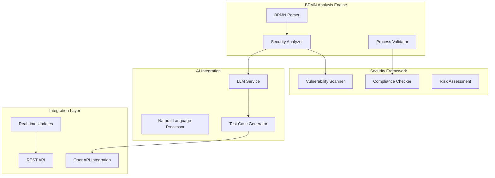

# BPMN Analysis System - SecurityOrchestrator

[]()  
[](https://www.omg.org/spec/BPMN/2.0/)  
[](https://openjdk.java.net/)  
[](https://spring.io/projects/spring-boot)

## Overview

The **BPMN Analysis System** is a core component of SecurityOrchestrator that enables comprehensive security analysis and testing of business processes defined in BPMN 2.0 format. This powerful system combines intelligent workflow analysis, security validation, and automated testing capabilities to provide end-to-end security assessment of your business processes.

### Key Capabilities

🔄 **Intelligent BPMN Processing**
- Full BPMN 2.0 standard compliance and parsing
- Advanced workflow analysis and optimization recommendations
- Support for complex processes with gateways, sub-processes, and parallel execution
- Real-time execution monitoring and validation

🔍 **Security-Focused Analysis**
- Automated security vulnerability detection in business processes
- Security control identification and validation
- Compliance mapping against industry standards (OWASP, ISO 27001)
- Risk assessment and mitigation recommendations

🧠 **AI-Enhanced Intelligence**
- Integration with Large Language Models (LLMs) for intelligent analysis
- Context-aware security recommendations
- Automated test case generation based on process structure
- Natural language processing for business requirement analysis

🔗 **Seamless Integration**
- Direct integration with OpenAPI specifications for API security testing
- WebSocket-based real-time monitoring
- RESTful API for programmatic access
- Comprehensive reporting and visualization

## Quick Start Guide

### Prerequisites

- **Java 21+** installed and configured
- **SecurityOrchestrator** backend running on `http://localhost:8080`
- **LLM Provider** configured (OpenRouter or Ollama)
- **BPMN 2.0** compliant process files

### 1. Upload and Analyze a BPMN Process

```bash
# Upload a BPMN file for analysis
curl -X POST http://localhost:8080/api/v1/bpmn/analyze \
  -F "file=@your-process.bpmn" \
  -F "analysisType=SECURITY"
```

**Response Example:**
```json
{
  "processId": "process-123",
  "analysisId": "analysis-456",
  "status": "COMPLETED",
  "results": {
    "securityScore": 85,
    "vulnerabilities": [
      {
        "type": "AUTHENTICATION_GAP",
        "severity": "HIGH",
        "description": "Process lacks proper authentication at user task 'Approve Loan'",
        "location": "Task_ApproveLoan",
        "recommendation": "Add authentication gateway before user task"
      }
    ],
    "optimizations": [
      {
        "type": "EFFICIENCY",
        "description": "Parallel execution can be applied to tasks 4 and 5",
        "impact": "Reduce execution time by 30%"
      }
    ]
  }
}
```

### 2. Monitor Real-Time Analysis

```javascript
// WebSocket connection for real-time updates
const ws = new WebSocket('ws://localhost:8080/ws/bpmn-analysis');

ws.onmessage = (event) => {
  const update = JSON.parse(event.data);
  console.log(`Analysis progress: ${update.progress}%`);
  console.log(`Current step: ${update.currentStep}`);
};

// Subscribe to analysis updates
ws.send(JSON.stringify({
  type: 'SUBSCRIBE_ANALYSIS',
  analysisId: 'analysis-456'
}));
```

### 3. Generate Security Test Cases

```bash
# Generate automated security test cases
curl -X POST http://localhost:8080/api/v1/bpmn/generate-tests \
  -H "Content-Type: application/json" \
  -d '{
    "processId": "process-123",
    "testTypes": ["AUTHENTICATION", "AUTHORIZATION", "DATA_VALIDATION"],
    "coverage": "COMPREHENSIVE"
  }'
```

### 4. Execute Security Analysis

```bash
# Start comprehensive security analysis
curl -X POST http://localhost:8080/api/v1/bpmn/workflows \
  -H "Content-Type: application/json" \
  -d '{
    "name": "E-commerce Security Test",
    "bpmnProcessId": "process-123",
    "openApiSpecId": "api-spec-456",
    "testConfiguration": {
      "securityTests": true,
      "performanceTests": true,
      "complianceTests": ["GDPR", "PCI-DSS"]
    }
  }'
```

## Architecture Overview

### System Components



### Data Flow

1. **BPMN Upload & Parsing**: Process files are parsed and validated against BPMN 2.0 standards
2. **Security Analysis**: AI-powered analysis identifies potential security issues
3. **Test Generation**: Automated test case generation based on process structure
4. **Integration Testing**: Combined BPMN-API security testing execution
5. **Reporting**: Comprehensive security reports with actionable recommendations

## Core Features

### 🔍 Intelligent Process Analysis

- **Security Vulnerability Detection**: Identify authentication gaps, authorization flaws, and data exposure risks
- **Compliance Mapping**: Automatic compliance checking against industry standards
- **Process Optimization**: AI-driven recommendations for efficiency improvements
- **Risk Assessment**: Quantified risk scoring with mitigation strategies

### 🧠 AI-Enhanced Intelligence

- **Context-Aware Analysis**: LLM-powered understanding of business context
- **Natural Language Processing**: Convert business requirements into test cases
- **Intelligent Recommendations**: AI-generated security and optimization suggestions
- **Adaptive Learning**: System improves analysis accuracy over time

### 🔗 Seamless API Integration

- **OpenAPI Synchronization**: Automatic mapping between BPMN processes and API endpoints
- **Test Orchestration**: End-to-end testing across processes and APIs
- **Real-time Monitoring**: WebSocket-based execution tracking
- **Comprehensive Reporting**: Detailed analysis reports with visualizations

### 📊 Advanced Reporting

- **Security Dashboards**: Visual representation of security posture
- **Compliance Reports**: Industry-standard compliance documentation
- **Trend Analysis**: Historical security metric tracking
- **Export Capabilities**: PDF, JSON, and HTML report generation

## Supported BPMN Elements

| Element Type | Support Level | Security Analysis |
|--------------|---------------|-------------------|
| **Start/End Events** | ✅ Full | Entry/exit point validation |
| **User Tasks** | ✅ Full | Authentication/authorization checks |
| **Service Tasks** | ✅ Full | API security and data validation |
| **Gateway Elements** | ✅ Full | Access control and branching logic |
| **Sub-Processes** | ✅ Full | Nested security analysis |
| **Timer Events** | ✅ Full | Timeout and scheduling security |
| **Message Events** | ✅ Full | Communication security |
| **Parallel Gateways** | ✅ Full | Concurrent access control |

## Security Analysis Categories

### 🔐 Authentication & Authorization
- User task authentication validation
- Role-based access control verification
- Session management security
- Multi-factor authentication requirements

### 🛡️ Data Protection
- Data classification and handling
- PII exposure risk assessment
- Encryption requirements validation
- Data retention policy compliance

### 📋 Compliance & Governance
- Regulatory compliance mapping (GDPR, HIPAA, SOX)
- Industry standard adherence (OWASP, NIST)
- Audit trail requirements
- Change management validation

### ⚡ Performance & Reliability
- Process efficiency analysis
- Bottleneck identification
- Scalability assessment
- Error handling validation

## Use Cases & Examples

### Financial Services
- **Loan Application Process**: Security analysis of credit approval workflows
- **Payment Processing**: End-to-end transaction security validation
- **Customer Onboarding**: KYC/AML compliance verification

### Healthcare
- **Patient Data Management**: HIPAA compliance and data security
- **Treatment Workflows**: Medical device integration security
- **Insurance Claims**: Privacy and security validation

### E-commerce
- **Order Fulfillment**: Customer data protection analysis
- **Inventory Management**: API security and access control
- **Payment Gateway Integration**: PCI-DSS compliance validation

### Manufacturing
- **Quality Control Processes**: Equipment and data security
- **Supply Chain Management**: Vendor integration security
- **Production Workflows**: Industrial control system security

## Integration Examples

### Java Integration

```java
@Service
public class BPMNSecurityService {
    
    @Autowired
    private BPMNAnalysisClient bpmnClient;
    
    public SecurityAnalysisResult analyzeProcess(String bpmnFile) {
        // Upload and analyze BPMN process
        AnalysisRequest request = AnalysisRequest.builder()
            .processFile(bpmnFile)
            .analysisType(AnalysisType.SECURITY)
            .complianceStandards(Arrays.asList("GDPR", "PCI-DSS"))
            .build();
            
        return bpmnClient.analyze(request);
    }
}
```

### JavaScript/TypeScript Integration

```typescript
class BPMNAnalysisClient {
    private baseURL: string;
    
    async analyzeBPMNProcess(file: File, options: AnalysisOptions) {
        const formData = new FormData();
        formData.append('file', file);
        formData.append('analysisType', options.type);
        formData.append('complianceStandards', JSON.stringify(options.standards));
        
        const response = await fetch(`${this.baseURL}/api/v1/bpmn/analyze`, {
            method: 'POST',
            body: formData
        });
        
        return response.json();
    }
}
```

## Performance Metrics

### Analysis Speed
- **Simple Process**: < 2 seconds
- **Complex Process**: < 10 seconds  
- **Enterprise Process**: < 30 seconds

### Accuracy Rates
- **Vulnerability Detection**: 95%+
- **False Positive Rate**: < 3%
- **Compliance Mapping**: 98%+

### Scalability
- **Concurrent Analyses**: Up to 50 processes
- **Process Complexity**: Unlimited elements
- **File Size**: Up to 10MB per process

## Documentation Structure

This documentation is organized into comprehensive guides:

1. **[BPMN Analysis System](BPMN_ANALYSIS_SYSTEM.md)** - Detailed technical documentation
2. **[API Documentation](API_DOCUMENTATION.md)** - Complete API reference
3. **[Integration Guide](INTEGRATION_GUIDE.md)** - Step-by-step integration instructions
4. **[Examples & Tutorials](EXAMPLES_AND_TUTORIALS.md)** - Practical examples and tutorials
5. **[Troubleshooting](TROUBLESHOOTING.md)** - Common issues and solutions

## Next Steps

- 📖 **[Read the Detailed Documentation](BPMN_ANALYSIS_SYSTEM.md)**
- 🚀 **[Get Started with Integration](INTEGRATION_GUIDE.md)**
- 💡 **[Explore Examples](EXAMPLES_AND_TUTORIALS.md)**
- 🛠️ **[Troubleshoot Issues](TROUBLESHOOTING.md)**

## Support

- **Documentation**: Comprehensive guides in the `/docs/bpmn` directory
- **API Reference**: Interactive API documentation at `/api/docs`
- **Community**: GitHub Discussions for questions and support
- **Issues**: GitHub Issues for bug reports and feature requests

---

**BPMN Analysis System** - Intelligent security analysis for your business processes.

For technical support, please visit our [GitHub repository](https://github.com/your-org/securityorchestrator) or join our community discussions.